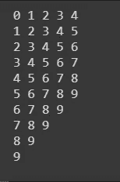
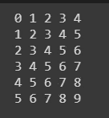
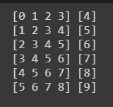
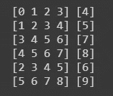
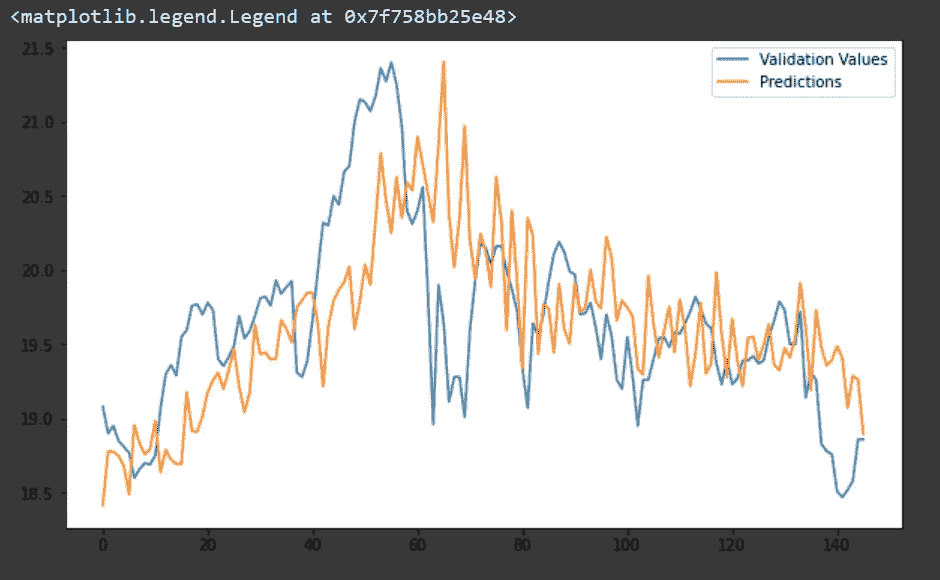

# 股票价格预测:基于张量流的单神经网络

> 原文：<https://medium.com/analytics-vidhya/stock-price-prediction-single-neural-network-with-tensorflow-75b64af74ed6?source=collection_archive---------11----------------------->


让我们学习如何在 TensorFlow 后端的帮助下，使用单层神经网络来预测股票价格。当您看到这样一个简单的架构在股票价格数据集上的表现有多么不可思议时，您会惊叹不已。
本博客的内容灵感来自 Coursera 系列:[序列、时间序列和预测](https://www.coursera.org/learn/tensorflow-sequences-time-series-and-prediction/home/welcome)。

这是我们关于时间序列预测系列博客的第三篇文章。链接到前两个:

*   [股票预测:脸书预言家](/analytics-vidhya/stock-price-prediction-facebook-prophet-34c385ff05a9?source=your_stories_page---------------------------)
*   [股价预测的统计方法:朴素预测、移动平均线](/analytics-vidhya/statistical-approach-to-stock-price-prediction-naive-forecast-moving-average-40f93e221e06?source=your_stories_page---------------------------)

# 加载数据集

我们使用新德国基金的数据。它是作为熊猫数据帧加载的。我们预测开盘价。因此，列 OPEN 被创建到 NumPy 数组的一个实例中。总共有 996 个值，我们决定选择 850:146 的训练验证分割。

# 准备要素和标签

我们创建 Tensorflow 对象数据集的一个实例。下面的函数为我们完成了这项工作:

```
def windowed_dataset(series,window_size,batch_size, shuffle_buffer):
   dataset = tf.data.Dataset.from_tensor_slices(series)
   dataset = dataset.window(window_size + 1, shift=1, drop_remainder=True)
   dataset = dataset.flat_map(lambda window: window.batch(window_size + 1))
   dataset = dataset.map(lambda window: (window[:-1], window[-1]))
   dataset = dataset.shuffle(shuffle_buffer).map(lambda window: (window[:-1], window[-1]))
   dataset = dataset.batch(batch_size).prefetch(1)
   return dataset
```

对于 Tensorflow 的新手来说，这似乎需要解释很多东西！让我们逐一了解每个命令。

变量 series 是一个 NumPy 数组，包含您的股票价格值，在我们的例子中是开盘价。NumPy 数组中的每个第*n*条目对应于第*n*天的开盘价。

为了让事情更清楚，让我们一个接一个地检查每个命令。现在，让我们假设变量 series 存储前十个整数的 NumPy 数组。我们将为您显示每个命令的相应输出。

**步骤 1:** 用系列值创建一个 Tensorflow 数据集实例。

```
dataset = tf.data.Dataset.from_tensor_slices(series)
```

**步骤 2:** 数据被分割成 window_size 项的块，每个块移动一个值。这会以表格格式排列数据。参数 drop_remainder 通过裁剪数据来确保数据窗口中的所有行长度相同。

```
dataset = dataset.window(window_size + 1, shift=1, drop_remainder=True)
```



drop_remainder=False



drop_remainder= True

**第三步:**数据被扁平化，以便于处理。

```
dataset = dataset.flat_map(lambda window: window.batch(window_size + 1))
```

**第四步:**接下来是将数据拆分成 Xs 和 Ys；那就是特性和标签。

```
dataset = dataset.map(lambda window: (window[:-1], window[-1]))
```



第三步输出

**第五步:**数据洗牌。请注意，如果第十个 X 值与第三个 X 值交换，第十个 Y 值也会与第三个 Y 值交换。

```
dataset = dataset.shuffle(shuffle_buffer).map(lambda window: (window[:-1], window[-1]))
```



输出步骤 4

我们有 10 个值的数据集，假设变量 *shuffle_buffer* =5。它会用前五个元素填充缓冲区，随机选取一个值，然后在进行下一个随机采样之前用第六个元素替换它。这个过程不断重复。

**第六步:**我们更喜欢通过批量发送数据来训练我们的模型。

```
dataset = dataset.batch(batch_size).prefetch(1)
```

# 模型

我们使用一个单一的密集层，本质上就像一个身份功能。命名图层是一个很好的做法，因为它有助于我们稍后研究它的属性。

```
l0 = tf.keras.layers.Dense(1, input_shape=[window_size])
model = tf.keras.models.Sequential([l0])
model.compile(loss=”mse”, optimizer=tf.keras.optimizers.SGD(lr=1e-6, momentum=0.9))
model.fit(dataset,epochs=100,verbose=0)
```

# 预言；预测；预告

预测值以橙色显示。验证值用蓝色表示。
平均汇率为 0.443。



# 结论

令人惊讶的是，单层神经网络在这个数据集上胜过脸书先知。我们不确定为什么会发生这种情况。也许，我们不能为 Prophet 恰当地选择超参数。

Tensorflow 实现在[这里](https://github.com/nikita-0209/stock_price_detection/blob/master/Stock_Prediction_Single_NN.ipynb)可用。博客和代码由 Nikita Saxena 编译。