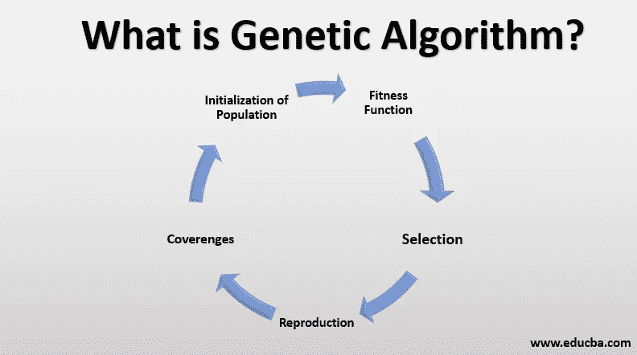
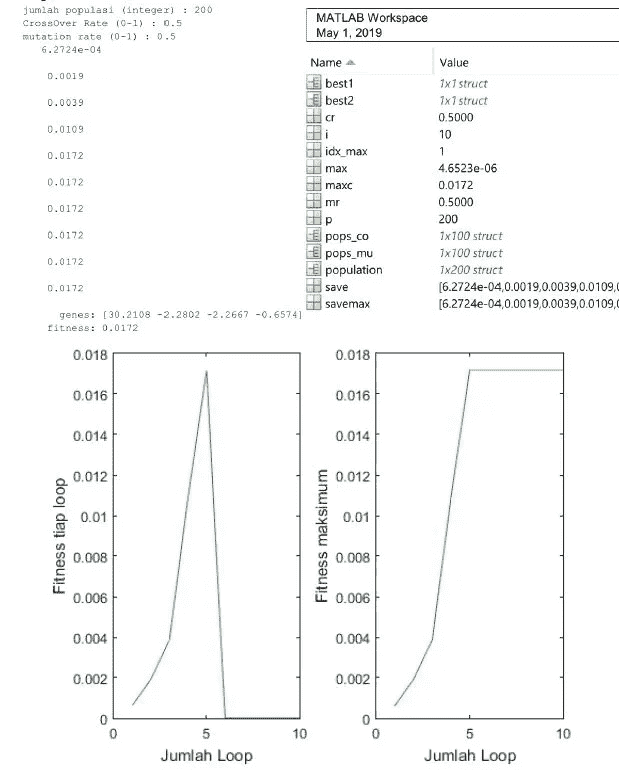

# 基于遗传算法的股票价格预测

> 原文：<https://medium.com/analytics-vidhya/stock-price-prediction-using-genetic-algorithms-65c64b002d9?source=collection_archive---------3----------------------->

来源:https://wallpaperaccess.com/

大家好！

在这个故事中，我将分享我的第一个数据科学项目。我在大学时参与了这个项目，我在 Github 上分享了数据、代码和报告，你可以在这里查看:[https://Github . com/shid qiet/stock-price-prediction-genetic-algorithm](https://github.com/Shidqiet/stock-price-prediction-genetic-algorithm)。

# 介绍

买卖股票是一件很有趣的事情。因为股票可以让投资者获得大收益，反之亦然。为了获得高额利润，投资者需要在预测股票价格时进行分析。然而，预测股票价格是一件困难的事情，因为股票价格一直在快速波动。因此投资者需要尽可能短地预测股票价格。

**遗传算法**或 GA 是一种元启发式算法，受自然选择过程的启发，属于进化算法(EA)的较大类别。遗传算法通常用于生成高质量的优化和搜索问题的解决方案，依赖于生物启发的操作符，如变异、交叉和选择[1]。

来源:[https://lapthrinx.com](https://laptrinhx.com/what-is-genetic-algorithm-1770596480/)

遗传算法中的过程始于初始化阶段，即创建具有某种基因排列(染色体)的随机个体。这些染色体代表了问题的解决方案。下一个阶段是繁殖，从群体中现有的个体产生后代。繁殖后，新的个体将会诞生，从而使个体数量增加。每个染色体都有一个适应度，适应度越大的染色体将被用作解。计算适合度的这个阶段称为评估阶段。最后一个阶段是选择，从种群集合和后代中选择个体。被选中的个体在下一代中继续存活[2]

在这个项目中，我试图使用回归方法和遗传算法来预测未来的股票价格。遗传算法用于在回归方程中搜索最合适的自变量/回归系数。这个项目改编自 Rahmi 等人发表的作品[2]。

# 方法学

本项目使用的数据是从雅虎财经获得的 BCA 股票(BBCA)自 2017 年 1 月 5 日至 2017 年 1 月 18 日(10 个数据)的数据，并计算平均值。

我使用以下方程作为回归方程:

Yt = a + b*Yt_1 - c*Yt_2 + Et -d* Et_1

其中:

*   Yt =未来股票价格的预测
*   a，b，c，d =回归系数(基因)
*   Yt_1 =昨日股价
*   Yt_2 =前天股票价格
*   Et =范围从 0 到 1 的随机数
*   Et_1 =昨天数据中的随机数

对于损失/误差函数，我使用均方根误差(RMSE)。为了计算染色体的适合度，我只需要计算 1/RMSE。

我使用 MATLAB 编程语言和计算环境来实现算法。

# 编码

为了实现遗传算法，我做了几个函数

1 .创建数据

从 excel 文件导入股票价格数据

2 .创建 _ 人口. m

启动由四个基因组成的群体。在这个函数中有函数 create_data、create_genes 和 calculate_fitness。人口取决于用户。

3 .创建 _ 基因. m

使用区间[-100，100]中的随机值建立基因的值。随机值的结果就是回归系数。

4 .计算 _ 健身. m

通过用回归函数计算股价预测并计算误差来计算适合度值。

5 .交叉

产生基因不同于初始种群的新个体或种群(初始种群的子代)。产生的个体数量取决于用户的交叉率。

6 .突变

从交叉结果中产生具有不同基因的新个体或群体。群体或父母是随机选择的。生成的个体数量取决于用户的突变率(mr)。

7 .选择

通过关注适应值来确保最佳种群总是通过。

8 .再生

根据选择结果创建新群体。

9 .主页面

还有…终于！主要代码，以实现所有我做的功能

# 结果

每个测试结果都有一个工作区，命令窗口，图形。工作区包含程序中的所有变量。命令窗口包含用户输入、每个循环中的最大适应度结果、最佳基因结果和最佳适应度值。该图由两部分组成，每个循环的最佳适应度图和每个循环的最大适应度图。

对于进一步的工作，我们可以找到种群数量，突变率(mr)和交叉率(cr)的最优配置。

# 参考

[1]米切尔·梅拉妮(1996)。*遗传算法简介*。麻省剑桥:麻省理工学院出版社。[书号](https://en.wikipedia.org/wiki/ISBN_(identifier)) [9780585030944](https://en.wikipedia.org/wiki/Special:BookSources/9780585030944) 。

[2]拉赫米，A，马赫穆迪，WF 和塞蒂亚万，BD 2015，“对数据历史的预测与遗传算法的模型回归”，DORO:布拉维贾亚大学法学文献库，第 5 卷，第 12 期。