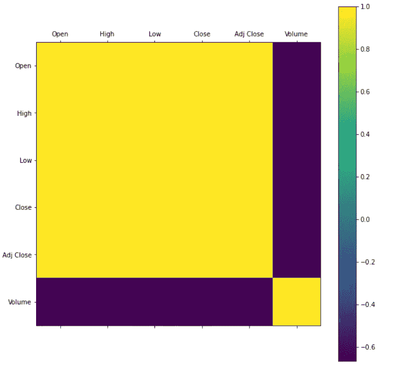

# 基于 LSTM(长短期记忆)的股价预测

> 原文：<https://medium.com/analytics-vidhya/stock-price-prediction-using-lstm-long-short-term-memory-e8c125a853e4?source=collection_archive---------7----------------------->

在这篇文章中，我将展示如何编写 python 代码，使用长短期记忆(LSTM)的机器学习技术来预测股票价格。

[用于股票价格预测的自适应在线学习](https://www.google.com/url?sa=i&url=https%3A%2F%2Fsundeeppothula1993.github.io%2FARTML%2F%2Fblog%2FAdaptive-Online-Learning-for-Stock-Price-Prediction%2F&psig=AOvVaw3WQrHZLfZvMloxgwBWlUrc&ust=1590901075825000&source=images&cd=vfe&ved=0CA0QjhxqFwoTCODigMPm2ukCFQAAAAAdAAAAABAJ)

# 算法选择

LSTM 无法处理任何一个数据点。它需要一系列数据进行处理，并能够存储历史信息。LSTM 是一种基于时间序列数据进行预测和处理的合适算法。最好在回归问题上多下功夫。

股票市场有大量随交易日变化的历史数据，这些数据是时间序列数据，但是当数据集有大量数据时，LSTM 模型可以更准确地预测短期内的股票价格。

# 数据集

[苹果公司的历史股价数据集来自雅虎](https://finance.yahoo.com/quote/AAPL/)！金融网页。其中包含从 2009 年 1 月 1 日到 2020 年 4 月 20 日的股票价格，用逗号分隔。csv)格式，在特定股票中也有不同类型的价格。通过获得一个数据集，然后得出最终确定的特征和行为的股票价格。获得了七个特征。

# 每个属性的描述

描述下面给出的数据集的属性。属性值是浮点型的，除了日期和体积。

***日期* :** —股票的交易日。

***开盘价* :** —该股票的开盘价，是指特定交易日的最开始价格，但与贵金属的当日收盘价不同。

***高点* :** —这是股票在特定交易日的最高价格。

***低点* :** —这是交易日的最低股价。

***收盘* :** —这是股票在特定交易日的收盘价。

***调整收盘:*** —这是股票的期末或收盘价格，该价格已发生变化，包含当天交易时间内发生的任何公司行为和分配。

***成交量* :** —这是某一天交易的股票数量。

# 数据预处理

第一阶段，我们需要导入所有必要的库。使用 python 中的 panda 库读取收集的数据集，并显示记录以理解数据集进行预处理。此时，我们能够识别数据集的行为和特征。

导入库

数据集的前五行

将给定数据可视化为股价涨跌行为的绘图格式。除了只显示该交易日股票收盘价的变化。其他属性是股票价格，即使收盘价决定交易日的交易价格。Matplotlib 是 python 中用于绘制任何类型的图形的极好的库。

数据集的可视化

# 正常化

特征缩放和标准化数据是降低错误率和提高模型精度的最佳方式。给定的数据集中有各种类型的数据。在这里，我把所有选定的功能放在同一个比例。所以，没有一个特征是支配其他的。在代码下面，快照用于缩放数据。

将数据缩放成表格形式。根据这种格式，我们可以很容易地识别特定汇率的交易率。功能缩放范围应介于 0 和 1 之间。

# 特征分布可视化。

下图展示了特征分布的可视化。通过此图，可以更好地了解判定分数的特征和系数。热点图是由过度索引功能创建的。在这里，我们能够看到数据集的给定特征之间的相互关系，例如**打开**、**高**、**低**、**关闭**和**调整关闭。**当我们在热图中的**处看到体积**点时，这是另一个特征，但没有显示其他特征之间的任何相关性。因此，在预测时应将其排除在外。

特征分布的可视化

提取必要的特征，然后将数据集分成训练和测试两部分。我们从不把测试数据用于训练。下图显示了用于训练的分割数据的代码快照。

在这里，我提取了给定缩放数据框的“收盘”价格。我已经分离了 80%的数据用于模型训练，20%的数据用于测试。2843 个样本中有 2275 个样本用于训练，其余用于测试和验证。

# 算法的实现

一旦完成预处理阶段，让我们继续进行 LSTM 算法的实现。在继续之前，创建一个包含股票过去六天收盘价的训练数据集，然后预测股票在第六十一天的收盘价。将训练数据集分成两部分 *Xtrain* 和 *Ytrain* 。这里， *Xtrain* 数据集是独立数据集， *Ytrain* 数据集是非独立数据集。

将 Xtrain 和 Ytrain 数据集转换为 **NumPy** 数组，因为它将用于训练 LSTM 模型。

LSTM 模型有一个三维数据集[样本数量，时间步长，特征]。因此，我们需要将数据从二维重塑为三维。(NumPy 数组有二维数据)。在代码下面，snapshot 展示了一个关于重塑数据集的清晰思路。

创建 LSTM 模型，该模型具有包含五十个神经元的两个 LSTM 层，还具有两个密集层，一个层包含二十五个神经元，另一个层包含一个神经元。为了创建一个模型，将 DNN 上的 Keras 库(深度神经网络)创建的 LSTM 模型顺序输入。

编译 LSTM 模型使用 MSE(均方误差)作为损失函数，优化器作为“adam”。

以便通过使用所创建的训练数据集来训练 LSTM 模型。在这里，用批量大小来拟合训练模型，批量大小是表示单个批次的训练示例的数量，历元是另一个参数，这意味着训练模型中的迭代次数，如果历元值增加，那么您将获得模型输出的更高精度。

# 测试

在这个测试阶段，测试创建的模型。在这里，我们将获得苹果公司第二天的股票收盘价，即 2020 年 4 月 21 日。(训练数据集值包含 2009 年 1 月 1 日到 2020 年 4 月 20 日之间的数据)。

我们必须创建一个空数组列表，并将过去 60 天的收盘价数据分配给它。将数组列表转换成 **NumPy** 并再次整形数据。它将是模型的输入数据。

直接从雅虎财务页面获得股票在特定交易日的实际价格。

# 结果和讨论

预测股票价格与交易日

上图显示的是对交易日股票价格的预测结果。在这里，验证和预测是一样的。得到训练模型的误差率被指定为均方根误差(RSME)为 6.65%。它评估预测的准确性。

# 结论

我们应该遵循以下策略来提高长短期记忆(LSTM)算法中模型的准确性。

*   为训练和测试分配更多的时间序列数据(80%和 20%)。这是获得更高精度结果的一个非常重要的策略。
*   特征缩放和标准化数据，以将独立特征表示在固定范围内。在这里，我把所有的特征放在同一个尺度上。
*   在训练之前从给定的数据集中识别最重要的特征。这会增加模型的准确性。

我希望每个人都清楚地了解使用机器学习预测股票价格。在这里，我与你分享我的 gits [库](https://github.com/SThenuja/ML)。