# 使用机器学习和深度学习技术预测股票价格(使用 Python 代码)

> 原文：<https://medium.com/analytics-vidhya/stock-prices-prediction-using-machine-learning-and-deep-learning-techniques-with-python-codes-a630c0d3f137?source=collection_archive---------0----------------------->

# 介绍

预测股票市场的表现是最困难的事情之一。预测中涉及的因素很多——物理因素与生理因素、理性与非理性行为等等。所有这些因素结合在一起，使得股价波动很大，很难高度准确地预测。

我们能把机器学习作为这个领域的游戏改变者吗？使用组织的最新公告、季度收入结果等功能。，机器学习技术有可能挖掘出我们以前没有看到的模式和见解，这些可以用来做出准确无误的预测。


在本文中，我们将使用上市公司股票价格的历史数据。我们将实施一系列机器学习算法来预测这家公司的未来股价，从简单的算法开始，如平均和线性回归，然后转移到高级技术，如自动 ARIMA 和 LSTM。

本文背后的核心思想是展示这些算法是如何实现的，所以我将简要描述这种技术，并在必要时提供相关链接来温习概念。如果你是时间序列世界的新手，我建议你先浏览以下文章:

*   [创建时间序列预测的综合初学者指南](https://www.analyticsvidhya.com/blog/2016/02/time-series-forecasting-codes-python/)
*   [时间序列建模完整教程](https://www.analyticsvidhya.com/blog/2015/12/complete-tutorial-time-series-modeling/)

# 目录

1.  理解问题陈述
2.  移动平均数
3.  线性回归
4.  k-最近邻
5.  ARIMA 汽车
6.  先知
7.  长短期记忆(LSTM)

# 理解问题陈述

我们将很快深入到本文的实现部分，但首先重要的是确定我们的目标是解决什么。广义来说，股票市场分析分为两部分——基本面分析和技术分析。

*   基本面分析包括根据公司当前的商业环境和财务表现来分析公司未来的盈利能力。
*   另一方面，技术分析包括阅读图表和使用统计数字来确定股票市场的趋势。

你可能已经猜到了，我们的重点是技术分析部分。我们将使用来自 [Quandl](https://www.quandl.com/) 的数据集(你可以在这里找到各种股票的历史数据)，对于这个特定的项目，我使用了“[塔塔全球饮料](https://www.quandl.com/data/NSE/TATAGLOBAL-Tata-Global-Beverages-Limited)的数据。是时候开始了！

我们将首先加载数据集，并为问题定义目标变量:

```
#import packages
import pandas as pd
import numpy as np

#to plot within notebook
import matplotlib.pyplot as plt
%matplotlib inline

#setting figure size
from matplotlib.pylab import rcParams
rcParams['figure.figsize'] = 20,10

#for normalizing data
from sklearn.preprocessing import MinMaxScaler
scaler = MinMaxScaler(feature_range=(0, 1))

#read the file
df = pd.read_csv('NSE-TATAGLOBAL(1).csv')

#print the head
df.head()
```

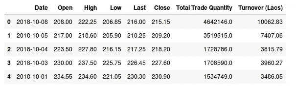

数据集中有多个变量—日期、开盘、盘高、盘低、最后、收盘、total_trade_quantity 和成交量。

*   列*开盘*和*收盘*代表股票在某一天交易的起始和最终价格。
*   *高*、*低*和*最后*代表当天股票的最高、最低和最后价格。
*   *总交易量*是当天买卖的股票数量*成交量(Lacs)* 是特定公司在给定日期的成交量。

另一个需要注意的重要事情是，市场在周末和公共假期是关闭的。再次注意上表，一些日期值缺失—2018 年 2 月 10 日、2018 年 6 月 10 日、2018 年 7 月 10 日。在这些日期中，2 日是国定假日，而 6 日和 7 日是周末。

损益计算通常由股票当天的收盘价决定，因此我们将收盘价作为目标变量。让我们绘制目标变量，以了解它在我们的数据中是如何形成的:

```
#setting index as date
df['Date'] = pd.to_datetime(df.Date,format='%Y-%m-%d')
df.index = df['Date']

#plot
plt.figure(figsize=(16,8))
plt.plot(df['Close'], label='Close Price history')
```

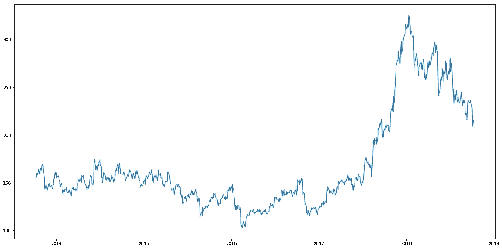

在接下来的部分中，我们将使用不同的技术来预测股票的每日收盘价。

# 移动平均数

# 介绍

“平均”是我们日常生活中最常用的词之一。例如，计算平均分以确定整体表现，或者找到过去几天的平均温度以了解今天的温度——这些都是我们定期进行的例行任务。因此，这是在我们的数据集上进行预测的一个很好的起点。

每天的预测收盘价将是一组先前观察值的平均值。我们将使用移动平均技术，而不是简单的平均，移动平均技术对每个预测使用最新的一组值。换句话说，对于每个后续步骤，在从集合中删除最早的观察值时，会考虑预测值。这里有一个简单的图表，可以帮助你更清楚地理解这一点。

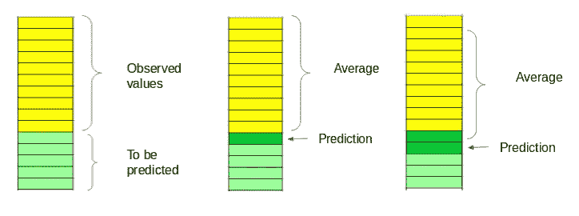

我们将在数据集上实现这项技术。第一步是创建一个只包含*日期*和*收盘*价格列的 dataframe，然后将它分成训练集和验证集来验证我们的预测。

# 履行

```
#creating dataframe with date and the target variable
data = df.sort_index(ascending=True, axis=0)
new_data = pd.DataFrame(index=range(0,len(df)),columns=['Date', 'Close'])

for i in range(0,len(data)):
     new_data['Date'][i] = data['Date'][i]
     new_data['Close'][i] = data['Close'][i]
```

在将数据拆分为训练和验证时，我们不能使用随机拆分，因为这将破坏时间成分。所以在这里，我将去年的数据设置为验证，将之前 4 年的数据设置为训练。

```
#splitting into train and validation
train = new_data[:987]
valid = new_data[987:]new_data.shape, train.shape, valid.shape
((1235, 2), (987, 2), (248, 2))train['Date'].min(), train['Date'].max(), valid['Date'].min(), valid['Date'].max()

(Timestamp('2013-10-08 00:00:00'),
Timestamp('2017-10-06 00:00:00'),
Timestamp('2017-10-09 00:00:00'),
Timestamp('2018-10-08 00:00:00'))
```

下一步是为验证集创建预测，并使用实际值检查 RMSE。

```
#make predictions
preds = []
for i in range(0,248):
    a = train['Close'][len(train)-248+i:].sum() + sum(preds)
    b = a/248
    preds.append(b)
```

# 结果

```
#calculate rmse
rms=np.sqrt(np.mean(np.power((np.array(valid['Close'])-preds),2)))
rms104.51415465984348
```

仅仅检查 RMSE 并不能帮助我们理解模型的表现。我们把这个形象化一点，以便更直观的理解。这是预测值和实际值的曲线图。

```
#plot
valid['Predictions'] = 0
valid['Predictions'] = preds
plt.plot(train['Close'])
plt.plot(valid[['Close', 'Predictions']])
```

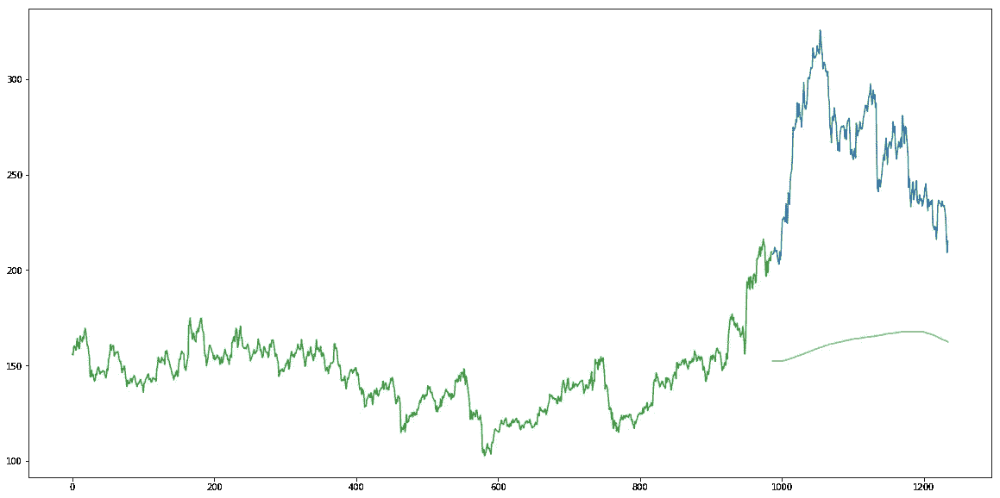

# 推理

RMSE 值接近 105，但结果并不乐观(从图中可以看出)。预测值与训练集中的观察值在相同的范围内(最初有增加的趋势，然后缓慢减少)。

在下一节中，我们将研究两种常用的机器学习技术——线性回归和 kNN，并了解它们在我们的股票市场数据上的表现。

# 线性回归

# 介绍

可以在这些数据上实现的最基本的机器学习算法是线性回归。线性回归模型返回一个确定自变量和因变量之间关系的方程。

线性回归的方程式可以写成:

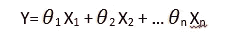

这里，x1，x2，…xn 代表自变量，而系数θ1，θ2，…θn 代表权重。你可以参考下面的文章来更详细地研究线性回归:

*   线性、脊形和套索回归综合初学者指南。

对于我们的问题陈述，我们没有一组独立变量。我们只有日期。让我们使用日期列来提取诸如日、月、年、周一/周五等特征。然后拟合线性回归模型。

# 履行

我们将首先按升序对数据集进行排序，然后创建一个单独的数据集，这样创建的任何新要素都不会影响原始数据。

```
#setting index as date values
df['Date'] = pd.to_datetime(df.Date,format='%Y-%m-%d')
df.index = df['Date']

#sorting
data = df.sort_index(ascending=True, axis=0)

#creating a separate dataset
new_data = pd.DataFrame(index=range(0,len(df)),columns=['Date', 'Close'])

for i in range(0,len(data)):
    new_data['Date'][i] = data['Date'][i]
    new_data['Close'][i] = data['Close'][i]
```

这就产生了如下特性:

'年'，'月'，'周'，'日'，'日周'，'日年'，'是 _ 月 _ 结束'，'是 _ 月 _ 开始'，'是 _ 季度 _ 结束'，'是 _ 季度 _ 开始'，'是 _ 年 _ 结束'，和'是 _ 年 _ 开始'。

*注意:我使用了 fastai 库中的 add_datepart。如果您没有安装它，您可以简单地使用命令****pip install fastai****。否则，您可以使用 python 中简单 for 循环来创建这些功能。我在下面展示了一个例子。*

除此之外，我们还可以添加我们认为与预测相关的一组特征。例如，我的假设是，一周的第一天和最后一天对股票收盘价的影响可能远远超过其他日子。因此，我创建了一个特性来识别某一天是星期一/星期五还是星期二/星期三/星期四。这可以使用以下代码行来完成:

```
new_data['mon_fri'] = 0
for i in range(0,len(new_data)):
    if (new_data['Dayofweek'][i] == 0 or new_data['Dayofweek'][i] == 4):
        new_data['mon_fri'][i] = 1
    else:
        new_data['mon_fri'][i] = 0
```

如果星期几等于 0 或 4，则列值将为 1，否则为 0。同样，您可以创建多个特征。如果你对有助于预测股价的功能有什么想法，请在评论区分享。

我们现在将数据分为训练集和验证集，以检查模型的性能。

```
#split into train and validation
train = new_data[:987]
valid = new_data[987:]

x_train = train.drop('Close', axis=1)
y_train = train['Close']
x_valid = valid.drop('Close', axis=1)
y_valid = valid['Close']

#implement linear regression
from sklearn.linear_model import LinearRegression
model = LinearRegression()
model.fit(x_train,y_train)
```

# 结果

```
#make predictions and find the rmse
preds = model.predict(x_valid)
rms=np.sqrt(np.mean(np.power((np.array(y_valid)-np.array(preds)),2)))
rms121.16291596523156
```

RMSE 值高于以前的技术，这清楚地表明线性回归表现不佳。让我们看看这个图，理解为什么线性回归没有做好:

```
#plot
valid['Predictions'] = 0
valid['Predictions'] = preds

valid.index = new_data[987:].index
train.index = new_data[:987].index

plt.plot(train['Close'])
plt.plot(valid[['Close', 'Predictions']])
```

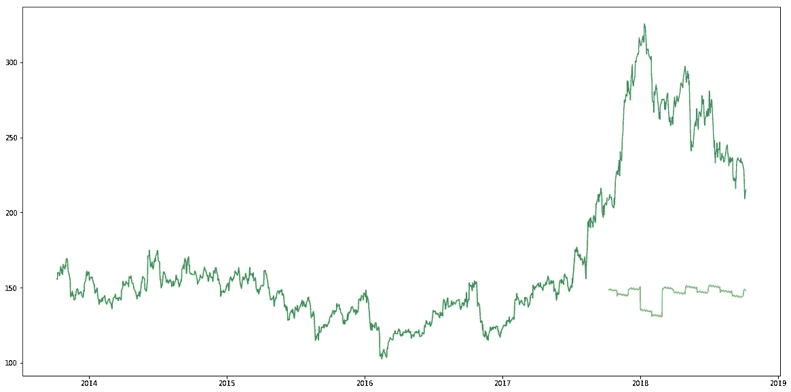

# 推理

线性回归是一种简单的技术，很容易解释，但有几个明显的缺点。使用回归算法的一个问题是模型过度适应日期和月份列。该模型将考虑一个月前同一*日期*或一年前同一*日期/月份*的值，而不是从预测的角度考虑以前的值。

从上面的情节可以看出，对于 2016 年 1 月和 2017 年 1 月，股价出现了下跌。该模型预测 2018 年 1 月也是如此。线性回归技术可以很好地解决诸如 [Big Mart sales](https://datahack.analyticsvidhya.com/contest/practice-problem-big-mart-sales-iii/) 这样的问题，其中独立特征对于确定目标值很有用。

# k-最近邻

# 介绍

这里可以使用的另一个有趣的 ML 算法是 kNN (k 最近邻)。基于独立变量，kNN 发现新数据点和旧数据点之间的相似性。让我用一个简单的例子来解释一下。

考虑 11 个人的身高和年龄。根据给定的特征(“年龄”和“身高”)，该表可以用如下所示的图形格式表示:

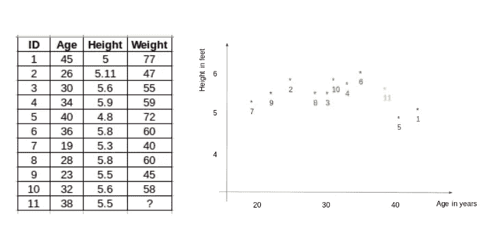

为了确定 ID #11 的权重，kNN 考虑这个 ID 的最近邻居的权重。ID #11 的权重被预测为其邻居的平均值。如果我们现在考虑三个邻居(k=3)，ID#11 的重量将= (77+72+60)/3 = 69.66 千克。

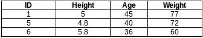

关于 kNN 的详细了解，可以参考以下文章:

*   [k 近邻介绍:简化](https://www.analyticsvidhya.com/blog/2018/03/introduction-k-neighbours-algorithm-clustering/)
*   [回归 K 近邻算法实用介绍](https://www.analyticsvidhya.com/blog/2018/08/k-nearest-neighbor-introduction-regression-python/)

# 履行

```
#importing libraries
from sklearn import neighbors
from sklearn.model_selection import GridSearchCV
from sklearn.preprocessing import MinMaxScaler
scaler = MinMaxScaler(feature_range=(0, 1))
```

使用与上一节相同的训练和验证集:

```
#scaling data
x_train_scaled = scaler.fit_transform(x_train)
x_train = pd.DataFrame(x_train_scaled)
x_valid_scaled = scaler.fit_transform(x_valid)
x_valid = pd.DataFrame(x_valid_scaled)

#using gridsearch to find the best parameter
params = {'n_neighbors':[2,3,4,5,6,7,8,9]}
knn = neighbors.KNeighborsRegressor()
model = GridSearchCV(knn, params, cv=5)

#fit the model and make predictions
model.fit(x_train,y_train)
preds = model.predict(x_valid)
```

# 结果

```
#rmse
rms=np.sqrt(np.mean(np.power((np.array(y_valid)-np.array(preds)),2)))
rms115.17086550026721
```

RMSE 值没有很大的差异，但是预测值和实际值的图表应该提供更清晰的理解。

```
#plot
valid['Predictions'] = 0
valid['Predictions'] = preds
plt.plot(valid[['Close', 'Predictions']])
plt.plot(train['Close'])
```

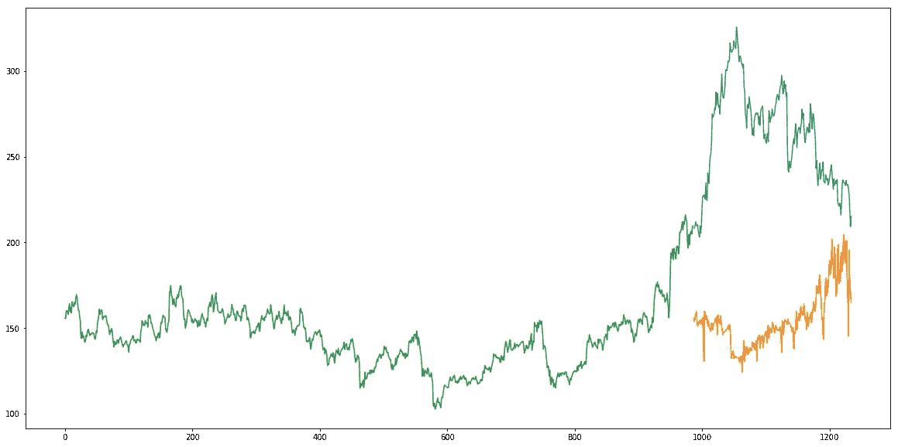

# 推理

RMSE 值几乎类似于线性回归模型，该图显示了相同的模式。像线性回归一样，kNN 也确定了 2018 年 1 月的下降，因为这是过去几年的模式。我们可以有把握地说，回归算法在这个数据集上表现不佳。

让我们来看看一些时间序列预测技术，看看它们在面对股票价格预测挑战时表现如何。

# ARIMA 汽车

# 介绍

ARIMA 是一种非常流行的时间序列预测统计方法。ARIMA 模型考虑过去的值来预测未来的值。ARIMA 有三个重要参数:

*   p(用于预测下一个值的过去值)
*   q(用于预测未来值的过去预测误差)
*   d(差分阶数)

ARIMA 的参数调整耗费大量时间。因此，我们将使用自动 ARIMA，它会自动选择提供最小误差的(p，q，d)的最佳组合。要了解更多关于自动 ARIMA 的工作原理，请参考这篇文章:

*   [使用 Auto ARIMA 构建高性能时间序列模型](https://www.analyticsvidhya.com/blog/2018/08/auto-arima-time-series-modeling-python-r/)

# 履行

```
from pyramid.arima import auto_arima

data = df.sort_index(ascending=True, axis=0)

train = data[:987]
valid = data[987:]

training = train['Close']
validation = valid['Close']

model = auto_arima(training, start_p=1, start_q=1,max_p=3, max_q=3, m=12,start_P=0, seasonal=True,d=1, D=1, trace=True,error_action='ignore',suppress_warnings=True)
model.fit(training)

forecast = model.predict(n_periods=248)
forecast = pd.DataFrame(forecast,index = valid.index,columns=['Prediction'])
```

# 结果

```
rms=np.sqrt(np.mean(np.power((np.array(valid['Close'])-np.array(forecast['Prediction'])),2)))
rms44.954584993246954
```

RMSE 值从 115 降低到 45。

```
#plot
plt.plot(train['Close'])
plt.plot(valid['Close'])
plt.plot(forecast['Prediction'])
```

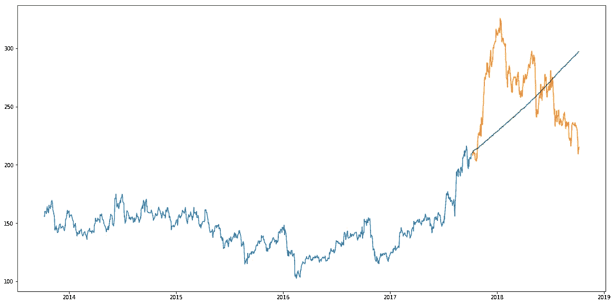

# 推理

正如我们前面看到的，自动 ARIMA 模型使用过去的数据来理解时间序列中的模式。使用这些值，模型捕捉到了序列中的增长趋势。尽管使用这种技术的预测远好于之前实现的机器学习模型的预测，但这些预测仍然不接近真实值。

从图中可以明显看出，该模型捕捉到了该系列中的一个趋势，但并未将重点放在季节性部分。在下一节中，我们将实现一个时间序列模型，该模型将序列的趋势和季节性都考虑在内。

# 先知

# 介绍

有许多时间序列技术可以在股票预测数据集上实现，但是这些技术中的大多数在拟合模型之前需要大量的数据预处理。由脸书设计和首创的 Prophet 是一个时间序列预测库，它不需要数据预处理，实现起来非常简单。Prophet 的输入是一个包含两列的 data frame:date 和 target (ds 和 y)。

Prophet 试图捕捉过去数据中的季节性，当数据集很大时效果很好。这里有一篇有趣的文章，以简单直观的方式解释了 Prophet:

*   [使用脸书先知](https://www.analyticsvidhya.com/blog/2018/05/generate-accurate-forecasts-facebook-prophet-python-r/)生成快速准确的时间序列预测。

# 履行

```
#importing prophet
from fbprophet import Prophet

#creating dataframe
new_data = pd.DataFrame(index=range(0,len(df)),columns=['Date', 'Close'])

for i in range(0,len(data)):
    new_data['Date'][i] = data['Date'][i]
    new_data['Close'][i] = data['Close'][i]

new_data['Date'] = pd.to_datetime(new_data.Date,format='%Y-%m-%d')
new_data.index = new_data['Date']

#preparing data
new_data.rename(columns={'Close': 'y', 'Date': 'ds'}, inplace=True)

#train and validation
train = new_data[:987]
valid = new_data[987:]

#fit the model
model = Prophet()
model.fit(train)

#predictions
close_prices = model.make_future_dataframe(periods=len(valid))
forecast = model.predict(close_prices)
```

# 结果

```
#rmse
forecast_valid = forecast['yhat'][987:]
rms=np.sqrt(np.mean(np.power((np.array(valid['y'])-np.array(forecast_valid)),2)))
rms57.494461930575149#plot
valid['Predictions'] = 0
valid['Predictions'] = forecast_valid.values

plt.plot(train['y'])
plt.plot(valid[['y', 'Predictions']])
```

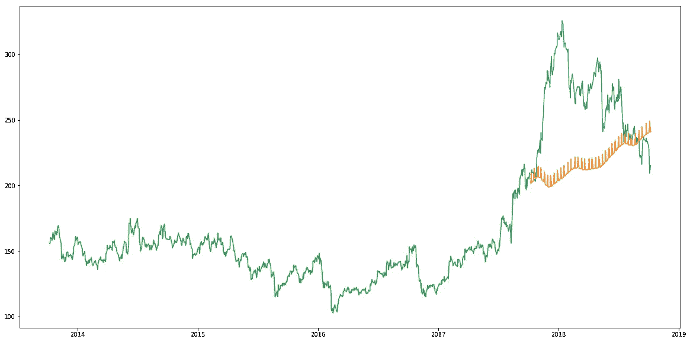

# 推理

Prophet(像大多数时间序列预测技术一样)试图从过去的数据中捕捉趋势和季节性。该模型通常在时间序列数据集上表现良好，但在这种情况下却名不副实。

事实证明，股票价格没有特定的趋势或季节性。这在很大程度上取决于目前市场的行情，因此价格会有涨有跌。因此，像 ARIMA、萨里玛和预言家这样的预测技术对于这个特殊的问题不会显示出好的结果。

让我们继续尝试另一种先进的技术——长短期记忆(LSTM)。

# 长短期记忆(LSTM)

# 介绍

LSTMs 被广泛用于序列预测问题，并被证明是非常有效的。它们如此有效的原因是因为 LSTM 能够存储过去重要的信息，并忘记不重要的信息。LSTM 有三个城门:

*   **输入门:**输入门向细胞状态添加信息
*   **遗忘之门:**它删除模型不再需要的信息
*   **输出门:**LSTM 的输出门选择要显示的信息作为输出

要更详细地了解 LSTM 及其建筑，你可以阅读下面的文章:

*   [长短期记忆简介](https://www.analyticsvidhya.com/blog/2017/12/fundamentals-of-deep-learning-introduction-to-lstm/)

现在，让我们将 LSTM 实现为一个黑盒，并检查它在特定数据上的性能。

# 履行

```
#importing required libraries
from sklearn.preprocessing import MinMaxScaler
from keras.models import Sequential
from keras.layers import Dense, Dropout, LSTM

#creating dataframe
data = df.sort_index(ascending=True, axis=0)
new_data = pd.DataFrame(index=range(0,len(df)),columns=['Date', 'Close'])
for i in range(0,len(data)):
    new_data['Date'][i] = data['Date'][i]
    new_data['Close'][i] = data['Close'][i]

#setting index
new_data.index = new_data.Date
new_data.drop('Date', axis=1, inplace=True)

#creating train and test sets
dataset = new_data.values

train = dataset[0:987,:]
valid = dataset[987:,:]

#converting dataset into x_train and y_train
scaler = MinMaxScaler(feature_range=(0, 1))
scaled_data = scaler.fit_transform(dataset)

x_train, y_train = [], []
for i in range(60,len(dataset)):
    x_train.append(scaled_data[i-60:i,0])
    y_train.append(scaled_data[i,0])
x_train, y_train = np.array(x_train), np.array(y_train)

x_train = np.reshape(x_train, (x_train.shape[0],x_train.shape[1],1))

# create and fit the LSTM network
model = Sequential()
model.add(LSTM(units=50, return_sequences=True, input_shape=(x_train.shape[1],1)))
model.add(LSTM(units=50))
model.add(Dense(1))

model.compile(loss='mean_squared_error', optimizer='adam')
model.fit(x_train, y_train, epochs=1, batch_size=1, verbose=2)

#predicting 246 values, using past 60 from the train data
inputs = new_data[len(new_data) - len(valid) - 60:].values
inputs = inputs.reshape(-1,1)
inputs  = scaler.transform(inputs)

X_test = []
for i in range(60,inputs.shape[0]):
    X_test.append(inputs[i-60:i,0])
X_test = np.array(X_test)

X_test = np.reshape(X_test, (X_test.shape[0],X_test.shape[1],1))
closing_price = model.predict(X_test)
closing_price = scaler.inverse_transform(closing_price)
```

# 结果

```
rms=np.sqrt(np.mean(np.power((np.array(valid['Close'])-np.array(valid['Predictions'])),2)))
rms11.772259608962642
```

rmse 大幅下降！让我们对照实际值来检查一下预测。

```
#for plotting
train = new_data[:989]
valid = new_data[989:]

valid['Predictions'] = 0
valid['Predictions'] = closing_price

plt.plot(train['Close'])
plt.plot(valid[['Close','Predictions']])
```

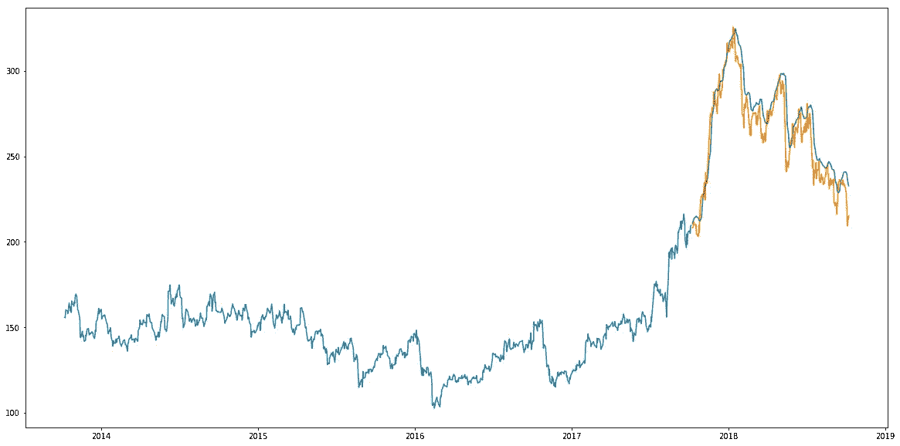

# 推理

哇！LSTM 轻而易举地超越了我们迄今为止看到的任何算法。LSTM 模型可以针对各种参数进行调整，例如更改 LSTM 层数、添加下降值或增加历元数。但是，LSTM 的预测是否足以确定股票价格是上涨还是下跌呢？肯定不是！

正如我在文章开始时提到的，股票价格受到有关公司的新闻和其他因素的影响，如公司的非货币化或合并/拆分。还有一些无形的因素通常是无法预先预测的。

# 结束注释

时间序列预测是一个非常有趣的领域，这是我在写这些文章的时候意识到的。社区中有一种看法，认为这是一个复杂的领域，虽然有一点道理，但一旦掌握了基本技术，就不会那么难了。

我很想知道 LSTM 是如何解决一种不同的时间序列问题的，并鼓励你自己也尝试一下。如果你有任何问题，欢迎在下面的评论区联系我。

*原载于 2018 年 10 月 25 日*[*【www.analyticsvidhya.com】*](https://www.analyticsvidhya.com/blog/2018/10/predicting-stock-price-machine-learningnd-deep-learning-techniques-python/)*。*