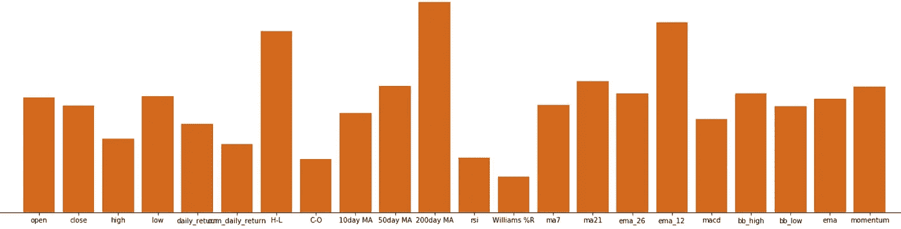

# 用技术指标预测股票趋势

> 原文：<https://medium.com/analytics-vidhya/stock-trend-prediction-with-technical-indicators-feature-engineering-and-python-code-1fa54d5806ba?source=collection_archive---------0----------------------->

## 使用 Python 代码的特征工程和分类模型

作者图片

正确预测未来趋势的预测模型对于投资管理和算法交易至关重要。在交易者中，使用技术指标进行金融预测是很普遍的。输入窗口长度是一个时间范围参数，需要在以下情况下设置