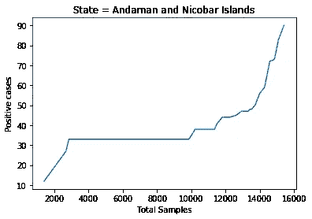

# COVID’19 在印度测试的故事

> 原文：<https://medium.com/analytics-vidhya/story-of-covid19-testing-in-india-2ec70c4d6572?source=collection_archive---------37----------------------->

“药可以治病，但只有医生才能治好病人。”——卡尔·荣格

2020 年 7 月 1 日，在印度被庆祝为国家医生日。这个国家的公民过去、现在和将来都欠医生的钱。医生提供的服务可以用货币来支付，但是他们的好意是无法支付的。在这个时代，医生的负担大大增加了。负担增加的原因是因为患者患病的比率上升非常快，合格的医疗保健专业人员也很缺乏。

印度注册医疗保健专业人员总数为 840，130 人。在印度这样的国家，医生和人口的比例是 1:1800。印度每年培养约 5 万名医生，据世卫组织称，印度医生与人口的比例应为 1:1000。自从 COVID'19 在印度出现以来，恐怕已有近 70 名印度医生死亡。德里是医护人员受打击最严重的地区之一，因为 2000 名医护人员的新冠肺炎病毒检测呈阳性。截至 5 月 23 日，印度医学研究委员会(ICMR)在医护人员中确认了 1073 例阳性病例。

本文的目的是分析每天检测的样本总数与检测完成后出现的阳性病例的比率。疾病的快速检测是增加了困境还是仅仅是一个可以控制的峰值。这篇文章提供了关于印度每个邦的见解，比如印度每个邦何时开始检测以及截至 2020 年 6 月 29 日的阳性病例总数。

# 概述:

印度的一些邦已经开始对 COVID'19 进行快速检测，在此过程中，泰米尔纳德邦、马哈拉施特拉邦等邦进行了 80 多天的检测，阳性病例迅速增加。像特伦甘纳州只做了 18 天的测试，即使 18 天阳性率也很高。病例增加的原因是由于遵循了不正确的检测程序，或者患者表现出的症状没有得到正确的诊断。这一方面是真的，快速检测会增加阳性病例率。在我看来，快速测试是必要的，但必须小心谨慎。

# 安达曼－尼科巴群岛

图:1。安达曼和尼科巴群岛的阳性病例与总检测天数之比

图 1 显示了安达曼和尼科巴群岛阳性病例的趋势。安达曼和尼科巴群岛从 2020 年 4 月 17 日开始测试。从 2020 年 4 月 17 日到 2020 年 6 月 29 日，他们已经测试了 48 天。

图:2。检测样本总数与阳性病例

图 2 显示了阳性病例相对于测试样本总数的趋势。在 48 天内，安达曼和尼科巴群岛对 16000 个样本进行了 COVID'19 测试。从图中，我们可以说，阳性病例显示了从 1500 到 3500 个样本的轻微线性增加，阳性病例是 35。从 3500 个样本到 10，000 个样本，COVID'19 的阳性病例显示出静态趋势，每次报告的阳性病例为 35 个。从 10000 到 16000 个样本检测，COVID'19 的阳性病例在快速增加。安达曼和尼科巴群岛的 COVID'19 阳性病例总数为 90 例。被测试的总样本与 COVID’19 阳性病例之间的个人相关性为 0.82。

图:3。安达曼和尼科巴群岛病例每月增加

图 3 显示了安达曼和尼科巴群岛 COVID'19 病例的每月上升情况。四月被称为目标 0，五月被称为目标 1，六月被称为目标 2。我们可以看到，4 月和 5 月的阳性病例率保持不变(n=33)。6 月份，安达曼和尼科巴群岛的病例迅速增加。

# 安得拉邦

图:4。安得拉邦阳性病例与检测总天数之比

图 4 显示了安得拉邦阳性病例的趋势。安得拉邦从 2020 年 4 月 2 日开始测试。从 2020 年 4 月 2 日到 2020 年 6 月 30 日，他们已经测试了 80 天。

图 5:检测样本总数与阳性病例

图 5 显示了阳性病例相对于测试样本总数的趋势。在 80 天内，安得拉邦对 80 万个样本进行了 COVID'19 测试。从图中，我们可以说，阳性病例显示了高达 60 万样本的轻微线性增加，阳性病例为 6000。从 60 万份样本到 75 万份样本，COVID’19 的阳性病例显示出快速增加，其中病例为 1.4 万。从 75 万到 89 万样本检测，COVID'19 的阳性病例呈线性增加。截至 2020 年 6 月 30 日，安得拉邦 COVID'19 阳性病例总数为 14000 例。被测试的总样本与 COVID’19 阳性病例之间的个人相关性为 0.89。

图:6。安得拉邦每月病例上升

图 6 显示了安得拉邦 COVID'19 病例的月增长情况。四月被称为目标 0，五月被称为目标 1，六月被称为目标 2。我们可以看到，4 月、5 月和 6 月的某些月份(2020 年 6 月 18 日)的病例数呈线性上升(n=6000)。截至 2020 年 6 月 18 日，安得拉邦已经完成了大约 60 万次测试。安得拉邦的问题始于他们跨过 60 万检测关口后，安得拉邦在 2020 年 6 月 19 日突然出现了 2000 个病例。从那时起，我们可以看到六月在图表中有不连续的点。得出的结论是，安得拉邦仍然需要在与 COVID'19 的斗争中找到一种正常感。

# 德里

图:7。德里的阳性病例与总检测天数之比

图 7 显示了德里阳性病例的趋势。德里从 2020 年 4 月 7 日开始测试。从 2020 年 4 月 2 日到 2020 年 6 月 30 日，他们已经测试了 80 天。

图:8。检测样本总数与阳性病例

图 8 显示了阳性病例相对于测试样本总数的趋势。在 80 天里，德里对 50 万个样本进行了 COVID'19 测试。从该图中，我们可以说，阳性病例显示了直到 150 万样本的轻微线性增加，阳性病例为 1.4 万。从 20 万份样本到 35 万份样本，COVID'19 的阳性病例显示出快速增加，其中病例为 5.6 万。从 35 万到 50 万样本检测，COVID'19 的阳性病例呈线性增加。截至 2020 年 6 月 30 日，德里的 COVID'19 阳性病例总数为 8 万例。被测试的总样本与 COVID’19 阳性病例之间的个人相关性为 0.97。

图:9。德里每月病例上升

图 9 显示了德里 COVID'19 病例的月度上升。四月被称为目标 0，五月被称为目标 1，六月被称为目标 2。在 4 月份，德里进行了 25000 次检测，报告的阳性病例有 3000 例。在 5 月份，德里进行了 2 万 5 千次检测，阳性病例从 50 万线性增加到 2 万。在 6 月份，德里检测了 30 万多份样本，直到前 5 万份，病例呈线性增长。但是，在最近的 250 万次检测中，阳性病例呈阶梯式增加。

# 卡纳塔克邦

图 10。卡纳塔克邦阳性病例与检测总天数之比

图 10 显示了卡纳塔克邦阳性病例的趋势。卡纳塔克邦从 2020 年 4 月 7 日开始测试。从 2020 年 4 月 3 日到 2020 年 6 月 30 日，他们已经测试了 87 天。

图:11。检测样本总数与阳性病例

图 11 显示了阳性病例相对于测试样本总数的趋势。在 87 天内，卡纳塔克邦对 60 万个样本进行了 COVID'19 测试。从图中，我们可以说，阳性病例显示了直到 350 万样本的轻微线性增加，阳性病例为 4000。从 20 万份样本到 35 万份样本，COVID'19 的阳性病例显示出快速增加，其中病例为 5.6 万。从 35 万到 55 万样本检测，COVID'19 的阳性病例迅速增加，使卡纳塔克邦的 COVID'19 总数达到 1 万。

图:12。卡纳塔克邦每月病例增加

图 12 显示了卡纳塔克邦 COVID'19 病例的月度上升。四月被称为目标 0，五月被称为目标 1，六月被称为目标 2。在 4 月份，卡纳塔克邦进行了 5 万次检测，报告的阳性病例只有 500 例。在 5 月份，卡纳塔克邦进行了 2 万 5 千次检测，阳性病例从 500 例直线上升到 3000 例。在 6 月份，卡纳塔克邦检测了 30 多万份样本，到 55 万份，病例呈线性增长。但是，在过去的 5 万次测试中，阳性病例呈阶梯式增长。

# 奥迪沙

图:奥里萨邦 13 例阳性病例与总检测天数

图 13 显示了奥里萨邦阳性病例的趋势。奥迪沙从 2020 年 4 月 7 日开始测试。从 2020 年 4 月 7 日到 2020 年 6 月 30 日，他们已经测试了 87 天。

图:14 检测样本总数与阳性病例

图 14 显示了阳性病例相对于测试样本总数的趋势。在 87 天内，奥迪沙已经对 25000 个样本进行了 COVID'19 测试。从图中，我们可以说，阳性病例显示了高达 5000 个样本的轻微线性增加，阳性病例为 500 个。从 5，000 个样本到 15，000 个样本，COVID'19 的阳性病例显示出斜坡类型的增量，其中病例为 2，000。从 1.5 万到 2.5 万个样本检测，COVID'19 的阳性病例迅速增加，使奥里萨邦的 COVID'19 总数达到 7 千例。

图:15。奥里萨邦每月病例增加

图 15 显示了奥里萨邦 COVID'19 病例的月增长情况。四月被称为目标 0，五月被称为目标 1，六月被称为目标 2。4 月份，奥里萨邦的阳性率接近 500。在 5 月的某些时候，Odisha 对阳性率进行了静态统计。从 5 月份的 5，000 份样本检测到 15，000 份样本检测，奥里萨邦的 COVID'19 阳性率直线上升。从 15000 到 25000 个样本，COVID'19 的阳性率以斜坡方式增加。

# 泰米尔纳德邦

图:泰米尔纳德邦 16 例阳性病例与总检测天数

图 16 显示了泰米尔纳德邦阳性病例的趋势。泰米尔纳德邦从 2020 年 4 月 7 日开始测试。从 2020 年 4 月 7 日到 2020 年 6 月 30 日，他们已经测试了 87 天。

图:17 个检测样本总数与阳性病例

图 17 显示了阳性病例相对于测试样本总数的趋势。在 87 天里，泰米尔纳德邦对 120 万个样本进行了 COVID'19 测试。从图中，我们可以说，阳性病例显示了高达 10 万样本的轻微线性增量，阳性病例为 5000。从 10 万份样本到 65 万份样本，COVID'19 的阳性病例呈线性增加，病例数为 4 万。从 65 万份样本到 95 万份样本检测，泰米尔纳德邦的 COVID'19 阳性病例显示出较高的比率。从 950 万到 120 万样本检测再次以线性方式增加，目前泰米尔纳德邦 COVID'19 阳性病例总数已超过 8 万。

图:18。泰米尔纳德邦每月病例增加

图 18 显示了泰米尔纳德邦 COVID 19 病例的月增长情况。四月被称为目标 0，五月被称为目标 1，六月被称为目标 2。泰米尔纳德邦于 2020 年 4 月 3 日开始检测，当天他们检测了 3000 个样本中的 411 个阳性病例。4 月份，泰米尔纳德邦每天登记 231 例阳性病例。5 月份，泰米尔纳德邦登记了 700 至 1000 例阳性病例。6 月份，泰米尔纳德邦阳性病例大幅增加，每天登记近 2000 例。目前，泰米尔纳德邦的 COVID'19 阳性病例总数为 9 万。

# 特伦甘纳

图:特伦甘纳州 19 例阳性病例与总检测天数

图 19 显示了特伦甘纳州阳性病例的趋势。特伦甘纳从 2020 年 4 月 19 日开始测试。从 2020 年 4 月 19 日到 2020 年 6 月 30 日，他们测试了 17 天，这太令人震惊了！！

图:20 个检测样本与阳性病例

图 20 显示了阳性病例相对于测试样本总数的趋势。在 17 天内，Telangana 对 9 万个样本进行了 COVID'19 测试。从图中我们可以说，阳性病例表现出轻微的稳定性，直到第一次 2 万个样本检测，阳性病例都在 2 千以下。从 20，000 个样本到 60，000 个样本，COVID'19 的阳性病例显示出线性增加，其中病例为 8，000。从 6 万份样本到 7 万份样本检测，特伦甘纳州的 COVID'19 阳性病例显示了高阳性病例的较小波动。从 8 万到 9 万份样本检测再次以线性方式增加，目前特伦甘纳邦的 COVID 19 例阳性病例已超过 1.6 万例。

数据取自这个网站:[https://www.mohfw.gov.in/](https://www.mohfw.gov.in/)

# 感谢

感谢印度[卫生部&家庭福利](https://www.mohfw.gov.in/)将数据公之于众。