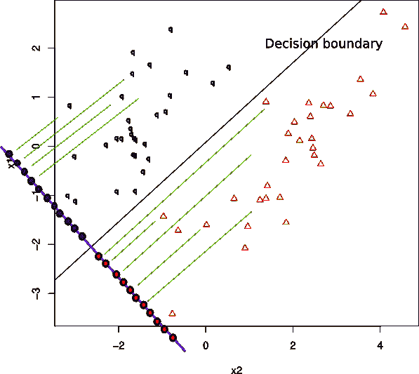
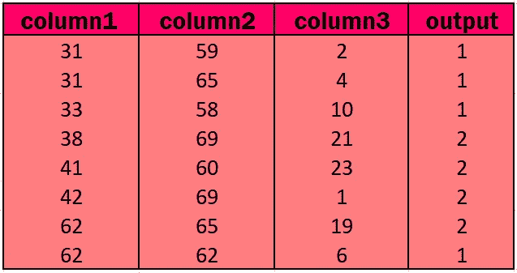
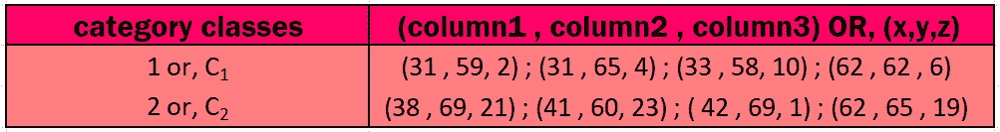
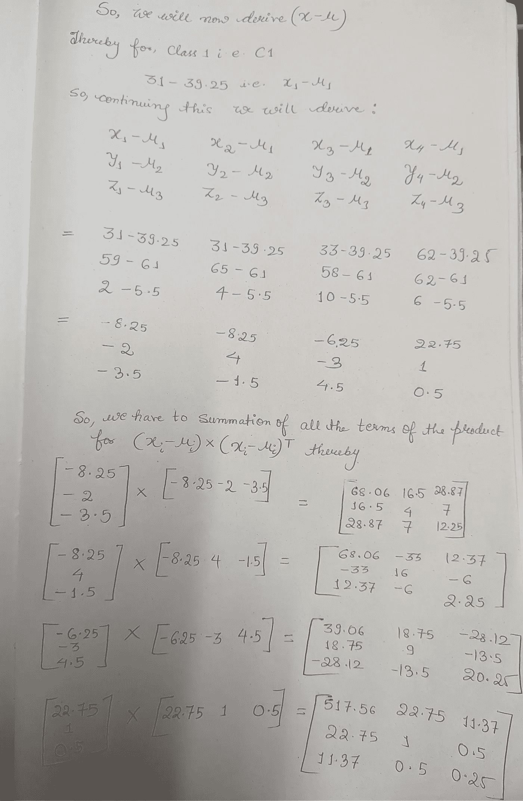
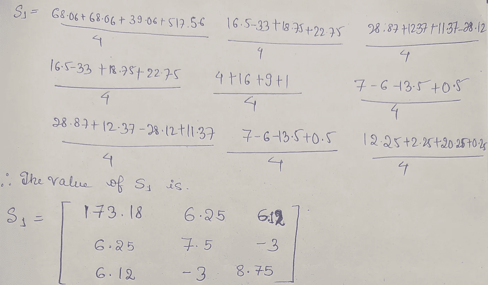
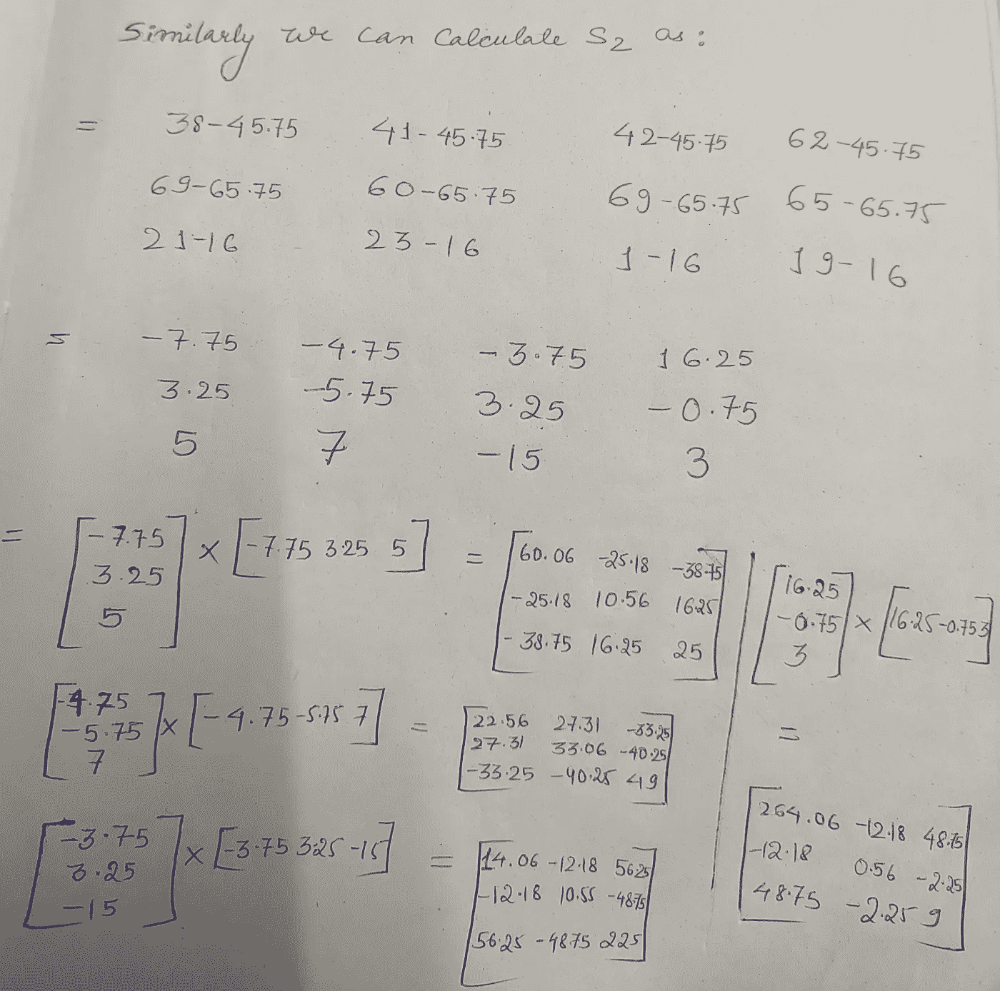
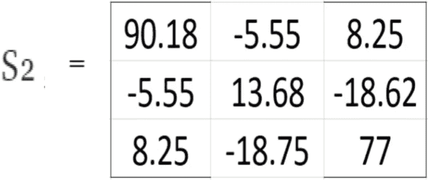
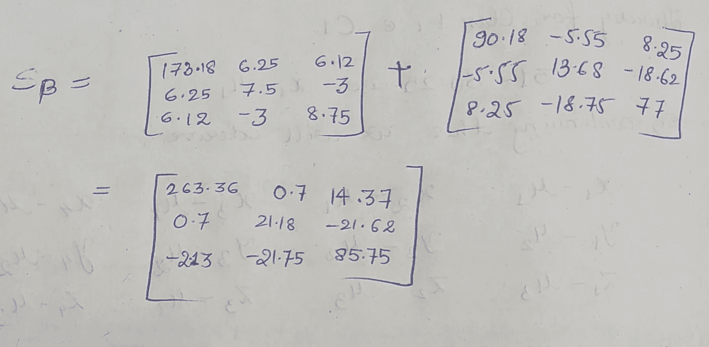
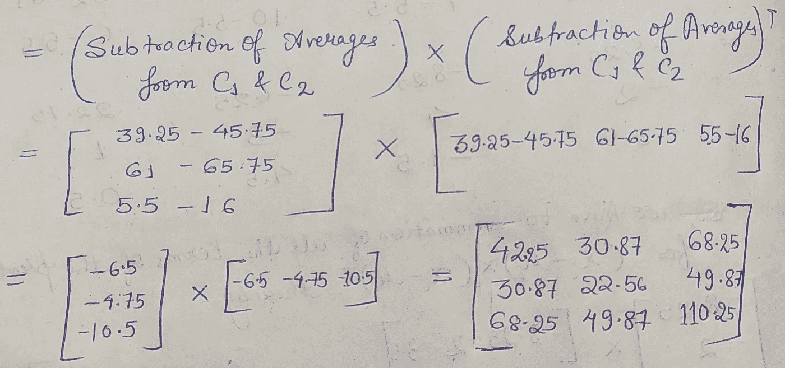

# 线性判别分析(LDA)的故事讲述

> 原文：<https://medium.com/analytics-vidhya/story-telling-for-linear-discriminant-analysis-lda-a53261afc2a9?source=collection_archive---------12----------------------->

线性判别分析是一种机器学习算法，在**分类**任务中被**用作预处理**步骤，以便我们能够**减少数据集**中与每个类别相关的特征数量。使用 LDA 的主要影响是它最大化了数据集中使用的每个类之间的距离

**(PIC-1)**→该图显示了如何使用 **LDA** 将 **q** & **△** 类的二维数据点投影到**蓝色 1D 线**上，其中**最大化 q & △类之间的间距**

需要注意的是，LDA 类似于 [**PCA**](/analytics-vidhya/reduce-the-curse-of-n-n-to-our-choice-our-choice-71c0322405cd?source=friends_link&sk=8601372811f93f7650db7502a6e0488e) (主成分分析)，但主要区别在于 **PCA 是一种无监督学习技术**，而 **LDA 是** **监督学习技术**。现在，我们将借助一个例子来理解 LDA 是如何工作的。这个例子很容易理解，但是有点长。所以只要耐心地把它读出来，几分钟后一切都会变得清晰明了。

## LDA 的工作:-

我们将使用几个来自 UCI 机器学习知识库 [**HABERMAN**](https://archive.ics.uci.edu/ml/machine-learning-databases/haberman/haberman.data) 数据集的行和列的例子。因此，在取出几个示例后，我们会收到这样一个数据集:

LDA 的主要目标是从数据集的当前 n 维特征中获得新的特征集( **k** ),其中， **k ≤(n-1)。在我们从 Haberman 数据集使用的例子中，n 的值是 3，因为在数据集中有 3 个特征列。**

表 1

## 步骤 1: →首先我们将找到类内散布 Matrix(S𝓌)和类间散布矩阵(Sᵦ)

从数据集我们得到推论:→

从而 Sᵦ = S₁ + S₂，其中 **S₁** & **S₂** 是类 C₁ & C₂ 的**协方差矩阵**

首先，我们需要得到每个类的每个特征的平均值。因此，

**μ**₁=(31+31+33+62)/4 = 39.25

**μ** ₂ = (59 + 65 + 58 + 62)/4 =61

**μ** ₃ = (2 + 4+ 10 + 6)/4 = 5.5

现在 S₁由公式给出=**σₓϵ𝒸₁(x-μ)(x-μ)ᵀ**

同样，我们将计算 S₂

**μ**₁=(38+41+42+62)/4 = 45.75

**μ**₂=(69+60+69+65)/4 = 65.75

**μ** ₃ = (21 + 23+ 1 + 19)/4 = 16

因此，当我们计算这 4 个矩阵的每个位置的平均值时，我们得到:

因此，类间散布矩阵(Sᵦ) = **S₁ + S₂ =**

Sᵦ显示了类间散布矩阵的值

现在，Matrix(S𝓌)=在课堂上分散开来

## 步骤 2: →现在我们将根据公式计算 igen 矢量& igen 值

**(s𝓌)⁻sᵦ**w =*λ*w****其中*、****w****是投影向量& **λ** 是 Igen 向量(标量值)。**

**= |**(s𝓌)⁻sᵦ-λ*I***| = 0 其中， ***I*** 为单位矩阵。**

**由于这里的计算太多，所以我只是从这里给出计算的方向。**

**在给上面的方程赋值后，我们将得到一个三次方程，解这个方程我们将得到 3 个 **λ，**的值，其中我们必须选择 **λ** 的**最高** **值**，它将输出到**最优投影**。**

**得到 **λ** 的标量值后我们将 **λ** 代入方程中，**(s𝓌)⁻sᵦ**w =*λ*w，*** *得到* ***W*** *的值作为****3×1****矩阵。***

****或者，我们可以利用这个等式直接计算出* **λ** *的值。****

****注:→(s𝓌)⁻*(μ**₁**]⁻ᵀ**-**【μ**₂**]⁻ᵀ)，其中μ** ₁ & **μ** ₂代表数据集中每个类的 3 个平均值，为 1 & 2，因此， **μ** ₁ = [39.25，61，5.5] &**

## **步骤 3: →计算实际的 1D 矢量**

**我们将通过简化**(s𝓌)⁻*(μ**₁**]⁻ᵀ**—**【μ**₂**]⁻ᵀ)**获得的矩阵值将是一个**3×1**矩阵，其转置将与 C₁ & C₂每个类的**4×3**特征矩阵的转置相乘【参见表 1】。最后，我们将得到一个 1×4 的矩阵，用于 C₁ & C₂。**

**让我们，假设 C₁ = [x₁，x₂，x₃，x₄] & C₂ = [y₁，y₂，y \，y \]，那么关于绘图(x \，y \)；(x₂,y₂)；(x₃,y₃)我们将在二维图上得到一条直线，代表表 1 中给出的二维平面上 C₁和 C₂类的特征点。最后，我们可以使用任何分类算法(如( **PIC-1** )来画出区分 C₁ & C₂类别的特征点的判定边界。**

**这是 LDA 算法的工作原理，我希望你已经掌握了这个算法的工作原理。如果您对此有任何疑问，请在回复部分告诉我，直到他们喜欢学习为止:)**