# 采用 ARIMA 和 FB Prophet 模型的 STP/HSS 流量模式

> 原文：<https://medium.com/analytics-vidhya/stp-hss-traffic-pattern-with-arima-and-fb-prophet-models-3ec43820c6a3?source=collection_archive---------25----------------------->

与示例 KPI 数据的简单比较

图片由 https://pix abay . com/photos/call-sim-card-cell-cell-71168/

蜂窝电信网络，从大的方面来说，可以分为终端、传输和控制。当我们与他人(语音或数据)交流时，蜂窝等终端使我们能够移动。当我们从一个地方移动到另一个地方时，传输是允许连续连接介质，例如移动电话编码/解码的空中电波、电信塔上的天线、连接到数据中心控制设备的光纤和电缆，用于处理语音和数据服务。

通常，移动网络具有一组用于识别它们用户的控制单元，称为归属位置寄存器(**HLR**)/归属用户服务器( **HSS** )，除此之外，它们还允许通过询问和计算先前记录在 SIM 卡上存储的向量来自用户的认证和授权。

HLR/HSS 是通过诸如 [SIGTRAN](https://en.wikipedia.org/wiki/SIGTRAN) 或 [Diameter](https://en.wikipedia.org/wiki/Diameter_(protocol)) 之类的信令协议进行通信的主动元件。不管使用的协议和请求或应答的消息类型(认证、授权、定位或取消更新、提供用户位置、路由信息、插入用户数据等)，信令链路都必须被监控，它可以识别服务上的问题并测量性能或扩展容量。

在这第一篇文章中，我使用了一个关键性能指标( **KPI** )的微妙变化的时间序列数据，这些数据来自核心网络单元接收和发送的消息，用于比较 ARIMA 模型和 FB Prophet 的结果。

数据开始于 2019–11–09 00:00:00，结束于 2019–12–08 23:55:00，每个样本 5 分钟，共 8640 行，数据集可在 [github](https://github.com/dhernandezgt/ARIMA-FB_Prophet) 上查看

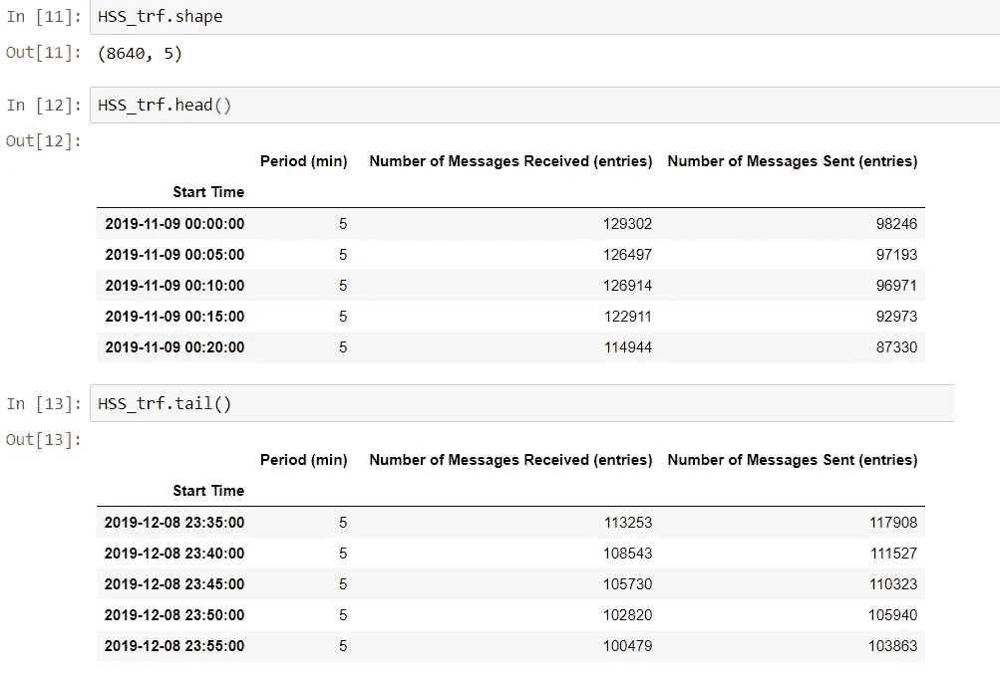

下图部署了来自网络元素的传入和传出流量，无需深入细节，我们可以看到，在观察期间，流量是不平衡的，到期末几乎达到相同的值。该分析将平均每小时对数据进行重新采样，以比较模型

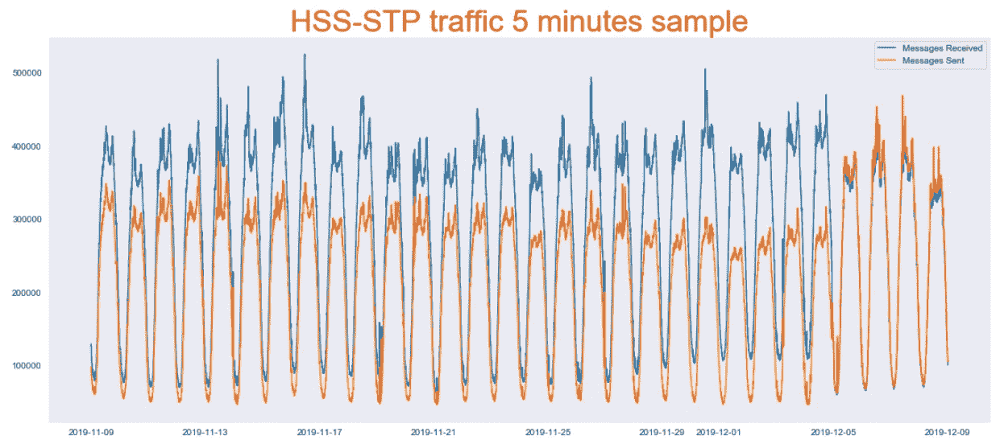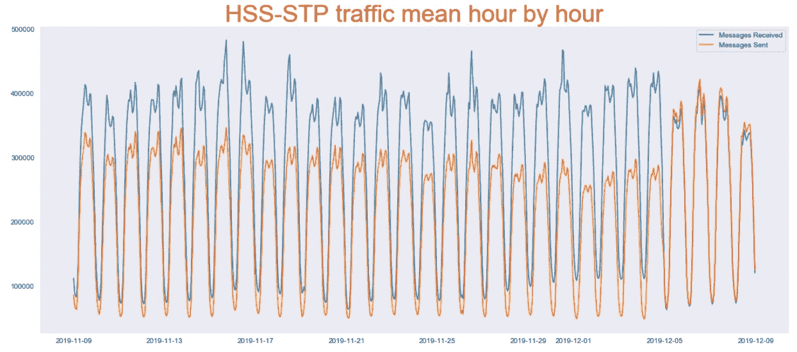

数据将分为训练(80% — 2019.11.09 至 2019.12.02)和测试(20% — 2019.12.03 至 2019.12.08)样本。每个模型将返回一个预测，该预测将通过均方误差(MSE)相互比较

# ARIMA 分析

用于预测的第一个模型是 [ARIMA](https://en.wikipedia.org/wiki/Autoregressive_integrated_moving_average) ，它代表**自回归综合移动平均**。它的特点是

1.  将当前值与先前值(AR)相关联，
2.  非平稳(一)；和
3.  移动平均的回归误差(MA)。

[ARIMA](https://en.wikipedia.org/wiki/Autoregressive_integrated_moving_average) 模型需要三个参数(p，d，q)来分别评价上述三个特征。对于“ *p* ”、对于“*d”*的增强 Dickey-Fuller 检验以及对于“*q”*的 PACF 图(部分自相关)，可以图形化地获得参数值。然而，很难用图形来识别校正值。

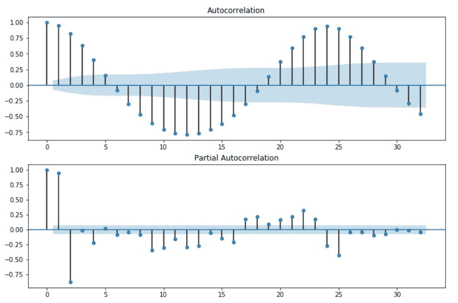

ACF(自相关)和 PACF(部分自相关)

数据集的第一步是以 Nicholas Jhana 在 [Kaggle 比赛](https://www.kaggle.com/nicholasjhana/univariate-time-series-forecasting-with-keras#Transform-Data:-Hour-by-Hour)中的方式每小时进行转换，以便将 ARIMA 模型应用于每小时的训练样本，新数据框架的一部分可以在这里看到

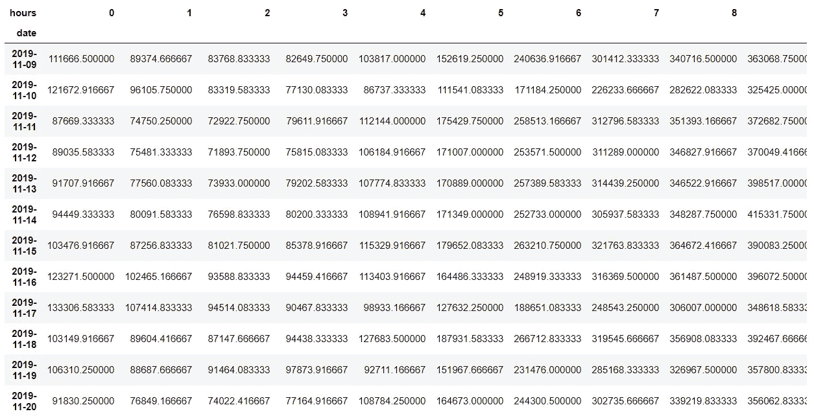

为了应用 ARIMA 模型，必须确定 *(p，d，q)* 参数，我依赖了 [Hamza Hamud](http://Can We Predict the Day Ahead Electricity Market?) 的伟大预测帖子，我遵循了上面解释的最小化 AIC ( *Akaike 信息标准*)值，这些值在改变 *p，d 和 q* 参数时比较预测模型，而不是使用 ACF/PACF 和通过使用以下函数的增强 Dickey-Fuller 检验。

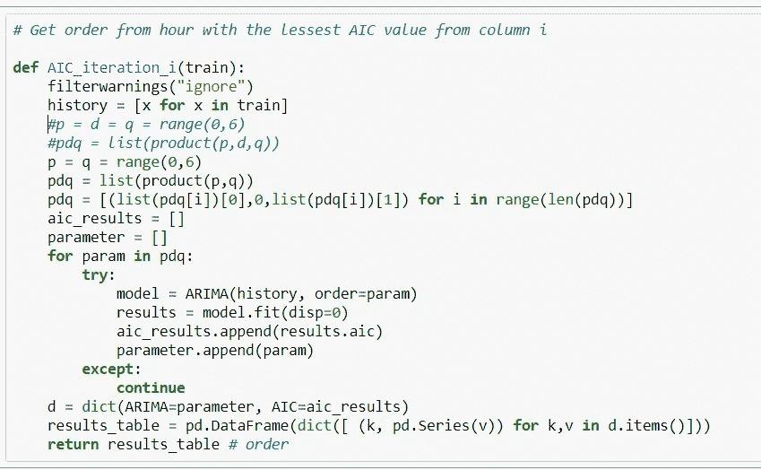

AIC 迭代函数在传递逐小时序列和返回顺序(p，d，q)以及结果表中的 AIC 时计算 AIC。

itertools 的“方法”产品在每个 *(p，d，q)* 参数中提供了从 0 到 6 的迭代，但是函数在评估“*模型= ARIMA(history，order = param)”*指令时返回错误，原因是最小 AIC 值返回 NaN 的“d”参数。

“d”参数发现大于 0 与 AIC 最小化逐小时表明数据集不是固定的。“d”参数每小时有不同的顺序(d=1、2 等)。应该通过应用微分或自然对数将数据集转换成平稳。在它之后 d = 0；p 和 q 参数，每一个都从 0 到 6 迭代。

我选择使用数据集中的自然对数进行转换，这样 AIC 迭代函数返回具有(p，0，q)参数的表，从每个小时我们取前五个 AIC 最小值用于重新评估*模型= ARIMA(历史，顺序=参数)*并逐小时循环

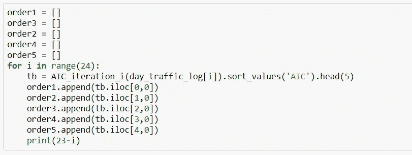

前 5 个 AIC 最小值用于重新评估预测 2 函数中的 ARIMA。当模型拟合时，一阶组合找到了几个小时序列的最小 AIC 返回误差，然后我使用第二个，如果它返回误差，那么第三个。

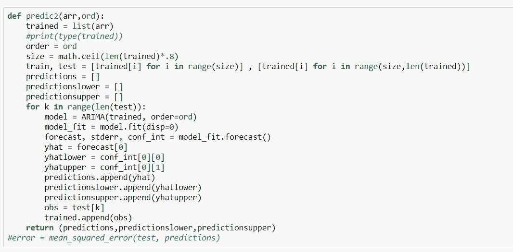

使用 predic2 函数获得 dataframe 预测后，默认情况下，其列包括 95%的预测和置信区间。因为 ARIMA 模型中的预测是用自然对数获得的，所以我们通过对预测数据集应用指数来将其转换回原始值，以便进一步分析。

下图以黑点显示收到的消息的预测结果和测试数据集的预测，紫色区域为置信区间。均方差(MSE)是 62167953964

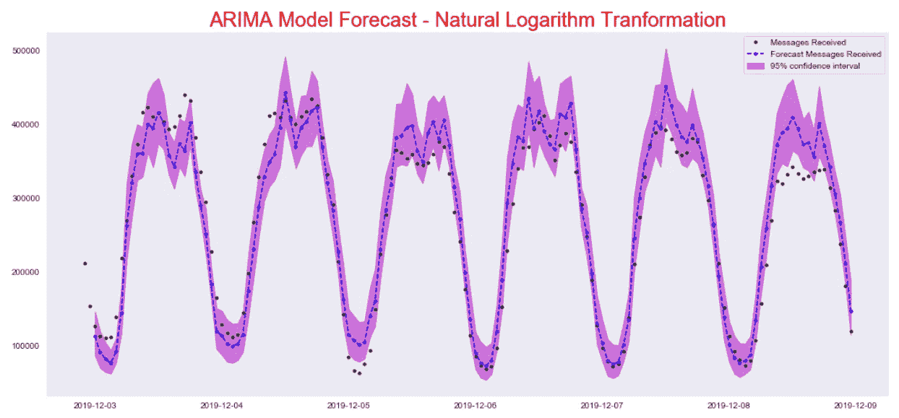

# FB 先知分析

[FB Prophet](https://facebook.github.io/prophet/) 分析简单明了，数据转换更少。它可用于预测遵循 *sklearn* 模型时间序列中的未来值。它评估季节性，并可以定制假日以改进分析。它需要两列:

1.  熊猫格式的“ds”表示日期，YYYY-MM-DD 表示时间戳
2.  “y”数值，它是用于预测的序列。

在我们的数据集的情况下，可以在 5 分钟内直接引入原始数据，可以按小时获得预测，但是为了继续分析，数据集按小时重新采样。

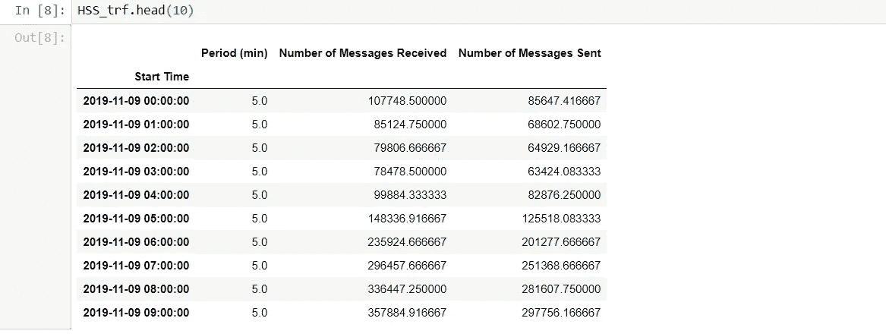

它可以使用 *Prophet()* 实例化模型，并在默认情况下以 80%的置信区间拟合数据集后立即进行，但是继续使用参数 *interval_width* 将比较置信区间设置为 95%。在 *make_future_dataframe* 方法的帮助下，创建未来时段的数据框，以适应小时时段的预测。用*预测*方法计算预测并固定在未来数据帧中。

预测结果数据集从原始数据加上预测开始。为了更好地展示，它提出了预测尾部转置。“yhat”是预测值，“yhat_lower”和“yhat_upper”是 95%的置信区间。

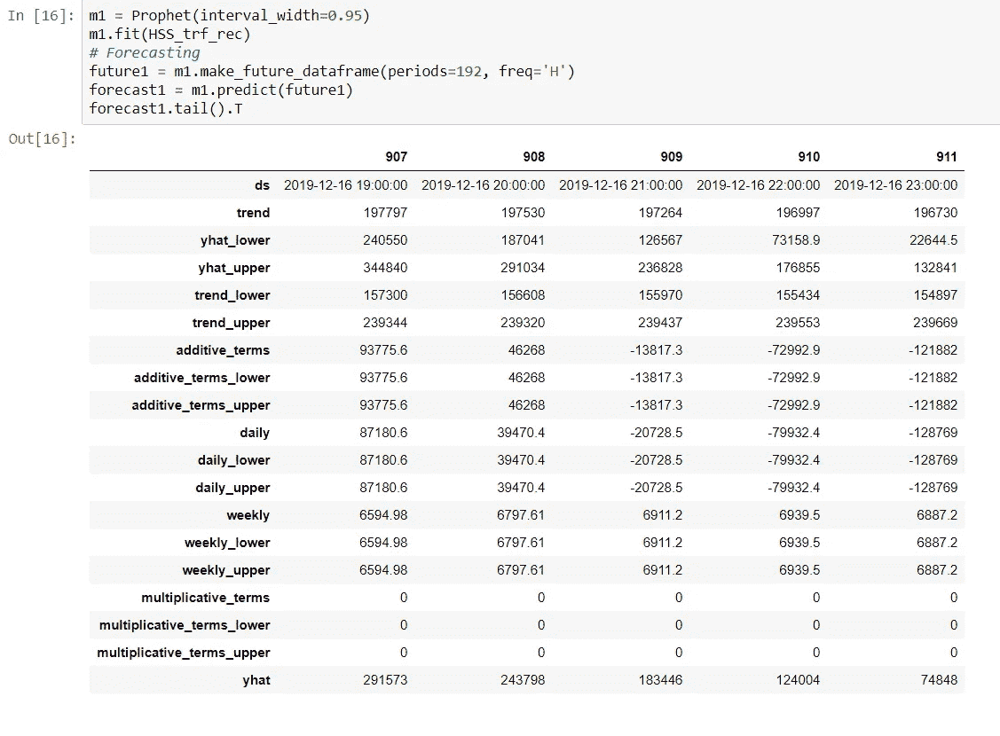

FB Prophet 还包括绘制原始数据和结果的方法。黑点是原始数据，蓝线是预测，浅蓝色是置信区间。

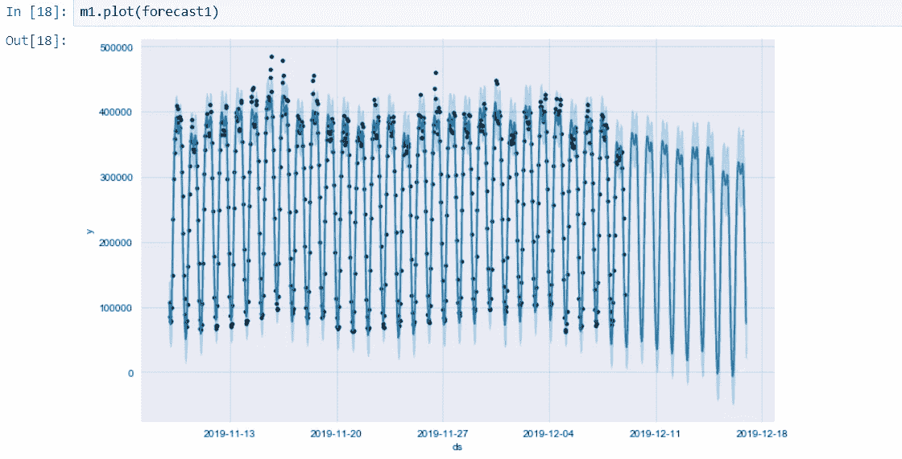

分析周期为原始数据集的 20%的测试样本(2019.12.03 至 2019.12.08)。我们可以看到，预测拟合得更好，且许多观测值在置信区间内，这降低了均方误差(MSE)。

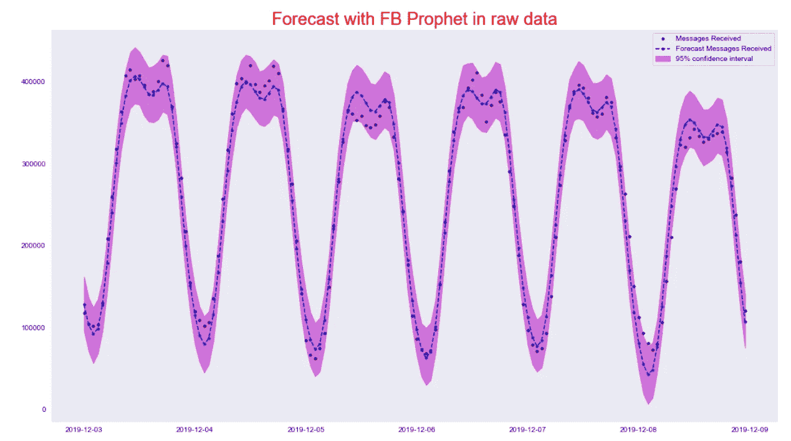

为了公平比较这两种方法，FB Prophet 将通过自然对数转换数据集进行拟合，并通过指数对数将预测结果返回到原始规模。

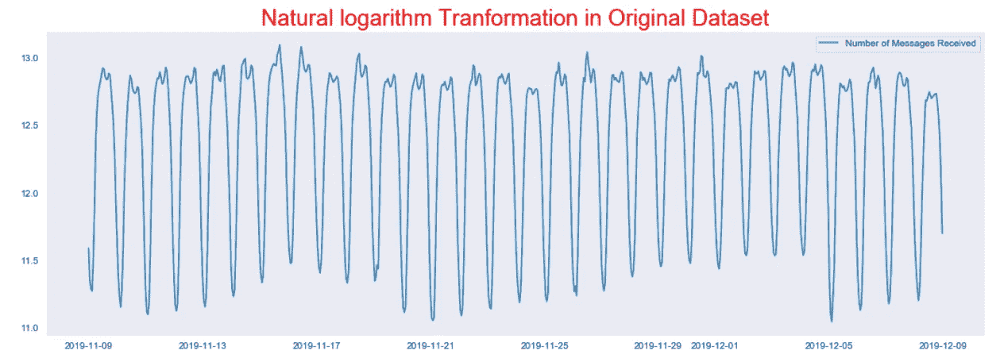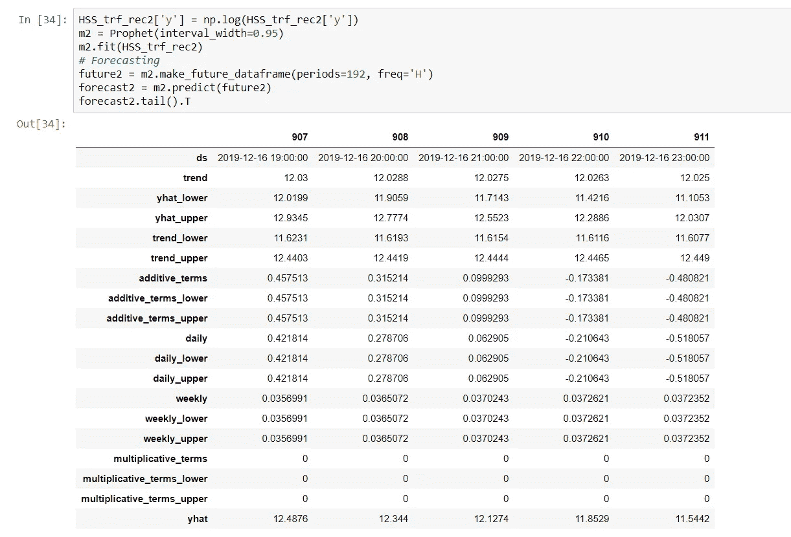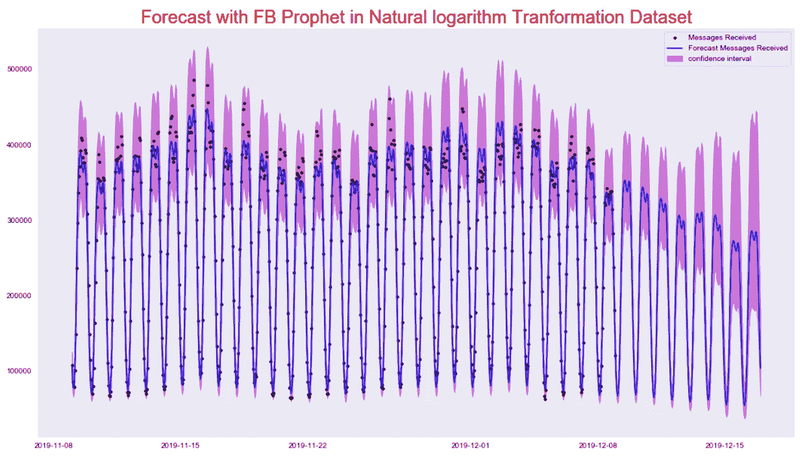

在下图中可以观察到分析周期，我们可以看到黑点比最小化 MSE 的预测蓝线更近。除了 FB Prophet 之外，它还可以进一步优化，如 [Vinicius Lopes](https://github.com/vavlopes) 在 github.com 举行的 [FB Prophet 第 549 期上所述，通过随机化超参数，如 growth、changepoint_prior_scale、changepoint_range、seasonality _ prior _ scale 和 holidays_prior_scale，这是另一篇文章的主题](https://github.com/facebook/prophet/issues/549)

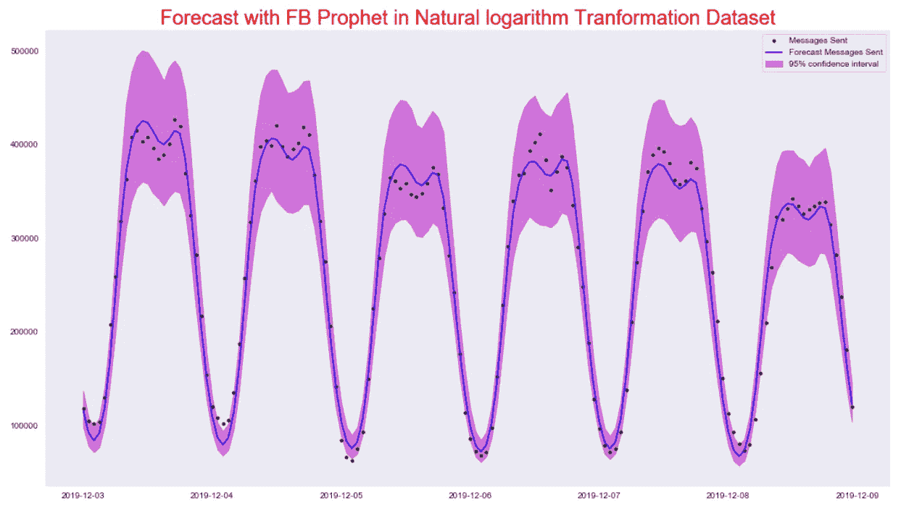

原始数据的均方误差(MSE)结果为 285087967，自然对数 MSE 为 219517629。

一些最后的想法:

1.  FB Prophet 使用通过自然对数转换的数据集为这一小部分数据样本获得了最佳结果。
2.  FB Prophet 与 ARIMA 或任何基于它的时间序列模型相比，是一个简单的应用模型。
3.  FB Prophet 可以优化并包含为改进预测而定制的假日日期，这是 ARIMA 模型所不具备的。