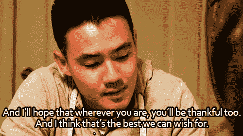
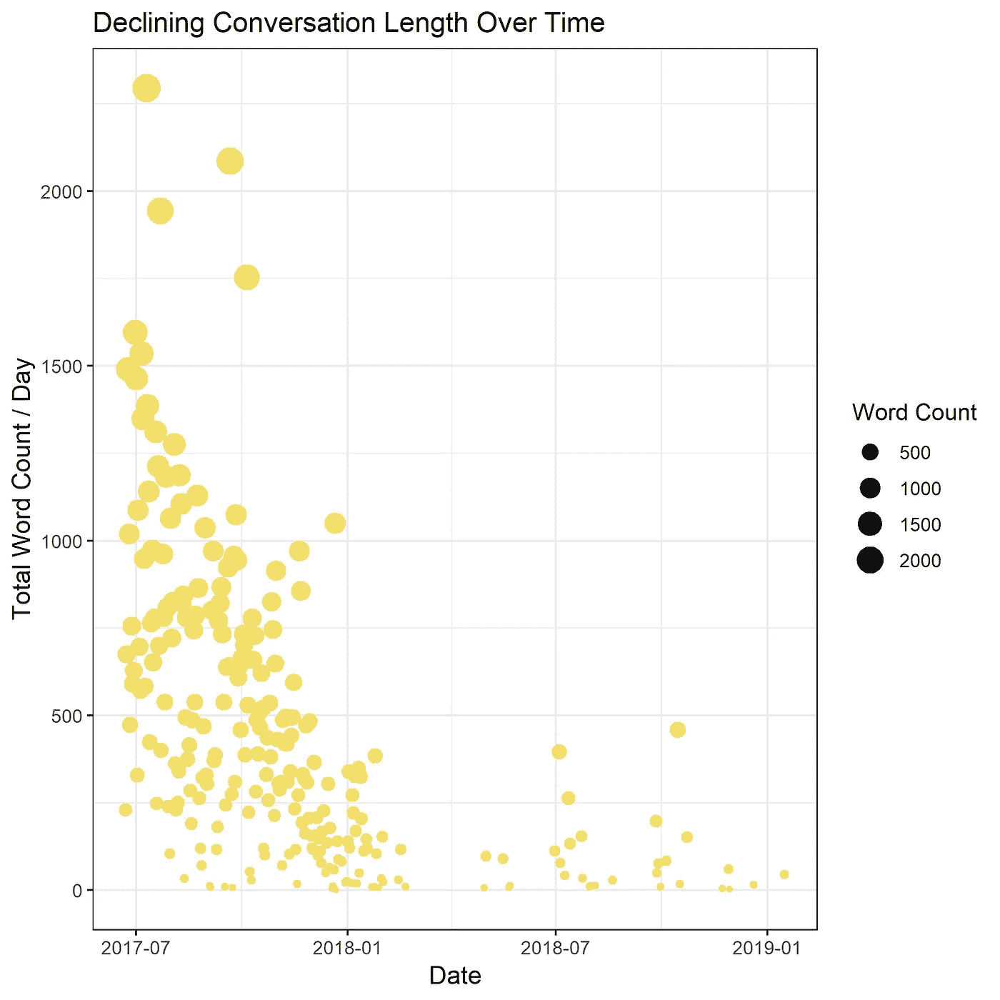
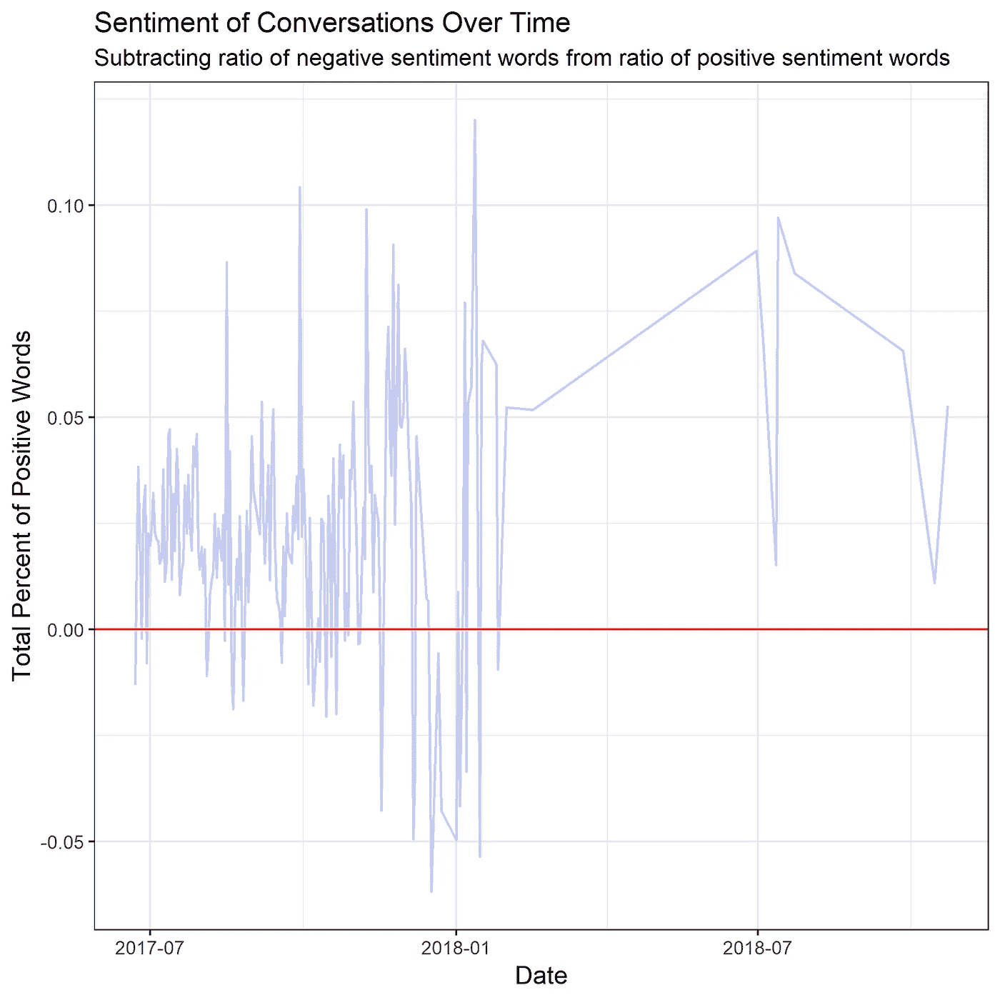
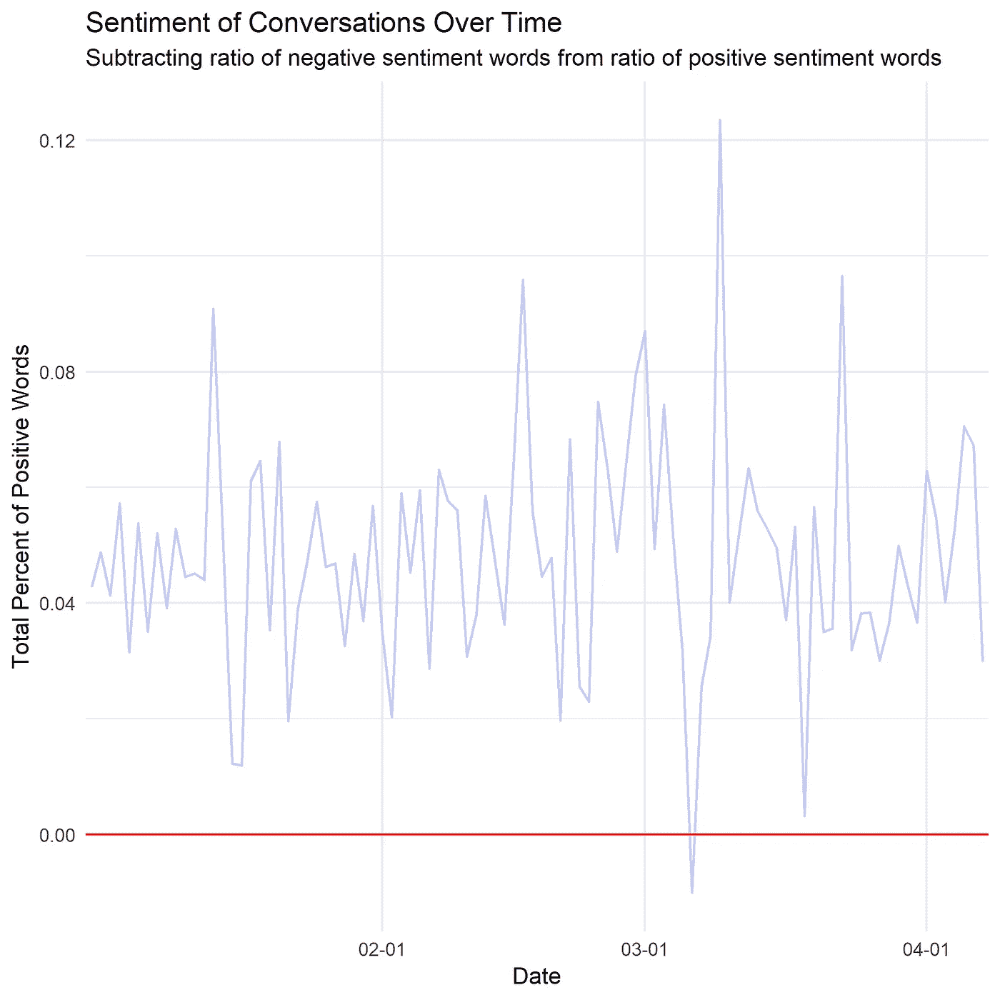

# 陌生人，再次:使用自然语言处理来编码爱情的开始和结束

> 原文：<https://medium.com/analytics-vidhya/strangers-again-using-natural-language-processing-to-code-the-beginning-end-of-love-63ae7366be5d?source=collection_archive---------1----------------------->

有一部很好看的 Wongfu 短片是我在青春期前看的，那时夏天的下午很长，Nigahiga 的视频很搞笑。这部电影名为《又是陌生人》，围绕一个男孩反思他与一个女孩的关系起伏，他曾认为这个女孩是他的“独角兽”。

看看这里的电影:[https://www.youtube.com/watch?v=tSdELZxEnHY](https://www.youtube.com/watch?v=tSdELZxEnHY)

曾经，凌晨 3 点的电话无所不包，感觉世界上没有人能如此理解你，而现在，这里充满了怨恨和未说出口的话，这些话来自无数次争吵，争吵的原因双方都不记得了。在某个地方，他们开始认为对方是理所当然的，而这个曾经感到如此特别的人——他的独角兽，下一个伟大的冒险——已经变得司空见惯。甚至是一种负担。

我将是第一个承认我经历过这部电影的人，在这部电影中，一个我曾经认为是我“永远的人”的人再次变成了一个陌生人。幸运的是，时间和空间让我从心碎中恢复过来，并为未来学习——但是如何处理我们积累的 36，450 多个脸书聊天记录呢？我决定(像所有正常人一样)这将是一个很好的机会，让我伸展我的数据科学肌肉，看看 NLP 是否可以应用于检测爱情的开始和结束。我将根据数量、参与度和内容来分析我们的对话。

**数据集&工具注意事项:**

*   JSON 由脸书提供，现在你的大部分数据都可以在“设置”中个人下载
*   有限的数据，仅出现在 2017 年 6 月——present 可供下载，尽管我和我的前任从 2016 年 6 月开始使用 messenger
*   不包括交流少于 100 个单词的日子，因为 100 个单词是我的实际对话的标准(与通知对方“我在这里”、“我们什么时候见面”等的对话相反)。)
*   使用 R 进行分析，主要是因为我想使用朱莉娅·西尔格和大卫·罗宾逊的令人难以置信的 [tinytext](https://juliasilge.github.io/tidytext/index.html) 包。强烈推荐这个包，如果你和我一样是初学者的话

**分析会话数量**

如果您的主要对话模式是通过 messenger——在我的案例中就是这样——这个基本分析会产生最佳结果。在 2018 年 1 月左右，交流的频率急剧下降，这是我们决定永远停止的时候了。即使在 10 月份，你也可以开始看到对话时间的减少。然而，这可能是由外部因素造成的，因为越亲密的夫妇见面越频繁，而不是聊天。

我决定通过对数据进行切片来进一步研究，看看谁对对话的贡献更大，而不是简单地看对话的长度。毕竟——如果谈话的长度和频率很高，因为你每天都在独白，哀叹你的伴侣在床上穿袜子的方式(当然，100%假设；) )，那么这对关系也不是很好，对吗？

**分析对话中的参与度**

这个证据相当确凿。看起来我一直是个健谈的人，即使在关系相对顺利的时候。红线显示的是 50%到 50%的单词量，我的上一个搭档通常乐于保持在 30%到 40%的范围内。当我们开始解开时，你可以看到它下降得更低了。

**分析对话内容**

我决定下一步，我会看看随着时间的推移，我们的谈话的整体情绪。毕竟，任何一天我都会选择高质量的迷因(呃，我指的是文字)而不是数量。我在大部分分析中使用了出色的 [tidytext](https://juliasilge.github.io/tidytext/articles/tidytext.html) R 包，因为它允许我同时访问 4 个词典库。我承认，我主要使用 Bing Liu 词库来做基本的正面和负面单词检测，但我对 NRC 选项很感兴趣，它显然可以进一步划分为 8 种不同的情绪。

这一分析描绘了一幅比我们只看字数时更快乐的画面！在每天的对话中，我用积极情绪词的百分比减去消极情绪词的百分比。红线代表中性(既不明显积极也不明显消极的对话)，我很高兴看到我们之前的大多数对话都可以归类为积极的。

情绪在 10 月份左右会有所下降，这表明我们会有更多更频繁的负面对话。这与我的记忆相符，因为不幸的是，在 11 月至 12 月的几个月里，我们开始了决定是否留在一起的过程——双方都试图这样做。

分手后，我们都分开了一段时间，但我很高兴地告诉大家，我们又友好地相处了。魔鬼在数据中，但你可以看到我们仍然时不时地进行简短而积极的对话来了解情况。

但是等等——你说过你也会记录爱情的开始！

别担心，我没忘记。不幸的是，由于(很可能是)脸书的存储限制，我的数据集不包含我们关系开始时的对话。我无法分析我们什么时候从陌生人转变为最好的朋友，从最好的朋友转变为合作伙伴。

然而，我最近一直在和一个很特别的人约会。

他让我很开心——你看得出来吗？

**展望未来**

我想一张照片真的抵得上 1000 个字——或者，在这个例子中，抵得上 36450 个字。通过分析我的数据，一些关键的收获是:

1.  我应该和一个在顺境和逆境中更善于沟通的人在一起，当我们有分歧时，他愿意讨论问题而不是退缩。
2.  我需要学习如何在我们有分歧时给人们空间，而不是坚持我们当时就谈，这往往会把人推开。
3.  即使关系结束了，我还是要说我们相处得很好！即使是最严重的消极对话也只有 6%的消极词汇，相比之下，最积极的对话接近 15%。

**影响精度的因素**

1.  一些被标记为负面的对话实际上是中性的，甚至是正面的经历，由于我奇怪的和深具讽刺意味的幽默感，它们被错误地归类了。我不确定是否有 NLP 库来检测讽刺/黑色幽默..也许那应该是我的下一个项目？
2.  再次与第一点相关——背景是关键。虽然分析单词是一个良好的开端，并且肯定会提供指示性的结果，但是句子的上下文将会提供更加准确和有价值的结果。

感谢 H.E-A，他在我知道 ggplot2 是什么之前很久就帮助我可视化了爱，没有他就没有数据科学。感谢我们在厨房的“灵光一现”时刻，你在 5 分钟内学会了 R，帮我转换了一个数据框架。最后，为了 p . y——为了所有未来爱情的可视化，那是一定会到来的。