# 设计模式-策略

> 原文：<https://medium.com/analytics-vidhya/strategy-design-pattern-d5c3d42f485b?source=collection_archive---------2----------------------->

设计模式是软件设计中常见问题的典型解决方案。每个模式就像一个蓝图，您可以定制它来解决代码中的特定设计问题。

设计模式的最大好处之一是，它为开发人员提供了一个谈论软件解决方案的通用词汇。它的确定义了一种全世界开发者都能理解的通用语言

# 开始吧！！！

有一个任务是设计一个鸭塘模拟游戏。这个游戏可以展示各种各样的鸭子在游泳并发出嘎嘎的声音。古老而明显的方法是面向对象的，我们可以设计一个名为 **Duck** 的类作为超类，所有其他 Duck 类型都将从它继承。这解决了我们的问题。不是吗？让我们来看看执行情况。

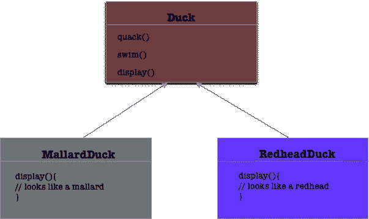

现在一个新的要求来了，那就是——**鸭子要飞！！！**

我们如何将飞行融入到我们当前的设计中？由于我们在这里使用了继承，我们可以直接将 flying 方法放在超类(duck)中，所有其他的 Duck 类型都可以直接使用它。

**就这样:**

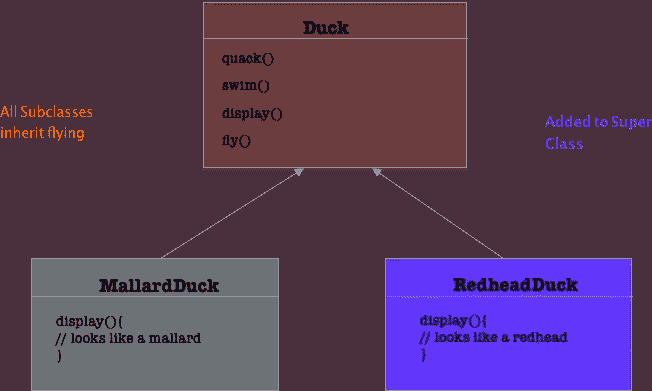

看起来很棒，对吧？但是这个设计有一个很大的问题，假设有橡胶鸭子被引进，它实际上不能飞。但是使用这种设计方法，它们仍然具有 fly()功能，因为它们将继承相同的超类。这也打破了接口分离原则，我们的鸭子被迫实现飞行功能。我们最多能做的就是重写橡皮鸭类中的 fly 方法，让它为空。但是假设我们要维护大量的物种，那么维护代码就会变得非常困难。

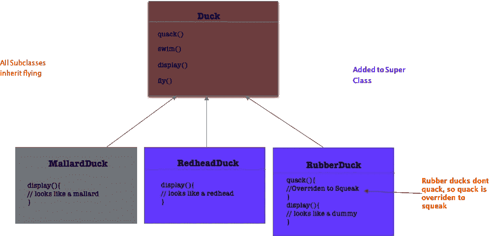

**那么我们应该怎么做才能避免这个问题呢？**

首先，我们必须确定是什么导致了问题？在这种情况下，它是一个 fly 方法，因为不是所有的鸭子都能飞，所以解决方案是将其从 Duck 类中分离出来，封装在另一个数据结构中，然后使用它。我们应该确保所有其他功能保持不变，因为它们已经结构良好，工作非常好。

我们知道 fly()和 quack()是鸭子类中不同于鸭子的部分。

为了将这些行为从 duck 类中分离出来，我们将从 Duck 类中取出这两个方法，并创建一组新的类来表示每个行为。

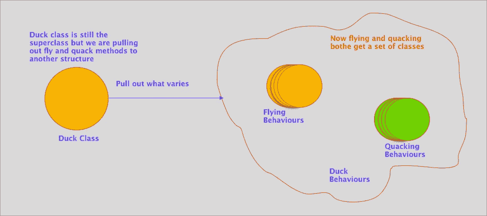

这也使得它可以重复使用。我们将有符合或实现这些行为的类，并且可以和 duck 类一起使用。因此，让我们看看如何实现它们。见下图了解。

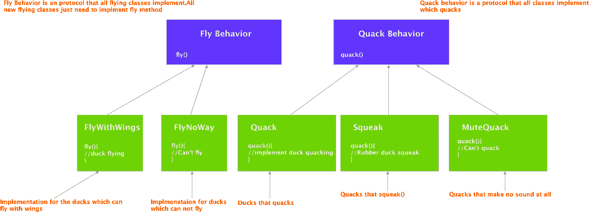

## **有了这些类型的行为，其他类型的对象(除了 duck 对象)也可以使用这些行为，因为它们不仅仅隐藏在一个 Duck 类中，这使得可重用性非常高。**

甚至我们可以添加或修改行为，甚至不需要接触 Duck 类。

现在让我们使用 Swift 中的代码来实现它。

## 让我们首先创建行为

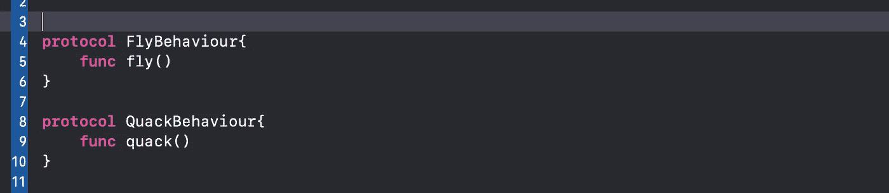

现在我们已经设置了行为，让我们创建实现这些行为的类。(这些也被称为**策略**

对于飞行-

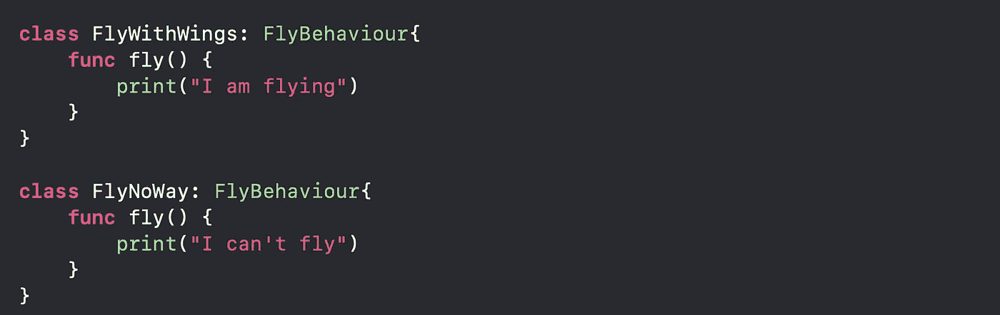

因为嘎嘎叫-

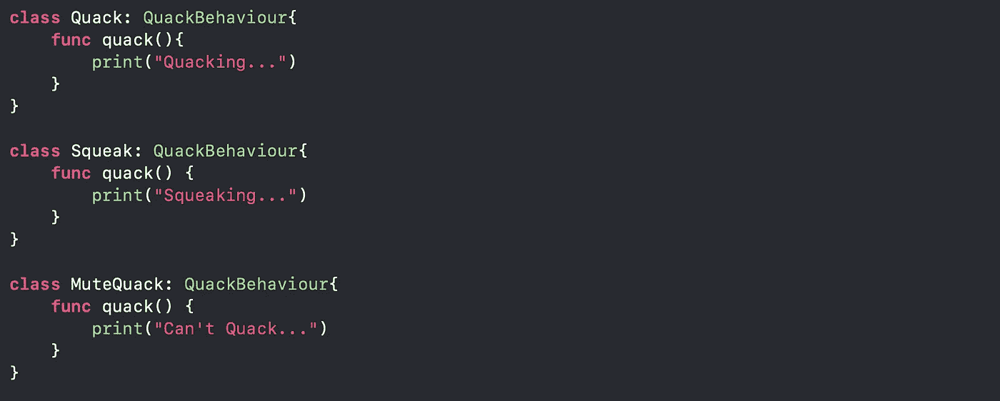

现在我们已经设置了所有需要的协议和类，让我们创建 duck 类。让我们首先创建超类。

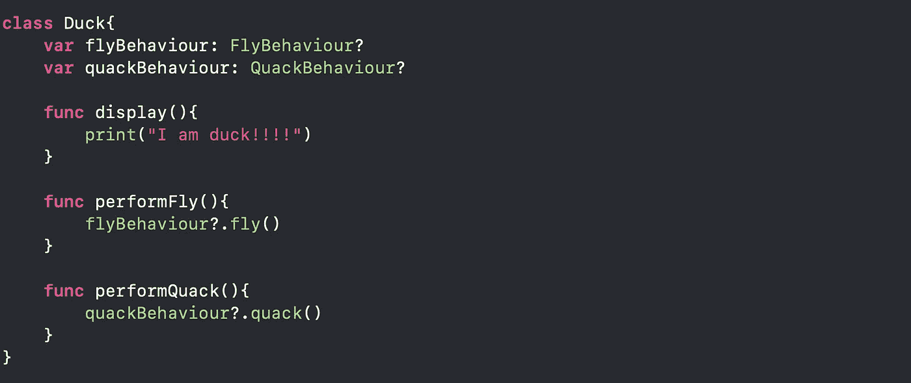

这个 duck 类有 fly 和 quack 行为，它们可以通过如下所示的 duck 类来初始化。

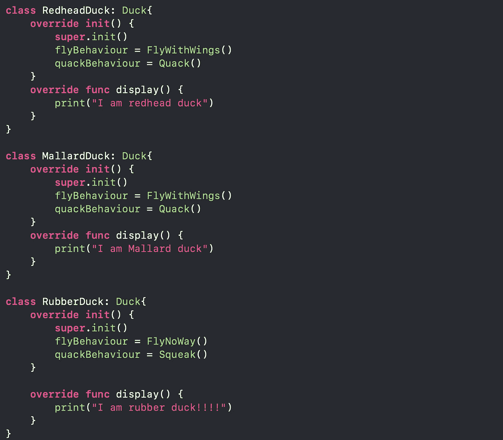

如何使用它们？。让我们看看下面…

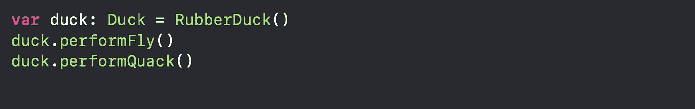

产量是多少？…

**我不会飞**

**吱吱叫…**

所以我们在这里，用策略模式解决了一个问题。我用一句话给你留下战略模式的定义。

> 策略模式又称为**策略模式**。我们定义了多个算法，并让客户端应用程序将算法作为参数传递。

这篇文章就到这里，下一篇再见！！

**感谢**！！！！！

**参考:头先设计图案(本书由** [**埃里克·弗里曼**](https://www.amazon.in/Eric-Freeman/e/B001H6Q032/ref=dp_byline_cont_ebooks_1) **)**