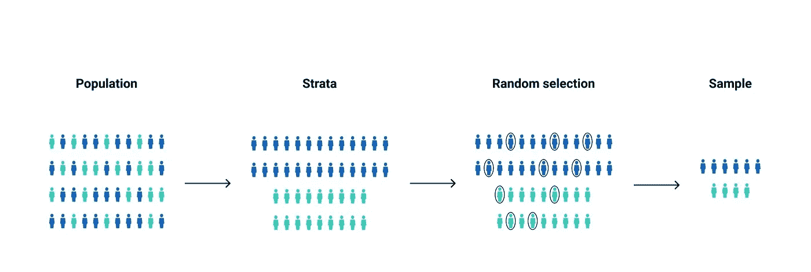
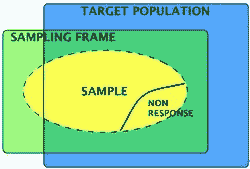
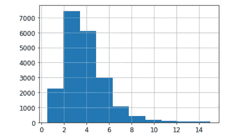
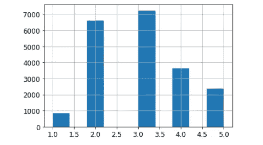

# 机器学习中的分层抽样。

> 原文：<https://medium.com/analytics-vidhya/stratified-sampling-in-machine-learning-f5112b5b9cfe?source=collection_archive---------3----------------------->

分层抽样

从训练数据集创建测试集是构建机器学习模型的最重要的方面之一。

本文展示了为什么在这样做的时候考虑使用分层抽样是一个好主意。

# 为什么要分层抽样？

*   它用于消除测试集中的采样偏差。
*   它允许用最能代表被研究的整个群体的群体来创建一个测试集。
*   分层随机抽样不同于简单随机抽样，简单随机抽样涉及从整个人口中随机选择数据，以便每个可能的样本出现的可能性相等。
*   如果在构建测试集时出现采样偏差，那么在测试机器学习模型时，它表明该模型表现不佳，因为测试集不能代表整个群体。

# 什么是抽样偏倚？

*   抽样偏倚是指随机变量的样本被错误地选择以确定其分布，并且由于非随机原因而不能代表真实的分布。
*   由于变量的某些值相对于变量的真实分布被系统地低估或高估，因此经常出现抽样偏差。

从总体中选择样本时出现偏差的可能来源。

# 分层抽样的工作原理。

*   这是通过将群体划分为子群体或阶层来实现的，并且从每个阶层中抽取正确数量的实例，以保证测试集能够代表整个群体。
*   分层抽样不同于简单的随机抽样，简单的随机抽样涉及从整个人口中随机选择数据，以便每个可能的样本出现的可能性相等。
*   随机样本取自每个阶层，与该阶层相对于总体的规模成正比，因此每个可能的样本出现的可能性是相等的。

# 一个简单的例子。

*   让我们以一个房价数据集为例，该数据集将用于建立一个机器学习模型，该模型将预测该地区的未来房价。
*   数据集中的一列是买房人的收入中值。

收入中位数直方图。

*   绘制中值收入直方图显示，大多数人口集中在 1.5-6 的范围内(此处 x 轴代表收入为 10，000 美元的倍数，即 1.5 代表 15，000 美元)。
*   如果使用随机抽样，较低群体进入测试集的概率非常低。
*   我们可以根据每个分组的重要性，将中值收入划分为(0-1.5，1.5-3，3-4.5，4.5-6)等不同的阶层(分组)。

分成阶层(子群体)的中等收入。

*   然后从每个阶层中选择与人口数量成正比的样本。
*   这将消除测试集中的采样偏差，并在测试模型时给出更好的结果。

# 优势

*   分层随机抽样准确地反映了被研究的人群。
*   它确保人口中的每个亚组在样本中得到适当的代表。
*   因此，分层随机抽样提供了更好的人口覆盖率。

# 不足之处

*   当我们不能自信地把所有人都归为一个小组时，这是不利的。
*   如果受试者属于多个亚组，重叠可能是一个问题。当进行简单的随机抽样时，那些在多个分组中的人更有可能被选中。
*   更复杂的群体会使这一过程更加困难，使分层抽样成为一种不太理想的方法。

所以下次当你开始为你的模型建立一个测试集的任务时，在你的头脑中保持抽样偏差，并尝试实现分层抽样，它最终将有助于装载。