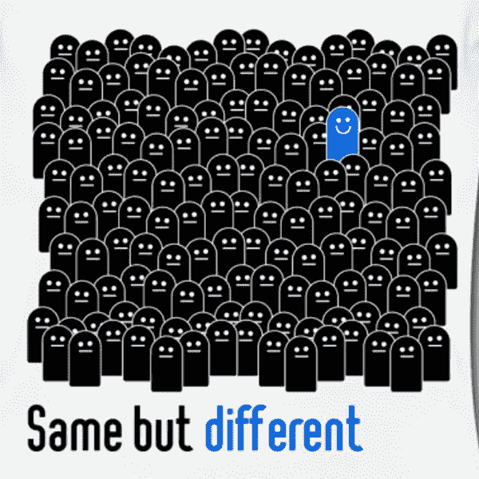

# 将 k-fold 分割成相等且正确的层

> 原文：<https://medium.com/analytics-vidhya/stratify-kfold-splits-equally-and-correctly-f2f80487bb7e?source=collection_archive---------9----------------------->



本文的目的是修复有时不正确的训练/有效分割的分层，以便多类分类模型可以被正确评估。

Sklearn 具有强大的内置功能，可以执行单一分层分割

```
from sklearn.model_selection import train_test_split as splittrain, valid = split(df, test_size = 0.3, stratify=df[‘target’])
```

这将产生两个分割，其中训练将是 df 的 70%,验证集将是 30%,并且在两个分割中“目标”变量的分布几乎相同

如果需要对一些函数或模型的结果进行多次分割评估，可以使用分层文件夹

```
from sklearn.model_selection import StratifiedKFoldkfold = StratifiedKFold()for train, valid in kfold.split(df.drop(‘target’, axis=1), df.target):
    X_train = df.drop(‘target’, axis=1).iloc[train]
    y_train = df.[‘target’].iloc[train]
    X_val = df.drop(‘target’, axis=1).iloc[valid]
    y_val = df[‘target’].iloc[val]# train/predict or do what you need to do
```

因此，具有高度不平衡的多类“目标”变量的数据集在训练和验证分裂中并不总是具有相同的“目标”类变量。在这种情况下(如果您试图训练和评估一个模型)，当您试图评估由不同类别变量表示的预测和 y_train 之间的准确性时，您将遇到 50%的错误


我想到的解决方案是，如果目标变量的唯一类在训练之间不同，并且在任何拆分中都有效，那么就裁剪训练或验证索引

我们将把它包装成一个单独的函数，并在拆分的迭代中调用它

```
def clip_splits(train,val):
 ‘’’
Fixes the stratification problem of StratifiedKfold
Finds outstanding target values in train, valid splits and removes indexes of those train and valid splits from consideration for further correct definition of X_train,X_val,y_train,y_val
‘’’
    tr_target_unique=temp.iloc[train].target.unique()
    val_target_unique=temp.iloc[val].target.unique()

    if len(tr_target_unique) > len(val_target_unique):
        outstanding_target_class = list(set(tr_target_unique)- 
                                   set(val_target_unique))
        ix_to_remove_from_train = []

        for i in outstanding_target_class:
            ix_to_remove_from_train.extend(   
            temp.iloc[train].reset_index(
            drop=True).index[temp.target.iloc[train] == i].tolist()) train = list(train)

        for index in sorted(ix_to_remove_from_train, reverse=True):
            del train[index] 

    elif len(tr_target_unique) < len(val_target_unique):

        outstanding_target_class = list(set(val_target_unique)-  
                                   set(tr_target_unique))
        ix_to_remove_from_val = []

        for i in outstanding_target_class:
            ix_to_remove_from_val.extend(
            temp.iloc[val].reset_index(
              drop=True).index[temp.target.iloc[val] == i].tolist())
        val = list(val) for index in sorted(ix_to_remove_from_val, reverse=True):
            del val[index] return train, val
```

然后，只需将对此函数的调用插入到折叠迭代管道中，如下所示

```
from sklearn.model_selection import StratifiedKFoldkfold = StratifiedKFold()for train, valid in kfold.split(df.drop(‘target’, axis=1), df.target): # fix the stratification problem
    train,valid = clip_splits(train,valid) X_train = df.drop(‘target’, axis=1).iloc[train]
    y_train = df.[‘target’].iloc[train]
    X_val = df.drop(‘target’, axis=1).iloc[valid]
    y_val = df[‘target’].iloc[val]# train/predict or do what you need to do
```

这样，在您的培训和验证拆分中，您将得到完全相同的唯一“目标”值变化。