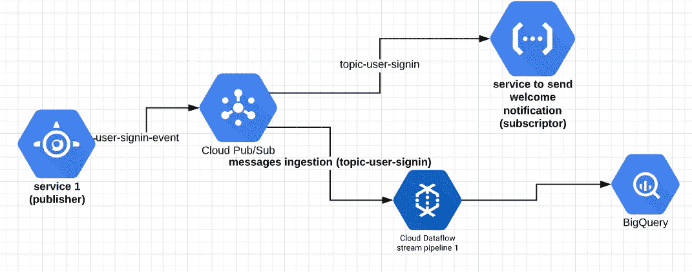
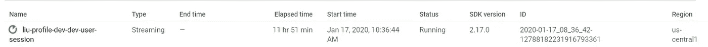

# 使用数据流和 Apache Beam 传输数据

> 原文：<https://medium.com/analytics-vidhya/streaming-data-with-dataflow-and-apache-beam-20cd786649bc?source=collection_archive---------12----------------------->

上次我写关于数据流的文章是为了和你分享我工作的公司的一个用例，以批处理模式处理数据。今天，我想分享一个流模式下的简单管道，从 pubsub 读取消息，然后写入 Bigquery。当您拥有基于事件的架构时，一个常见的场景如下。



服务 1 可以是用户操作时你的后端触发事件。然后，服务 2 基于服务 1 上发出的事件执行另一个动作，比如在用户登录或在我们的平台上注册后在后台发送通知，等等。

假设每次用户登录我们的平台时，我们需要在数据仓库(Bigquery)中存储一条新记录。

那么，我们需要做什么？

我的项目结构如下:

```
pipeline
   user_signin.py // our pipeline definition
   __init__.py
transforms
   pubsub_message.py //DoFn to transform messages
   __init__.py
main.py
README.md
requirements.txt // apache-beam[gcp]
setup.py // definition of our package
run.sh //command to send messages to pubsub for local testing
```

让我们看看 main.py

```
import logging
from pipeline import user_signinlogging.basicConfig(filename='**debugging.log**', level=logging.DEBUG)if __name__ == '__main__':
  user_signin.run()
```

在 main.py 文件中，我希望将第三行代码指向我们为应用程序调试设置输出的地方。这对于本地开发非常重要，因为在这里，您将看到每个 logging.error()、logging.debug()等的输出。在你的申请中。对于生产环境，如果你在数据流(谷歌平台)上托管你的管道，你会在 StackDriver 上看到，但目前很难做到。因此，您的管道应该在本地进行测试，这样对于生产环境来说就不会有问题。对我来说这是有意义的。假设您的管道处理数百万兆字节的数据，打印关于错误或调试的日志并不是一个好主意，因为在大量的日志中很难甚至不可能找到什么。

现在让我们看看 pipeline/user_signin.py。

```
import logging
import argparse
from dateutil import parser
import apache_beam as beamfrom apache_beam.io.gcp.internal.clients import bigquery
from apache_beam.options.pipeline_options import PipelineOptions
from transforms.pubsub_message import **MessageExtractingFn**table_schema = bigquery.TableSchema()
userid_schema = bigquery.TableFieldSchema()
userid_schema.name = 'userid'
userid_schema.type = 'string'
userid_schema.mode = 'required'
table_schema.fields.append(userid_schema)date_schema = bigquery.TableFieldSchema()
date_schema.name = 'date'
date_schema.type = 'timestamp'
date_schema.mode = 'required'
table_schema.fields.append(date_schema)def run(): pipe_options = {
      'project': 'project_id',
      'staging_location': 'gs://%s/dataflow' % 'bucket',
      'runner': 'DataflowRunner', # change to DirectRunner for local
      'setup_file': './setup.py',
      'job_name': 'signin-user-tobigquery',
      'temp_location': 'gs://%s/temp' % 'bucket',
      'streaming': True, # **important** 'region': 'us-central1' # depends on your preferences
   } with 
      beam.Pipeline(
        options=
           PipelineOptions.from_dictionary(pipe_options)) as pipe: messages = pipe | beam.io.**ReadFromPubSub**(
        topic='projects/project_id/topics/topic-user-signin')
      lines = messages | 'decode' >> 
          beam.Map(lambda x: x.decode('utf-8')) pubsub_msg = (lines | 'Format Message' >>
          (beam.ParDo(**MessageExtractingFn**()))) output_table_name =
         '{project}:YourDataset.YourTable'.format(
            project=pipe_options.get('project')) user_sessions = (pubsub_msg | 'Write Sessions' >>
            beam.io.WriteToBigQuery(output_table_name,
                schema=table_schema,
                create_disposition=
                   beam.io.BigQueryDisposition.CREATE_IF_NEEDED,
               write_disposition=
                   beam.io.BigQueryDisposition.WRITE_APPEND)) logging.debug('Writing into big query') result = pipe.run()
```

现在让我们看看 transforms/pubsub_message.py

```
import json
import logging
import apache_beam as beamclass **MessageExtractingFn**(beam.DoFn):
   def process(self, element):
      logging.debug('element %s', element)
      message = json.loads(element)
      userid = message.get('userid')
      date = message.get('date') if userid and date: new_element = {
           'userid': userid,
           'date': date,
         } yield new_element # add the element to the pcollection
```

运行管道

1.  python main.py. For localhost 别忘了在 pipe_options 里面改成 DirectRunner。
2.  如果你使用 DataflowRunner，你会在谷歌控制台上看到类似于数据流部分的下图。



3.要模拟向 pubsub 发送消息，请使用 gcloud:

```
> gcloud pubsub topics publish topic-user-signin --project yourprojectid --message '{"userid": "93234234", "date": "2017-10-17T20:57:17.338320"}'> messageid: 333545454 # you will see something like this in the terminal
```

4.如果您对本地主机上的身份验证有问题，可能是因为有多个 google 帐户，请尝试下一步并设置相应的:

```
> gcloud beta auth application-default login
> gcloud auth login
```

提示:

*   在 bigquery 模式定义中对日期字段使用时间戳，因为在 Bigquery 上进行查询时会有更大的灵活性。
*   当需要将结构化属性存储为 bigquery 表中的新列时，也可以定义嵌套或重复字段。

参考资料:

[https://beam . Apache . org/documentation/sdks/python-streaming/](https://beam.apache.org/documentation/sdks/python-streaming/)