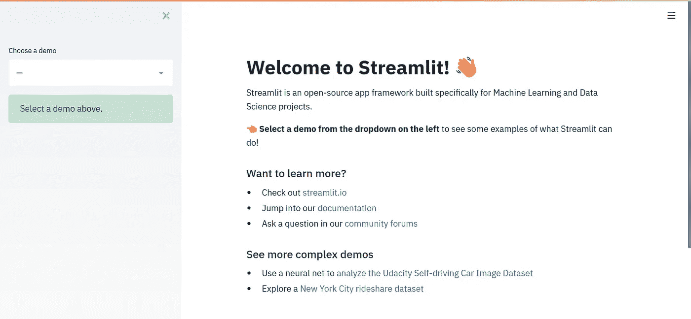

# Streamlit 部署数据科学和机器学习应用程序的令人敬畏的新方法。

> 原文：<https://medium.com/analytics-vidhya/streamlit-the-awesome-new-way-to-deploy-data-science-machine-learning-apps-6929737b7a68?source=collection_archive---------9----------------------->


对于数据科学家和机器学习工程师来说，部署他们努力调整的项目和模型(准确率为 99.89%)通常是一个挑战。对于一些人来说，这意味着学习使用 [Flask](http://flask.palletsprojects.com/en/1.1.x/) 进行他们的模型部署。这通常并不容易，因为他们中的大多数都不是 Web 开发人员。

我的情况也差不多，直到遇到[Streamlit](https://streamlit.io/)；这是一个非常棒的新方法，可以轻松地部署 DS/ML 应用程序，而无需成为 web 开发专家。我震惊于使用 Streamlit 部署我的模型和数据科学项目是如此容易。对我来说，Streamlit 是我一直在等待的令人敬畏的框架，可以与 R 用户的 [Shiny](https://shiny.rstudio.com/) 相提并论。但是是什么让 Streamlit 如此牛逼呢？

以下是 Streamlit 是 dope 的一些原因；

1.  **免费开源**；酷吧？我知道。它是免费和开源的，所以你可以使用它，商业化和分享它。
2.  **简单易学**；Streamlit 的学习曲线为零，因为它是没有回调或隐藏状态的纯 python。所以如果你懂 Python，你就懂 Streamlit。我在一天之内开发了 3 个很棒的机器学习应用。我所要做的就是参考他们令人敬畏的官方文件。没有麻烦！！
3.  **它与一切**一起工作；Streamlit 适用于大多数 ML 框架，如果不是全部的话；从 [Tensorflow](https://www.tensorflow.org/) 和 [Pytorch](https://pytorch.org/) 到 sci kit——学习 Seaborn、Altair、Plotly 等等。
4.  **易于安装**；安装 Streamlit 就像每隔一段时间安装一次 python 包一样！你可以和皮普一起做。
5.  **还有更多的来了**；他们还计划添加一键式部署。所以请多加留意。

所以现在你明白我为什么对这个框架着迷了吧？

在这篇文章和接下来的一系列文章中，我将带您了解使用 Streamlit 构建和部署 3 个令人敬畏的 ml 应用程序的整个步骤。我们将从多语言情感分析开始。情感分析，也称为意见挖掘；是自然语言处理的一个分支，涉及文本中情感的提取。VADER T21 包使得用 Python 做情感分析变得容易。

我们将使用以下包:

```
pip install streamlit # the awesome framework
pip install vaderSentiment # for sentimental analysis
pip install googletrans # for language translation
```

现在我们已经安装了我们的包，让我们通过运行 hello world 应用程序来测试我们的 Streamlit 安装；

```
streamlit hello # run the hello app
```

您应该会看到应用程序在您的默认浏览器中启动并运行，网址为 [http://localhost:8501。](http://localhost:8501.)万岁！您的第一款 Streamlit 应用。但是现在让我们建立我们自己的。



首先，让我们创建一个文件夹和一个文件，你可以在其中调用 *app.py* 。然后导入这些库，并用下面的代码在你的 *app.py 文件*中初始化它们；

```
import streamlit as st
from googletrans import Translator
from vaderSentiment.vaderSentiment import \ SentimentIntensityAnalyzeranalyser = SentimentIntensityAnalyzer() # initialize it
translator = Translator() # initialize
```

所以我们导入了 Streamlit 并给它起了个别名 *st* ，还从 googletrans 导入了 *Translator，从 Vader perspection*导入了 SentimentIntensityAnalyzer，然后初始化了它们。

接下来，我们将使用 *Streamlit。markdown* 方法来编写一些 markdown 文本，这些文本将作为我们的访问者的标题和副标题。顺便说一下，Markdown 是一种类似于 HTML 的标记语言，但是它更酷，因为它没有使用 HTML 时必须声明的大量标签。

```
st.markdown(‘# Machine Learning App Registry’)
st.markdown(
 ‘#### These are projects from Artificial Intelligence Movement(AIM) Led by [Boadzie Daniel]([http://boadzie.surge.sh/)'](http://boadzie.surge.sh/)'))st.markdown(‘## App 1: Multilingual Sentimental Analysis’)st.write(‘Sentimental Analysis is a branch of Natural Language Processing \
 which involves the extraction of sentiments in text. The VADER package makes it easy to do Sentimental Analysis’)
```

我们的应用程序的大脑现在看起来如下:

```
# The sentiment analyzer function
def sentiment_analyzer_scores(sentence):
   trans = translator.translate(sentence).text # extracting   translation text
   score = analyser.polarity_scores(trans) # analyzing the text
   score = score[‘compound’]
   if score >= 0.05:
      return ‘The sentiment of your text is Positive’
   elif score > -0.5 and score < 0.05:
      return ‘The sentiment of your text is Neutral’
   else:
      return ‘The sentiment of your text is Negative’
   return score
```

这是我们的应用程序的令人敬畏的大脑。我们创建了一个函数，它将一个句子作为参数，翻译该句子，分析情感，并返回带有适当的人类可读信息的分数。酷吧？我知道！

现在，我们如何使用用户的输入将这个函数呈现给前端呢？令人惊讶的是，Streamlit 让这变得异常简单。

```
sentence = st.text_area(‘Write your sentence’) # we take user inputif st.button(‘Submit’): # a button for submitting the form
   result = sentiment_analyzer_scores(sentence) # run our function  on it
   st.balloons() # show some cool animation
   st.success(result) # show result in a Bootstrap panel
```

在上面的代码中，我们将用户的输入保存在名为*句子*的变量中，然后当点击提交按钮时，我们使用一个条件在一个点缀着一些漂亮气球动画的引导面板中呈现情感值。

我们现在可以像这样运行我们的应用程序

```
streamlit run app.py # if app is the name of your file
```

该应用程序应该在我们的默认浏览器中启动，网址为 [http://localhost:8501。](http://localhost:8501.)(这篇文章的完整代码以及其他许多内容可以在我的 [GitHub 页面](https://github.com/Boadzie)找到)


万岁！！

就这样，我们毫不费力地完成了多语言情感分析器！多棒啊。(应用程序正在运行[这里](https://ml-app-rig.herokuapp.com/))

这只是你可以用 Streamlit 创建的众多出色的 DS/ML 应用中的一个。本系列的后续文章将处理其他应用程序，如工资预测和 Iris flower 分类器等等。我坚信 Streamlit 是 Python 开发者的数据科学和机器学习应用的未来。因此，强烈建议你现在就加入(如果你还没有的话),成为这个令人敬畏的旅程的一部分。