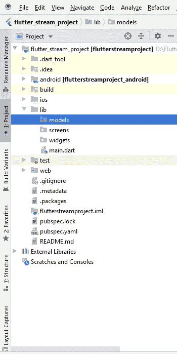

# 带有 ListView 和平滑滚动的流

> 原文：<https://medium.com/analytics-vidhya/streams-with-listview-and-smooth-scrolling-546158e1b3c5?source=collection_archive---------9----------------------->

大家好，今天我们将讨论如何使用流和 listview 来构建项目，当用户到达项目的特定位置时，我们将使用包含 5000 张图像的照片的 JSON 占位符 API，我们将在文章的结尾学习如何使用流控制器和 listview 来平滑滚动，所以不浪费时间，让我们开始❤


创建一个名为“flutter_stream_project”的新的 flutter 项目，并确保您有这样的项目结构:



现在首先创建一个名为“Photo”的模型类，并复制粘贴以下代码:

```
**class** Photo {
  **final** String **title**;
  **final** String **url**;

  Photo.fromJsonMap(Map map)
      : **title** = map[**'title'**],
        **url** = map[**'url'**];
}
```

因为我们只需要 JSON 占位符 API 中的图片 URL 和标题。

fromJsonMap 是将 JSON 数据映射到一个 Map 中。

现在，让我们在 screens 文件夹中创建一个名为 PhotoList 的新文件，并复制粘贴以下代码:

```
**import 'dart:async'**;

**import 'package:flutter/material.dart'**;
**import 'package:flutterstreamproject/models/Photo.dart'**;
**import 'dart:convert'**;

**import 'package:http/http.dart' as** http;
**class** PhotoList **extends** StatefulWidget {
  @override
  _PhotoListState createState() => _PhotoListState();
}

**class** _PhotoListState **extends** State<PhotoList> {
  StreamController<Photo> **_streamController**;
  List<Photo> **list** = [];

  @override
  **void** initState() {
    **super**.initState();
    **_streamController** = StreamController.broadcast();

    **_streamController**.**stream**.listen((p) => setState(() => **list**.add(p)));

    load(**_streamController**);
  }

  load(StreamController<Photo> sc) **async** {
    String url = **"https://jsonplaceholder.typicode.com/photos"**;
    **var** client = **new** http.Client();

    **var** req = **new** http.Request(**'get'**, Uri.*parse*(url));

    **var** streamedRes = **await** client.send(req);

    streamedRes.**stream** .transform(utf8.**decoder**)
        .transform(json.**decoder**)
        .expand((e) => e)
        .map((map) => Photo.fromJsonMap(map))
        .pipe(sc);
  }

  @override
  **void** dispose() {
    **super**.dispose();
    **_streamController**?.close();
    **_streamController** = **null**;
  }

  @override
  Widget build(BuildContext context) {
    **return** Scaffold(
      appBar: AppBar(
        title: Text(**"Photo Streams"**),
      ),
      body: Center(
        child: ListView.builder(
*//          scrollDirection: Axis.horizontal,* itemBuilder: (BuildContext context, int index) => _makeElement(index),
          itemCount: **list**.**length**,
        ),
      ),
    );
  }

  Widget _makeElement(int index) {
    **if** (index >= **list**.**length**) {
      **return null**;
    }

    **return** Container(
        padding: EdgeInsets.all(5.0),
        child: Padding(
          padding: EdgeInsets.only(top: 200.0),
          child: Column(
            children: <Widget>[
              Image.network(**list**[index].**url**, width: 150.0, height: 150.0),
              Text(**list**[index].**title**),
            ],
          ),
        ));
  }
}
```

这里我们创建一个流控制器，因为流控制器是一个通用类型，所以我们需要在<>尖括号内定义数据类型，因为我们需要照片数据，所以我们在尖括号内传递照片模型， 现在，为了初始化流控制器，我们需要 init 状态。现在，我们广播流控制器，也就是说，我们订阅流控制器的每一个更改，然后我们使用 listen 方法并传递 p，它可以与我们在流控制器中传递的照片模型类无关。现在，每当列表中添加新项目时，我们都需要更改，所以我们将 p 添加到我们的列表中，它是一个照片模型，然后我们 创建一个带参数的方法 load 作为流控制器，现在一个 load 方法我们用 get 请求调用我们的 API，并在来自 JsonMap 方法的 Photo model 类的帮助下映射流的结果，然后我们调用 dispose 方法来处理所有的流控制器并传递 null，这样如果我们导航到另一个屏幕等，它就不会占用任何内存或导致任何内存泄漏。

现在，我们用 listview.builder 创建一个简单的 UI，在 item builder 中，我们创建了一个 makeElement 方法，它有一个容器和一个子列，并传递网络图像和文本小部件。

现在让我们运行应用程序，用户界面不会很好，但你会注意到滚动如何通过这种方法变得如此平滑，而且我们订阅了每当新项目添加时的更改，流控制器更改方法将被调用并突然进行更改。

我希望你明白如何使用 listview 和 API 的流控制器，希望看到你们对这篇文章的评论和鼓掌。

谢谢你，❤.

示例项目的 Github Repo 链接:

[https://github.com/Mashood97/flutter_stream_project](https://github.com/Mashood97/flutter_stream_project)