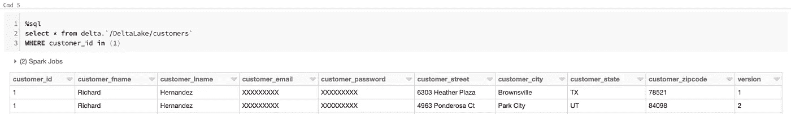

# StreamSets Transformer:渐变维度的设计模式

> 原文：<https://medium.com/analytics-vidhya/streamsets-transformer-design-patterns-for-slowly-changing-dimensions-ed36d136a4c9?source=collection_archive---------19----------------------->

在这篇博客中，我们将研究渐变维度(SCD)类型 2 的一些设计模式，并了解 StreamSets DataOps 平台的最新成员 [StreamSets Transformer](https://streamsets.com/products/transformer/) 如何使其易于实现。

虽然相对静态的数据(如实体(如客户)的位置和地址)很少(如果有的话)随时间变化，但在大多数情况下，维护所有变化的历史是至关重要的。这指的是维度和渐变维度的概念，它们是通过此类数据集的管理和自动化实现的数据操作的重要组成部分。

> *“数据管理和数据仓库中的维度包含关于地理位置、客户或产品等实体的相对静态的数据。缓慢变化维度(SCD)捕获的数据变化缓慢但不可预测，而不是按照规律的时间表”——维基百科。*

SCD 操作有六种类型(类型 1 到类型 6 ), StreamSets Transformer 使您能够处理和实现两种常见的类型——类型 1 和类型 2。

**类型 1 SCD** —不需要维护尺寸变化的历史记录，旧的尺寸值会被新的尺寸值覆盖。这种类型的操作易于实现(类似于普通的 SQL 更新)，通常用于删除特殊字符、纠正记录字段值中的打字错误和拼写错误。

**Type 2 SCD** —需要维护对维度表中每个键所做的所有更改的历史记录。以下是手动处理 2 型 SCD 时涉及的一些挑战:

*   更新这些表的每个进程都必须遵循类型 2 SCD 模式，即让旧记录过期并用新记录替换它们
*   可能没有内置约束来防止给定维度键的开始和结束日期重叠
*   当将一个现有的表转换为类型 2 SCD 时，很可能需要更新从该表中读取或写入该表的每个查询
*   针对该表的每个查询都需要考虑历史类型 2 SCD 模式，只过滤当前数据或特定时间点的数据

可以想象，类型 2 SCD 操作可能会变得复杂，并且是手写代码、SQL 查询等。可能无法扩展，并且难以维护。

遇见[缓变维度](https://streamsets.com/documentation/transformer/latest/help//transformer/Processors/SCDimension.html#concept_ixk_bbr_j3b)处理器。该处理器使数据工程师能够通过配置集中所有“逻辑”(*)来轻松实施 2 型 SCD 操作；而不是 SQL 查询或代码！*)在一处。

让我们来看看几个常见的设计模式。

**模式 1:一次性迁移—基于文件(批处理模式)**

让我们首先举一个非常简单但具体的例子，为现有客户和新客户管理客户记录(更新地址)。在这种情况下，假设目标是空的，因此这更像是一个一次性的迁移场景，用于将“主”和“变更”记录从各自的源接收到一个新的文件目标。

这个场景包括:

*   为“主”源中的每一行创建一条记录
*   为“更改”原点中的每一行创建一条记录
*   新客户:版本设置为 1，其中客户 id 在“主”来源中不存在
*   现有客户:版本设置为“主”来源中的当前值+ 1，其中客户 id 存在于“主”来源中

样本管道:


*注:详细配置属性，* [*点击此处*](https://streamsets.com/documentation/transformer/latest/help/transformer/Processors/SCDimension.html#task_pf4_hdn_f3b) *。*

**主产地输入:**现有客户的样本主记录

```
*customer_id,customer_fname,customer_lname,customer_email,customer_password,customer_street,customer_city,customer_state,customer_zipcode,version1,Richard,Hernandez,XXXXXXXXX,XXXXXXXXX,6303 Heather Plaza,Brownsville,TX,78521,12,Mary,Barrett,XXXXXXXXX,XXXXXXXXX,9526 Noble Embers Ridge,Littleton,CO,80126,13,Ann,Smith,XXXXXXXXX,XXXXXXXXX,3422 Blue Pioneer Bend,Caguas,PR,00725,1*
```

**变更来源输入:**现有客户和新客户的样本变更记录

```
*customer_id,customer_fname,customer_lname,customer_email,customer_password,customer_street,customer_city,customer_state,customer_zipcode2,Mary,Barrett,XXXXXXXXX,XXXXXXXXX,4963 Ponderosa Ct,Park City,UT,801263,Ann,Smith,XXXXXXXXX,XXXXXXXXX,1991 Margo Pl,San Fran,CA,0072511,Mark,Barrett,XXXXXXXXX,XXXXXXXXX,4963 Ponderosa Ct,Park City,UT,80126*
```

**最终输出:**给定上述两个数据集，结果输出将如下所示

```
*customer_id,customer_fname,customer_lname,customer_email,customer_password,customer_street,customer_city,customer_state,customer_zipcode,version1,Richard,Hernandez,XXXXXXXXX,XXXXXXXXX,6303 Heather Plaza,Brownsville,TX,78521,1****2,Mary,Barrett,XXXXXXXXX,XXXXXXXXX,9526 Noble Embers Ridge,Littleton,CO,80126,1****2,Mary,Barrett,XXXXXXXXX,XXXXXXXXX,4963 Ponderosa Ct,Park City,UT,80126,23,Ann,Smith,XXXXXXXXX,XXXXXXXXX,3422 Blue Pioneer Bend,Caguas,PR,00725,1****3,Ann,Smith,XXXXXXXXX,XXXXXXXXX,1991 Margo Pl,San Fran,CA,00725,211,Mark,Barrett,XXXXXXXXX,XXXXXXXXX,4963 Ponderosa Ct,Park City,UT,80126,1***
```

请注意，输出记录的总数是 6；3 条记录来自现有客户的主源，3 条记录来自变更源——其中两条记录用于现有客户，它们的更新地址和版本增加到 2，一条记录用于新客户，版本设置为 1。

**限制**:虽然这种模式实现起来简单明了，但是它有一个缺点，即主源中任何给定客户的版本号不会随着来自变更源的每个更新记录而增加。因此，来自变更源的所有更新记录(针对现有客户)在最终输出中将总是具有设置为 2 的版本。因此，只有当变更源对于相应的主记录最多有一个更新记录时，这种模式才会起作用。将来，StreamSets Transformer 将增加在单个 SCD 批处理中处理同一记录的多个更新的能力。请注意，这个限制也可以通过下面概述的一些其他设计模式来克服。

**特征码 2:增量更新—基于 JDBC(流模式)**

现在，假设有一个支持 JDBC 连接的数据库(例如，MySQL ),它有一个维度表“customers ”,带有复合主键— *customer_id，version。*在这种情况下，目标仍然与模式 1 和 2 相同，我们希望捕获和维护新的和现有的客户记录的更新历史。

样本管道:


*注:详细配置属性，* [*点击此处*](https://streamsets.com/documentation/transformer/latest/help/transformer/Processors/SCDimension.html#task_pf4_hdn_f3b) *。*

这与模式 1 的主要区别如下:

*   模式 1 设计为以批处理模式运行，并在所有数据处理完毕后自动终止；而模式 2 中的管道被配置为以流模式运行——持续运行，直到管道被手动停止——这意味着它将“监听”被放入 S3 桶中的客户更新，并在它们可用时立即处理它们，而无需用户干预。
*   对于任何给定的客户记录，模式 1 最多只能处理一个额外的更新，因为事实上主源并没有为每个相应的变更记录更新新的版本号——这实际上意味着通过变更源进入的每个更新记录都将被分配版本 2。
*   与模式 1 不同，在模式 2 中，主记录被更新为最新版本(通过 JDBC 生产者目的地),因此每个通过变更源进入的更新记录都将被分配一个新版本。


**模式 3:增量更新—DBFS 三角洲湖数据(流模式)**

这与模式 2 非常相似。主要区别是:

*   单一来源
*   Delta Lake Lookup —对于每个更新/更改记录，将根据维度关键字 *customer_id* 对当前 Delta Lake 进行查找。如果匹配，值 *customer_id* 将被返回并传递给 SCD 处理器。SCD 处理器将基于查找值增加版本号，并且具有更新版本的新记录将被插入到 Delta Lake 表中。

样本管道:


*注:关于配置属性的详细信息，* [*点击此处*](https://streamsets.com/documentation/transformer/latest/help/transformer/Processors/SCDimension.html#task_pf4_hdn_f3b) *。* **查询*客户*在 DBFS 三角洲:**

```
*SELECT * FROM delta.`**/DeltaLake/customers`* *where customer_id in (1)*
```



**模式 4: Upserts —数据块三角洲湖和时间旅行(流模式)**

如果您正在使用 Delta Lake，另一个选择是利用 Delta Lake 内置的 upserts 合并功能。这里的基本概念与维护维度版本的 SCD 相同，但是它的实现要简单得多。

样本管道:


*注:关于配置属性的详细信息，* [*点击此处*](https://streamsets.com/documentation/transformer/latest/help/transformer/Destinations/DeltaL-D.html#task_pxc_v1x_phb) *。*

在这种模式中，对于通过(S3)来源进入的每个记录，在 Delta Lake 中根据分别为新产品(“不匹配时”)和现有产品(“匹配时”)配置的条件执行插入或更新操作。由于 Delta Lake 存储层支持 ACID 事务，它能够创建新的(parquet)文件进行更新，同时允许使用简单的 SQL 查询最近的记录，而无需明确要求跟踪字段(例如，“”)出现在表和 where 子句中。

例如，考虑这个原始记录:

```
*product_id,product_category_id,product_name,product_description,product_price1,2,"Quest Q64 10 FT. x 10 FT. Slant Leg Instant U","",****59.98***
```

这个价格从 **59.98 更新到**69.99 的变化记录

```
*product_id,product_category_id,product_name,product_description,product_price1,2,"Quest Q64 10 FT. x 10 FT. Slant Leg Instant U","",****69.98***
```


请注意，该表没有跟踪类型字段(例如，“”)，而查询仍然检索产品价格为 ***$69.98*** 的记录的最新版本。

为了查询旧版本的数据，Delta Lake 提供了一个名为“时间旅行”的功能。因此，在我们的例子中，要检索产品价格的前一(0)版本，SQL 查询应该是这样的:

```
*SELECT * FROM products VERSION AS OF 0 where product_id=1*
```


**结论**

这篇博客文章强调了处理 SCD 类型 2 的一些常见模式，并展示了在 StreamSets Transformer 中使用[渐变维度](https://streamsets.com/documentation/transformer/latest/help//transformer/Processors/SCDimension.html#concept_ixk_bbr_j3b) (SCD)处理器实现这些模式是多么容易。

*原载于 2019 年 11 月 19 日*[*https://streamsets.com*](https://streamsets.com/blog/streamsets-transformer-design-patterns-for-slowly-changing-dimensions/)*。*