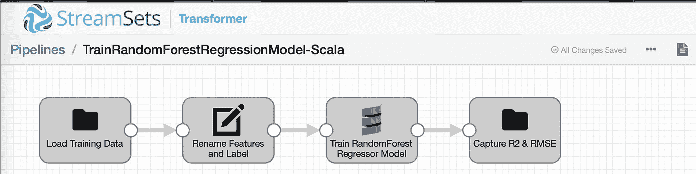
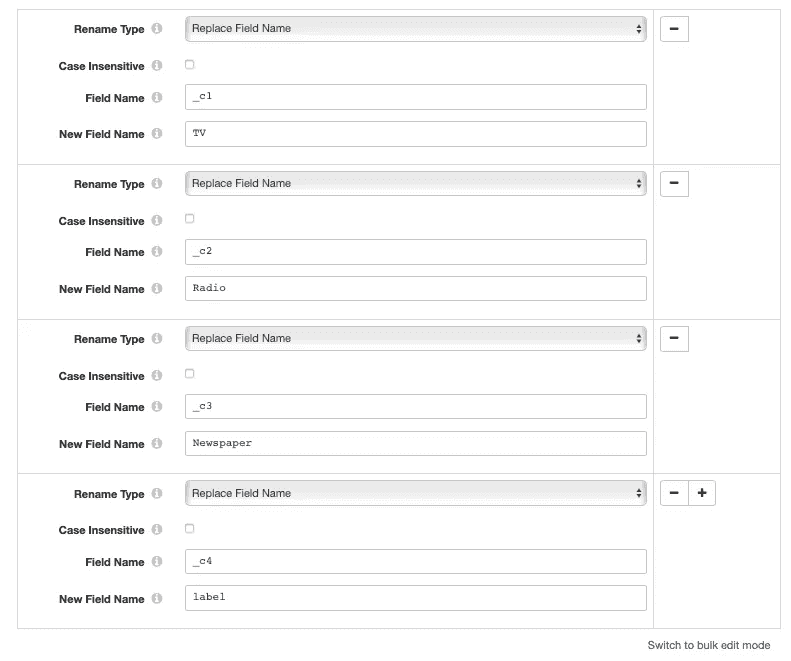
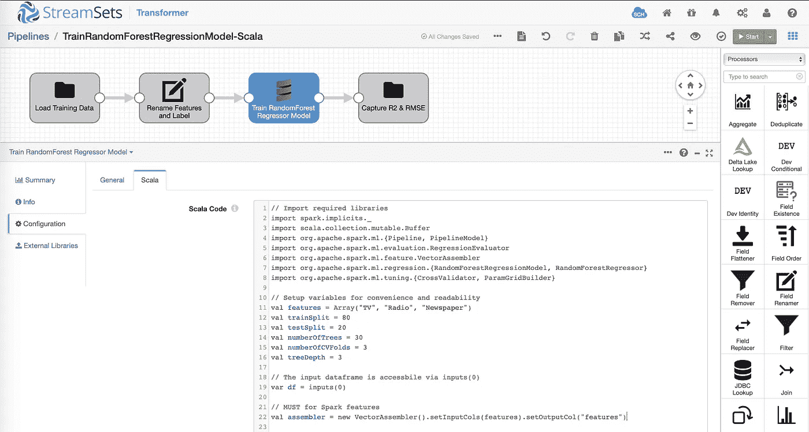

# StreamSets Transformer 可扩展性:Spark 和机器学习

> 原文：<https://medium.com/analytics-vidhya/streamsets-transformer-extensibility-spark-and-machine-learning-e8ddcd7b7a9d?source=collection_archive---------12----------------------->

Apache Spark 在过去几年中一直处于上升趋势，在内存和分布式计算、实时分析和机器学习用例方面，它继续占据主导地位。随着最近发布的 [StreamSets Transformer](https://streamsets.com/products/transformer/) ，这是一个为现代 ETL 创建高度插装的 Apache Spark 应用程序的强大工具，您可以以最小的操作和配置开销快速利用 Apache Spark 的所有优势和功能。

在这篇博客中，你将学习如何扩展 StreamSets Transformer 来训练[Spark ML RandomForestRegressor](https://spark.apache.org/docs/latest/ml-classification-regression.html#random-forest-regression)模型。

# StreamSets 转换器可扩展性

虽然 StreamSets DataOps 平台作为一个整体使您能够处理所有数据操作，但 StreamSets Transformer 则更进一步，还使您能够合并和自动化机器学习中涉及的一些更常见的任务。例如，通过组合、连接和丰富来自多个来源的训练数据集来进行数据准备，重命名特征，将特征的数据类型转换成机器学习算法所期望的数据类型，等等。

此外，StreamSets Transformer 还为您提供了一种扩展其功能的方式，即编写定制的 **Scala** 和 **PySpark** 代码作为您数据管道的一部分。该平台的这些新功能和可扩展性为自动化 ML 任务打开了大门，例如训练机器学习模型。

StreamSets 转换器管道概述

在我们深入研究代码之前，这里有一个高层次的管道概述。

投入

一个[分隔的(。csv)文件](https://github.com/iamontheinet/StreamSets/blob/master/Misc/Advertising_training.csv)，包含媒体渠道(电视、广播和报纸)的历史广告预算(以千美元为单位)及其销售额(以千美元为单位)。

字段重命名器

该处理器将列(也称为用于模型训练的特征)重命名为更易于人类阅读的形式—“_ C1”→“电视”，“_ C2”→“广播”，以及“_ C3”→“报纸”。

更重要的是，它还将表示“销售额”(==售出的单位数)的列“_c4”重命名为“标签”，这是 Spark ML 必须/必需的东西。

Scala 处理器

管道加载如上所述的训练数据集，并将其传递给 Scala 处理器，该处理器封装定制代码以训练 Spark ML RandomForestRegressor 模型。该模型被训练为根据分配给电视、广播和报纸媒体渠道的广告预算来预测销售额(==售出的单位数)。

先决条件:为了让管道运行我们的定制 Scala 代码，必须通过**基本阶段库**下的**包管理器**从 UI 安装以下外部库。(注意，这将需要变压器重启。)

**管道之肉！**

下面是插入到 **Scala 处理器> > Scala > > Scala 代码**段的 Scala 代码。它基本上接受输入数据并训练 Spark ML RandomForestRegressor 模型——同时结合训练测试分割、超参数调整和交叉验证。(请参阅行内注释进行演练。)

*注意:在后台，这个定制代码被编译到一个 jar 中，并交给底层的执行引擎——在本例中是 Spark。*输出

假设一切顺利,“输出”数据帧将包含“R2”和“RMSE ”,它们将被写到上述管道中标记为“捕获 R2 和 RMSE”的文件目标位置中配置的文件中。例如，如果文件目标的数据格式设置为 JSON，JSON 文件的内容可能类似于:

> { " RMSE ":2.133713963903168 ," R2 ": 0.1337263466

不言而喻，模型精度将取决于训练数据集的大小和质量，以及调整哪些超参数。🙂

# 摘要

在这篇博客中，您了解了如何轻松地扩展 StreamSets Transformer 的功能。特别是，您学习了如何合并自定义 Scala 代码来训练 Spark ML 机器学习模型。以类似的方式，您也可以使用 Python API for Spark 或 PySpark 编写定制代码，并使用内置的 [PySpark](https://streamsets.com/documentation/transformer/latest/help//transformer/Processors/PySpark.html#concept_gqm_4hn_ygb) 处理器。

尽管该平台易于扩展，但需要注意的是，定制代码仍然利用 StreamSets Transformer 的底层内置功能和强大功能。仅举几个例子:

*   在任何 Spark 集群、本地 Hadoop 或云托管 Spark 服务(例如 Databricks)上执行。
*   渐进式错误处理可以准确地了解错误发生的位置和原因，而无需解密复杂的日志文件。
*   高度仪表化的管道揭示了每个操作以及应用程序作为一个整体是如何执行的。

要了解更多关于 StreamSets Transformer 的信息，请访问我们的[网站](https://streamsets.com/products/transformer/)，参考[文档](https://streamsets.com/documentation/transformer/latest/help//transformer/GettingStarted/GettingStarted-Title.html#concept_a1b_zf4_pgb)，参加[网络研讨会](https://go.streamsets.com/webinar-intro-to-data-transformer.html)，以及[下载二进制文件](https://streamsets.com/download/)。

## 更新

[在第 2 部分](https://streamsets.com/blog/streamsets-transformer-extensibility-part-2-spark-mleap-bundles-to-s3/)中，我已经说明了如何创建 Spark MLeap 捆绑包来序列化训练好的模型并将捆绑包保存到亚马逊 S3。

*原载于 2019 年 9 月 12 日*[*https://streamsets.com*](https://streamsets.com/blog/streamsets-transformer-extensibility-spark-and-machine-learning/)*。*