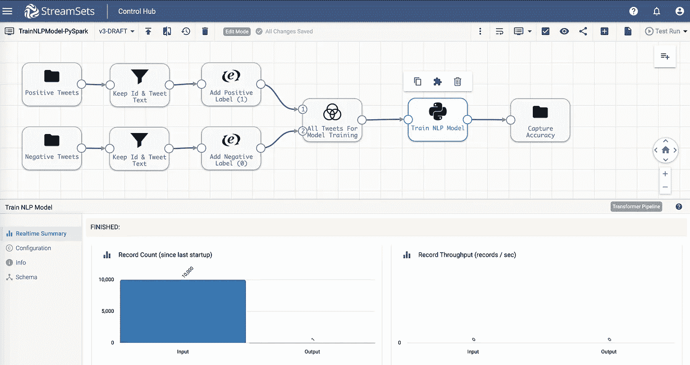
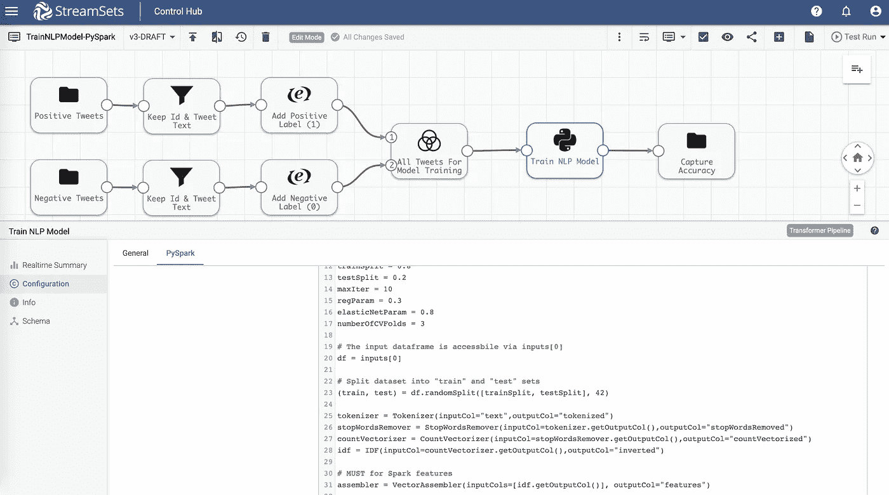

# StreamSets Transformer:PySpark 中的自然语言处理

> 原文：<https://medium.com/analytics-vidhya/streamsets-transformer-natural-language-processing-in-pyspark-9ad955f5d7c0?source=collection_archive---------15----------------------->

在我之前的两篇博客中，我展示了使用 Scala 扩展 StreamSets Transformer 是多么容易:1)训练 Spark ML RandomForestRegressor 模型，2)序列化训练好的模型并保存到亚马逊 S3 。

在这篇博客中，您将学习如何在 StreamSets Transformer 中使用 PySpark 为自然语言处理(NLP)训练 Spark ML 逻辑回归模型。该模型将被训练成将给定的推文分类为积极的*情绪*或消极的*情绪*。

先决条件

*   [流集转换器](https://streamsets.com/products/transformer/)版本 3.12.0+
*   [PySpark 处理器先决条件](https://streamsets.com/documentation/transformer/latest/help/transformer/Installation/StagePrerequisites.html#task_gn4_b1x_dhb)
*   [NumPy](https://en.wikipedia.org/wiki/NumPy) 库安装在同一台机器上

在我们深入细节之前，这里是管道概述。



**输入**

两个[文件](https://streamsets.com/documentation/transformer/latest/help/transformer/Origins/File.html#concept_jcx_f2d_qgb)原点被配置为加载包含将用于训练模型的*正面*和*负面*推文的数据集。

**转换**

*   [字段移除器](https://streamsets.com/documentation/transformer/latest/help/transformer/Processors/FieldRemover.html#concept_svw_dxf_fhb)处理器被配置为仅保留 tweet Id 和 tweet 文本字段，因为在本例中，tweet 的其他字段/值不用于训练模型。
*   [Spark SQL 表达式](https://streamsets.com/documentation/transformer/latest/help/transformer/Processors/SparkSQLExp.html#concept_akj_gsz_mhb)处理器使我们能够将值为 **1** 和 **0** 的 true(情感)列添加到两个数据帧中。该列将用于训练模型。
*   联合处理器被配置为将两个数据帧组合成一个数据帧，用于训练模型。
*   PySpark 处理器是我们用来训练和评估模型的代码所在。(详见下文。)

**PySpark 处理器**

下面是 PySpark 代码插入到 **PySpark** **处理器**>>**PySpark****标签** > > **PySpark 代码**部分。它基本上采用输入数据(帧)并基于它训练 Spark ML 逻辑回归模型-代码细节包括训练-测试分裂，标记文本，删除停用词，设置超参数调整网格，跨折叠交叉验证，在“训练”分裂数据集上训练，并在“测试”分裂数据集上评估训练的模型。(请参阅行内注释进行演练。)



```
# Import required libraries
from pyspark.ml.feature import VectorAssembler, StopWordsRemover, Tokenizer, CountVectorizer, IDF
from pyspark.ml.linalg import Vectors
from pyspark.ml import Pipeline, PipelineModel
from pyspark.sql.functions import *
from pyspark.ml.tuning import CrossValidator, ParamGridBuilder
from pyspark.ml.evaluation import MulticlassClassificationEvaluator
from pyspark.ml.classification import LogisticRegression
from pyspark.sql.types import FloatType

# Setup variables for convenience and readability 
trainSplit = 0.8
testSplit = 0.2
maxIter = 10
regParam = 0.3
elasticNetParam = 0.8
numberOfCVFolds = 3

# The input dataframe is accessible via inputs[0]
df = inputs[0]

# Split dataset into "train" and "test" sets
(train, test) = df.randomSplit([trainSplit, testSplit], 42) 

tokenizer = Tokenizer(inputCol="text",outputCol="tokenized")
stopWordsRemover = StopWordsRemover(inputCol=tokenizer.getOutputCol(),outputCol="stopWordsRemoved")
countVectorizer = CountVectorizer(inputCol=stopWordsRemover.getOutputCol(),outputCol="countVectorized")
idf = IDF(inputCol=countVectorizer.getOutputCol(),outputCol="inverted")

# MUST for Spark features
assembler = VectorAssembler(inputCols=[idf.getOutputCol()], outputCol="features")

# LogisticRegression Model
lr = LogisticRegression(maxIter=maxIter, regParam=regParam, elasticNetParam=elasticNetParam)

# Setup pipeline -- pay attention to the order -- it matters!
pipeline = Pipeline(stages=[tokenizer, stopWordsRemover, countVectorizer, idf, assembler, lr])

# Setup evaluator -- default is F1 score
classEvaluator = MulticlassClassificationEvaluator(metricName="accuracy")

# Setup hyperparams grid
paramGrid = ParamGridBuilder().addGrid(lr.elasticNetParam,[0.0]).addGrid(countVectorizer.vocabSize,[5000]).build()

# Setup cross validator
cv = CrossValidator(estimator=pipeline, estimatorParamMaps=paramGrid, evaluator=classEvaluator, numFolds=numberOfCVFolds) 

# Fit model on "train" set
cvModel = cv.fit(train)

# Get the best model based on CrossValidator
model = cvModel.bestModel

# Run inference on "test" set
predictions = model.transform(test)

# Return accuracy as output dataframe
accuracy = classEvaluator.evaluate(predictions)
output = spark.createDataFrame([accuracy], FloatType()).withColumnRenamed("value","Accuracy")
```

假设一切顺利,“输出”数据帧将包含“准确性”,它将被写到文件中的一个位置，该位置是在上述管道中标有“捕获准确性”的文件目标中配置的。

重申我在其他 ML 相关博客中提到的内容，不言而喻，模型的准确性将取决于训练和测试数据集的大小和质量，以及特征工程和超参数调整——这并不是这篇博客的重点，而是展示如何将 StreamSets Transformer 扩展到其他用例。

**GitHub 上的管道和数据集**

如果您想亲自尝试一下，请从 GitHub 下载管道。

**总结**

在这篇博客中，您了解了如何轻松地扩展 StreamSets Transformer 的功能。

尽管该平台易于扩展，但需要注意的是，定制代码仍然利用 StreamSets Transformer 的底层内置功能和强大功能。仅举几个例子:

*   在任何 Spark 集群、本地 Hadoop 或云托管 Spark 服务(例如 Databricks)上执行。
*   渐进式错误处理可以准确地了解错误发生的位置和原因，而无需解密复杂的日志文件。
*   高度仪表化的管道揭示了每个操作以及应用程序作为一个整体是如何执行的。

*原载于 2019 年 12 月 12 日*[*https://streamsets.com*](https://streamsets.com/blog/streamsets-transformer-natural-language-processing-in-pyspark/)*。*