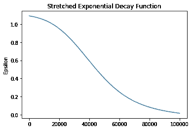

# ε贪婪算法的拉伸指数衰减函数

> 原文：<https://medium.com/analytics-vidhya/stretched-exponential-decay-function-for-epsilon-greedy-algorithm-98da6224c22f?source=collection_archive---------7----------------------->

在从事强化学习(RL)项目时，我一直在寻找一个衰减函数，它可以为 RL 代理提供以下特性

1.  在剧集的开始部分有更多的探索时间
2.  在剧集结尾进行随机探索，实现更多开发(准确定性策略)
3.  从勘探转换到开采时平滑梯度

虽然网上有好几个资源，但我找不到与我要找的功能最匹配的。所以我最后自己发明了一个衰变函数。我还知道了这种衰减函数叫做拉伸指数衰减

## 拉伸指数衰减的表达式

在 python 中，代码看起来像这样:

```
A=0.5
B=0.1
C=0.1
def epsilon(time):
    standardized_time=(time-A*EPISODES)/(B*EPISODES)
    cosh=np.cosh(math.exp(-standardized_time))
    epsilon=1.1-(1/cosh+(time*C/EPISODES))
    return epsilon
```

这里的片段是我们将训练 RL 代理的迭代次数。此外，还有 3 个超参数:A、B 和 c。我们将在一会儿看看这个

对于上面的超级参数设置，衰减函数将如下所示:


集数=100，000 A=0.5，B=0.1，C=0.1

图的左尾部具有大于 1 的ε值，当与ε贪婪算法结合时，将迫使代理探索更多

图的右尾具有接近零的ε值，这有助于代理展现准确定性行为。这意味着代理将在剧集的后期开发更多，但是它也可以随机探索。想象一下，当部署一个 RL 代理人再次扮演人类对手时，如果代理人总是选择相同的最佳行动，代理人的行动总是可以被猜到的。所以这个衰减函数也可以用于这些情况。

在图的左尾和右尾之间有一个过渡部分，它平滑地将代理行为从探索过渡到利用

检查衰减函数形状的代码

```
new_time=list(range(0,EPISODES))
y=[epsilon(time) for time in new_time]
plt.plot(new_time,y)
plt.ylabel('Epsilon')
plt.title('Stretched Exponential Decay Function')
```

## 衰减函数的超参数

参数 A 决定了我们希望代理在探索或开发上花费更多的时间。对于低于 0.5 的 A 值，代理人将花费更少的时间探索，更多的时间利用。对于 0.5 以上的 A 值，您可以期待代理探索更多

衰减函数对于 A=0.3，图形的左尾已经缩短，因此代理将相对探索较短的持续时间


对于 A=0.3，左尾翼被缩短

衰减函数 A=0.7 时，图形的左尾部变长，因此代理将探索更长的持续时间


对于 A=0.5，左尾翼已经加长

参数 B 决定了勘探区和开采区之间的过渡区的坡度

当 B 为 0.3 时，斜率接近 45 度。我个人选择 B=0.1



B=0.3 时，过渡部分的坡度= -45 度

参数 C 控制图形左右尾部的陡度。C 值越高，图形的左右尾部越陡。在这里，我也更喜欢使用 C=0.1


当 C=0.7 时，左右尾部趋于变陡

## ε贪婪算法中衰减函数的配置

ε贪婪算法的代码如下

```
def epsilon_greedy(state, time):

    z = np.random.random() #provides a number less than 1
    state=Q_state(state)   #state is provided by environment  
    if z > epsilon(time):
    #for smaller epsilon values, the agent is forced to chose the best possible action action = <write your code to choose best possible action> 
#Exploitation: this gets the action corresponding to max q-value of current state

    else:
# for larger epsilon values (close to 1), the agent is forced to explore by choosing a random action action = <write your code to choose the a random action>    #Exploration: randomly choosing and action

    return action
```