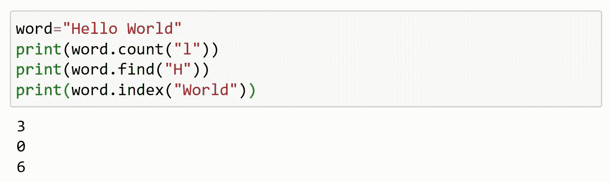

# Python 中的字符串操作

> 原文：<https://medium.com/analytics-vidhya/string-manipulation-in-python-1cba16490ab1?source=collection_archive---------11----------------------->

正如我们之前讨论的什么是字符串？如何创建字符串？如何移除一个元素等等。

在本文中，我们将看到字符串操作。

让我们快速回顾一下 python 中的字符串是什么；

字符串是按顺序排列的字符集合

字符串是不可变的

可以使用索引来访问字符串

空字符串是包含 0 个字符的字符串。

单个字符就是长度为 1 的字符串

当数据由单引号或双引号(“”或“)分隔时，Python 会将其识别为字符串

数组是一组同质的数据集合，而字符串是字符数据的集合。

python 中的字符串是数组。

## 什么是字符串操作？

字符串操作是创建、解析和分析数据的过程。

***创作:***

字符串的创建如下所示；

字符串的创建

***接入:***

字符串的字符/元素可以通过索引的方法来访问。

访问字符串

***长度:***

为了确定字符串的长度，我们使用 len()

字符串长度

***发现:***

要了解更多关于字符串的信息，我们可以使用 find()

使用查找( )

***计数:***

找出字符串中有多少个字符。这也包括空格。

使用 count()

***分裂:***

这有助于你在空白的地方分开。为此，我们可以使用 split()。

使用 split()

***开始与结束:***

这些函数告诉我们字符串是否以指定的字符开始和结束。因此，它只返回 true 或 false。

使用 startswith()和 endswith()

***重复字符串:***

要重复字符串的内容，我们只需输入*符号和您希望打印的次数。

重复一串

***改变字符串大小写:***

**1。大写:**

以大写形式打印所有字符。

大写字母

**2。小写:**

以小写形式打印所有字符。

小写字母盘

**3。标题:**

以大写形式打印所有单词的第一个字符。如果字符串以 symbol 开头，那么其后的第一个字母将以大写形式打印。

标题

**4。大写:**

以大写形式打印第一个字符。

大写

**5。互换案例:**

打印所有大写字母都是小写字母的字符串，反之亦然。

互换案例

***倒车:***

我们可以使用索引切片来反转字符串。

反转字符串

***长条():***

返回删除了空格的字符串的副本。

使用条带( )

**1。rstrip:**

从字符串右侧移除不需要的字符。

使用 rstrip

**2。lstrip:**

从字符串左侧移除不需要的字符。

使用 lstrip

要从两端移除，可以将 strip 函数赋给原始变量。

使用条形函数

***串联:***

这可以在字符串上使用“+”操作符来完成。

连接一个字符串

***加入:***

在字符串的每个字符之间添加一个字符。

连接一根线

***多行字符串赋值:***

将一个长字符串拆分成多行是最简单的方法。必须在字符串的开头和结尾用三重引号将字符串括起来。

多行字符串

***测试:***

python 中的字符串可以测试真值。返回类型将为布尔值(True 或 False)。

测试字符串

至此，我们已经结束了 python 中的字符串操作。

快乐编码…😊😊😊