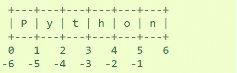

# Python 中的字符串

> 原文：<https://medium.com/analytics-vidhya/strings-in-python-5696217b0e3?source=collection_archive---------15----------------------->


由[萨法尔萨法罗夫](https://unsplash.com/@codestorm?utm_source=medium&utm_medium=referral)在 [Unsplash](https://unsplash.com?utm_source=medium&utm_medium=referral) 上拍摄的照片

为了更好地理解，本文将提供一些片段。

Python 中使用字符串来记录文本信息，比如姓名。Python 中的字符串实际上是一个*序列*，这基本上意味着 Python 将字符串中的每个元素作为一个序列来跟踪。例如，Python 将字符串“hello”理解为特定顺序的字母序列。这意味着我们将能够使用索引来抓取特定的字母(比如第一个字母，或者最后一个字母)。

序列的概念在 Python 中是很重要的，我们以后会谈到它。

在交互式解释器中，输出字符串用引号括起来，特殊字符用反斜杠转义。虽然这有时可能看起来与输入不同(括起来的引号可能会改变)，但这两个字符串是等效的。如果字符串包含单引号而没有双引号，则用双引号将字符串括起来，否则用单引号将字符串括起来。`[print()](https://docs.python.org/3.7/library/functions.html#print)`函数通过省略括起来的引号和打印转义字符和特殊字符，产生了可读性更好的输出:

可以使用单引号 **' '** 或双引号 **" "** 在 Python 中创建字符串

“你好，世界”

运筹学

“你好，世界”

使用引号时要小心。

我使用单引号，但这会产生错误

```
**SyntaxError:** invalid syntax
```

一旦你运行，这些将给出一个语法错误。

这是因为单引号引起了字符串。

```
In [] : "Now I'm ready to use the single quotes inside a string!" 
```

# 字符串切片和索引。

```
In[1] : "Now I'm ready to use the single quotes inside a string!"Out[1] :  "Now I'm ready to use the single quotes inside a string!"In [2]: my_string= "Now I'm ready to use the single quotes inside a string!"In[3]: my_string[0:14]out[3]:"Now I'm ready "
```



为了更好地理解，可以尝试这些代码行

# HelloWorld 在 Hello 和 World 之间没有空格

# 你好，我来了，我来了

# 0 1 2 3 4 5 6 7 8 9

在 Python 中 h 取值或 0。在 Python 中，每个第一个单词都被认为是 0

e=1

l=2

l=3

o=4

…，等等

# 也

# 你好，我来了，我来了

10 -9 -8 -7 -6 -5 -4 -3 -2 -1

这些是反串。

# 你能猜出是否:-

# Hello World 在 Hello 和 World 之间留有空格

# 我们开始索引吧！

# 对于“你好，世界”

```
In[1] :# Show first element (in this case a letter)
       s[0]Out[1]:'H'In [2]:s[1]Out[2]:'e'In[3] :print(s[2])Out[3]:1
```

我们可以使用一个`:`来执行*切片*，将所有东西抓取到指定的点。例如:

```
In[1] :# Grab everything past the first term all the way to the                    length of s which is len(s)
       s[1:3]Out[1]:'el'In[2]:
      # Note that there is no change to the original 
       sOut[2}:'Hello World'In[3]:# Grab everything UP TO the 3rd index
      s[:3]Out[3]:'Hel'
```

#注意上面的切片。在这里，我们告诉 Python 从 0 到 3 获取所有内容。它不包括第三个指数。在 Python 中你会注意到这一点，这里的语句和通常是在“直到，但不包括”的上下文中。

```
In[1] :#Everything
       s[:]Out[1]:'Hello World'We can also use negative indexing to go backwards.In[2]:# Last letter (one index behind 0 so it loops back around)
      s[-1]Out[2]:'d'In[3]:# Grab everything but the last letter
       s[:-1]Out[3]:'Hello Worl'
```

我们还可以使用索引和切片符号，按照指定的步长(默认为 1)来获取序列的元素。例如，我们可以在一行中使用两个冒号，然后使用一个数字来指定获取元素的频率。例如:

```
In[1] :# Grab everything, but go in steps size of 1
       s[::1]Out[1]:'Hello World'In[2]:# Grab everything, but go in step sizes of 2
      s[::2]Out[2]:'HloWrd' 
```

#大写 a 字符串
s.upper()

#小写
s.lower()

斯普利特()

# 字符串方法

下面是一些最常见的字符串方法。一个方法就像一个函数，但是它运行在一个对象上。如果变量 s 是一个字符串，那么代码 s.lower()在该字符串对象上运行 lower()方法并返回结果(这种在对象上运行方法的思想是构成面向对象编程(OOP)的基本思想之一)。以下是一些最常见的字符串方法:

*   s.lower()、s.upper() —返回字符串的小写或大写版本
*   s.strip() —返回移除了开头和结尾空白的字符串
*   s . is alpha()/s . is digit()/s . is space()…—测试所有字符串字符是否都在不同的字符类中
*   s.startswith('other ')，s.endswith('other') —测试字符串是以给定的其他字符串开始还是结束
*   s.find('other') —在 s 中搜索给定的其他字符串(不是正则表达式)，并返回它开始的第一个索引，如果没有找到，则返回-1
*   s.replace('old '，' new ')-返回一个字符串，其中所有出现的' old '都已被' new '替换
*   s.split('delim') —返回由给定分隔符分隔的子字符串列表。分隔符不是正则表达式，它只是文本。aaa，bbb，ccc '。拆分('，')-->[' AAA '，' bbb '，' ccc']。作为一个方便的特例，s.split()(不带参数)对所有空白字符进行分割。
*   s.join(list) —与 split()相反，使用字符串作为分隔符将给定列表中的元素连接在一起。例如“—”。join(['aaa '，' bbb '，' ccc']) -> aaa — -bbb — -ccc

Python 没有单独的字符类型。相反，像 s[8]这样的表达式返回一个包含字符的 string-length-1。对于字符串长度为 1 的情况，操作符==、< =、…都像您所期望的那样工作，所以大多数情况下您不需要知道 Python 没有单独的标量“char”类型。