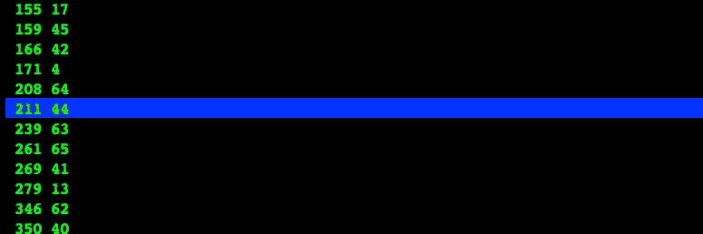
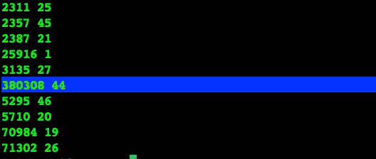

# 结构尴尬的 CSV 以及如何处理它们

> 原文：<https://medium.com/analytics-vidhya/structurally-awkward-csvs-and-how-you-can-deal-with-them-26e34285b48f?source=collection_archive---------16----------------------->

在我作为数据科学家的生活中，我经常要处理 CSV。有时候，当它们在系统和人之间来回传递时，它们的结构已经被破坏了。这里有一种方法可以让你处理这些问题，并在此过程中做一些数据探索。我选择用 AWK 的。


照片由[米卡·鲍梅斯特](https://unsplash.com/@mbaumi?utm_source=unsplash&utm_medium=referral&utm_content=creditCopyText)在 [Unsplash](https://unsplash.com/s/photos/csv?utm_source=unsplash&utm_medium=referral&utm_content=creditCopyText) 上拍摄

我经常发现自己必须在尽可能短的时间内将结构受损的 CSV 转换成可用的数据集。这是因为我的客户并不总是有必要的专家、软件或时间来为我采购一个*干净的*版本。

最重要的是，被销售的工具通常为那些一开始就有相对简单的解决方案的事物提供解决方案，这并不是说它们不提供价值。在本文中，我将向您展示如何处理在将数据加载到软件之前通常必须解决的问题类型。我称之为结构性问题。

我遇到的最常见的结构问题是:

*   字节顺序标记
*   混合使用 Windows 和 Linux 换行
*   未隔离的外壳和外壳内的分离器

最后一个问题特别难处理，因为它将导致 CSV 被读取为某些行具有不同的列数。在本文中，我们将探索如何处理字节顺序标记和未转义的闭包以及闭包内的分隔符的简单方法。

因为我是从 IT 工程背景转到数据科学的，所以我最初用来帮助我处理结构性问题的工具在大多数系统上都是现成的。我发现的最有用的工具是 AWK。还将显示其他命令。

我不会提供对 AWK 的完整介绍，而只是解释一些有用的代码片段。如果你想了解 AWK 的细节，我强烈建议你阅读文档，可以通过这个链接找到。

 [## GNU Awk 用户指南

### 这个文件记录了 awk，一个可以用来选择文件中特定记录并对其执行操作的程序…

www.gnu.org](https://www.gnu.org/software/gawk/manual/gawk.html#SEC_Contents) 

我用来说明你如何使用 AWK 的数据集是大都会艺术博物馆开放存取 CSV，你可以在 github 上找到。

[](https://github.com/metmuseum/openaccess/) [## metmuseum/openaccess

### 大都会艺术博物馆展示了来自世界各地超过 5000 年的艺术，供每个人体验和欣赏

github.com](https://github.com/metmuseum/openaccess/) 

请下载一份拷贝到你选择的文件夹，如果默认情况下没有 awk，请确保在你的系统上安装 awk。我创建了数据集的副本，并将其命名为 *data.csv* 。代码片段已经在 AWS 上运行的默认 Ubuntu 18.04 和我的 Mac 上运行的 AWK 5.0.1 上进行了测试。

让我们从初步查看数据开始。

```
head -20 data.csv | less -S
```

*head -20* 命令从 *data.csv* 文件中取出前 20 行，然后用*管道*将它们连接成一个名为 *less* 的命令。S 参数告诉 *less* it，我不想换行。这两个命令的结果是，我们现在可以看到最上面的 20 行，并且侧滚可以看到所有列的自然顺序。

首先突出的是以下内容:

```
**<U+FEFF>**
```

这是字节顺序标记，通常是代码转换的结果。通常，您会在曾经有特定于区域设置的字符的地方看到这些字符，如德语*中的“、”或“”。*不幸的是没有办法恢复原来的性格。您可以选择保留字节顺序标记或删除它。每当我想要一个角色丢失的提醒时，我通常会选择保留它。当数据向消费者公开时，我会删除它，因为它有时会使用以下符号显示。


字节顺序标记，也称为替换字符

为了摆脱它，你可以使用以下非常简单的 AWK 程序。

```
awk '{ gsub(/^\xef\xbb\xbf/,""); print }' data.csv > data1.csv
```

这段代码所做的是找到所有出现的字节顺序标记，用空值替换它们，从而删除它们。结果是*使用 *>* 将*重定向到一个名为 *data1.csv* 的新文件中。

现在，让我们试着找出列名是什么。

```
awk -F "," 'NR==1{ gsub(/,/, "\n"); print }' data1.csv
```

这将查看文件的第一行，并用换行符替换所有逗号，从而转置文件的第一行。

此时，我们可能想要了解我们正在处理多少列。

```
awk -F "," 'NR==1{ print NF }' data1.csv
```

结果应该是 44 列。 *NR==1* 告诉 awk 只查看第一行， *NF* 包含了*字段的数量*(在 AWK 的上下文中列被称为字段)。为了计算出文件包含多少行，我们可以使用下面的代码片段。

```
awk -F "," 'END{ print NR }' data1.csv
```

*结束*告诉 **AWK** 只在结束时运行这个，这时 *NR* 包含行数。你应该得到 583121 **。**

在*dirty*CSV 中很常见的一点是，列包含自由文本数据，这可能导致它们包含分隔符和分隔符。这几乎是最糟糕的情况，因为它可能导致不可恢复的行，因为仅仅由于缩放或者由于分隔符和外壳的嵌套方式，可能没有办法重建原始列。让我们看看如何检测到这一点，并找到一种快速简单的方法来解决它。

我们可以通过比较每行检测到的列数来实现这一点。

```
awk -F "," 'NR>1{ print NF }' data1.csv | sort | uniq -c | sort
```

这将打印每一行大于 1 的字段数。第一个 *sort* 命令为我们的第二个命令 *uniq* 进行排序，后者计算出现的次数，最后一个 *sort* 命令最后对它们进行排列，这样我们就可以在输出的底部看到最大的列号。换句话说，这个命令的结果是两个数字，第二个告诉您计算了多少列，第一个告诉您计算了多少次。



这是个坏消息。我们似乎只有 211 行，正好是 44 列。请记住，我们之前在查看标题行时发现，我们应该有 44 列。

有一个非常简单的技巧可以帮助我们找到更多的行。 **AWK** 让你提供一个正则表达式来定义一个字段应该是什么样子。

```
awk -F "," 'BEGIN{ FPAT="([^,]*)|(\"[^\"]+\")" } NR>1{ print NF }' data1.csv | sort | uniq -c | sort
```

正如你所看到的，这是通过在我们的 **AWK** 计划的开始定义 FPAT 来实现的。提供的正则表达式字面意思是:一个字段要么是**任何不是逗号的内容**，要么是**一个双引号，任何不是双引号的内容，以及一个右双引号。**这个超级有用的部分是直接从文档中摘录的，这也是我认为 **AWK** 如此强大的一个重要原因。

 [## 按内容拆分(《GNU Awk 用户指南》)

### 本节讨论 gawk 的一个高级特性。如果你是 awk 的新手用户，你可能想跳过它…

www.gnu.org](https://www.gnu.org/software/gawk/manual/html_node/Splitting-By-Content.html) 

虽然 FPAT 的引入导致程序需要更多的时间来运行，但它也极大地改善了结果。我们现在应该总共计数 380308 行，44 列。



不幸的是，目前仍有许多行的状况不佳。我们可以在后续文章中研究如何尝试恢复其中一些。

现在，让我们把数据集分成一个干净的文件和一个脏文件，前者只包含 44 列的行，后者包含所有其他内容。

```
awk -F "," 'BEGIN{ FPAT="([^,]*)|(\"[^\"]+\")" }; NF==44{ print }' data1.csv > clean.csvawk -F "," 'BEGIN{ FPAT="([^,]*)|(\"[^\"]+\")" }; NF!=44{ print }' data1.csv > dirty.csv
```

在结束本文之前，让我们先来看几个可以帮助我们探索数据的技巧。

让我们首先显示干净文件的各个列，并用 *sort* 和 *uniq* 对它们进行总结。

```
awk -F "," 'BEGIN{FPAT="([^,]*)|(\"[^\"]+\")" } NR>1{ print $1 }' clean.csv | sort | uniq -c | sort
```

这将显示第一列的内容，经过排序和计数。你可以通过*打印$2* 来查看列，以此类推。 *$0* 包含整行。

最后，这里有一个查看 10 个随机行的第 5 列的简洁方法。

```
awk -F "," 'BEGIN{ FPAT="([^,]*)|(\"[^\"]+\")";srand(); for (i = 1; i <= 10; i++) a[int(380308 * rand())] } (NR in a) { print $5 }' clean.csv
```

确保正确指定总行数，在本例中为 380308，否则代码可能会试图打印不存在的行。

我希望这是有帮助的，并为更深入地挖掘 AWK 提供了一些动力。