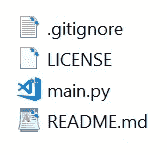
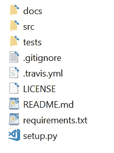

# 结构化 Python 代码—来自 10 多个博客的最佳实践

> 原文：<https://medium.com/analytics-vidhya/structuring-python-code-best-practices-from-over-10-blogs-2e33cbb83c49?source=collection_archive---------0----------------------->

在一个位置汇集最佳实践，以供快速参考。

[来源](http://Chris Ried on Unsplash)

我在 2019 年 11 月开始了一条提高我的 Python 技能的道路，并设定了在新年前完成这项工作的最后期限。4 个月后，我的进展远远没有达到我为自己设定的目标，尽管我很高兴我完成了这项(艰苦的)练习，记录了一些最好的资源，以便它可以给其他人一个良好的开端，改善他们的整体代码组织。

对于许多有经验的 python 开发人员来说可能是微不足道的事情，花费这么长时间的原因来自这篇中型文章，其中 Albert 解释[“不，你不会在周末完成它”。](/better-programming/no-you-wont-get-it-done-over-the-weekend-1cbfc10eee01)

我给自己设定了一个非常具体的任务，即改进我的面向对象编程，适当地使用日志记录，编写单元测试，使用适当的工作流进行版本控制，使用 Travis CI 运行自动化测试，使用 Sphinx 生成文档，并尽可能地按照 PEP-8 指南构建文件和代码。

这是我以前的目录结构。

这是我的目录结构在完成这个练习后的样子。

在花了这么多时间后，我意识到还有很大的改进空间，需要更多的迭代和练习。

巨大的房间照片— [来源](http://Israa Hilles on Unsplash)

这些是我花了几个小时浏览的一些链接，我感谢它们各自的作者。我添加了一个简短的摘要，其中包含突出重要步骤的链接，作为快速参考指南。

# Python 应用程序/项目的示例模块库和代码布局:

*   [https://realpython.com/python-pep8/](https://realpython.com/python-pep8/)——一个提供如何编写 Python 代码的指南和最佳实践的文档
*   [https://docs.python-guide.org/writing/structure/](https://docs.python-guide.org/writing/structure/)——构建项目以实现其目标的指南
*   [https://www . kennethreitz . org/essays/repository-structure-and-python](https://kenreitz.org/essays/2013/01/27/repository-structure-and-python)—python 目录中所需的不同文件及其适当位置的解释和分解
*   [https://github.com/navdeep-G/samplemod](https://github.com/navdeep-G/samplemod)—一个简单 python 项目的 GitHub repo 示例，解释见上面的链接

# 以正确的方式开源 Python 项目

*   [https://jeffknupp . com/blog/2013/08/16/open-sourcing-a-python-project-the-right-way/](https://jeffknupp.com/blog/2013/08/16/open-sourcing-a-python-project-the-right-way/)—我见过的最好的博客之一，展示了如何构建一个项目并将其作为开源包发布，重点是 g it 进行版本控制，GitHub 进行项目管理，Git-Flow 工作流，Tox 进行测试标准化，Sphinx 进行文档和 readthedocs 进行自动和持续的文档集成。

# 以正确的方式开始一个 Python 项目

*   [https://jeffknupp . com/blog/2014/02/04/starting-a-python-project-the-right-way/](https://jeffknupp.com/blog/2014/02/04/starting-a-python-project-the-right-way/)—Jeff 的另一篇优秀文章展示了如何从零开始构建项目，为方法和属性添加占位符，并随着代码的进展完成它们

# 注释和记录代码

*   [https://realpython.com/documenting-python-code/](https://realpython.com/documenting-python-code/)——使用诸如 BUG、FIXME 和 TODO 等标签，为代码的某些部分标注问题、修复或改进

# 模块命名和导入约定

*   [https://docs.python-guide.org/writing/structure/](https://docs.python-guide.org/writing/structure/)—Bad—从 modu 导入*，Better —从 modu 导入 sqrt，Best —导入 modu，Ok —导入 library.plugin.foo，not OK —导入 library.foo_plugin

# Python 日志模块

*   [https://www.pylenin.com/blogs/python-logging-guide/](https://www.pylenin.com/blogs/python-logging-guide/)—关于配置根记录器与主记录器、记录到文件和控制台的精彩解释。
*   [https://Fang penlin . com/posts/2012/08/26/good-logging-practice-in-python/](https://fangpenlin.com/posts/2012/08/26/good-logging-practice-in-python/)—适当使用日志记录级别并使用不同格式的配置文件— ini、json、yaml，使用回溯捕获异常

# Python 测试模块

*   [https://realpython.com/python-testing/](https://realpython.com/python-testing/)——关于如何编写单元测试的精彩解释

# 从模板设置新项目的模板

*   [https://github.com/audreyr/cookiecutter-pypackage](https://github.com/audreyr/cookiecutter-pypackage)—一个 CLI 工具，使创建和维护项目模板变得简单而直观
*   [https://www . py Danny . com/Cookie-project-templates-made-easy . html](https://www.pydanny.com/cookie-project-templates-made-easy.html)—这里是关于 Cookie-Cutter 入门的精彩解释

# Gitflow 工作流

*   [https://www . atlassian . com/git/tutorials/comparising-workflows/git flow-workflow](https://www.atlassian.com/git/tutorials/comparing-workflows/gitflow-workflow)——这个工作流使用两个分支——一个主分支和一个开发分支，作为特性的集成分支。

此外，所有链接的集合可以在 GitHub 的[这里](https://github.com/prkapur/python-reference-blogs)找到。如果您对如何进一步改进有任何建议或想法，请留下回复。