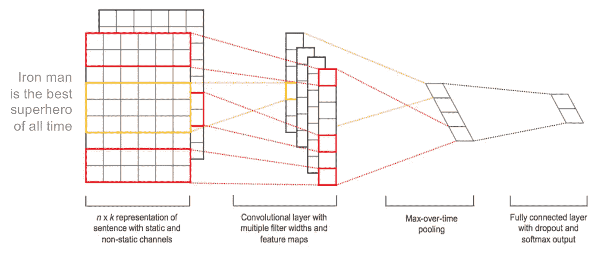
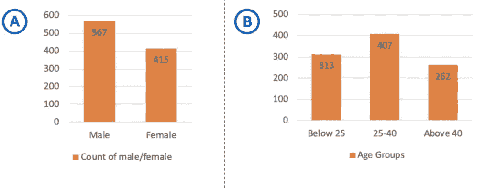
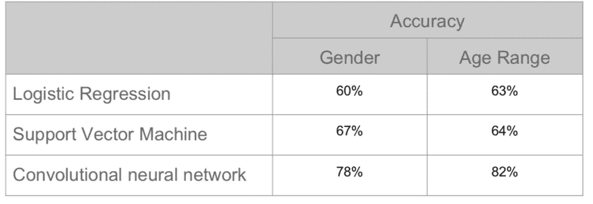
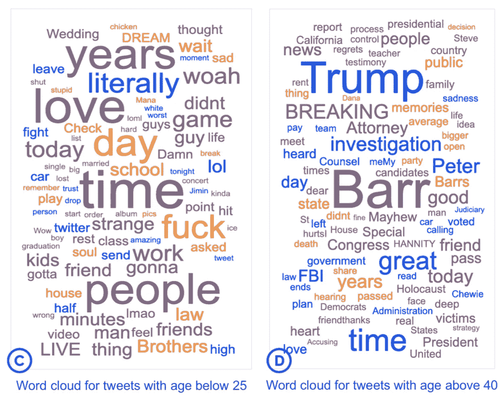

# 推特上的语言和年龄研究

> 原文：<https://medium.com/analytics-vidhya/study-of-language-and-age-on-twitter-bf614e7acadf?source=collection_archive---------27----------------------->

资料来源:https://www.lipskas.com/tags/twitter/

*   检索并标注性别和年龄的推文。使用 NLTK 库对数据进行预处理，使用 TF-IDF 值生成文本特征。
*   *比较了 Logistic 回归、支持向量机和卷积神经网络的预测精度。*
*   *对这些推文进行了分析，以观察不同年龄组的推文风格以及随时间的变化。*

一个人的语言使用揭示了他们的社会身份。它可以基于各种群体，如年龄、性别、政治派别等。在 Twitter 数据的帮助下，我们执行了一个细粒度的注释任务，该任务可用于研究一个人的语言与其年龄和性别之间的关系。

## **方法**:

我们实验并比较了三种机器学习算法的预测:

1.  二元逻辑回归分类器用于根据性别对标记化的推文进行分类。我们使用一个对所有的方法来处理年龄组的多类分类。
2.  支持向量机也被用来执行这两个分类任务。
3.  通过使用 Keras 合并层将滤波器应用于卷积神经网络。

## **数据收集:**

这些推文由 3 名注释者收集并标注了性别和年龄范围(见图 A & B)。为注释任务设置的基本规则如下:

1.  该帐户应该可以公开访问。
2.  账户应该代表一个人。
3.  该帐户应该有足够的推文(至少 10)。

## **注释者间协议**:

两个注释者执行注释。两者一共注释了 982 条推文。第三个注释者使用 Cohen 的 Kappa 通过评估同一样本的两个试验来评估注释者之间的协议。发现性别的 Kappa 值为 1.0，年龄的 Kappa 值为 0.76。

## **数据预处理:**

1.  所有的用户提及(@user)都被一个公共标记所取代。
2.  特殊字符和停用词将被删除。
3.  我们只保留在训练文档中出现至少 10 次的单词。
4.  然后，通过计算词汇表中所有单词的 Tf-Idf 分数，对推文进行标记化。

## **结果和分析:**

所有三种方法的精度如下所示:

卷积神经网络似乎比其他两种方法更好地学习这些特征。如果数据集更大，精确度会更高。

在分析了这些推文之后，我们可以看到不同年龄组的人在推文风格和用词上的明显差异(见图 C & D)。我们还发现，女性比男性写得略多(代币的平均数量:2235 对 2130)

## **结论:**

我们的模型仅仅基于用户的推文。这有一个实际的优势，即数据很容易收集，因此模型可以很容易地应用于新的 Twitter 用户。一个人在社交媒体上的表现只是他身份的一个方面。一个人可以在任何特定的时刻选择代表他们身份的不同方面。人们也可以说，当年轻人在 Twitter 等社交媒体平台上采用非正式的写作风格时，老年人的写作风格变得更加正式，不那么幼稚。