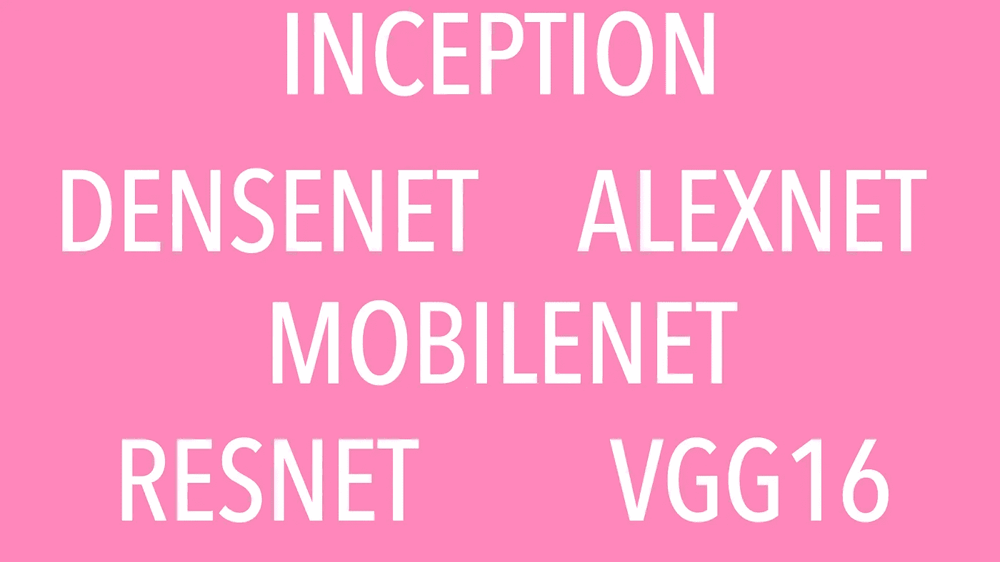

# 基于迁移学习的图像分类模型及其在人脸识别中的应用研究

> 原文：<https://medium.com/analytics-vidhya/study-of-state-of-the-art-image-classification-models-and-their-application-to-face-recognition-bdd6b3820ac?source=collection_archive---------8----------------------->

最先进的模型

近年来，我们在图像分类领域进行了大量的研究，使用了非常大的数据库，如 ILSVRC[ImageNet 大规模视觉识别挑战] [11]数据集。深度 cnn 的应用对旧模型进行了相当大的改进。它始于 Alex Krizhevsky 等人提出的深度 cnn 架构。al 命名为 AlexNet [8]，然后泽勒和弗格斯提出了另一个与 AlexNet 深度相似的架构[15]。这些模型在 ImageNet 数据集上的成功结果为更深层次的卷积神经网络铺平了道路。牛津大学的视觉几何小组提出了更深层次的架构，其中 VGG16 和 VGG19 [12]是公开可用的。图像分类效率的提高引起了谷歌和微软等大型 IT 公司的注意。谷歌投资研究更深的卷积网络，很快谷歌团队，Szegedy 等人提出了 Inception network [14]，谷歌的另一个深度 cnn 架构由 Francois Chollet 在 2017 年创建，命名为 Xception [5]。微软提出了自己的一系列深度网络，如何等人提出的 ResNets。自从他们第一次提出建议以来，所有这些研究人员都提出了进一步的增强和更好的架构，以克服以前模型的缺点，并进一步提高所提出模型的准确性和泛化能力。

所有这些模型都遵循监督学习方法。在监督学习中，我们向模型提供包含输入特征和相应输出的样本数据。模型应该学习给定数据的通用解决方案。其他类型的学习是无监督学习和强化学习。模型学习输入数据的有用表示，这使它们能够有效地解决图像识别和分类等复杂问题。[3]

由于这种重用能力，迁移学习大大提高了深度学习模型的效率。在一般设置中，用户使用最先进的预训练模型和权重来获得输入的有用表示，然后将该有用表示馈送给用户设计的顶级模型。这个顶层模型通常是包含一个或两个隐藏层的小得多的模型。因此，运行时间大大减少，问题可以更有效地解决。如果我们选择正确的模型来获得表示，整个设置的准确性也是好的。在这项研究中，我们将看到迁移学习在图像分类中的应用。

## *表象学习*

有用的表示已经在我们的日常生活和计算机系统中使用了很长时间。表征决定了许多信息处理任务的表现。正确的表达使问题易于理解、形象化并在更少的时间、更少的努力和更少的空间内解决问题。例如，从存储在数组中的数字中访问一个数字需要 O(1)时间，从存储在堆栈中的数字中访问一个数字需要 O(n)时间。

在机器学习和深度学习中，有用的表示使学习任务变得容易。有用表示的选择主要取决于手头的问题，即学习任务。在深度学习中，前馈神经网络可以被视为在以监督方式训练时执行表示学习。输入层与所有隐藏层的结合应该将输入转换成有用的表示。这种表示充当最后一层(通常是分类层)的输入。该分类器通常是 softmax 回归分类器、线性回归或逻辑回归分类器，其利用从早期层接收的表示来成功解决目标问题。例如，在模型被训练来检测图像中的猫的情况下，对最后一层的表示是这样的，使得它可以分离包含猫和非猫图像的图像。

你可以在我之前写的另一篇文章中读到更多关于表征学习概念的内容，[https://medium . com/analytics-vid hya/representation-learning-a-key-idea-of-deep-learning-19 B9 B1 de 63 af](/analytics-vidhya/representation-learning-a-key-idea-of-deep-learning-19b9b1de63af)

## *转移学习*

迁移学习是一种重用已有知识的方法。这个想法是使用一个已经在一个更大的数据集上训练了很长时间并被证明在相关任务中工作良好的最先进的模型。许多这样的模型可供我们使用。Keras [4]提供了一些预先训练好的先进模型。这些模型的详细信息可在 https://keras.io/applications/[找到](https://keras.io/applications/)我们可以通过两种方式使用这些模型:

1.  直接应用:在这种方法中

a)我们研究模型，以检查它是否能解决我们的目标问题。

b)如果是，我们需要根据模型预处理我们的输入，然后将其馈送给模型以获得结果。

2)代表性:

在这种方法中，我们认为预先训练的模型可能无法直接适用于我们的问题。但是，我们可以用它来获得输入数据的有用表示。

a)我们将输入数据输入预训练模型，以获得数据的表示。

b)我们设计自己的模型，并用预训练模型给出的表示来输入它，以获得结果。

我在我的文章[中写了关于迁移学习和它与 CNN 和 DNN 的比较【https://medium . com/analytics-vid hya/image-class ification-a-comparison-of-dnn-CNN-and-Transfer-learning-approach-704535 beca 25](/analytics-vidhya/image-classification-a-comparison-of-dnn-cnn-and-transfer-learning-approach-704535beca25)

# 流行的最先进的深度 CNN 模型

在本节中，我们将讨论以下最新模型:

1)Alex net[8]
2)VGG[13]
3)Inception[14]
所有这些模型都对深度学习领域做出了重大贡献。这些模型制造了

图像相关任务的深远影响，如图像分类、对象识别和定位、人脸识别等。

## *A. AlexNet [9]*

AlexNet 模型是由 Krizhevsky 等人提出的。艾尔。它被提交为 2012 年 ILSVRC 竞赛的参赛作品，并以 15.3%的前 5 名错误率赢得了比赛。它以 10.8 个百分点的优势取代了第二个 spot 模型。克里热夫斯基等人。al 将他们模型的成功主要归因于模型的深度。他们指出，增加深度会增加模型的计算成本，但会显著提高模型的准确性和泛化能力。为了应对增加的计算成本，他们使用 GPU 实现了他们的模型。GPU 的使用显著改善了模型的执行时间。AlexNet 论文是图像识别和分类史上最有影响力的论文之一。它已经成为被引用最多的论文之一。它为深入研究 cnn 架构铺平了道路。AlexNet 在其架构中使用了 8 层，5 个卷积层和 3 个全连接层，其中最后一层是针对 ImageNet 数据集描述的 1000 个类的 softmax 层。

## *B. VGG 建筑[13]*

受 AlexNet 的启发，由 Karen 和 Andrew 领导的牛津大学视觉几何小组提出了一个更深层次的网络。在他们的研究中，他们从 11 层架构开始创建了深层 CNN，并将其增加到 19 层。他们的最后两个实验架构(16 层和 19 层)VGG16 和 VGG19 的实现是公开可用的。在实验过程中，他们固定了最后 3 个完全连接的层，然后是最终的 softmax 层。从 11 年开始，他们不断给网络增加更多的卷积层以增加深度，分类任务的精度也不断提高。他们参加 2014 年 ILSVRC 是他们在研究过程中开发的 7 个网络的集合。它在分类任务中以 7.5%的前 5 名错误率排名第二，在本地化任务中以 25.3%的前 5 名错误率排名第一。因此，他们得出结论，传统的 cnn 模型可以从增加深度中获得更高的精度。他们还描述了学习模型如何能够很好地推广到许多其他任务，如对象检测、定位等。

## *C .盗梦架构【14】*

赛格迪等人。谷歌的 al 提出了一个深度 cnn 架构，它使用了一个新概念，他们称之为盗梦假设。在他们发表在 IEEE 2015 上的论文中，他们讨论了以一种可以部署到实际应用中的方式优化深度 cnn 的重要性。随着移动设备和物联网应用中视觉相关应用的增加，设计高性能架构至关重要，这种架构实际上具有可在这些设备中实现的存储器和处理要求。为了实现这一点，他们提出了一个新的架构组件，称为初始模块。一个初始模块本质上是 1x1，3x3，5x5 卷积和最大池的组合。因为他们的研究表明，这些初始模块在计算上更有效，并且在捕捉有用的表示方面表现良好。完整的架构是通过将这样的初始模块一个接一个地堆叠起来而创建的。如果我们将初始模块视为单层，那么他们论文中描述的最终模型总共包含 22 个权重层。如果 inception 模块本身被看作是一个包含一些层的较小的网络，我们分别计算它们，那么层的数量大约是 100。所以，基本上，盗梦空间创造了一个网络的网络。他们在 2014 年 ILSVRC 图像分类部分以“GoogLeNet”的名称获奖的作品是 7 个这样的初始网络的集合。它实现了 6.7%的前 5 名错误率，击败了 VGG 条目 7.5%的前 5 名错误率。

# 迁移学习实验

VGG16、VGG19 和 InceptionV3 模型已经被用于解决小数据集上的人脸识别问题。

## *数据集*

在这个比较研究中，我们使用了美国电话电报公司人脸数据库，以前称为 ORL 人脸数据库，它是一个包含 400 张图像的小数据集。这些是 40 个不同人的照片，每个人 10 张。捕捉图像时只关注面部，并在不同的光照条件下捕捉面部，面部表情和一些像眼镜一样的物体也在面部。每个文件的大小为 92x112。我从 Kaggle 得到了这个数据集，[https://www . ka ggle .](https://www.kaggle.)com/kasi krit/att-database-of-faces。

## *电脑设置*

我的设置的主要组件是:

框架:Tensorflow 2.0.0 和 Keras，Keras 现在包含在 Tensorflow 2.0 中所以我们不需要单独导入。

电脑配置:Ubuntu 18.04.3 LTS，内存:13 GB，处理器:英特尔酷睿 i5–6402 p CPU @ 2.80 GHz x4

进行这些实验的 PC 是一台配置一般的 PC，没有任何支持 DNN 模型执行的 GPU。目标是用这种配置实现合理的运行时间和性能。

## *实验设置*

在我们的实验中，我们遵循迁移学习，一种重用已经获得的知识的方法。这个想法是使用一个已经在一个更大的数据集上训练了很长时间并被证明在相关任务中工作良好的最先进的模型。Keras 提供了一些经过预先训练的先进模型。这些模型的细节可以在[https://keras.io/applications/](https://keras.io/applications/)找到

在这种方法中，我们认为预先训练的模型可能不直接适用于我们的问题。但是，我们可以用它来获得输入数据的有用表示。答:我们将输入数据输入预训练模型，以获得数据的表示。b .我们设计自己的模型，并用预先训练好的模型给出的表示来输入它，以获得结果。

## *实验结果*

我们保持了一些固定的参数:

批量= 30，时期= 80，训练规模= 40%，测试规模= 60%

而我们使用的是 SGD 优化器，学习率为 0.001，动量为 0.9。

## *1) VGG16 结果:*

训练结果:历元 80/80
损失:0.1397 精度:1.0000
价值损失:1.0511
价值精度:0.8333

完整数据集上的模型准确率为 90%。

## *2) VGG19 结果:*

训练结果:历元 80/80
损失:0.1943 精度:1.0000
val 损失:1.0470
val 精度:0.8625

在完整数据集上的模型准确率为 91.75%。

## *3) Inception V3 结果:*

训练结果:历元 80/80
损失:0.0164 精度:1.0000
val 损失:1.2301
val 精度:0.6833

完整数据集上的模型准确率为 81%。

# 参考

[1]马尔特纳巴迪、阿希沙加尔瓦尔、保尔巴勒姆、欧根布雷夫多、陈质枫、克雷格西特罗、格雷斯。科拉多、安迪达维斯、杰弗雷迪恩、马蒂厄·德文、桑杰·格玛瓦特、伊恩·古德费勒、安德鲁·哈普、杰弗里·欧文、迈克尔·伊萨德、杨青·贾、拉斐尔·约泽福维茨、卢卡斯·凯泽、曼朱纳斯·库德鲁尔、乔希·莱文伯格、蒲公英·马内、拉杰特·蒙加、雪莉·穆尔、德里克·默里、克里斯·奥拉赫、迈克·舒斯特、黄邦贤·施伦斯、伯努瓦·施泰纳、伊利亚·苏茨克弗、库纳尔·塔尔瓦尔、保罗·塔克、文森特·范胡凯、维贾伊·瓦斯特 TensorFlow:异构系统上的大规模机器学习，2015。tensorflow.org 提供的软件。

[2]U . aiman adv . p . vishwakarma . face recognitionusingmodifieddeplearningneuralnetwork . in*20178 国际计算、通信和网络技术会议(ICCCNT)* ，第 1–5 页，美国加利福尼亚州洛斯阿拉米斯，2017 年 7 月。IEEE 计算机学会。

[3]约舒阿·本吉奥、亚伦·库维尔和帕斯卡尔·文森特。表征学习:回顾与新观点。 *arXiv 电子版*，第 arXiv 页:1206.5538，2012 年 6 月。

[4]弗朗克·̧ois·乔莱等人。 [https://keras.io，](https://keras.io,) 2015。

[5]法郎·̧ois·乔莱。例外:具有深度可分卷积的深度学习。 *CoRR* ，abs/1610.02357，2016。

[6] Chuong B. Do 和 Andrew Y. Ng 文本分类中的迁移学习。《第 18 届国际神经信息处理系统会议记录》 , NIPS'05，第 299-306 页，美国马萨诸塞州剑桥，2005 年。麻省理工出版社。

[7]何、、任、。用于图像识别的深度残差学习。 *CoRR* ，abs/1512.03385，2015。

[8]alexkrijevsky、IlyaSutskever 和 andGeoffreyEHinton。imagenetclassificationwithdeepconvolutionneuralnetworks . INF . Pereira，C. J. C. Burges，L. Bottou 和 K. Q. Weinberger，编辑，*神经信息处理系统进展 25* ，第 1097–1105 页。柯伦联合公司，2012 年。

[9]亚历克斯·克里热夫斯基、伊利亚·苏茨基弗和杰弗里·e·辛顿。基于深度卷积神经网络的图像网分类。在 *NIPS 2012* 中，2012。

[10]潘世杰和杨振宁。迁移学习研究综述。 *IEEE 知识与数据工程汇刊*，22(10):1345–1359，2010 年 10 月。

[11] Olga Russakovsky、Jia Deng、、Jonathan Krause、Sanjeev Satheesh、Sean Ma、、Andrej Karpathy、Aditya Khosla、Michael Bernstein、Alexander C. Berg 和李菲菲。ImageNet 大规模视觉识别挑战。*国际计算机视觉杂志(IJCV)* ，115(3):211–252，2015。

12 卡伦·西蒙扬和安德鲁·齐塞曼。用于大规模图像识别的非常深的卷积网络。 *CoRR* ，abs/1409.1556，2014。

13 卡伦·西蒙扬和安德鲁·齐塞曼。用于大规模图像识别的非常深的卷积网络。arXiv 电子版，第 arXiv 页:1409.1556，2014 年 9 月。

[14]克里斯蒂安·塞格迪、贾、皮埃尔·塞尔马内、斯科特·里德、德拉戈米尔·安盖洛夫、杜米特鲁·埃汉、文森特·万霍克和安德鲁·拉宾诺维奇。用回旋越走越深。 *2015 年 IEEE 计算机视觉和模式识别会议(CVPR)* ，第 1–9 页，2014 年。

15 马修·泽勒和罗布·弗格斯。可视化和理解卷积网络。*更正*，abs/1311.2901，2013。