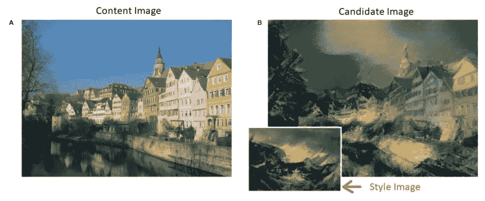
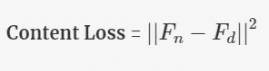
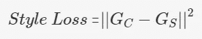
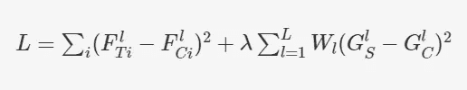

# 使用 CNN 的图像风格转换

> 原文：<https://medium.com/analytics-vidhya/style-transfer-of-images-using-cnn-e79472ee350b?source=collection_archive---------24----------------------->

丹尼·米勒在 [Unsplash](https://unsplash.com?utm_source=medium&utm_medium=referral) 上的照片

> 风格转移是转移学习的一个应用，在这里你将得到一个 ***【内容图像】*** 和一个 ***【风格图像】*** ，目的是将风格从风格图像转移到内容图像，对内容图像应用风格后生成的图像称为 ***【候选图像】。***

使用相同的内容图像和相同的风格图像可以生成许多可能的候选图像，任务是生成合适的候选图像。

候选图像应该类似于内容图像和样式图像的样式。

## 将内容和风格的概念转化为数学形式:

## 内容丢失:

在将内容图像馈送到能够很好地提取特征的预先训练的卷积神经网络(例如 VGGNet)之后，我们得到一个' ***内容特征向量'*** ，它是网络最后层中内容图像的表示。

同样，如果你输入一个候选图像，你会得到一个 ***【候选特征向量】*** ，这是一个候选图像的表示。

损失函数的***‘内容’***部分保证内容&候选图像对应的特征向量相同。

训练任务是学习候选图像，即，在训练期间，学习候选图像的各个像素值。您可以随机初始化候选图像，然后使用反向传播更新像素。

设内容特征向量为 Fn，前馈机制后候选特征向量为 Fd。为了使 Fd 接近 Fn，即，为了使候选图像的内容与内容图像的内容相同，Fd 和 Fn 的 L2 范数必须尽可能小。

## 风格损失:

一般来说，风格可以被认为是“图像的不同特征如何相互作用”。

换句话说，风格是图像不同特征之间的相关性。

在将一幅图像输入 CNN 后，我们得到了每一个卷积层后的特征图。让我们假设我们在卷积层之后得到 128×128×256 的特征图，这意味着卷积层从图像中提取了总共 256 个特征。

展平后，我们将得到一个大小为 16384 X 256 的特征向量，它可以表示为一个相同大小的矩阵。

如前所述，风格是不同特征之间的相关性，我们需要计算在每个卷积层获得的特征向量之间的相关性。

为了计算相关性，我们将每层的展平特征向量与其转置矩阵相乘。将一个特征向量与其自身的转置相乘后得到的矩阵称为***‘格拉姆矩阵’。***

gram 矩阵的每个元素表示图像中一个特征与其他特征之间的相关性。

g =[(fl)x[transpose(fl)])^2]

其中 G 是 Gram 矩阵，而 Fl 是层级别“l”处的展平特征向量，并且[Fl]表示矩阵。

由于我们得到不同层的特征向量，我们可以提取多个 gram 矩阵。

为了从风格图像中捕获风格，我们需要捕获候选图像和风格图像之间的相关性的相似性。设风格图像的克矩阵为 Gs，候选图像的克矩阵为 Gc。风格损失是两个格拉姆矩阵的 L2 范数。

让我们找出总损失函数，基于该函数来训练网络。

在哪里，

t 代表内容图像，

c 代表候选图像，

s 代表图像样式，

f 代表特征向量矩阵，

I 表示在层“l”的第“I”个特征向量，

g 代表克矩阵，

w 代表给予特定层的权重，

λ符号表示内容/风格损失的重要性。

在使用预训练网络进行风格转换的情况下，我们不改变网络的权重，因为预训练网络擅长从图像中提取用于计算内容和风格损失的特征。

因为目的是使用迁移学习进行风格迁移，所以我们不更新或改变网络的权重，而是训练候选图像，即，我们试图最小化对应于候选图像的总损失，这意味着反向传播机制基于候选图像的像素值。

> **参考:**
> 
> 本帖基于 Leon A Gatys 等人于 2015 年发表的一篇名为**“艺术风格的神经算法”**的论文。
> 
> 为了更好地理解[https://arxiv.org/abs/1508.06576](https://arxiv.org/abs/1508.06576)，我建议浏览一下原文