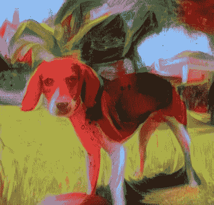

# 使用 Pytorch 进行风格转换

> 原文：<https://medium.com/analytics-vidhya/style-transfer-pytorch-84cf2e9ba86d?source=collection_archive---------15----------------------->

我重新创建了这篇论文的风格转换方法[“使用卷积神经网络的图像风格转换”](https://www.cv-foundation.org/openaccess/content_cvpr_2016/papers/Gatys_Image_Style_Transfer_CVPR_2016_paper.pdf)，作者 Gatys。在论文中，风格转换使用了 VGG19 网络中的特性，我使用 Pytorch 和 Keras 重新创建了它。我将用相同的实现写另一篇文章，但是使用 Keras。

我用我的狗 Roscón 作为这个实验的模型！他被奖励了 …