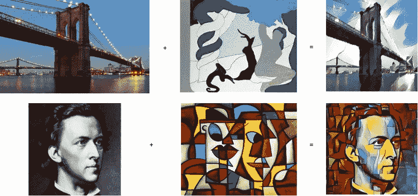
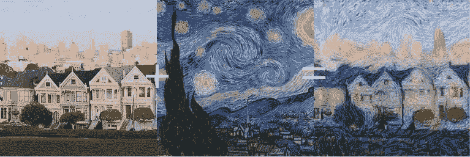
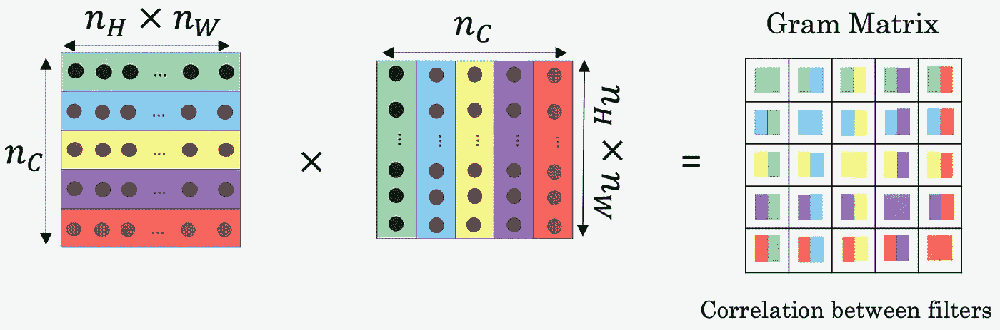
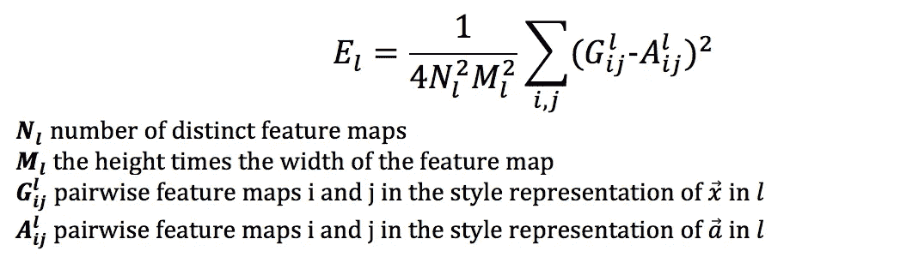
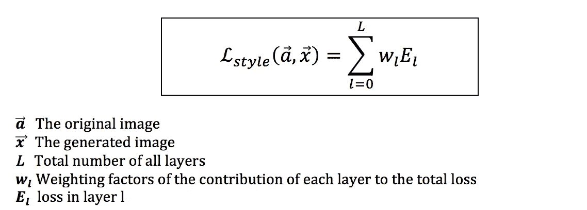
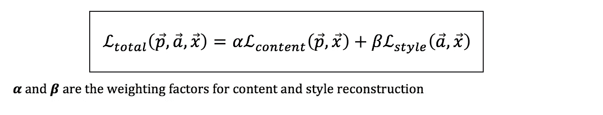
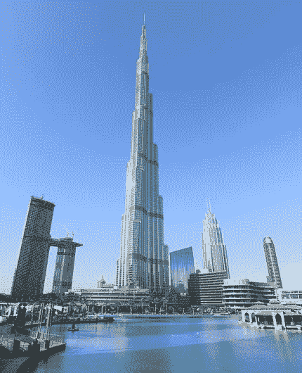
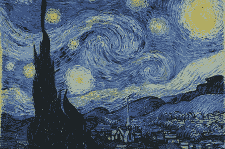
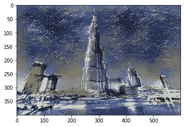

# 使用神经网络的风格转换

> 原文：<https://medium.com/analytics-vidhya/style-transfer-using-neural-nets-1b57d88ebb91?source=collection_archive---------14----------------------->

在众多实现人工智能的应用程序或通过应用人工智能解决的无数日常问题中，风格转换是人们曾经想到的最迷人和最具创新性的想法之一。像文森特·梵高、莱昂纳多·达·芬奇、巴勃罗·毕加索、米开朗基罗等传奇艺术家创作的杰作至今仍与我们同在。这些艺术家的作品从每个艺术家的角度描绘了日常生活、历史事件和宗教主题的艺术版本。这些传奇艺术家的作品是独一无二的&具有明确的绘画风格特征，如色彩、色调、笔触、纹理、形状、抽象程度等，这使得普通人很难复制他们的风格。现在想象一下将这种艺术风格应用到纽约的天际线图片、孟买海上车道的航拍照片或一张人物照片上。



最早的作品之一叫做[揭开神经风格转移的神秘面纱](https://arxiv.org/abs/1701.01036)成功地将风格从一幅图像转移到另一幅图像。给定两个图像，艺术图像&要进行风格化的图像，神经网络可以从艺术图像中检测风格&将其应用到另一个图像。

神经风格转移是如此具有开创性，以至于一群人在伦敦最负盛名的拍卖行之一以 50 万美元(43.2 万美元)的价格出售了一幅由 GAN(一种深度神经网络)制作的画作，从而赚了一大笔钱。

# 什么是神经风格转移？

神经风格转移算法通过操纵图像来采用另一个图像的风格和外观，从而生成图像的艺术版本。该算法应用处理 3 种不同图像的优化技术:

1.  内容图像。
2.  风格形象。
3.  生成的输出图像。



Content Image:我们希望从中提取内容并转换样式的输入图像，顾名思义，该图像具有基本内容，如建筑物或需要进行样式化的人物。

样式图像:DNN 从中捕获样式并将其应用于内容的图像。

生成的图像:输出图像是内容图像的样式版本。生成的图像是包含内容图像中的内容部分(建筑物/人)的输出，并从样式图像中获取样式。

> 与经典的深度学习任务不同，深度神经网络不是来回训练的，而是算法将优化应用于输出生成的图像，以看起来更像内容图像的艺术版本。DNN 的权重和偏差被冻结，同时减少了生成的输出图像与内容图像、生成的图像输出图像与风格图像之间的误差。

# 入门指南

如所讨论的，深度神经网络没有被训练来校正艺术输出图像。**卷积神经网络仅用于从两幅输入图像中提取内容特征&艺术风格(特征图)。**在 ImageNet 数据集上训练的 VGG19 等预先训练的先进网络用于此目的&网络权重/内核在整个过程中保持固定。


使用预训练网络背后的想法是，它的内核可以在网络的某个级别捕获内容特征和风格特征。卷积神经网络在输入图像向前传播时提取其特征，从较低层的简单原始特征开始，映射较深层的复杂图案和设计。如果你对*【CNN 如何工作】*背后的东西没有清晰的认识，可以随意去读一读《CNN 眼中的世界[。](/analytics-vidhya/the-world-through-the-eyes-of-cnn-5a52c034dbeb?source=friends_link&sk=ad1957a5e5286073a97864b397431078)

通过将内容图像和风格图像输入到预先训练的 VGG 网络，我们获得内容和风格图像的特征图。内容图像的输出特征图表示图像的实体(建筑物、汽车、人物等)&风格图像的输出特征图表示图像的艺术元素，如笔触、颜色混合、纹理、色调等。

**内容图像特征图是从网络的深层提取的，因为它们复制了复杂的模式、前景中的对象&背景或图像本身中的实体。**

**风格图像特征图是为网络的中级或低级获取的，它捕捉图像中的纹理&图案，在我们的情况下，将是笔触、颜色组合等。**

> 正如所讨论的，在神经类型转换中，卷积神经网络没有被训练。训练网络基本上是计算网络呈现的损失或误差&应用优化算法来调整网络权重和偏差，以便减少网络的误差。

输出图像用随机像素值或噪声初始化。在损失函数中将输出图像特征图与内容和风格特征图进行比较，以公式化损失/误差。

通过使用优化算法来修改输出图像的像素值，该优化算法在每次迭代中最小化输出图像像素的损失/误差。

简而言之，神经类型转移保持网络的权重和偏差固定，而不是通过在每次迭代中最小化损失或成本函数来迭代地修改输出图像。

> 注意:输出图像也通过网络传播，以获得其相应的目标/输出内容特征和目标/输出风格特征。
> 将这些目标/输出特征图与损失函数中的输入内容&风格特征图表示进行比较。

## 艺术输出是如何产生的？

损失函数由**内容损失**&**风格损失**项组成，这些项确定输出艺术图像在从其各自的内容&风格特征图中结合内容部分&风格元素方面有多远或有多错误。

如前所述，我们从网络的不同阶段获得了内容图像和风格图像的特征图。这些特征图有助于确定内容损失和风格损失。总损失是内容和风格损失的总和。

## 内容损失

**基于直觉，具有相似内容的图像在网络的更深层将具有相似的特征地图表示。**为此，我们通过 VGG19 网络&传播输出图像(最初带有随机噪声),在产生内容图像特征图的相同深度获得目标/输出图像特征图。


内容损失估计内容图像和输出目标图像的特征图之间的均方误差。

*   P^ *l* —原始图像的特征图。
*   F^ *l* —生成图像的特征图。
*   *l* —提取内容特征的图层**。**

如果内容图像和生成图像在更深的层具有相似的特征表示，则内容损失值将最小。

> 内容损失计算输出和内容输入图像特征图之间的逐像素差异。

## 风格丧失

样式损失类似于内容损失，只是在样式损失中估计误差的方式有所不同。计算风格损失的过程是:

*   与内容特征不同，风格(艺术)输入图像特征图是从 CNN 的所有层获得的。因此，输出图像的相应目标风格特征也从所有层获得。
*   我们获得了每一层的风格特征图的 gram 矩阵表示。

**什么是格拉姆矩阵表示法？**

该论文描述了风格信息被测量为风格特征图之间的相关量。Gram Matrix 恰恰做到了这一点。该过程计算层 *l.* 的特征图之间的相关性



为输入样式图像&输出图像的所有指定*样式层*计算特征图之间的相关性。

**计算风格损失**

风格损失被定义为生成图像和输入风格图像的特征图的 gram 矩阵表示之间的平方差。



A^ *l —* 输入风格图像的 gram 矩阵表示。

G^ *l —* 生成的图像在一层的克矩阵 *l.*

*N-* 特征图的数量或图层的过滤器数量 *l.*

特征地图的高度和宽度的 m-乘积。

**总风格损失是每个风格层误差的线性加权组合。**



E *l-* 图层样式错误 *l.*

w *l-* 对各层的重量贡献。这控制了特定层对损失的贡献程度。

## 全损



总损失是内容损失和风格损失的总和。**这个损失函数是如何描述神经风格转移的？**

生成图像的内容必须与内容图像的内容相似&生成图像的样式必须与样式图像的样式相似。*α*&*β*是用于控制最终生成的图像上的表现内容&风格表现的权重。

*   如果 *alpha > beta* 最终的图像将包含更多的内容特征&更少的风格。
*   如果α*α<β*最终图像将更具艺术性&将捕捉更少的内容。

**运行优化算法，如 SGD 或 Adam，以减少输出图像的总损失。**

在每次迭代中，优化算法在最小误差的方向上修改输出图像的像素值。

## 总结流程

1.  加载输入内容图像*c*样式图像 *s* 。
2.  加载一个预先训练好的网络，比如 VGG19。
3.  指定提取内容要素地图和样式要素地图的图层。
4.  获取内容图像*‘c’*特征图&样式图像*‘s’*特征图。
5.  获取风格特征的 Gram 矩阵表示。此外，指定每个图层的样式权重(常数值)。
6.  用随机像素值初始化输出/生成的图像。
7.  初始化优化器/优化算法，如 SGD/Adam/Adagrad，以最小化输出图像的误差 wrt。最后，将α和β初始化为一些常数值。
8.  通过 VGG19 网络传播输出图像，获得输出图像在内容层的特征图，即**目标内容特征图。**
9.  计算目标内容特征图与输入内容图像的特征图 *c* 之间的内容损失。
10.  获取输出图像在每个风格层的风格特征图，又名**目标风格特征图**。
11.  计算**目标样式特征图的 Gram 矩阵。**
12.  计算目标风格特征图和输入风格图像特征图的 Gram 矩阵之间的误差。
13.  对每个样式层重复此操作，以获得整体样式损失。
14.  计算总损失(内容损失+风格损失)。
15.  运行优化器/优化算法以减少输出图像的总损失/误差。
16.  重复步骤 8-15，直到总损耗达到最小值。

# 密码

下面实现神经风格转移的代码是用 PyTorch 编写的，这是一个流行的深度学习库。

1.  导入必要的模块

```
from PIL import Image
import matplotlib.pyplot as plt
import numpy as npimport torchimport torch.optim as optim
from torchvision import transforms, models
```

2.定义一个函数来加载输入图像(内容和样式)。使用 PIL 库打开图像，该库返回图像的 NumPy 表示。通过应用变换将图像转换为 torch 张量

```
def load_image(image_path,max_size=400,shape=None):
  image = Image.open(image_path).convert('RGB')
  if max(image.size) > max_size:
    size = max_size
  else:
    size = max(image.size)
  if shape is not None:
    size = shapein_transforms = transforms.Compose([transforms.Resize((size,int(1.5 * size))),transforms.ToTensor(),transforms.Normalize((0.485, 0.456, 0.406), (0.229, 0.224, 0.225))])image = in_transforms(image)[:3,:,:].unsqueeze(0)
  return image
```

3.创建一个方法将 torch 张量转换回 NumPy 表示，以便可以使用 Matplotlib 显示它。

```
def im_convert(tensor):
  image = tensor.to("cpu").clone().detach()
  image = image.numpy().squeeze()
  image = image.transpose(1, 2, 0)
  image = image * np.array((0.229, 0.224, 0.225)) + np.array(
    (0.485, 0.456, 0.406))
  image = image.clip(0, 1)

  return image
```

4.定义从网络/模型的指定图层提取要素地图的方法。将特征地图存储在特征地图字典中。这种方法适用于内容和风格的图像。

```
def get_features(image,model,layers=None):
  if layers is None:
    layers = {'0': 'conv1_1','5': 'conv2_1',
              '10': 'conv3_1',
              '19': 'conv4_1',
              '21': 'conv4_2',  ## content layer
              '28': 'conv5_1'}
  features = {}
  x = image

  for name,layer in enumerate(model.features):
    x = layer(x)
    if str(name) in layers:
      features[layers[str(name)]] = x

  return features
```

5.定义一种方法来计算所有风格特征图的 gram 矩阵表示。

```
def gram_matrix(tensor):
  _,n_filters, h, w = tensor.size()
  tensor = tensor.view(n_filters, h*w)
  gram = torch.mm(tensor,tensor.t())return gram
```

6.创建一个 VGG19 网络实例，并使用预先训练好的 ImageNet 权重对其进行初始化。禁用所有网络参数的梯度，因为不需要训练网络&权重保持固定。您可以从[这里](https://download.pytorch.org/models/vgg19-dcbb9e9d.pth)下载重量。

```
vgg = models.vgg19()
vgg.load_state_dict(torch.load('vgg19-dcbb9e9d.pth'))for param in vgg.parameters():
  param.requires_grad_(False)
```

7.用平均池替换最大池层，以获得更好的结果。原因是 max-pool 通过移除信息，而 average pooling 通过在对像素值求平均的过程中包含信息来保留丢失的信息。

```
for i,layer in enumerate(vgg.features):
  if isinstance(layer,torch.nn.MaxPool2d):
    vgg.features[i] =  torch.nn.AvgPool2d(kernel_size=2,stride=2,padding=0)
```

8.检查您的机器是否有 GPU，以便 PyTorch 可以利用 GPU 来提高处理速度。

```
device = torch.device("cuda" if torch.cuda.is_available() else "cpu")
vgg.to(device).eval()
```

9.加载输入内容和样式图像。

```
content = load_image('content image path').to(device)
style = load_image('style image path').to(device)
```

10.从它们各自的输入图像中获得相应的内容和风格特征图。

```
content_features = get_features(content,vgg)
style_features = get_features(style, vgg)
```

11.获取风格特征图的 gram 矩阵表示。

```
style_grams = {
layer : gram_matrix(style_features[layer]) for layer in style_features
}
```

12.创建具有随机值的输出图像张量，其大小与内容图像相同。

```
target = torch.rand_like(content).requires_grad_(True).to(device)
```

13.初始化从中提取样式要素地图的每个图层的样式权重值。

```
style_weights = {'conv1_1': 0.75,
                 'conv2_1': 0.5,
                 'conv3_1': 0.2,
                 'conv4_1': 0.2,
                 'conv5_1': 0.2}
```

14.创建 Adam optimizer 实例，以优化输出目标张量的误差 wrt。

```
optimizer = optim.Adam([target], lr=0.01)
```

15.为总损失函数指定 alpha(内容权重)和 beta(样式权重)值。

```
content_weight = 1e4
style_weight = 1e2
```

16.以指定的迭代次数运行样式传递循环。每次迭代计算内容损失和风格损失。应用 Adam 优化器来减少目标的总损失 wrt。

```
for i in range(2000):
  optimizer.zero_grad()
  target_features = get_features(target, vgg)

  content_loss = torch.mean((target_features['conv4_2'] - content_features['conv4_2'])**2)

  style_loss = 0
  for layer in style_weights:
    target_feature = target_features[layer] 
    target_gram = gram_matrix(target_feature)
    _,d,h,w = target_feature.shape
    style_gram = style_grams[layer]layer_style_loss = style_weights[layer] * torch.mean((target_gram - style_gram)**2)style_loss += layer_style_loss/(d*h*w)total_loss = content_weight*content_loss + style_weight*style_losstotal_loss.backward(retain_graph=True)optimizer.step()if i % 10 == 0:
    total_loss_rounded = round(total_loss.item(),2)content_fraction = round(content_weight*content_loss.item()/total_loss.item(),2)style_fraction = round(style_weight*style_loss.item()/total_loss.item(),2)print('Iteration {}, Total loss: {} - (content: {}, style {})'.format(
      i,total_loss_rounded, content_fraction, style_fraction))
```

17.将输出张量转换回 NumPy 数组以显示它&查看结果。

```
final_img = im_convert(target)
plt.imshow(final_img)
```

