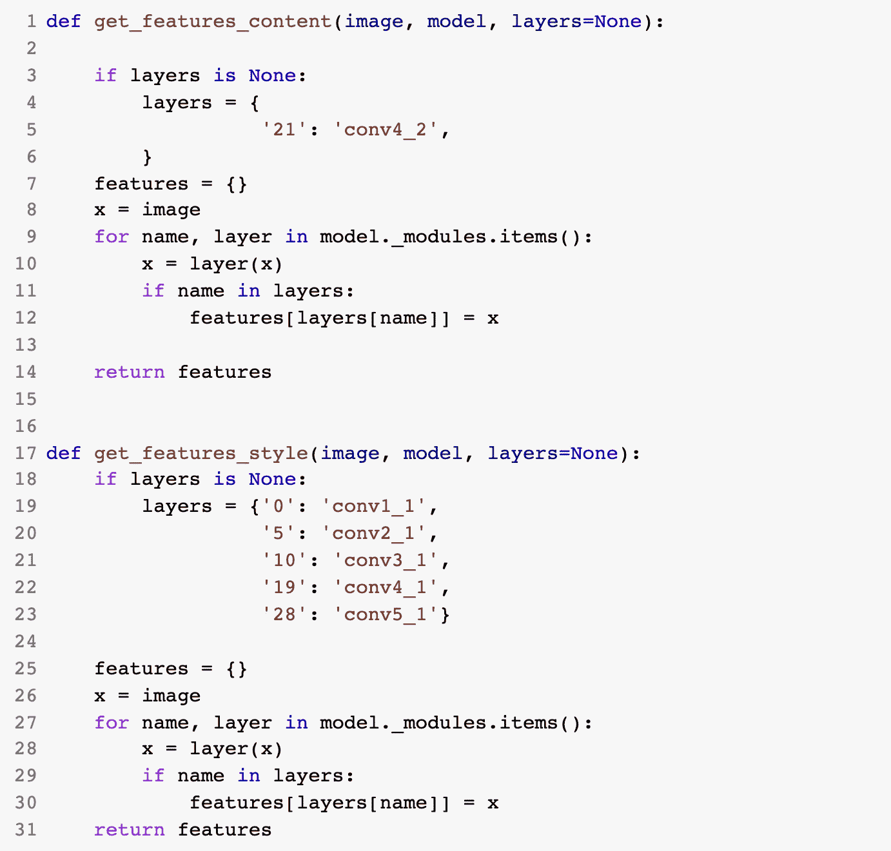

# 深度学习中的风格转移

> 原文：<https://medium.com/analytics-vidhya/styletransfer-3a74c2cb1202?source=collection_archive---------10----------------------->

## 用 Pytorch 实现

来源: [**风格转移与深度学习**](https://github.com/Nielspace/AI-From-Scratch/blob/master/Transfer%20Learning/02_Transfer_Learning_with_pytorch.ipynb)

我们大多数人都非常熟悉编辑软件，比如 Adobe Photoshop、Coral draw 等等。这些软件在编辑图片方面做得很好，特别是混合各种背景和一次呈现一幅图像。许多艰苦的工作都是为了制作这样的软件。

但是如果我们可以用深度学习做同样的事情呢？

问题的答案是肯定的！我们能做到。我们所需要的是一个**稳定的编码背景**，有点像对**线性代数**的中级和基本理解，以及一些**研究论文**，它们会帮助你达到你的目标。

我们将使用的深度学习技术被称为**迁移学习。**

## 这是什么？

迁移学习是一种机器学习技术，我们使用现有的训练模型来满足我们的需求。这就像借朋友的车来完成你的工作。

# 为什么？

因为种种原因:

1.  如果我们不能在大量的试验和错误之后为我们的特定需求产生一个好的模型。
2.  我们希望 a 开发一个快速模型，将满足我们的要求。
3.  如果我们特定需求的模型已经存在，我们需要做的就是获得所需的数据，并用这些数据训练模型。**我们不想再重新发明轮子**。

这种方法广泛用于:

1.  计算机视觉
2.  自然语言处理

> 我的工作是让这篇文章尽可能简单，让你能够理解。

# 获得研究论文

我们的第一个要求是找到一篇研究论文。现在，找到一篇研究论文是一件乏味的工作，我们必须非常耐心才能找到。确保您在搜索引擎中输入了准确的关键字，并浏览显示给您的结果。

arxiv.org 是你可以免费找到研究论文的最好的网站之一。一个好的经验法则是下载并收集一堆随机的 pdf 文件，然后浏览所有的文件。寻找对主题有透彻解释的论文。还有一个附带说明是在一张纸上记下要点，复制粘贴，甚至截屏保存你认为有价值的信息。

需要注意的一点是，研究论文总是会驱使你去搜索你第一次遇到的关键词。因此，一个建议是有一个分屏，这将有助于你轻松地浏览不同的窗口。

我将使用的研究论文将是使用卷积神经网络 **的 [**图像风格转换。**您可以点击链接为自己下载。它是开源的。](https://www.cv-foundation.org/openaccess/content_cvpr_2016/papers/Gatys_Image_Style_Transfer_CVPR_2016_paper.pdf)**

接下来读**摘要**然后是**结论。我知道这听起来很奇怪，但事实就是如此。你不会想把你的时间浪费在这篇论文上，因为它没有提供你所寻找的主题的具体细节或答案。**

一旦你完成了同样的浏览整篇论文，突出你遇到的值得注意的关键词和公式。

> 不要担心你无法处理的信息。一旦你开始写代码，你几乎会看到和观察到你略读时漏掉的小细节。

一旦完成，我们可以开始我们的编码。但在此之前，我们应该知道什么是深度学习的*风格迁移*。

# 深度学习中的风格转移

我在上面提到的论文中概述的风格转换方法。

我将尝试分解每一个步骤，以获得更直观的知识。我将向你展示如何将一篇论文分解成基本的组成部分。

> 我们的方法是修改 CNN 的架构。

## 那么什么是风格转移呢？

风格转移是一种通过采用其他图像的风格来修改图片的方法。我们已经在 photoshop、coral 等软件中使用了这种技术。

内容图片(左)；风格图像(中间)；目标图像(右)

这个项目背后的想法和灵感是使用神经网络从风格图像中捕捉一些次要细节，并将其部署在原始图像上。

为此，我们使用卷积神经网络。为什么？因为，CNN 包含多个层，每个层都像一个过滤器，允许我们提取最终结果或渲染所需的特征。

我将使用预先训练好的 VGG19 Net 从传入的图像中提取内容或样式特征。然后形式化内容和风格损失的概念，并使用它们迭代更新我们的目标图像，直到我们得到我们想要的结果。

# 让我们编码

重要的事情先来。确保您的环境已准备就绪。

我将使用 google colab 进行代码编辑——因为它给了我一个 GPU 选项，可以更快地渲染代码。

## 进口

我们将导入依赖项。由于我们将使用 pytorch 作为基本库，我们需要 pip 安装 torch 和 torchvision，然后将其导入到我们的笔记本中。

我们将从 torchvision.models 导入我们的 vgg19 CNN 模型。

VGG19 分为两部分:

*   vgg19.features —指所有卷积层和池层
*   vgg19 .分类器——线性层:**密集线性层**

我们将只使用特征，以便我们可以提取造型细节和**使我的方式来优化输出图像**。正因为如此，我们没有使用线性层。我们的想法是，我们将优化输出图像，这也导致我们冻结所有层的优化。

*注意:由于上述原因，我们不会优化任何参数。*

来源: [**利用卷积神经网络进行图像风格转移**](https://www.cv-foundation.org/openaccess/content_cvpr_2016/papers/Gatys_Image_Style_Transfer_CVPR_2016_paper.pdf)

上图告诉我们，内容图像，*a*——将被修改的图像——和样式图像，*p*——将用于样式化内容图像——将通过 CNN 传递，在我们的例子中是 VGG19。CNN 将从这些图像中过滤出模式，然后使用一个空图像来呈现它在处理这两个图像时找到的模式。

> 想象一下，一个画家在一张空白的画布上画出他眼前的风景作为参考，并添加了画笔的笔触和颜色。

## 制作助手功能

然后，我们将编写一个函数来加载图像。该函数将把像素值转换成张量，然后可以将该张量馈送到网络中，或者在馈送到网络中之前进行任何其他操作。

在制作一个函数时，我们必须记住所有的图像应该有相同的尺寸。

我们还应该注意到，我们必须对图像进行标准化。在将像素值输入网络或任何其他操作之前，在两个值的范围之间转换像素值。

接下来，我们将形象化。

我们也将创建一个函数来做这件事。现在，当我们使用 matplotlib 进行任何可视化时，我们必须记住它只对 numpy 数组有效。如果您的数据不是 numpy 数组，那么它将引发一个错误。

此外，如果图像的形状不是(宽度*高度*通道)，它将再次引发错误。为了达到要求的格式，我们可以使用转置函数。

## 抓住内容和风格特征

根据这篇论文，我们必须隔离某些层来表现内容和风格。

来源: [**利用卷积神经网络进行图像风格转移**](https://www.cv-foundation.org/openaccess/content_cvpr_2016/papers/Gatys_Image_Style_Transfer_CVPR_2016_paper.pdf)

内容表示将在“ *conv4_2* 上合成，而风格表示将在 *conv1_1、conv2_1、conv3_1、conv4_1* 和 *conv5_1 上合成。*

为了找到 CNN 模型中的所有层，我们可以使用 for 循环来遍历这些层，或者我们可以只打印 vgg19 存储的变量。

一旦我们得到了输出，我们就可以为内容和风格表现制作函数，为我们合成图像。

特征功能的工作是将图像传递到特别选择的 CNN 层，而保持其余部分不变。

## 格拉姆矩阵

Gram 矩阵或 gramian 矩阵是内积空间中的一组向量{ *v1，v2，v3，v4，vn* }，其项由 *Gij = < vi，VJ>给出。*

来源: [**利用卷积神经网络进行图像风格转移**](https://www.cv-foundation.org/openaccess/content_cvpr_2016/papers/Gatys_Image_Style_Transfer_CVPR_2016_paper.pdf)

这告诉我们它是一个 *v* 的方阵。即。我们可以计算出 *v*v.T*

gramian 的一个重要应用是计算线性无关性:一组向量线性无关当且仅当 Gram 行列式(Gram 矩阵的行列式)非零。换句话说，grammian 有助于发现 CNN 中不同滤波器之间的相关性。

> 获得风格损失的最佳方法是测量 gram 矩阵。

## 优化和权重

优化就是通过减少*误差*和增加*精度*来改进模型。阅读我最近写的文章 [**了解梯度下降**](/analytics-vidhya/understanding-gradient-descent-8dd88a4c60e6) 中优化的详细版本。

我们还为我们选择的每个风格层初始化了随机权重，这些权重将被运算到目标和特征图矩阵的均方误差中。

一旦我们完成了所有要求的编码，我们就可以进入最后一部分，即。使用 for 循环进行优化。

但是在我们把所有东西放入循环之前，我们必须初始化我们将使用的优化器，在我们的例子中，Adam 和我们将优化目标图像或空白画布。

来源: [**利用卷积神经网络进行图像风格转移**](https://www.cv-foundation.org/openaccess/content_cvpr_2016/papers/Gatys_Image_Style_Transfer_CVPR_2016_paper.pdf)

来源: [**利用卷积神经网络进行图像风格转移**](https://www.cv-foundation.org/openaccess/content_cvpr_2016/papers/Gatys_Image_Style_Transfer_CVPR_2016_paper.pdf)

来源: [**利用卷积神经网络进行图像风格转移**](https://www.cv-foundation.org/openaccess/content_cvpr_2016/papers/Gatys_Image_Style_Transfer_CVPR_2016_paper.pdf)

来源: [**利用卷积神经网络进行图像风格转移**](https://www.cv-foundation.org/openaccess/content_cvpr_2016/papers/Gatys_Image_Style_Transfer_CVPR_2016_paper.pdf)

一旦我们定义了所有内容，我们就可以开始 for 循环，并将所有损失计算放入其中，包括:

1.  内容损失
2.  风格丧失
3.  全损

> 我们将使用文中提到的 L2 范数或均方误差。

总损失将包含我们定义的α和β以及权重。这些 alpha 和 beta 是决定内容和样式图像混合以获得输出图像的权重因子。

下面是我制作的一些图片:

阿尔法=1，贝塔=1e3，纪元=1000

阿尔法=1，贝塔=1e6，纪元=1000

阿尔法=1，贝塔=1e10，纪元=2000

# 结论

本质上我们已经看到:

1.  我们如何阅读一篇论文，并记下重要而有价值的信息。
2.  理解概念和图表，特别是解释和绘制我们的过程。
3.  一步一步地执行函数以及精心编写的公式。
4.  使用 for 循环优化模型。
5.  最后，要有耐心。

# 读物

1.  [https://arxiv.org/abs/1703.07511](https://arxiv.org/abs/1703.07511)
2.  [使用卷积神经网络的图像风格转换](https://www.cv-foundation.org/openaccess/content_cvpr_2016/papers/Gatys_Image_Style_Transfer_CVPR_2016_paper.pdf)
3.  [https://arxiv.org/abs/1603.08155](https://arxiv.org/abs/1603.08155)
4.  用 GitHub 中的深度学习 检查我的代码 [**风格转移。**](https://github.com/Nielspace/AI-From-Scratch/blob/master/Transfer%20Learning/02_Transfer_Learning_with_pytorch.ipynb)