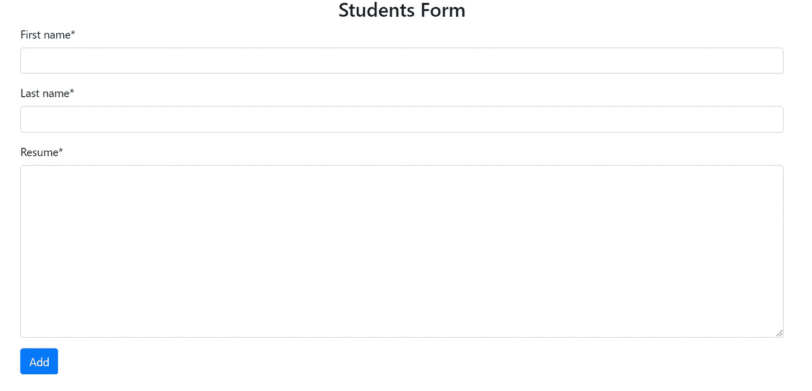

# 用脆的形式设计你的 Django 表单

> 原文：<https://medium.com/analytics-vidhya/styling-your-django-forms-with-crispy-forms-b4e12fec0758?source=collection_archive---------6----------------------->


在本文中，我们将看到如何用库 Crispy Forms 来设计我们的表单。

所以，我们走吧。

首先，让我们使用下面的命令安装 django 和 crispy 表单

```
pip install django==2.1.5
pip install django-crispy-forms
```

然后，让我们使用以下命令创建一个名为“my_project”的新项目:

```
django-admin startproject my_project .
```

既然项目已经创建，让我们使用命令创建一个新的应用程序:

```
python manage.py startapp student
```

在 settings.py 文件中，我们将在 INSTALLED_APPS 添加学生应用程序和 crispy 表单库

```
INSTALLED_APPS = [
 ‘django.contrib.admin’,
 ‘django.contrib.auth’,
 ‘django.contrib.contenttypes’,
 ‘django.contrib.sessions’,
 ‘django.contrib.messages’,
 ‘django.contrib.staticfiles’,
 ‘student’,
 ‘crispy_forms’
]
```

在 settings.py 文件的末尾，我们将添加下面一行，将引导程序定义为 crispy 表单的模板包。

```
CRISPY_TEMPLATE_PACK = ‘bootstrap4’
```

完成这些更改后，我们将使用以下命令执行项目的第一次迁移:

```
python manage.py migrate
```

执行第一次迁移后，让我们在 models.py 文件中创建 Student 类

```
from django.db import models# Create your models here.
class Student(models.Model):
    first_name = models.CharField(max_length=200)
    last_name  = models.CharField(max_length=200)
    resume     = models.TextField() def __str__(self):
        return self.first_name + ' ' + self.last_name
```

现在让我们来迁移学生应用程序。

```
python manage.py makemigrations student
python manage.py migrate
```

让我们在学生应用程序中创建一个名为 *forms.py* 的新文件，并编写表单:

```
from .models import Student
from django import formsclass StudentForm(forms.ModelForm):
    class Meta:
        model  = Student
        fields = ('first_name','last_name','resume')
```

现在表单已经准备好了，让我们编写视图:

```
from django.shortcuts import render
from .models import Student
from .forms import StudentForm
from django.http import HttpResponsedef add_student(request):
    form = StudentForm(request.POST or None)
    if form.is_valid():
        instance = form.save(commit=False)
        instance.save()
    return render(request,”student/student_form.html”,{‘form’:form})
```

在“我的项目”里面，在*的 urls.py* 文件*、*上我们会添加一个新的路径:

```
from django.contrib import admin
from django.urls import path
from student.views import add_studenturlpatterns = [
    path('admin/', admin.site.urls),
    path('add_student',add_student,name='add_student')
]
```

现在，让我们转到模板列表中的 *settings.py* 文件，我们将添加一个新目录，其中包含:

*os.path.join(BASE_DIR，' templates')*

```
TEMPLATES = [
    {
        'BACKEND':'django.template.backends.django.DjangoTemplates',
        'DIRS': [os.path.join(BASE_DIR,'templates')],
        'APP_DIRS': True,
        'OPTIONS': {
            'context_processors': [
                'django.template.context_processors.debug',
                'django.template.context_processors.request',
                'django.contrib.auth.context_processors.auth',
             'django.contrib.messages.context_processors.messages',
            ],
        },
    },
]
```

好了，让我们创建“templates”目录，我们将在项目的根目录下创建它，位置与 manage.py 文件相同。

然后，让我们创建一个名为“模板”的文件夹。
在“templates”文件夹中，我们将创建一个新文件夹“student ”,在“student”文件夹中，我们创建一个名为“student_form.html”的新文件

在文件“student_form.html”中，我们将导入 bootstrap 并创建一个带有 form 标签的 html 表单。

```
<!DOCTYPE html>
<html lang="en">
<head>
 <meta charset="UTF-8">
 <title>Add Student</title>
 <link rel="stylesheet" href="[https://stackpath.bootstrapcdn.com/bootstrap/4.4.1/css/bootstrap.min.css](https://stackpath.bootstrapcdn.com/bootstrap/4.4.1/css/bootstrap.min.css)" integrity="sha384-Vkoo8x4CGsO3+Hhxv8T/Q5PaXtkKtu6ug5TOeNV6gBiFeWPGFN9MuhOf23Q9Ifjh" crossorigin="anonymous">
</head>
<body><div class="container"><h3 class="text-center">Students Form</h3> 
<form action="" method="POST"> 
  {{ form.as_p }}
  <button class="btn btn-primary">Add</button>
 </form>
</div>
</body>
</html>
```

在下面的中，我们将用下面的代码行加载 crispy _ forms:

```

```

最后，我们将把“{{form.as_p}}”改为:

```
{{ form|crispy }}
```

最终文件将如下所示:

```
<!DOCTYPE html>

<html lang="en">
<head>
 <meta charset="UTF-8">
 <title>Add Student</title>
 <link rel="stylesheet" href="[https://stackpath.bootstrapcdn.com/bootstrap/4.4.1/css/bootstrap.min.css](https://stackpath.bootstrapcdn.com/bootstrap/4.4.1/css/bootstrap.min.css)" integrity="sha384-Vkoo8x4CGsO3+Hhxv8T/Q5PaXtkKtu6ug5TOeNV6gBiFeWPGFN9MuhOf23Q9Ifjh" crossorigin="anonymous">
</head>
<body>
 <div class="container">
  <h3 class="text-center">Students Form</h3>
  <form action="" method=""> 
   {{ form|crispy }}
   <button class="btn btn-primary">Add</button>
  </form>
 </div>

</body>
</html>
```

现在只要去[http://127 . 0 . 0 . 1:8000/](http://127.0.0.1:8000/)add _ student

还有……

形式是程式化的！

