# 用于探索性数据分析的 R 和 Python 之间的风格差异

> 原文：<https://medium.com/analytics-vidhya/stylistic-differences-between-r-and-python-for-exploratory-data-analysis-1c5195162b8a?source=collection_archive---------13----------------------->

## 数据科学文体学


在准备了我在 [**之前的博客**](/swlh/stylistic-differences-between-r-and-python-for-data-preparation-bfda6ebd15aa) 中解释的数据之后，个人可能会有他们想要测试的先验假设(ht)。在其他情况下，探索性数据分析(EDA)是在数据框架中寻找重要模式的驱动力。探索的方法可以是多方面的，并应导致可以描述关系和设置参数的视觉输入，以开发准确的统计模型。下图解释了基于视觉输出的数据浏览的目的。

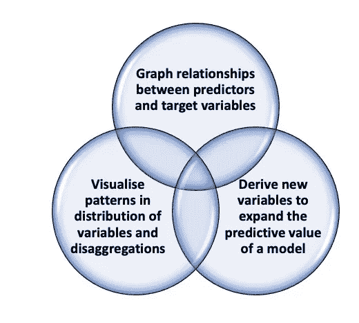

探索性数据分析的目的

以下步骤旨在提供一个初步的可视化解决方案范围，以解决这三个目标，并推进最合适的统计模型的开发。另一个目标是强调 Python 和 r 中语义的一些不同和相似之处。

# 1.重新创建可测试的数据框架

视觉输出的生成受益于创建多个分类变量以创建覆盖图。为了增加我们在 **Python、**中的数据帧的复杂性，添加了一个新的分类变量，即“Balance”，如下面的代码所示。

```
df = pd.DataFrame(np.random.randint(0,100,size=(100, 3)), columns= ('A','B','C'))Place = (['PlaceA','PlaceB','PlaceC'])
df["Place"] = np.random.choice(Place, size=len(df))Balance = (["Credit", "Debit","Zero"])
df["Balance"] = np.random.choice(Balance, size=len(df))df['index']=pd.Series(range(0,100))df['Geolocation']=df['Place']
dict_place={"Geolocation":{"PlaceA":"London", "PlaceB":"Delhi", "PlaceC":"Rome"}}
df.replace(dict_place, inplace=True)
df.head()
```

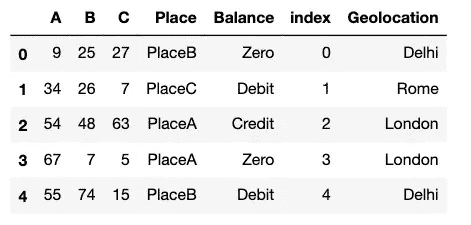

在 **R** 中，扩充数据帧的生成遵循类似的过程。最明显的区别是增加了随机分类变量，这需要指定概率分布，而不是另一个库中的自动函数。除此之外，代码的结构非常相似，在语义上几乎没有区别。

```
df <- data.frame(replicate(3,sample(0:100, 100, rep=TRUE)))
colnames(df) <- c("A","B","C")df$Place <- sample(c("PlaceA", "PlaceB","PlaceC"), size = nrow(df), prob = c(0.76, 0.14,0.1), replace = TRUE)
df$Balance <- sample(c("Credit", "Debit","Zero"), size = nrow(df), prob = c(0.70, 0.1,0.45), replace = TRUE)n<-dim(df)[1]
df$index<-c(1:n)dict_place<-revalue(x=df$Place, replace= c("PlaceA"="London", "PlaceB"="Delhi", "PlaceC"="Rome"))
df$Geolocation<-dict_place
head(df)
```

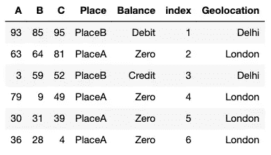

# 2.带有响应覆盖的条形图

一旦用两种语言创建了数据框架，下一步就是通过图形方式可视化关系。带有反应重叠的条形图可用于探索分类预测值和目标变量之间的关系。

为此，第一步是通过建立可修改的参数来控制每个图形的大小。在 Python 中，最成熟的库之一是`matplotlib.pyplot` ，后面还有`%matplotlib inline`，这是一个在 Jupyter 笔记本中添加图形的关键命令。该库允许输出遵循如下所示的图形大小。

```
import matplotlib.pyplot as plt
%matplotlib inlinefig_size = plt.rcParams["figure.figsize"]
fig_size[0] = 10
fig_size[1] = 5
plt.rcParams["figure.figsize"] = fig_size
```

在基于最佳值设置了一个数字大小之后，下一步将是可视化两个分类变量之间的关系。在这种情况下,“Place”和“Balance”将在输出中显示为一个简单的堆积条形图，显示分布在响应变量的三个属性中的频率计数。在 Pandas 逻辑中，`crosstab`函数后的第一个变量是预测值(x ),第二个变量是目标值(y)。

```
crosstab_01=pd.crosstab(df['Place'],df['Balance'])
crosstab_01.plot(kind='bar', stacked=True)
plt.legend(loc='center left', bbox_to_anchor=(1, 0.9))
```

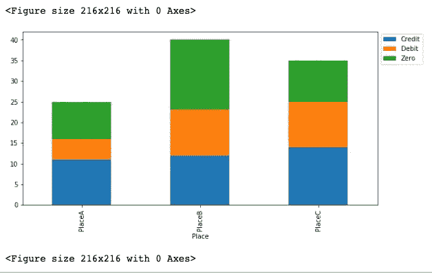

频率分布需要通过基于每个分类属性内的比例进行计数来归一化。`div`和`sum`命令的组合将把预测变量“Place”的每个属性中的值的分布视为独立的，它们的总和除以轴 0，这在 Python 中表示行，在这里由变量“Balance”举例说明。

```
crosstab_norm=crosstab_01.div(crosstab_01.sum(1),axis=0)
crosstab_norm.plot(kind='bar', stacked=True)
plt.legend(loc='center left', bbox_to_anchor=(1, 0.9))
```

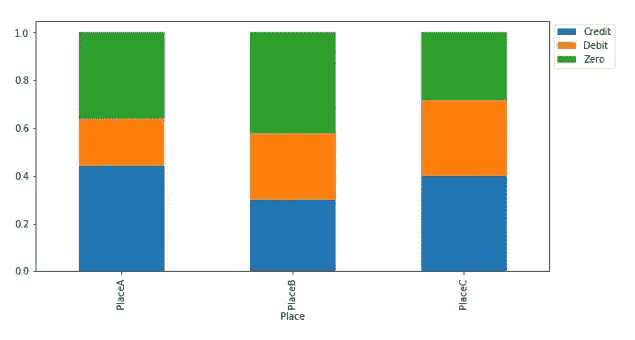

当设置绘图的尺寸时， **R** 允许通过简单调用(`set_plot_dimension`)和修改尺寸的数值参数，使用可应用于任何图形的功能。该函数结构允许控制`repr`包的行为，而不是直接调用它，并提供在括号内改变参数的灵活性。

```
set_plot_dimensions <- function(width_choice, height_choice) 
{options(repr.plot.width = width_choice, repr.plot.height = height_choice)}set_plot_dimensions(8,4)
```

一旦设置了绘图的大小， **R** 就可以用更简单的代码产生吸引人的视觉输出。上传`ggplot2`库后，要定义的参数是数据帧的名称和第一个实例中感兴趣的值(预测值)。第二步需要通过定义变量来描述函数`geom_bar` 中的目标变量，以表征美学映射(`aes`)。R 的另一个很酷的特性是通过使用`coord_flip`翻转图表的能力，以及生成吸引人的视觉输出的设计原则的内置自动化。

```
library(ggplot2)
ggplot(df, aes(Place))+geom_bar(aes(fill=Balance))+ coord_flip()
```

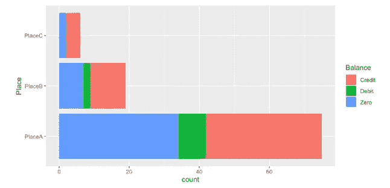

为了使分布标准化，增加了`geom_bar`中的填充规范，填充的位置将实现预测变量(位置)的每个分类属性内答案的比例分布。简单加法不需要进一步的说明，因为已经嵌入到应用于目标变量的函数中。

```
ggplot(df, aes(Place))+geom_bar(aes(fill=Balance), position='fill')+ coord_flip()
```

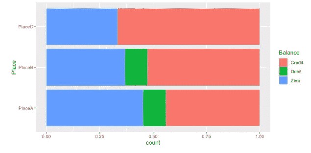

# 3.带响应覆盖的直方图

直方图是数字变量频率分布的图形表示。为了确定响应分布的模式，应用了将频率计数转换成比例的类似方法。在 Python 中，构建数值变量的分层频率图需要创建两个子集，对应于一个分类属性及其沿数值变量的分布。可视化数字分布的方式是，`bin`命令沿着分布划分多个部分，而`stacked`沿着一个条编译分解。

```
import numpy.np
import matplotlib.pyplot as pltdf_Debit= df[df.Balance=='Debit']['A']
df_Credit= df[df.Balance=='Credit']['A']
df_Zero= df[df.Balance=='Zero']['A'plt.hist([df_Debit,df_Credit,df_Zero], bins=10, stacked=True)
plt.legend(['Debit', "Credit",'Zero'])
plt.title('Histogram of variable A with response overlay')
plt.xlabel(''); plt.ylabel('Count'); plt.show()
```

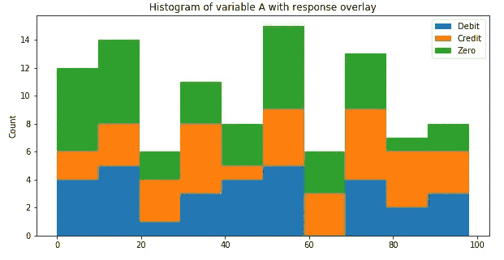

为了使分布正常化，如果保持仓间距，代码会变得复杂得多。初始的两列矩阵(其中列保存每个条的高度)需要通过将每行除以该行的总和来进行归一化。在为数据框中的每一列生成一个调整比例的标准化表格后，创建一个可视分布只需要比例表中的一个`plot`条。这种方法不需要定义仓之间的实际间距，因此更简单，并且会在图形中将每个仓视为一个单独的列。从这个例子来看， **Python** 似乎是通用的，因为它允许用户更多地动手定义对象之间的空间和边界，但也提供了快捷方式，尽管代价是减少了对美学的控制。

```
(n, bins, patches)=plt.hist([df_Debit,df_Credit,df_Zero], bins=10, stacked=True)n_table=np.column_stack((n[0],n[1],n[2]))
n_norm=n_table/n_table.sum(axis=1)[:,None]
n_norm = pd.DataFrame(n_norm, columns= ('Debit','Credit','Zero'))
n_norm.plot(kind='bar', stacked=True)plt.legend(['Debit','Credit','Zero'])
plt.title('Normalised histogram of variable A with response overlay')
plt.xlabel('Variable A'); plt.ylabel('Proportion'); plt.show()
```

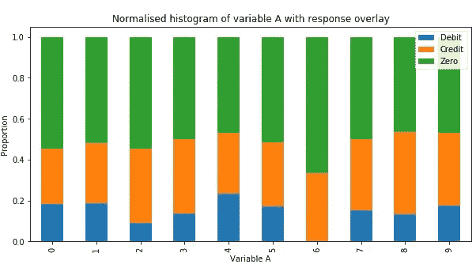

美观是 r 的核心特性，这简化了图形所需的代码量。在这种情况下，要产生频率计数，设置`geom_hist`函数中的参数就足以按分类属性进行分解。

```
ggplot(df,aes(A))+geom_histogram(aes(fill=Balance),color='black')
```

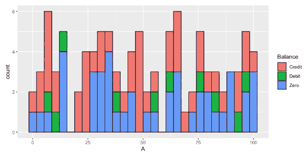

为了生成一个直方图来表示每个条柱内的比例分布，计算被嵌入到`geom_histogram`中。通过指定直方图在同一个填充变量中的位置，比例会自动计算并以可视形式呈现。

```
ggplot(df,aes(A))+geom_histogram(aes(fill=Balance), color='black', binwidth=10, position='fill')
```

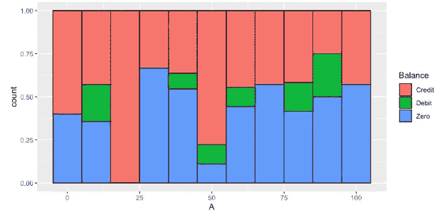

# 4.基于预测的宁滨

宁滨作为一种导出新分类变量的策略，是一种根据数值预测值的不同集合相对于响应变量的表现将值置于特定范围内的方法。特定仓内的循环分布指示与预测的潜在值的关系。这种分析有助于识别分类变量和数字变量之间较强或较弱的关联。

在 **Python** 中，第一步是根据新的宁滨标准绘制频率计数图，该标准也可以反映百分位数或分位数，并且可以在 bins 命令中设置为首选值。基于新的分界点，交叉表的 bar `plot`使输出能够堆叠各种分类属性的频率计数。

```
df['binning']=pd.cut(x=df['A'], bins=[0,30,60,100], labels=['Under 30', '30 to 60','Over 60'], right=False)crosstab_02=pd.crosstab(df['binning'],df['Balance'])
crosstab_02.plot(kind='bar', stacked=True, title='Bar graph of binned A variable with response overlay')
```

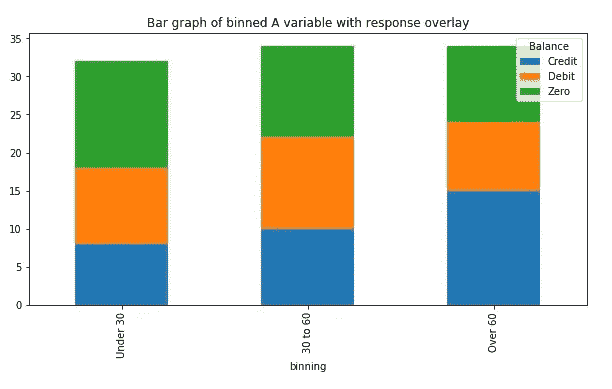

跨新条柱的值分布的标准化基于跨分类值的比例。这个计算可以通过引入一个`lambda`函数来实现，这个函数产生一个比例表，用 **Python** 来绘制。情节的其他特征(图例、标题……)如前定义。

```
table=pd.crosstab(df.binning, df.Balance).apply(lambda r: r/r.sum(), axis=1)table.plot(kind='bar',stacked=True)
plt.legend(['Debit','Credit','Zero'])
plt.title('Normalised histogram of variable A with response overlay')plt.xlabel('Variable A'); plt.ylabel('Proportion'); plt.show()
```

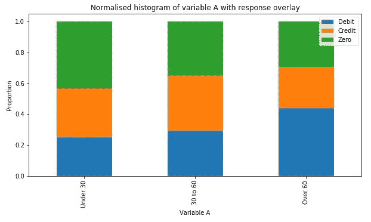

在 **R** 中，宁滨过程遵循类似的语言，函数 cut 生成分布中的间断。没有指定填充位置的 ggplot 中的视觉输出显示了频率计数。

```
df$binning<-cut(x=df$A, breaks=c(0,30,60,101), right=FALSE, 
                   labels= c("Under 30","30 to 60", "Over 60"))ggplot(df, aes(binning))+geom_bar(aes(fill=Balance))+ coord_flip()
```

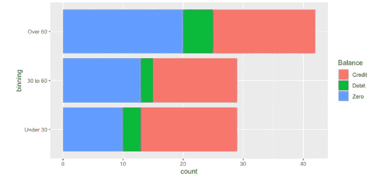

通过指定`fill`和`stat="count"`的位置，视觉输出提供了每个分类属性中的比例。这个比例的计算是通过使用 stat 自动完成的，它使条形的高度与每组中的病例数成比例。

```
ggplot(df,aes(binning))+ geom_histogram(aes(fill=Balance), color='black', stat="count", position='fill')
```

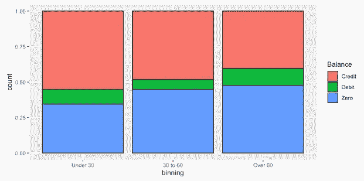

# 在此步骤之后，建议的数据科学方法的下一阶段是建立计算模型。这将在下一篇博客中解释