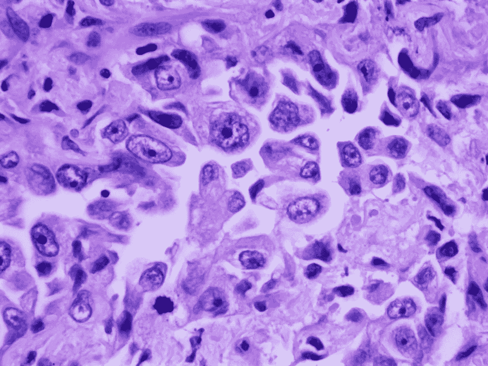
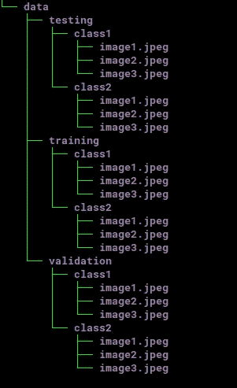
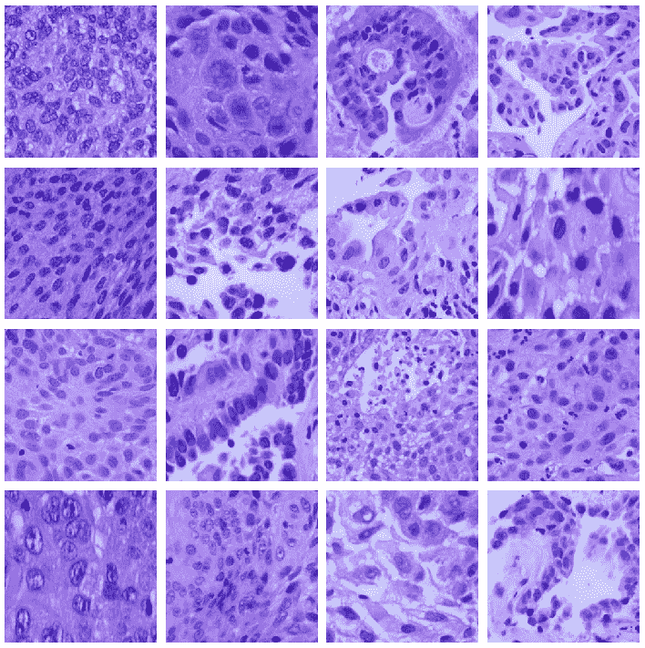
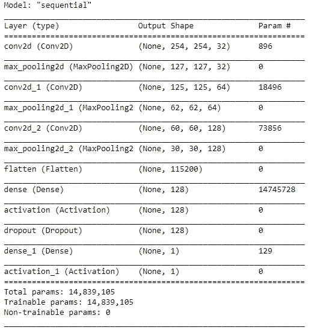
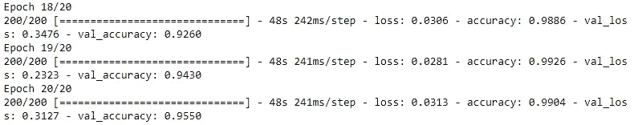
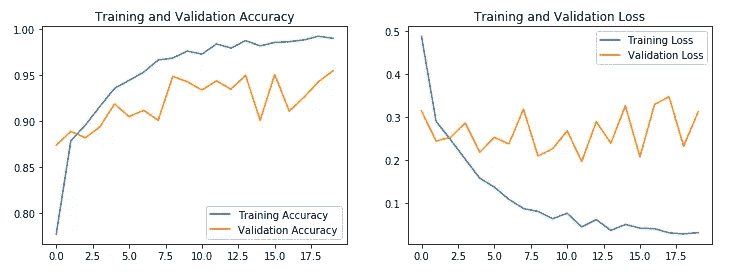
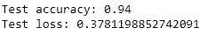

# 用张量流 2 和 Keras 对肺癌进行亚分类

> 原文：<https://medium.com/analytics-vidhya/sub-classifying-lung-cancer-with-tensorflow-2-and-keras-616353e59e5e?source=collection_archive---------5----------------------->

肺腺癌

肺癌仍然是一个重大的卫生保健挑战。它是全球男性癌症死亡的主要原因，也是女性癌症死亡的第二大原因。非小细胞肺癌占所有肺癌病例的 85 %。

由于最近先进的靶向治疗的可用性，不仅必须检测非小细胞肺癌，而且必须将非小细胞肺癌适当地细分为两个主要的亚型:鳞状细胞癌和腺癌，这有时甚至对于有经验的病理学家来说也是具有挑战性的。

在这篇文章中，我详细介绍了我如何使用 TensorFlow 2 和 Keras 训练和测试机器学习(ML)模型，以将非小细胞肺癌图像细分为**鳞状细胞癌**和**腺癌**。2020 年，谷歌发布了全面集成 Keras API 的 TensorFlow 2 深度学习库，比以往任何时候都更容易使用。如果你是卷积神经网络的新手，你可以在[媒体](https://towardsdatascience.com/a-comprehensive-guide-to-convolutional-neural-networks-the-eli5-way-3bd2b1164a53)上找到全面的指南，在[维基百科](https://en.wikipedia.org/wiki/Convolutional_neural_network)上找到深入的描述。

本教程的部分内容:

1.选择 Google Colab 或本地计算机

2.准备培训、验证和测试数据目录

3.导入库

4.指定定型、验证和测试数据集目录的路径

5.归一化图像并生成用于训练、验证和测试的批量张量图像数据

6.可视化训练图像的样本(可选)

7.构建卷积网络模型

8.编译和训练模型

9.评估模型

10.在测试数据集上评估训练模型的性能

我们开始吧！

1.Google Colab 或本地计算机。

一台配有强大的 NVIDIA GPU 的计算机最适合这个项目。在这个 [YouTube 视频](https://www.youtube.com/watch?v=qrkEYf-YDyI&t=311s)中提供了关于如何在 GPU 支持下设置 TensorFlow 2 的出色说明。

如果你没有强大的 NVIDIA GPU，那么使用谷歌 Colab 是一个很好的选择。就像在云端使用 Jupyter 笔记本一样。谷歌 Colab 为用户提供了 12 小时的免费计算时间，并可以访问 GPU 甚至 TPU。关于如何使用 Google Colab 的很好的指导可以在这个[中的帖子](https://towardsdatascience.com/getting-started-with-google-colab-f2fff97f594c)中找到。

2.准备培训、验证和测试目录。

对于这个项目，我使用了一个图像数据集，其中包含来自 [LC25000 数据集](/@tampapath/new-freely-available-lung-and-colon-cancer-image-dataset-for-ml-researchers-94756581ed81)的 5000 幅肺鳞癌彩色图像和 5000 幅肺腺癌彩色图像，ML 研究人员可以免费获得。如果你要使用 Google Colab，你需要上传图片到你的 Google Drive。

因为我使用 ImageDataGenerator 类中的 Keras flow_from_directory 方法为我们的模型生成批量张量图像数据，所以我需要将数据集组织到下面列出的特定目录结构中。这是必要的一步。否则，程序无法运行。

所需的目录结构

我的原始数据集文件夹包含两个子文件夹，包含两类图像(肺鳞癌类和肺腺癌类)。我使用一个[分割文件夹 python 包](https://pypi.org/project/split-folders/)将我的原始数据集文件夹分成训练、验证和测试数据集文件夹，每个文件夹中有相同的两个类。我将 80%的图像用于训练数据集，10%用于验证数据集，10%用于测试数据集。关于训练、验证和测试数据集之间的差异的一个很好的解释可以在[这里](https://machinelearningmastery.com/difference-test-validation-datasets/)找到。总的来说，我使用训练数据集来训练模型(找到最佳权重)，我使用验证数据集来微调模型(指定隐藏层、时期、丢弃层等的数量)。)，我使用测试数据集来评估完全训练的模型的性能。

3.导入库。

4.指定定型、验证和测试数据集目录的路径

我用我的本地电脑做这个项目。如果你打算使用 Google Colab，你需要先安装你的 Google Drive。

5.归一化图像并生成用于训练、验证和测试的批量张量图像数据

6.可视化训练图像的样本(可选)

输出应该如下所示:

肺鳞癌和腺癌样本训练图像

7.构建卷积网络模型

一个关于如何设计卷积神经网络的很棒的教学视频可以在这里找到。我用三组用于特征提取的卷积/池层和两个用于分类的密集层构建了我的模型。我添加了一个单一的辍学层(20%的辍学率)，以防止模型过度拟合。我对卷积层使用 3x3 内核(过滤器)大小，对池层使用 max-pooling，对深层使用 relu 激活函数，对输出层使用 sigmoid 激活函数。

模型摘要:

我们的模型摘要

如你所见，这个模型有将近 1500 万个可训练参数。

8.编译和训练模型

由于我是做二元分类的，所以用了 binary_crossentropy 作为损失函数。我用亚当作为优化器。“亚当优化算法简介”可以在[这里](https://machinelearningmastery.com/adam-optimization-algorithm-for-deep-learning/)找到。每个时期的步骤数来自图像数除以批量大小。例如，我在训练数据集中有 8000 个图像，并将 ImageDataGenerator 训练批次大小设置为 40 个图像。8000 除以 40 得出每个时期 200 步。

9.评估模型

20 个时期后，该模型显示训练精度为 0.99，验证精度为 0.95。

过去三个时代

绘制精度和损失的代码:

输出如下所示:

训练和验证准确性和损失图

10.在测试数据集上评估训练模型的性能

测试数据集上模型性能的结果

总之，经过训练的模型能够以 94 %的准确度将以前未见过的(测试数据集)非小细胞肺癌图像分类为鳞状细胞癌和腺癌。

你可以在我的 [GitHub 库](https://github.com/tampapath/tf2_cnn_tutorial)上找到 Jupyter 笔记本文件，里面有本教程的全部代码。我希望你会发现这个教程是有帮助的，我祝你在机器学习的努力中好运。