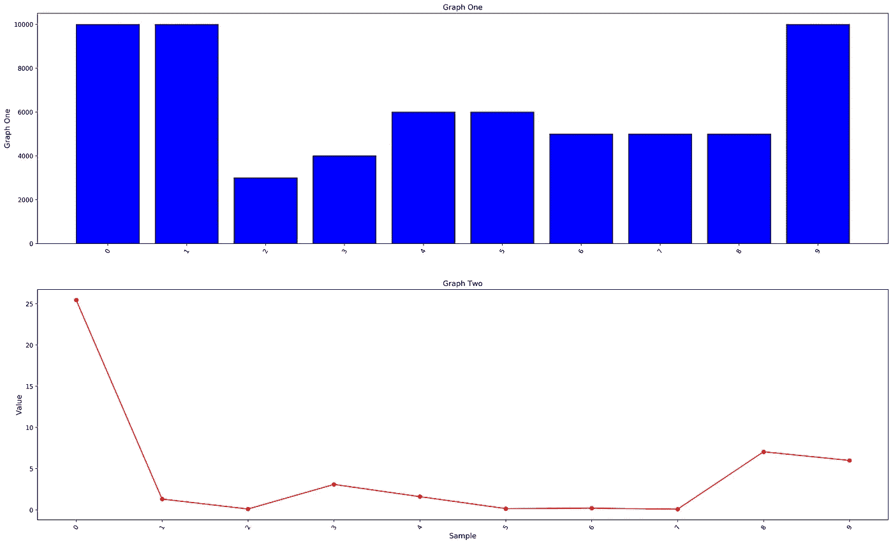
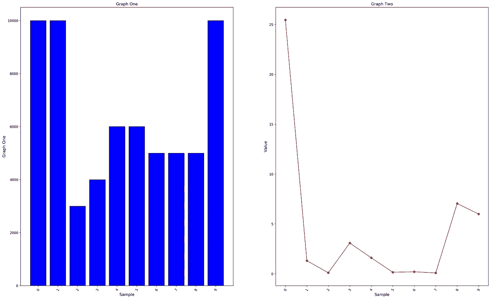
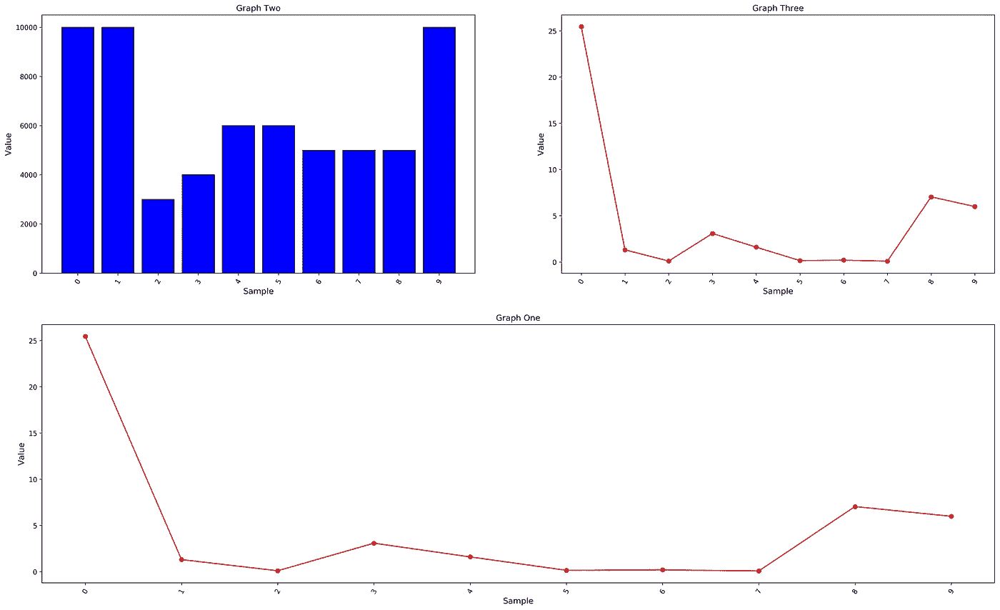
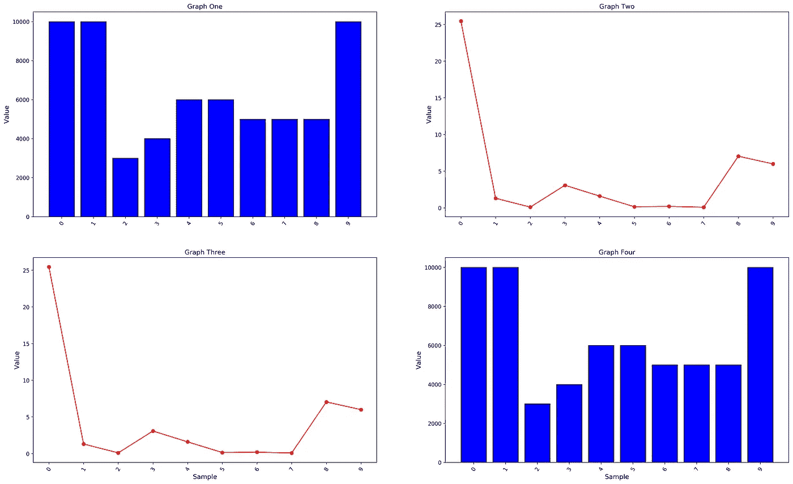

# Python 中带 Matplotlib 的子情节

> 原文：<https://medium.com/analytics-vidhya/subplots-in-python-with-mathplotlib-8614fbae8152?source=collection_archive---------16----------------------->

在本文中，我们将重点关注 python 中 matplotlib 库的子情节的图形化表示。

# 数据集准备

包含整数和浮点数的三个列表被初始化为图形的数据集。第一个列表表示 x 轴刻度，而第二个和第三个列表用作子图中的数据点。

```
x_ticks   = [1,2,3,4,5,6,7,8,9,10]
graph_one = [10000,10000,3000,4000,6000,6000,5000,5000,5000,10000]
graph_two = [25.45,1.31,0.1,3.08,1.6,0.15,0.2,0.08,7.04,5.99]
```

# 两个水平图形

首先，我们说明了在一张图中横向绘制两个不同图形的步骤。

***设置图形的高度***

下面两条语句设置了各自图形的高度。

```
heights_graph_one = [x for x, _ in enumerate(x_ticks)]
heights_graph_two = [x for x, _ in enumerate(graph_one)]
```

***绘制图表***

1.  绘制两个水平图形。

```
import numpy as np
import matplotlib.pyplot as pltx_ticks   = [1,2,3,4,5,6,7,8,9,10]
graph_one = [10000,10000,3000,4000,6000,6000,5000,5000,5000,10000]
graph_two = [25.45,1.31,0.1,3.08,1.6,0.15,0.2,0.08,7.04,5.99]

fig = plt.figure(figsize=(25, 15))
heights_graph_one = [x for x, _ in enumerate(x_ticks)]
heights_graph_two = [x for x, _ in enumerate(graph_one)]

# -----------------------------------------------------------------
plt.subplot(211)
plt.bar(heights_graph_one, graph_one, color='blue', edgecolor='black')
plt.xticks(np.arange(0, len(graph_one), 1), rotation="60")
plt.ylabel("Graph One", fontsize=12)
plt.title("Graph One", fontsize=12)

# ------------------------------------------------------------------
plt.subplot(212)
plt.plot(heights_graph_two, graph_two, marker='o', color='red')
plt.xticks(np.arange(0, len(graph_two), 1), rotation="60")
plt.xlabel("Sample", fontsize=12)
plt.ylabel("Value", fontsize=12)
plt.title("Graph Two", fontsize=12)

plt.show()
```



图 1 .水平曲线图

2.绘制两个垂直图形。

你只需要改变两条语句就可以垂直排列图形。

```
plt.subplot(121) # previously plt.subplot(211)
plt.subplot(122) # previously plt.subplot(212)
```



图 2 .垂直曲线图

3.绘制三幅图

一次绘图三图排列法。

```
# ------------------------------------------------------------------
plt.subplot(212)
plt.plot(heights_graph_two, graph_two, marker='o', color='red')
plt.xticks(np.arange(0, len(graph_two), 1), rotation="60")
plt.xlabel("Sample", fontsize=12)
plt.ylabel("Value", fontsize=12)
plt.title("Graph One", fontsize=12)

# ------------------------------------------------------------------
plt.subplot(221)
plt.bar(heights_graph_one, graph_one, color='blue', edgecolor='black')
plt.xticks(np.arange(0, len(graph_one), 1), rotation="60")
plt.xlabel("Sample", fontsize=12)
plt.ylabel("Value", fontsize=12)
plt.title("Graph Two", fontsize=12)

# ------------------------------------------------------------------
plt.subplot(222)
plt.plot(heights_graph_two, graph_two, marker='o', color='red')
plt.xticks(np.arange(0, len(graph_two), 1), rotation="60")
plt.xlabel("Sample", fontsize=12)
plt.ylabel("Value", fontsize=12)
plt.title("Graph Three", fontsize=12)
```



图 3 .绘制三个图表

4.绘制四张图

```
# ------------------------------------------------------------------
plt.subplot(221)
plt.bar(heights_graph_one, graph_one,  color='blue', edgecolor='black')
plt.xticks(np.arange(0, len(graph_one), 1), rotation="60")
plt.ylabel("Value", fontsize=12)
plt.title("Graph One", fontsize=12)

# ------------------------------------------------------------------
plt.subplot(222)
plt.plot(heights_graph_two, graph_two, marker='o', color='red')
plt.xticks(np.arange(0, len(graph_two), 1), rotation="60")
plt.ylabel("Value", fontsize=12)
plt.title("Graph Two", fontsize=12)

# ------------------------------------------------------------------
plt.subplot(223)
plt.plot(heights_graph_two, graph_two, marker='o', color='red')
plt.xticks(np.arange(0, len(graph_two), 1), rotation="60")
plt.xlabel("Sample", fontsize=12)
plt.ylabel("Value", fontsize=12)
plt.title("Graph Three", fontsize=12)

# ------------------------------------------------------------------
plt.subplot(224)
plt.bar(heights_graph_one, graph_one,  color='blue', edgecolor='black')
plt.xticks(np.arange(0, len(graph_one), 1), rotation="60")
plt.xlabel("Sample", fontsize=12)
plt.ylabel("Value", fontsize=12)
plt.title("Graph Four", fontsize=12)
```



图 4 .四张图表

这个简单的例子展示了在 python 中使用 mathplotlib 绘制子图的方法。

祝您愉快！！