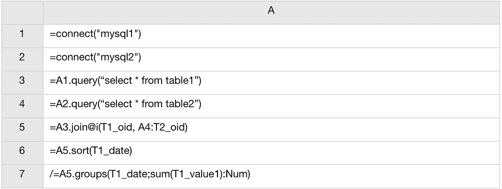

# 来自 BIRT 不同数据源的子查询

> 原文：<https://medium.com/analytics-vidhya/subquery-from-the-different-data-source-in-birt-b2192f8167a4?source=collection_archive---------12----------------------->

要求有一个类似如下的查询:

```
SELECT  *  FROM table1 WHERE oid in  (  SELECT  *  FROM  table2  WHERE condition )
```

表 1 和表 2 在不同的数据库上。使用 Eclipse Birt 环境可以做什么？

有三种传统的方法来解决这个问题。
1)。使用类似数据库链接的东西— Oracle 数据库链接。通过这种方式，您可以将问题转移到数据库级别。

2).根据实际问题,“从表 2 中选择 where 条件”结果的长度，您可以使用 BIRT 数据立方体或

3).使用两个数据集和一个布局结构列表，如下所示:
两个数据集需要不同的数据源。

*   带有查询“从表 2 中选择 where 条件”的数据集“T2_oids”。
*   带有单个参数 param_oid 和查询“select * from table1 where oid =？”的数据集“T1_object”。

布局结构:*外部列表项“T2_oids”绑定到数据集“T2 _ OIDs”*内部表项或列表项“T1_object”绑定到数据集“T1_object”，参数绑定到行[“oid”](或行[“OID”]，使用列表框)。此项目必须放在 T2_oids 细节部分。由于 T1_object 将返回一行，您甚至可以使用 GridItem 来代替 TableItem 或 ListItem。

但是，如果您必须执行更多的计算操作，例如，按列“date”对数据进行排序，因为它们是按原始条件的关键字排序的，即使在 birt 输出表上设置排序过滤器也不能解决问题。有一种方法可以解决这个排序问题(通过将外部结果写入 POJO(例如 ArrayList)，然后使用脚本化数据集最终对结果进行排序)。但是这太复杂了。

4).将 esProc 与 BIRT 一起使用。

这是 SPL 的剧本。



你的 BIRT 报告可以有一个来自两个数据源的查询，不管是什么样的数据库，并进行其他在 BIRT 不方便的计算。有关 SPL 与 BIRT 整合的详细信息，请参见[如何在 BIRT 调用 SPL 脚本](http://c.raqsoft.com/article/1544410181816)。