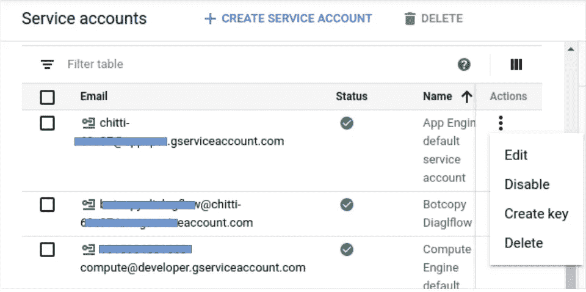

# 与 Spring Boot·GCP 一起订阅谷歌发布主题

> 原文：<https://medium.com/analytics-vidhya/subscribing-to-google-pubsub-topics-with-spring-boot-gcp-98fb4573bf4a?source=collection_archive---------8----------------------->


这是我上一篇文章[从 Dialogflow](/tech-sauce/retrieving-conversation-history-from-dialogflow-bf3d41320420) 中检索对话历史的延续。在那里，我们将 Dialogflow 日志导出到 [Google Stackdriver](https://cloud.google.com/logging) ，然后将它们路由到 [Google PubSub](https://cloud.google.com/pubsub/docs/overview) 主题。我们还在本地机器上安装了 [Google Cloud SDK](https://cloud.google.com/sdk) ，并使用 **gcloud** 命令订阅了主题。在本文中，我们将实现一个 Spring Boot 应用程序，它可以订阅我们的 PubSub 主题。

## 从 Spring Boot 开始

由于这不是一个 Spring Boot 教程，我将不会解释如何设置您的 Spring Boot 应用程序。参见[https://spring.io/guides/gs/spring-boot/](https://spring.io/guides/gs/spring-boot/)开始使用。我更愿意选择使用 [Spring 初始化器](https://start.spring.io/)来建立一个 Spring Boot 应用程序。

这将是我的 **pom.xml**

```
<?xml version="1.0" encoding="UTF-8"?>
<project  xmlns:xsi="http://www.w3.org/2001/XMLSchema-instance"
   xsi:schemaLocation="http://maven.apache.org/POM/4.0.0 https://maven.apache.org/xsd/maven-4.0.0.xsd">
   <modelVersion>4.0.0</modelVersion>
   <parent>
      <groupId>org.springframework.boot</groupId>
      <artifactId>spring-boot-starter-parent</artifactId>
      <version>2.2.6.RELEASE</version>
      <relativePath/> <!-- lookup parent from repository -->
   </parent>
   <groupId>com.dialog</groupId>
   <artifactId>chatboard</artifactId>
   <version>0.0.1-SNAPSHOT</version>
   <name>chatboard</name>
   <description>PubSub subscriber and Dashboard backend</description>
   <properties>
      <java.version>1.8</java.version>
      <spring-cloud.version>Hoxton.SR3</spring-cloud.version>
      <elasticsearch.version>7.3.0</elasticsearch.version>
   </properties>
   <dependencies>
      <dependency>
         <groupId>org.springframework.boot</groupId>
         <artifactId>spring-boot-starter-web</artifactId>
      </dependency>
      <dependency>
         <groupId>org.springframework.cloud</groupId>
         <artifactId>spring-cloud-gcp-starter</artifactId>
      </dependency>
      <dependency>
         <groupId>org.springframework.cloud</groupId>
         <artifactId>spring-cloud-gcp-starter-pubsub</artifactId>
      </dependency>
      <dependency>
         <groupId>org.springframework.integration</groupId>
         <artifactId>spring-integration-core</artifactId>
      </dependency>
      <dependency>
         <groupId>org.springframework.boot</groupId>
         <artifactId>spring-boot-starter-test</artifactId>
         <scope>test</scope>
         <exclusions>
            <exclusion>
               <groupId>org.junit.vintage</groupId>
               <artifactId>junit-vintage-engine</artifactId>
            </exclusion>
         </exclusions>
      </dependency>
   </dependencies>
   <dependencyManagement>
      <dependencies>
         <dependency>
            <groupId>org.springframework.cloud</groupId>
            <artifactId>spring-cloud-dependencies</artifactId>
            <version>${spring-cloud.version}</version>
            <type>pom</type>
            <scope>import</scope>
         </dependency>
      </dependencies>
   </dependencyManagement>
   <build>
      <plugins>
         <plugin>
            <groupId>org.springframework.boot</groupId>
            <artifactId>spring-boot-maven-plugin</artifactId>
         </plugin>
      </plugins>
   </build>
</project>
```

## 春云 GCP

[Spring Cloud GCP](https://spring.io/projects/spring-cloud-gcp) 提供了广泛的库集合，使得从 Spring 框架应用程序中使用 Google 云平台变得更加容易。我们将使用 Spring Cloud GCP 发布/订阅支持(Spring Integration 和 Spring Cloud Stream Binder)。查看本文件了解详细信息。

## Google 云服务帐户凭据

还记得我们的 Stackdriver 日志和来自[上一篇文章](/tech-sauce/retrieving-conversation-history-from-dialogflow-bf3d41320420)的 PubSub 主题吗？所有这些都存在于谷歌云项目中，我的项目是 **CHITTI** 。每个项目可以有几个服务帐户，我们需要相关的[服务帐户](https://cloud.google.com/iam/docs/service-accounts)的凭证作为 json 文件，以便从我们的 Spring Boot 应用程序与项目通信。

从谷歌云控制台的侧边菜单中，选择`IAM & Admin -> Service Accounts`。


点击名为“App Engine 默认服务帐户”的服务帐户旁边的⋮，然后选择`Create key`。



在下一个窗口中，选择 **JSON** 作为**键类型**，点击`CREATE`。一个 Json 文件将被下载到您的计算机上。将文件复制到您喜欢的文件夹中。


## 订阅谷歌发布主题

在您的 Spring Boot 应用程序中，在 **resources** 文件夹中创建一个 **application.properties** 文件，然后添加以下内容。将 ***项目 Id*** 替换为您的 Google Cloud 项目 Id，将***json 文件路径*** 替换为您刚刚下载的 Json 文件的路径。

```
spring.cloud.gcp.project-id=***project-Id***
spring.cloud.gcp.credentials.location=file:***path-to-json-file***
```

创建一个**配置**文件，并添加以下代码。将 ***订阅名称*** 替换为您在我们的[上一篇文章](/tech-sauce/retrieving-conversation-history-from-dialogflow-bf3d41320420)中为您的订阅提供的名称。

```
@Bean
public MessageChannel pubsubInputChannel() {
    return new DirectChannel();
}

@Bean
public PubSubInboundChannelAdapter messageChannelAdapter(
        @Qualifier("pubsubInputChannel") MessageChannel inputChannel,
        PubSubTemplate pubSubTemplate) {
    PubSubInboundChannelAdapter adapter =
            new PubSubInboundChannelAdapter(pubSubTemplate, "***subscription-name***");
    adapter.setOutputChannel(inputChannel);

    return adapter;
}
```

在主类中，添加下面的。这里 **DemoApplication** 是我的主类。这将把从 PubSub 收到的消息记录到您的控制台。实际上，这些消息是来自你的 Dialogflow 聊天机器人的 [**对话历史**](/tech-sauce/retrieving-conversation-history-from-dialogflow-bf3d41320420) 。

```
private static final Log *LOGGER* = LogFactory.getLog(DemoApplication.class);

@ServiceActivator(inputChannel = "pubsubInputChannel")
public void messageReceiver(String payload) {
    *LOGGER*.info("Message arrived! Payload: " + payload);
}
```

我们做了几个小时的工作不仅仅是为了在控制台中记录对话历史，不是吗？我们可以将这些传入的数据发送给服务，然后对这些数据做任何我们想做的事情。在我的例子中，我想把这些消息写给 [Elasticsearch](https://www.elastic.co/) 。

```
private static final Log *LOGGER* = LogFactory.getLog(DemoApplication.class);

@ServiceActivator(inputChannel = "pubsubInputChannel")
public void messageReceiver(String payload) {
    pubsubService.saveToElasticsearch(payload);
}
```