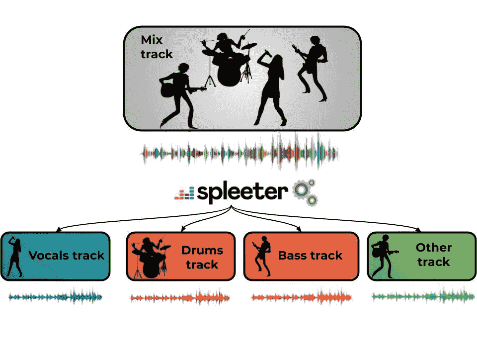
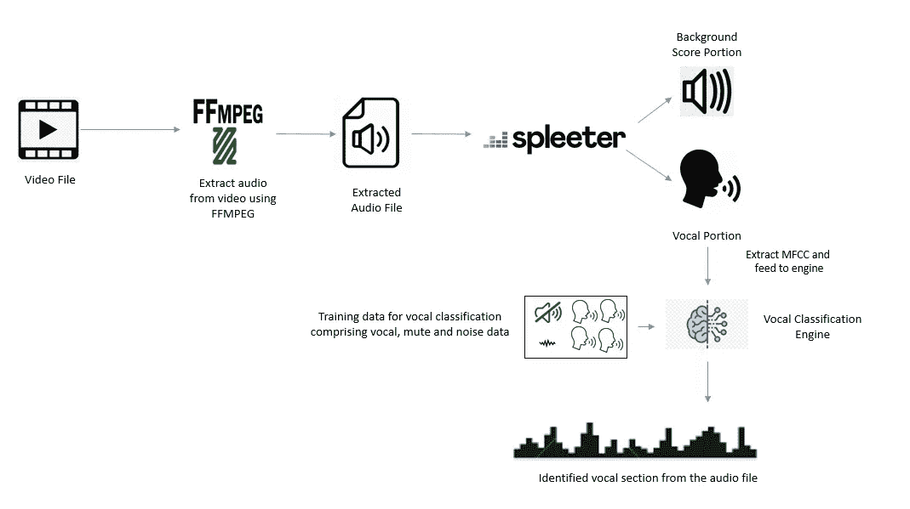
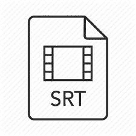
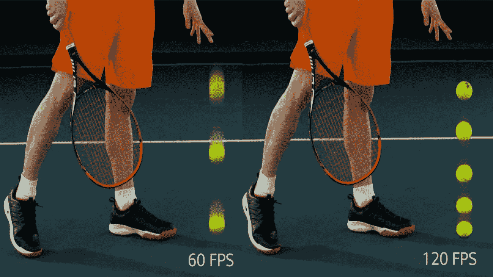
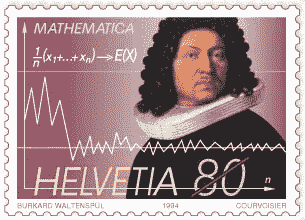

# 字幕同步——人工智能+概率主义的救援方法

> 原文：<https://medium.com/analytics-vidhya/subtitle-synchronization-ai-probabilitistc-approach-to-the-rescue-e59e166c5f25?source=collection_archive---------19----------------------->

字幕同步是人工智能有趣的应用之一，我们很容易联想到它。

假设你有一部外语电影，你并不知道，但你想借助字幕观看。但不幸的是，在播放视频时，视频和字幕播放之间存在同步问题，这严重影响了你的电影观看体验——破坏了你的周末:-( :-(。

人工智能拯救 src

基于人工智能的解决方案可以帮助你解决这个问题。

这是一个需要解决的有趣问题——因为它涉及音频处理、字幕(SRT)文件处理、对字幕校正的概率应用等。

本博客旨在向您概述库中使用的字幕同步活动所涉及的概念和方法— [字幕同步器](https://github.com/Subtitle-Synchronizer/SubtitleSynchronizer)。这个库受到了另一个库' [autosubsync](https://github.com/oseiskar/autosubsync) '的启发

字幕同步主要包括两个主要的处理步骤:

→识别视频文件中的声乐部分。

→根据确定的声乐部分进行字幕定时校正。

# **人声识别**

视频中的声部识别。 [src](https://www.google.com/url?sa=i&url=https%3A%2F%2Fwww.youtube.com%2Fwatch%3Fv%3Ds_LmC-ynqGM&psig=AOvVaw03hZSWnHO10HO1MfziwmsZ&ust=1590525735005000&source=images&cd=vfe&ved=0CAIQjRxqFwoTCJiYrKPwz-kCFQAAAAAdAAAAABAD)

人声识别是识别视频中人声部分的过程。典型地，视频将包括各种音频信号，例如人声部分、背景音乐、无声部分等。同步的 SRT 文件将包含与视频的各个有声部分对齐的“字幕”记录。因此，为了纠正字幕的同步错误，第一步是识别给定视频的有声部分。

这里可以使用基于音频分类的预测模型来识别发声部分——其中音频块的 mfcc 值将充当特征(要了解 mfcc 和音频处理，请参考此处),并且可以从“同步 SRT”文件中检索标签值以充当训练数据。你可以参考这个[博客](https://albertosabater.github.io/Automatic-Subtitle-Synchronization/)来获得更多关于这个方法的细节。

但是这种方法有一些固有的限制，我们主要依赖字幕文件进行标记，下面是一些限制:

→创建 SRT 文件时考虑到了观众的可读性。如果演员讲 2 秒钟，字幕可以用附加缓冲区显示，以便观众可以阅读。当我们以亚秒级别对音频进行分块时，这个缓冲区会破坏数据质量。

→ SRT 档案经常为观众提及非有声音频，如“下雨”、“打雷”、“人群欢呼”等。当从这些文件创建标签时，标签会错误地将这些音频部分指示为有声部分，这将影响预测准确性。

为了克服这一点，我们可以利用“音频分离”概念从给定的视频中分离出人声部分，并通过“人声分类”模型对其进行处理，以识别人声部分。

Deezer 的 Spleeter

Spleeter 是一个优秀的开源库，它使用深度学习技术将音轨分成人声和其他伴奏。我们将使用 Spleeter 来分离音轨，并将分离的音轨提供给“人声分类”预测模型，以识别音频文件中存在的人声部分。

下图总结了从原始视频中识别声乐部分的整个过程:

与来自给定视频文件的声乐部分识别相关联的过程图

**SRT 文件更正:**

SRT 文件校正

现在我们已经确定了有声部分，下一步是根据有声部分校正/对齐字幕记录文件，使它们同步。但是对齐字幕记录并不像看起来那么简单，它需要一种概率方法来解决这个问题。

我在这里要解释的方法来自于我对 autosubsync 库使用的“字幕修正”代码的理解。作者在构建这种方法方面做得非常出色——在这篇文章中，我只是描述这种方法对每个人都有好处。

让我们进入方法…

首先，让我们定义同步问题的原因:

→文件的预静态延迟和后静态延迟:考虑当您播放视频文件时，在显示相应语音内容的字幕时存在+2 秒的持续延迟。这个值也可以是负数。这种延迟将是恒定的延迟，并且它将在整个视频长度中保持恒定。

→与帧速率相关的延迟:考虑这种情况，您的 SRT 文件是以 25 帧/秒的视频帧速率创建的，当您播放视频时，视频播放器以 28 帧/秒的速率播放视频。在这种情况下，与字幕显示相关的延迟会随着时间而增加。

为了我们的分析，让我们考虑 SRT 档案中的一种或两种问题。我们不要在分析中考虑人为错误或不正确生成的 SRT 文件，因为它们在现实世界中非常罕见。

现在，我们已经定义了我们的问题陈述。让我们进入解决方案部分。

**帧率定义:**

视频和 SRT 文件回放的帧速率是导致同步问题的原因之一。 [src](https://www.google.com/url?sa=i&url=https%3A%2F%2Fwww.techradar.com%2Fau%2Fnews%2Fhfr-explained-high-frame-rate-is-coming-to-tvs-heres-what-you-need-to-know&psig=AOvVaw2pNhdzwfcHkiYZx96Vjjeb&ust=1590526083670000&source=images&cd=vfe&ved=0CAIQjRxqFwoTCIDToMjxz-kCFQAAAAAdAAAAABAI)

行业中通常用于视频回放的帧速率是 24 帧/秒、25 帧/秒和 28 帧/秒。

考虑到这一点，当我们将帧速率不匹配视为一个问题时，可能会产生 SRT 文件，视频回放帧速率差异可能会落入以下组合中:[[24，24]，[24，25]，[24，28]，[25，24]，[25，25]，[25，28]，[28，24]，[28，25]，[28，28]]。

让我们将这些组合称为“不对称率”，并让我们将它们之间的比率计算如下[24/25，24/28，25/24，25/28，28/24，28/25，1/1]。

因此，如果 SRT 文件中因为帧速率不匹配而出现了异步问题，那么它肯定会落入上面提到的不对称速率中，这将对不匹配产生指数级影响。由于我们不知道导致问题的确切不对称率，我们不得不使用每个不对称率来处理我们的文件，并应用概率选择最佳的一个。

等等！！！帧速率差异是我们正在考虑的问题之一，还有一个“静态延迟”问题，我们也需要考虑进行校正。大家讨论一下怎么处理吧。

**SRT 文件上的前/后静态延迟**

正如我们之前所讨论的，在我们的 SRT 文件中可能存在“n”秒的静态延迟，我们需要应用概率来确定该延迟。让我们考虑 SRT 文件中存在的范围为“+/- [0 到 20]秒”的延迟，并为每个值处理文件。

**加工段:**

如前所述，我们将考虑两种问题，我们已经确定了处理输入 SRT 文件所用的偏斜率组合和前/后静态延迟，如下所示:

→偏差率组合:[24/25，24/28，25/24，25/28，28/24，28/25，1/1] —总共 7 个值

→前/后静态延迟:+/-值[0 至 20 秒] —总共 41 个值

根据上述值的组合，让我们考虑给定的 SRT 文件受到“24/25”的“不对称率”问题的影响，并且它具有 2 秒的“静态后延迟”。有了这些值，异步 SRT 文件将需要按照下面的等式进行移位:

> x = x*skew_rate —静态延迟

其中“x”是字幕记录文件的“秒(时间)”值。

**人声分类结果**

雅各布·伯努利 [src](https://www.google.com/url?sa=i&url=https%3A%2F%2Fwww.britannica.com%2Fbiography%2FJakob-Bernoulli&psig=AOvVaw20oLfvifVfEFvfyK2u2sEU&ust=1590526384299000&source=images&cd=vfe&ved=0CAIQjRxqFwoTCOjAt9zyz-kCFQAAAAAdAAAAABAF)

由于我们不知道影响“偏斜率”和“静态延迟”的确切值，我们需要用这些值的每个组合来处理 SRT 文件，并通过使用“伯努利方程”比较识别的“声音分类”结果来识别最佳移位 SRT 文件。

> NP . sum(probs[标签])+NP . sum(1.0—probs[~标签])/float(len(标签)

这里，

→“probs[labels]”对应于通过视频在人声分类结果中识别的概率值，其中根据每个组合的移位 SRT 文件，存在“人声”部分。

如上所述，这是“概率”概念的一个有趣的应用，用于基于声音分类结果从各种集合中识别最佳偏移的 SRT 文件。

再说一遍，我在这里解释的关于 SRT 文件处理的一切都来自于我对伟大的“自动同步”库的理解，以及对作者解决这个问题的赞扬。

请随时评论您的疑问。