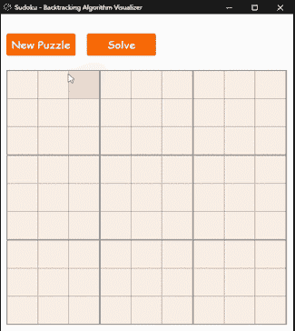
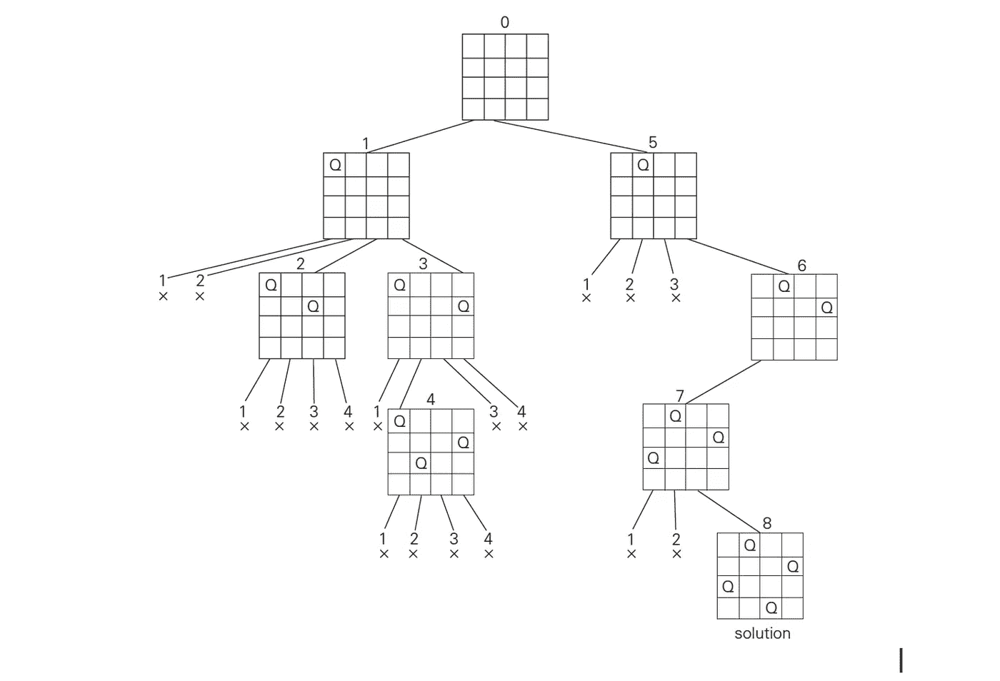
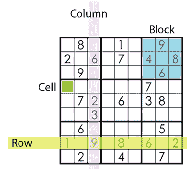
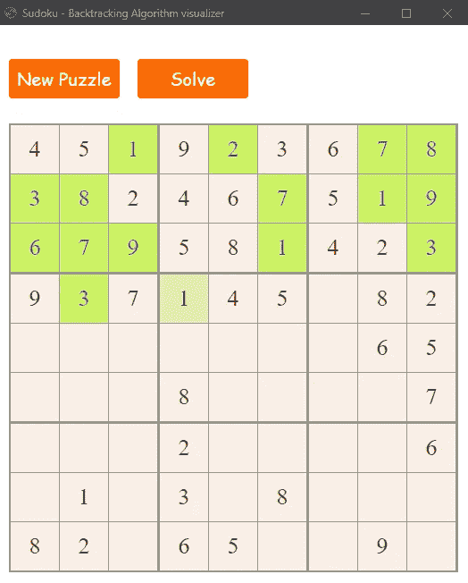

# 数独回溯算法及其可视化

> 原文：<https://medium.com/analytics-vidhya/sudoku-backtracking-algorithm-and-visualization-75adec8e860c?source=collection_archive---------5----------------------->

一边解数独，一边把回溯算法可视化，是不是很酷？是的，我将讨论算法，并分享我如何开发一个简单的程序来可视化算法。关于该计划:

*   算法在`Python`中
*   GUI 在`HTML, CSS, JavaScript/JQuery`中使用 python 的`eel`库。阅读更多关于[鳗鱼](https://pypi.org/project/Eel/)的信息。
*   检查 [GitHub](https://github.com/tarunk04/sudoku-backtracking-visualizer) 上的完整代码

追踪

# 回溯算法

递归处理问题以解决问题的经典算法之一。尝试一个接一个地构建解决方案，并消除那些无法解决的方案。其中一个著名的问题是 N-Quene 问题，你可能听说过。其中需要将 N 个皇后放在 NxN 板上，以便没有一个皇后处于攻击位置。点击这里阅读更多关于 N 皇后问题的内容。数独也是一个著名的问题/难题，可以使用回溯算法解决。

在回溯算法中，我们为问题建立一个解树，并排除不满足要求条件的解。

4 皇后问题的解树

# **数独**

数独是一种数字益智游戏，其中 1-9 的数字被放置在 9x9 的网格中，以便在每行、每列和 3x3 的子网格/块中没有数字重复。

行、列和块

**如何使用回溯求解:**我们从第一个空单元格开始，逐一迭代 1-9，如果一个数字满足所有 3 个条件，即该特定数字不存在于行、列和块中，我们用该数字填充。然后我们前进到下一个空的单元格，我们做同样的数字迭代，但是使用更新的数独板。当我们在新的空单元格中前进时，我们可能会到达一个不能放置 1-9 之间的数字的单元格。因此，这个解决方案被拒绝，现在我们向后移动，在那些先前的单元格中尝试新的可能值。因为我们知道数独棋盘只有一个解，所以我们会一直拒绝这个解，直到我们找到一个满足最初为空的每个单元格的所有条件的解。

验证单元格

上面的代码验证了特定单元格在 0-9 之间的不同值。如果该值满足所有 3 个条件，则返回 true，否则返回 false。

数独难题的回溯算法

递归调用上述函数来构建解树，并拒绝所有不满足条件的解。变量`visualize`的值默认为`False`,这意味着它不会更新 GUI 并快速解决难题。如果值是`true`,那么 GUI 将在求解的每一步更新。因此，为了可视化回溯算法，这个变量需要是`True`。

# **生成数独**

向前一点，让我们在进入可视化部分之前讨论如何生成数独。

**如何接近？**

*   第一件事是生成一个解决数独板。
*   第二件事是从解出的数独棋盘上删除一些单元格，这样它是可解的，并且解必须是唯一的。

1.  **生成解出的数独板**:方法与解出数独板非常相似。这里唯一改变的是我们有一个空的板子。因此，我们可以从第一个单元格(即左上角的单元格)开始，随机填充值。移动到下一个空单元格，现在我们在板上有一个值，所以我们必须在新单元格中填充值之前检查数独条件。再次生成一个介于 1-9 之间的随机值，并检查数独条件。如果它满足所有条件，则将该值放在单元格中，并移动到下一个单元格。在某一点上，可能会发生 1-9 之间的值不适合该单元格的情况，然后返回到前面的单元格并尝试不同的组合，直到解出的数独板准备就绪。
2.  **删除单元格生成谜题:**随机选取一个非空单元格，删除值，然后尝试使用我们的求解算法求解，并计算解的数量。如果数字解不是 1，则将该值放回单元格，并尝试不同的单元格。重复这样做，直到你得到拼图所需的难度。谨记两件事

*   移除的细胞越多，拼图就越难。
*   移除的细胞越多，生成拼图所需的时间就越长。

移除 30-55 个细胞将会给`very hard`谜题带来`easy`。但是移除超过 55 个细胞将花费更多的时间来生成拼图。有人提出，作为数独谜题的线索，所需的最小单元数是 17。这意味着你可以删除多达 64 个细胞。但是要找到这样一个谜题可能非常耗时。我还没有测试我的算法来找到这样一个难题，它可能会失败。

生成已解决的数独

生成谜题

# **实时可视化算法**

GUI 预览

GUI 是使用 HTML、CSS 和 JavaScript/JQuery 开发的。对于连接，使用前端和后端 eel 库。

> Eel 是一个小 Python 库，用于制作简单的类似电子的离线 HTML/JS GUI 应用程序，可以完全访问 Python 功能和库。

在 GitHub 上检查关于 [eel](https://github.com/samuelhwilliams/Eel)

eel 允许您从 JavaScript 调用 Python 函数，反之亦然。

**暴露给 Python 的 JavaScript 函数。**

可以从 python 调用的 JavaScript 函数

函数`draw_sudoku`向 GUI 显示数独，这里的`data`是一个 9x9 数组的参数，通过 python 传递给 JavaScript。而`update_sudoku`在解数独时从 Python 获取参数`val and i`来更新 GUI。其中`val`是单元格`i`的值。单元格`i`表示 81 个单元格中的第 I 个单元格。

**暴露给 JavaScript 的 Python 函数**

这些函数可以从 JavaScript 调用。例如，如果你需要一个新的谜题，那么点击 GUI 上的 new puzzle 按钮，JavaScript 将调用 python 的函数`generate_new_sudoku`，并将`level`作为参数传递。

暴露给 JavaScript 的 Python 函数

# **可视化示例:**

查看回溯操作

# **完整代码**

在我的 GitHub 上找到完整代码:[https://github.com/tarunk04/sudoku-backtracking-visualizer](https://github.com/tarunk04/sudoku-backtracking-visualizer)

# **反馈**

今天的帖子到此为止，如果你有任何问题，请在评论中告诉我。此外，如果你发现任何错误，请写信给我在 tarun12.tarunkr@gmail.com。

如果你想让我在接下来的帖子中涉及一些特定的话题，请在评论中告诉我。

关注:

*   我在 GitHub 上有更多这样的项目
*   我在 [Kaggle](https://www.kaggle.com/tarunk04) 上。

感谢您抽出时间阅读本文。喜欢请分享。

我正在寻找拥有不同技能的人来建立一个封闭的社区，这样我们就可以一起打造令人惊叹的产品。如果你有兴趣，请在 Linkedin 上联系我或给我发邮件