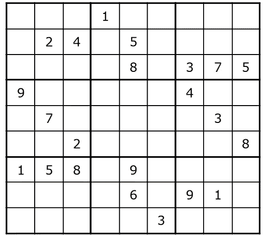
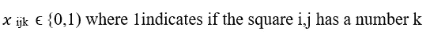
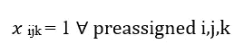
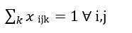
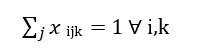
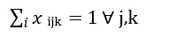
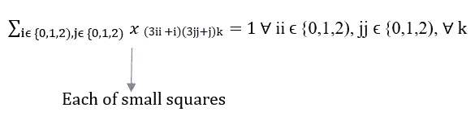
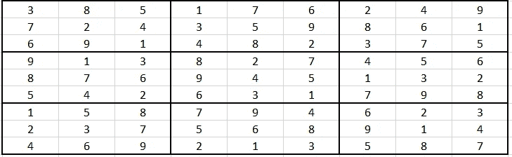

# 基于整数规划的数独求解策略

> 原文：<https://medium.com/analytics-vidhya/sudoku-problem-solving-strategy-using-integer-programming-347a847235a5?source=collection_archive---------6----------------------->



让我们考虑在本文中得到上述数独问题的解决方案。

# 导入包

```
from gurobipy import *
```

# 设置输入网格

```
Grid = [
[0,0,0, 1,0,0, 0,0,0],
[0,2,4, 0,5,0, 0,0,0],
[0,0,0, 0,8,0, 3,7,5],

[9,0,0, 0,0,0, 4,0,0],
[0,7,0, 0,0,0, 0,3,0],
[0,0,2, 0,0,0, 0,0,8],

[1,5,8, 0,9,0, 0,0,0],
[0,0,0, 0,6,0, 9,1,0],
[0,0,0, 0,0,3, 0,0,0]]

#N represents the Big Square comprised of 9 smaller squares
N = range(9)

#K represents the numbers 1-9
K = range(1,10)
```

# 设定模型

```
m = Model()
```

# 定义变量



```
X = {(i,j,k): m.addVar(vtype=GRB.BINARY) for i in N for j in N for k in K}
```

# 定义约束

约束 1:

I，j，k 在网格中是预先指定的



```
PreAssign = {
    (i,j): m.addConstr(X[i,j,Grid[i][j]]==1)
    for i in N for j in N if Grid[i][j]>0}
```

约束 2:

每个单元格中只有一个数字



```
OnePerSquare = {
    (i,j): m.addConstr(quicksum(X[i,j,k] for k in K)==1)
    for i in N for j in N}
```

约束 3:

每一行都必须有 1-9 的数字



```
EachValueInRow = {
    (i,k): m.addConstr(quicksum(X[i,j,k] for j in N)==1)
    for i in N for k in K}
```

约束 4:

每一列都必须有数字 1-9



```
EachValueInCol = {
    (j,k): m.addConstr(quicksum(X[i,j,k] for i in N)==1)
    for j in N for k in K}
```



```
EachValueInSubSquares = {
    (ii,jj,k): m.addConstr(quicksum(X[i,j,k] 
                        for i in range(3*ii,3*ii+3)
                        for j in range(3*jj,3*jj+3))==1)
    for ii in range(3) for jj in range(3) for k in K}
```

# 优化结果

```
m.optimize()
print('---+---+---')
for i in N:
    if i==3 or i==6:
        print('---+---+---')
    for j in N:
        if j==3 or j==6:
            print('|', end='')
        for k in K:
            if X[i,j,k].x > 0.9:
                print(k,sep='',end='')
    print('')
print('---+---+---')Gurobi Optimizer version 9.0.1 build v9.0.1rc0 (win64)
Optimize a model with 346 rows, 729 columns and 2938 nonzeros
Model fingerprint: 0x125478e4
Variable types: 0 continuous, 729 integer (729 binary)
Coefficient statistics:
  Matrix range     [1e+00, 1e+00]
  Objective range  [0e+00, 0e+00]
  Bounds range     [1e+00, 1e+00]
  RHS range        [1e+00, 1e+00]
Presolve removed 346 rows and 729 columns
Presolve time: 0.04s
Presolve: All rows and columns removed

Explored 0 nodes (0 simplex iterations) in 0.06 seconds
Thread count was 1 (of 8 available processors)

Solution count 1: 0 

Optimal solution found (tolerance 1.00e-04)
Best objective 0.000000000000e+00, best bound 0.000000000000e+00, gap 0.0000%
---+---+---
385|176|249
724|359|861
691|482|375
---+---+---
913|827|456
876|945|132
542|631|798
---+---+---
158|794|623
237|568|914
469|213|587
---+---+---
```

基本上，上面输出的这个谜题的数独解如下:



*该算法可以解决任何数独难题，只需在网格中输入预先分配的值。