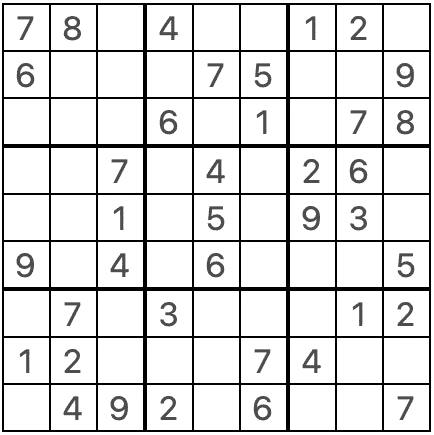
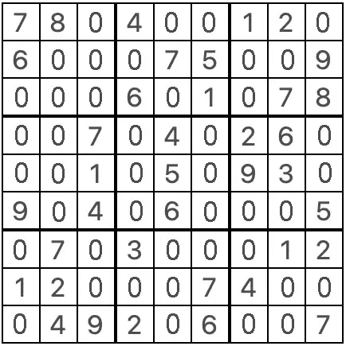

# 数独解谜器——如何构建您的第一个 Python 项目

> 原文：<https://medium.com/analytics-vidhya/sudoku-puzzle-solver-how-to-build-your-very-first-python-project-b2f4c3e2160e?source=collection_archive---------4----------------------->


编程新手通常会先熟悉编程语言的语法，然后通过各种网站，如 [HackerRank](http://hackerrank.com) 、 [HackerEarth](http://hackerearth.com) 、 [CodeWars](https://www.codewars.com) 、 [Project Euler](http://projecteuler.net) 等，练习大量的挑战。

虽然这些平台可以有效地帮助构建推理、思考、应用逻辑的技能，并帮助即兴编写代码以有效地处理大量输入数据，但它们缺乏的一点是帮助您构建合理规模的项目。当手头的任务变得更复杂时，它需要很多很多行代码。代码越多，其中重复的元素就越多，因此需要建立基本的技能来围绕函数和类构建代码。

使用函数和类有助于开发人员将技能提升到编写有效的可重用代码的下一个层次。这需要一些头脑风暴和大量的实践。数独解谜是一个谦逊的努力，帮助初学者开始他们的第一个迷你项目，可以在一个小时左右建成。



一个简单的数独游戏

来自 [Teach With Tim](https://techwithtim.net/tutorials/python-programming/sudoku-solver-backtracking/) 的 Tim 帮我轻松理解回溯算法。与他的相比，我的实现要复杂和耗时得多。一定要参考他的视频来理解可视化表示的回溯算法。

**数独游戏的规则**

1.  它包含一个 9 x 9 的拼图网格，细分为 3 x 3 的 9 个数字块。
2.  9 x 9 拼图中任何单元格的每个数字只能是 1 到 9 之间的数字，包括 1 和 9。
3.  每个 3 x 3 块应该在任何单元格中包含 1 到 9 之间的所有数字。因为一个 3 x 3 的方块有 9 个单元，很明显没有数字可以重复。
4.  类似地，9 x 9 拼图的每一行必须包含 1 到 9 之间的所有数字。同样，由于每行有 9 个单元格，没有数字可以重复。
5.  每一列需要有 1 到 9 之间的数字，如上所述，没有数字可以重复。

一旦我们完全填写了一个满足上述所有标准的数独谜题，我们就可以有把握地认为这个谜题已经解决了。

**构建程序的步骤**

1.  我们从左到右，从上到下迭代这个难题
2.  迭代通过难题，直到你找到一个空的细胞。
3.  请填写有效的数字。一个有效的数字既不在单元格所在的行中，也不在单元格所在的列中，也不在单元格所在的 3 x 3 块中。这是因为没有一个数字可以在一行、一列和 3×3 块中重复一次以上。
4.  找到有效号码后，重复步骤 2 和 3。
5.  在执行步骤 4 时，如果我们到达空单元格中没有有效数字的点，我们回溯并移动到由算法填充的前一个单元格，以找到下一个有效数字，并使用回溯和找到下一个有效数字来继续重复难题步骤 2 和 3。回溯可能听起来有点复杂，但我会花时间用下面的代码解释它。
6.  重复该过程，直到拼图中不存在空单元格。

既然我们已经制定了一个简单的算法来帮助生成数独难题的解决方案，让我们花点时间来分析需要定义函数的重复步骤。

*   一个可选的功能，帮助加载从一个. txt 文件的难题
*   查找空单元格的函数
*   一个函数，用于判断一个数字是否可以填充到一个空单元格中。
*   需要时随时打印纸板的功能
*   使用上述方法解决难题的功能

让我们一步一步地构建算法，以便更好地理解。

任务 1:编写一个函数，帮助从文本文件
加载谜题，或者，你可以在你的程序中预定义变量`board`并将一个谜题存储为 9 个元素的列表，每个元素代表数独谜题的一行，因此列表的每个元素也是 9 个数字的列表。

请务必注意。为了便于表示，我们用一个`0`填充拼图中所有的空白区域，并在`1 and 9`之间分别填入数字。



在空白单元格中填充 0 的拼图示例

我们现在从代码开始。让我先向您展示代码，然后解释它的作用。

```
def loadPuzzle():
    """
    A method to read a file having puzzle in it. The puzzle should have nine lines
     of nine numbers each between 0-9 seprated by commas.

    Arguments:
    None

    Output:
    A list variable board
    """
    board = []
    fileHandle = open("SudokuPuzzle.txt", "r")
    puzzle = fileHandle.readlines()
    for line in range(len(puzzle)):
        if line != len(puzzle) - 1:
            puzzle[line] = puzzle[line][:-1]
            board.append(list(map(int,puzzle[line].split(","))))
        else:
            board.append(list(map(int,puzzle[line].split(","))))
    fileHandle.close()
    return board
```

我们首先使用代码`fileHandle = open("SudokuPuzzle.txt", "r")`以读取模式打开一个文本文件。您可以根据您的文件名和文件路径编辑此代码。

下一行代码，`puzzle = fileHandle.readlines()`读取文件中的所有行。

for 循环遍历`puzzle`变量中的每一行。for 循环的内容如下。对于除最后一行之外的所有行，读取该行，删除最后一个字符，即`\n`，这是一个新的行字符，出现在`SudokuPuzzle.txt`文件中除最后一行之外的所有行中，用`,`作为分隔符将其拆分，并将其转换为一个列表。对于`SudokuPuzzle.txt`文件的最后一行，由于最后没有新的行字符，我们直接读取该行并用`,`作为分隔符将其拆分。

然后，我们关闭文件并返回`board`变量，该变量实际上将数独难题存储为一个 9 个元素的列表，每个元素又是一个在`0 and 9`和`0`之间的 9 个数字的列表，代表一个空单元格。

**任务 2:如前所述，查找下一个空单元格**
的函数。我们在拼图中首先从左到右，然后从上到下进行迭代。这基本上意味着我们必须遍历`board`元素，获取第一个列表，遍历它，然后是下一个列表，依此类推。这个函数的代码非常简单，一目了然。

```
def findEmpty(board):
    """
    A method to find the next empty cell of the puzzle.
    Iterates from left to right and top to bottom

    Arguments:
    board - a list of nine sub lists with 9 numbers in each sub list

    Output:
    A tuple (i, j) which is index of row, column
    """
    for i in range(len(board)):
        for j in range(len(board[0])):
            if board[i][j] == 0:
                return (i, j) #row, column
    return None
```

上面的函数基本上会返回一个元组`(i, j)`，它是找到的空单元格的行号和列号。如果没有找到空单元格，函数返回`None`变量。

3.一个函数，用于判断一个数字是否可以填充到一个空单元格中。我们不尝试任何复杂的方法来预测哪个数字适合一个空单元格，算法所做的只是检查该数字是否已经存在于相应的行、列和 3 x 3 框中。如果号码已经存在，函数返回一个`False`，否则返回`True`。

```
def valid(board, num, pos):
    """
    A method to find if a number num is valid or not

    Arguments:
    board - a list of nine sub lists with 9 numbers in each sub list
    num - a number between 1 to 9 both inclusive
    pos - a tuple (i, j) representing row, column

    Output:
    True if the number is valid in position pos of puzzle else False.
    """
    row = pos[0]
    column = pos[1] #checking rows
    for i in range(len(board[0])):
        if board[row][i] == num and column != i:
            return False #checking columns
    for i in range(len(board)):
        if board[i][column] == num and row != i:
            return False

    #checking box
    startRowBox = row//3 
    startColumnBox= column//3
    for i in range(startRowBox*3, (startRowBox*3)+3):
        for j in range(startColumnBox*3, (startColumnBox*3)+3):
            if board[i][j] == num and row != i and column != j:
                return False
    return True
```

代码非常简单。在第一种情况下，for 循环遍历存储在变量`row`中的行号的每个元素，除了正在被测试以填充值`num`的单元格的位置。如果检测到该数字已经存在于该行中，则返回`False`。

然后它移动到检查列。列号存储在变量`column`中。如果变量`num`中的值已经存在于列号`column`中，那么函数返回`False`。

接下来是 3 x 3 框，其中显示了当前的空单元格。为了生成 3×3 代码迭代，我们假设整个拼图被分成 9 个 3×3 块的单元，每行的索引号为 0、1 和 2，每列的索引号为 0、1 和 2。第一个盒子的位置是(0，0)，第二个盒子的位置是(0，1)，依此类推，直到最后一个盒子的位置是(2，2)。

前两行代码帮助使用检测空单元格所在的框的位置。然后，我们使用这些位置信息来遍历 3 x 3 块，并检查变量`num`中的值是否已经存在于该块中。如果存在，函数返回`False`，否则函数结束返回`True`。

**4。需要时随时打印棋盘的功能**
我们已经知道数独谜题以嵌套列表的形式存储在变量`board`中，但是具有以视觉上吸引人的方式打印谜题的功能会有所帮助。

```
def printBoard(board):
    """
    A method to print the sudoku puzzle in a visually appealing format

    Arguments:
    board - a list of nine sub lists with 9 numbers in each sub list

    Output:
    Prints a nine x nine puzzle represented as a sudoku puzzle. Returns None.
    """
    if not findEmpty(board):
        print("Finished puzzle")
    else:
        print("Unsolved puzzle")
    for i in range(len(board)):
        if i%3 == 0:
            print("-------------------")

        for j in range(len(board[0])):
            if j%3 == 0:
                print("\b|", end ="")

            print(str(board[i][j])+" ", end="")
        print("\b|")
    print("-------------------")
```

同样，在非常基础的层面上，我们迭代通过`board`变量并打印出每一行，但是我们检测位置 0、3、6 和 9 来打印它们之间的间隔符，这样它看起来就像一个数独游戏。

```
Unsolved puzzle
-------------------
|7 8 0|4 0 0|1 2 0|
|6 0 0|0 7 5|0 0 9|
|0 0 0|6 0 1|0 7 8|
-------------------
|0 0 7|0 4 0|2 6 0|
|0 0 1|0 5 0|9 3 0|
|9 0 4|0 6 0|0 0 5|
-------------------
|0 7 0|3 0 0|0 1 2|
|1 2 0|0 0 7|4 0 0|
|0 4 9|2 0 6|0 0 7|
-------------------
```

在这个函数的开始，它会检查拼图中是否还有空的单元格。如果是，它将标题打印为`Unsolved puzzle`，但如果没有空单元格，则意味着已经找到解决方案，因此该函数将标题打印为`Finished puzzle`。

```
Finished puzzle
-------------------
|7 8 5|4 3 9|1 2 6|
|6 1 2|8 7 5|3 4 9|
|4 9 3|6 2 1|5 7 8|
-------------------
|8 5 7|9 4 3|2 6 1|
|2 6 1|7 5 8|9 3 4|
|9 3 4|1 6 2|7 8 5|
-------------------
|5 7 8|3 9 4|6 1 2|
|1 2 6|5 8 7|4 9 3|
|3 4 9|2 1 6|8 5 7|
-------------------
```

5.使用上述方法解谜的功能
解决方案的最后也是最重要的部分。我将首先分享整个代码，然后深入每一行进一步解释它，包括回溯部分。不要被复杂的词汇吓倒，比如回溯算法，这只是一个递归函数，就像最基本的斐波那契数列解一样，经常用递归来教授。

```
def solve(board):
    """
    A method to solve the sudoku puzzle using the other functions defined.
    We use a simple recursion and backtracking method.

    Arguments:
    board - a list of nine sub lists with 9 numbers in each sub list

    Output:
    Returns True once the puzzle is successfully solved else False
    """
    find = findEmpty(board)

    if not find:
        return True
    else:
        row, col = find

    for i in range(1,10):
        if valid(board, i, find):
            board[row][col] = i

            if solve(board):
                return True

            board[row][col] = 0
    return False
```

代码的第一部分`find = findEmpty(board)`基本上是调用带参数的`findEmpty(board)`函数作为 board，并要求它找到下一个空单元格。如果没有找到空单元格，它要么返回一个元组作为`(row, column)`坐标，要么返回`None`。

然后我们定义递归的基本情况

```
if not find:
    return True
```

也就是说，如果`find`的值为`None`,则意味着谜题已经被成功解决，并且`solve()`函数返回值`True`,表示相同的情况。但是如果谜题还没有解决，并且`findEmpty()`函数返回了一个元组，那么我们将`find`的变量存储在`row and column`变量中。我们也可以直接使用`find[0] and find[1]`，但是使用更好的变量表示会更容易理解代码。

然后我们开始算法的一部分，开始猜测哪个值适合由`find`表示的空单元格。我们从 1 开始迭代，直到 9，每次都调用`valid()`函数，直到它返回`True`，表明它是有效的猜测。在填入猜测值后，我们用新填入的值再次递归调用`solve()`函数。这一次，它将获得下一个空单元格，并重复这个过程。这种递归将继续下去，直到它成功地填充了这次迭代中的所有值，或者遇到了这样一种情况，即它到达了一个从 1 到 9 的值都无效的单元格。

当它到达一个单元格不能将任何数字作为有效值的情况时，它意味着先前的猜测之一是不正确的，因此递归在这里停止，并且在递归调用之后的代码行，`board[row][column] = 0`用于最后猜测的递归深度被调用。所以这基本上意味着，把最后一个猜测值设回 0，并为它寻找一个新的猜测值。例如:如果最后一次猜测是 5，我们将其设置回 0，for 循环继续测试 6 是否是有效的猜测，然后是 7、8、9 等等。如果找到一个有效的猜测，它继续填充下一个空单元格，如果没有，那么它甚至进一步回溯并用 0 填充它，并再次尝试新的猜测。所以基本上，算法通过递归不断回溯每一步。

一旦电路板被填入有效值，它返回`True`并退出该功能。

我在这里分享一个程序的全部代码。

```
#!/usr/bin/env python3
# -*- coding: utf-8 -*-
"""
Created on Sun Dec 22 12:24:49 2019[@author](http://twitter.com/author): raghu
"""
#uncomment the code below to initiate a puzzle board 
#instead of loading it from a file
# =============================================================================
# board = [
#     [7, 8, 0, 4, 0, 0, 1, 2, 0],
#     [6, 0, 0, 0, 7, 5, 0, 0, 9],
#     [0, 0, 0, 6, 0, 1, 0, 7, 8],
#     [0, 0, 7, 0, 4, 0, 2, 6, 0],
#     [0, 0, 1, 0, 5, 0, 9, 3, 0],
#     [9, 0, 4, 0, 6, 0, 0, 0, 5],
#     [0, 7, 0, 3, 0, 0, 0, 1, 2],
#     [1, 2, 0, 0, 0, 7, 4, 0, 0],
#     [0, 4, 9, 2, 0, 6, 0, 0, 7]
# ] 
# =============================================================================# loading the puzzle from a file 
#comment the loadPuzzle code below if you want to iniate the board above        
def loadPuzzle():
    """
    A method to read a file having puzzle in it. The puzzle should have nine lines
     of nine numbers each between 0-9 seprated by commas.

    Arguments:
    None

    Output:
    A list variable board
    """
    board = []
    fileHandle = open("SudokuPuzzle.txt", "r")
    puzzle = fileHandle.readlines()
    for line in range(len(puzzle)):
        if line != len(puzzle) - 1:
            puzzle[line] = puzzle[line][:-1]
            board.append(list(map(int,puzzle[line].split(","))))
        else:
            board.append(list(map(int,puzzle[line].split(","))))
    fileHandle.close()
    return boarddef findEmpty(board):
    """
    A method to find the next empty cell of the puzzle.
    Iterates from left to right and top to bottom

    Arguments:
    board - a list of nine sub lists with 9 numbers in each sub list

    Output:
    A tuple (i, j) which is index of row, column
    """
    for i in range(len(board)):
        for j in range(len(board[0])):
            if board[i][j] == 0:
                return (i, j) #row, column
    return Nonedef valid(board, num, pos):
    """
    A method to find if a number num is valid or not

    Arguments:
    board - a list of nine sub lists with 9 numbers in each sub list
    num - a number between 1 to 9 both inclusive
    pos - a tuple (i, j) representing row, column

    Output:
    True if the number is valid in position pos of puzzle else False.
    """
    row = pos[0]
    column = pos[1]
    #checking rows
    for i in range(len(board[0])):
        if board[row][i] == num and column != i:
            return False
    #checking columns
    for i in range(len(board)):
        if board[i][column] == num and row != i:
            return False

    #checking box
    startRowBox = row//3 
    startColumnBox= column//3
    for i in range(startRowBox*3, (startRowBox*3)+3):
        for j in range(startColumnBox*3, (startColumnBox*3)+3):
            if board[i][j] == num and row != i and column != j:
                return False
    return Truedef printBoard(board):
    """
    A method to print the sudoku puzzle in a visually appealing format

    Arguments:
    board - a list of nine sub lists with 9 numbers in each sub list

    Output:
    Prints a nine x nine puzzle represented as a sudoku puzzle. Returns None.
    """
    if not findEmpty(board):
        print("Finished puzzle")
    else:
        print("Unsolved puzzle")
    for i in range(len(board)):
        if i%3 == 0:
            print("-------------------")

        for j in range(len(board[0])):
            if j%3 == 0:
                print("\b|", end ="")

            print(str(board[i][j])+" ", end="")
        print("\b|")
    print("-------------------")

def solve(board):
    """
    A method to solve the sudoku puzzle using the other functions defined.
    We use a simple recursion and backtracking method.

    Arguments:
    board - a list of nine sub lists with 9 numbers in each sub list

    Output:
    Returns True once the puzzle is successfully solved else False
    """
    find = findEmpty(board)

    if not find:
        return True
    else:
        row, col = find

    for i in range(1,10):
        if valid(board, i, find):
            board[row][col] = i

            if solve(board):
                return True

            board[row][col] = 0
    return False

board = loadPuzzle()   #loading the board from puzzle file     
printBoard(board)      #printing the board before solving the puzzle
solve(board)           #solving the puzzle
printBoard(board)      #printing the puzzle after solving
```