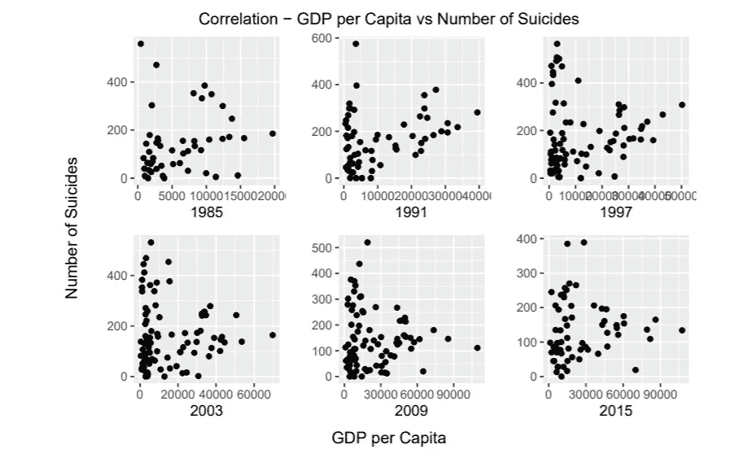
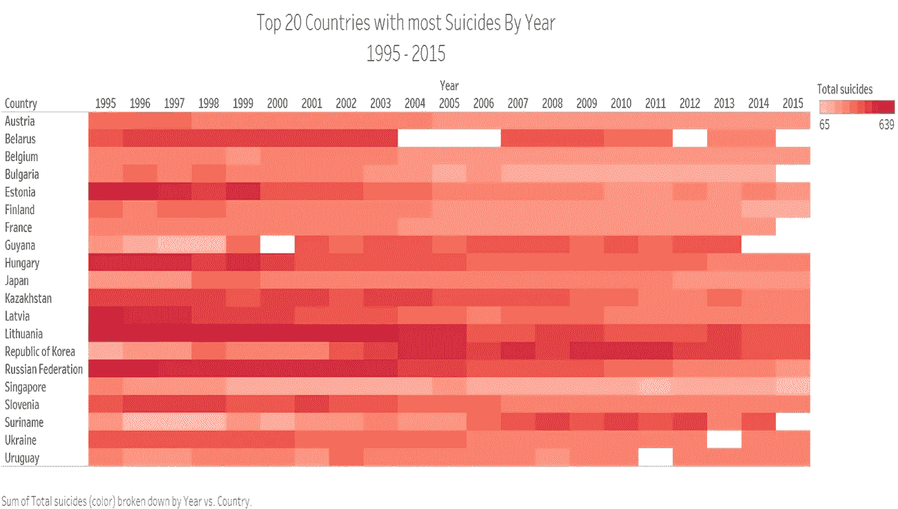
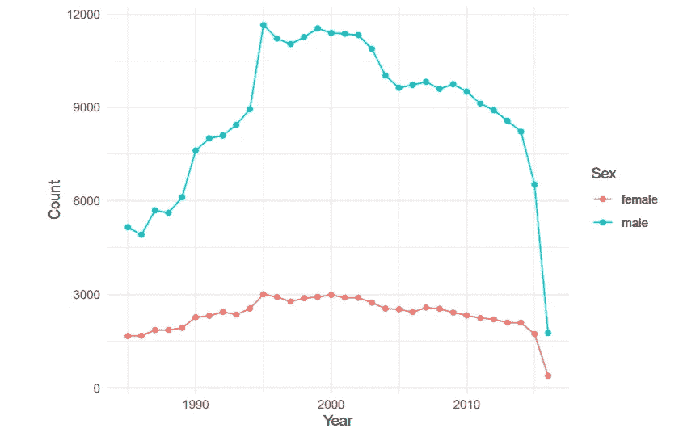
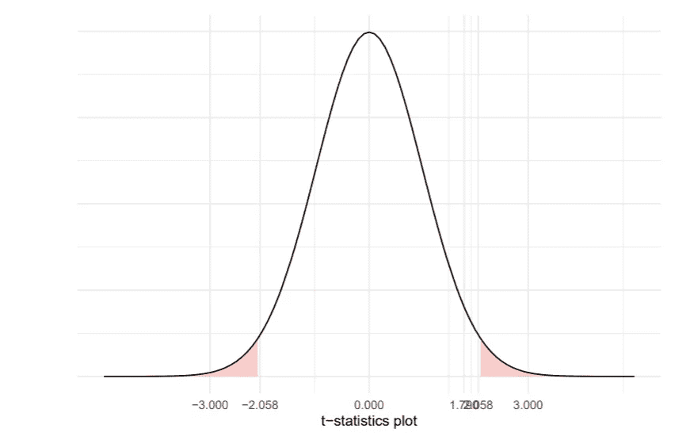
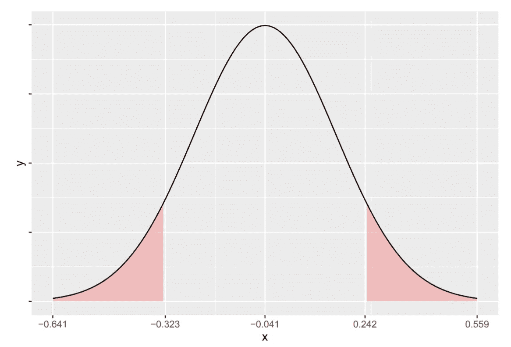

# 1985 年至 2016 年的自杀率分析

> 原文：<https://medium.com/analytics-vidhya/suicide-rate-analysis-from-1985-to-2016-fb93a61a2d93?source=collection_archive---------16----------------------->

我最近做了一项分析，解读了 1985 年至 2016 年某些国家所有年龄组的自杀模式。尽管自杀是导致死亡的主要原因之一，但在许多国家仍然很少被报道，这使得不可能在世界范围内进行准确的分析。我所掌握的数据包含了 30 个国家 15-75 岁以上不同年龄段的人群。

最初，我试图找到该国的 gdp(人均)与自杀人数之间的相关性。由于每个国家的人口不同，我决定最好是每 10 万人口中的自杀人数，而不是自杀总人数。

绘制这些年(1985 年、1991 年、1997 年、2004 年、2009 年和 2015 年)国内生产总值和自杀人数之间的相关性的原因是，其他年份的模式几乎相似，间隔 6 年更容易看到进展。

显而易见，随着国内生产总值的增加，自杀人数减少。自杀人数最多的国家总是属于低 gdp 国家。

为了找到全世界自杀率的模式，我决定做一个热图。

这是根据自杀率排名的前 20 个国家。我只能做 1995 年以来的热图，因为在 80 年代和 90 年代早期有很多缺失值，主要是因为全世界的自杀人数被大大低估了。总体而言，大多数国家的自杀率明显下降。匈牙利、立陶宛和俄罗斯联邦的自杀人数最多，但即使是这些国家的自杀率也有所下降，但也有一些例外，如苏里南、大韩民国和圭亚那的自杀率一直在上升。尽管大韩民国在 1995 年自杀人数只有 65 人，但在 2000 年之后，自杀率已经上升到 600 人。

除此之外，我还对多年来男性和女性自杀人数的模式感兴趣。借助于代表多年来自杀率模式的时间序列图，这就是我得出的结论。

多年来，世界各地的男性和女性自杀人数差距很大。从 1985 年到 1995 年，男性自杀人数持续上升，但女性自杀人数几乎一直呈线性增长。2000 年代末，男性自杀人数大幅下降，几乎与女性自杀人数持平。

然后，我做了一个假设测试，测试 2015 年 15-24 岁和 25-34 岁之间的平均自杀人数，以获得相同的最新分析。这里的无效假设是这些年龄组之间的自杀率是相同的。在执行 Welch 双样本 t 检验并绘制如下所示的 t 统计图后

每次我用数据中的随机样本进行测试时，T calc 总是落在可接受的区域内，因此，我们无法拒绝零假设，即自 2015 年以来，15-24 岁和 25-34 岁之间的自杀率没有显著差异。

当我看了一下数据集，并碰巧注意到 75 岁以上人口的自杀人数非常多，这真的令人惊讶。因此，我决定以 95 %的置信度计算 75 岁及以上男性和女性自杀比例差异的置信区间。首先，我考虑了 2000 年至 2016 年间男性和女性自杀人数的两个群体。我进行了 t 检验，以找出两个独立比例之间的差异的下限和上限，例如 75 岁以上男性在男性自杀总人数中的比例和 75 岁以上女性在女性自杀总人数中的比例。

对于每个随机样本，置信区间的下限和上限具有交替的符号，表明 75 岁及以上男性和女性自杀的比例没有显著差异。

尽管大多数国家的自杀率都在下降，但自杀死亡仍然是全世界死亡的主要原因之一，也是报道最少的原因。我们不能否认，人们对精神健康的认识不断提高，这似乎对自杀率产生了影响。我们越是谈论心理健康，这个世界就变得越是美好。