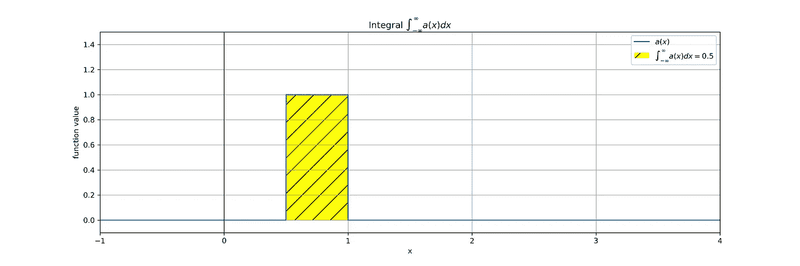

# 两个随机变量的和或理解概率分布卷积的艰难道路

> 原文：<https://medium.com/analytics-vidhya/sum-of-two-random-variables-or-the-rocky-path-to-understanding-convolutions-of-probability-b0fc29aca3b5?source=collection_archive---------5----------------------->

在我攻读硕士期间，我花了几个小时喝咖啡，努力完成一项作业，乍看之下，这似乎很琐碎。这是:

> 给定两个独立的均匀分布的随机变量 **X** 和 **Y** ，确定 **Z=X+Y** 的概率密度函数 **p(Z=z)** 。从数学角度来说:

我们可以说，结果函数将具有范围[0，2],因为应该有采样 x=1 和 y=1 的概率。**但是**——仅仅把两个均匀分布相加，并不能给我们问题的正确答案。

在快速的网络搜索之后，我找到了解决这个问题所需的理论工具:[概率分布的卷积](https://en.wikipedia.org/wiki/Convolution_of_probability_distributions)。它指出:

> 两个独立的整数值(因此是离散的)随机变量之和的分布的一般公式是

给定 X 和 Y 的(离散)概率分布，Z=X+Y 的概率密度

> 具有密度函数 ***𝑓,𝑔*** 的独立连续分布随机变量的对应物为

给定 X 和 Y 的(连续)概率密度，Z=X+Y 的概率密度

我的第一个想法是“哦，我在几年前的控制理论讲座上看到过这些方程(拉普拉斯变换)”——不幸的是，几年过去了，我不再知道积分是如何

是计算出来的。当然，维基百科的页面上有一些奇特的可视化效果，比如下面这个:

但对我来说，很难解读方程中不同变量的含义。例如，我不清楚为什么红色函数向左移动，而 **t** 参数为正。

这篇博客的目标是一步一步地钻研卷积方程——最终你会对卷积感到舒适，并且不害怕复杂的积分。

尽情享受吧！

# 基础

## 改变功能图

你可能在学校学过这一章，老师(至少在德国学校)通常用二次函数来做。如果您知道将 **𝑓(𝑥)** 更改为 **𝑓(−𝑥+3)** 后功能 **𝑓** 会发生什么，请随意跳过这一部分。

本节的动机是理解由 **𝑔(𝑥)** 变化而来的术语 **𝑔(𝑧−𝑥)** 。

> 注意，我把函数实参***【𝑡***换成了*，以免读者把*误认为“时间”。在这篇博客文章中，我们将继续使用 **x** 。**

**让我们定义两个简单的函数来完成本教程。第一个是简单的二次函数**

****

**因为我也想完成我的家庭作业——我们将把均匀分布 **U([0，1])** 作为我们的第二个函数**

****

**让我们在一张图中想象这两者:**

****

**现在，当我们将一个常量 **𝑧** 添加到函数参数(即 **𝑓(𝑥+3)** )时会发生什么？让我们看看不同的𝑧值会发生什么。我们将为每个示例函数绘制一个图，这里是二次函数:**

****

**加上一个正数 **z** ，我们将图表向左移动，一个负数 **z** 向右移动。**

**如果我们将**-1**乘以函数参数 **x** 会发生什么？由于二次图是对称的，不会显示任何变化，因此我们在一致函数上显示了这种影响。**

****

**显然，给 **x** 加上一个负号会“镜像”相对于 y 轴的函数图。**

**现在我们可以理解 **g(x)** 到**g(zx)**的变换了。它只是描述了添加一个常数 **z** (将其向左移动)并将**-1**乘以 **x** (相对于 y 轴镜像)**。****

**请参见下面虚线函数图的效果:**

****

## **两个函数相乘**

**让我们继续研究卷积计算公式，我们的下一个任务是了解两个函数的乘积(或者在我的例子中是密度分布):**

****

**如果我们把它们相乘会怎么样？**

**让我们将一个代理函数 **a(x)** 定义为两个示例函数的乘积，并将这三个函数可视化:**

********

**黑色点状图是我们在下一步中集成的产品函数。由于两个矩形函数并不完全重叠，因此生成的图形没有两个源函数那么宽。**

## **在乘积函数 a(x)上积分**

**积分是函数图和 x 轴之间的面积。这是我们卷积过程的最后一个构件**

********

**两个均匀概率密度 **f** 和 **g** (其中一个向右移动 0.5)的乘积上的积分为 **0.5** 。**

**哇，太多了…让我们用一张图来总结一下吧！**

# **收集积木**

**最后，我们准备好理解卷积方程**

****

**为了计算特定 **z** 的 **h(z)** ，我们必须执行以下步骤:**

1.  **将功能 **g(x)** 向左 **z** ，即 **g(x+z)****
2.  **相对于 y 轴镜像结果，即**g(x+z)= g(z x)****
3.  **计算乘积**a(x)**，即**f(x)g(zx)= a(x)****
4.  **计算 **a(x)=i** 上的无穷积分**
5.  **在特定位置 **z** 卷积的结果是 **i** ，即我们计算出**h(z)=∫f(x)g(zx)dx**。**

**我们对我们感兴趣的每个 **z** 应用这个程序，通常是一个范围，用于计算一个特定的概率。**

**现在有了计算卷积的程序，我们可以把它应用到最初的问题(我的学习任务):**

****

**我们计算并可视化范围从-1 到 3 的 **z** 的结果:**

****

**不错！正如所料，最终的概率分布不是均匀分布。我们看到两个均匀分布的随机变量之和会导致一个“三角形”的概率密度！**

**它的形状看起来也很合理和直观，因为 **X** 和 **Y** 的期望值都是 0.5(记住，两者都均匀分布在[0，1]中)，Z 的期望值必须是 1。**

****

**感谢您的关注，并在下方留下您的评论！**

**为了创建这些图，我使用了 Python 和 matplotlib 包。用 *scipy.integrate.trapz* 函数进行积分计算。**

**特别感谢[https://github.com/herzog-ch](https://github.com/herzog-ch)的点评！**