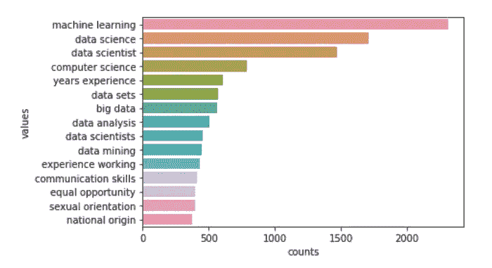

# 从文本中总结和提取信息来回答问题。

> 原文：<https://medium.com/analytics-vidhya/summarize-and-extract-information-from-text-to-answer-questions-67e2f415b4b1?source=collection_archive---------25----------------------->


自然语言处理

> 一幅画胜过千言万语。

如今，每天都会产生大量数据。这些数据有很多模式，可以回答很多问题。但是由于数据非常大，没有人能够浏览所有的数据并找到模式。但是由于机器学习和数据可视化的最新进展，我们可以总结这些数据并找到模式。有了这个，我们可以找到许多与该领域相关的见解。

在本文中，我们将探索美国数据科学家就业市场中的[](https://www.kaggle.com/sl6149/data-scientist-job-market-in-the-us)*数据，以回答一些普遍问题。*

*该数据集有 5 个属性，即职位、公司、描述、评论和位置。*

**

*数据集的数据*

*通过查看数据，我们可以看到有空值、标点符号和大写字母。所以数据需要清理。我们先去掉标点符号。*

```
*import string
def punc(text):
    try:
        text = [c for c in text if c not in string.punctuation]  #removes punctuation
    except:
        text = [' ']
    return ''.join(text)
#removing punctuation from position ,description ,company columns
data.position = data.position.apply(punc)
data.description = data.description.apply(punc)
data.company = data.company.apply(punc)*
```

*现在让我们把所有的大写字母转换成小写字母。这在对列值执行操作时非常有用。*

```
*data.description = [i.lower() for i in data.description]
data.position = [i.lower() for i in data.position]
data.company = [i.lower() for i in data.company]*
```

*现在让我们从列 location 中只提取 place，并更新 location 列。*

```
*def place(text):
    try:
        text = text.split(',')#removes ',' and return first word
        return text[0]
    except:
        pass
    return ''
#getting location 
data.location = data.location.apply(place)*
```

*让我们删除 review 列，因为我们不会使用它，因为它有许多空值。*

```
*data.drop('reviews',axis = 1,inplace = True)*
```

*现在，我们的数据已经清理完毕，可以进行分析了。让我们来看看吧。*

**

*清理的数据*

*现在让我们试着回答一些问题。**首先让我们看看哪家公司有最多的职位空缺。***

```
*vacancies = data.company.value_counts().rename_axis('values')
vacancies = vacancies.reset_index(name='counts')
plt.figure(figsize = (10,7))
sns.barplot(x = 'counts',y = 'values',data = vacancies[:15])*
```

**

*职位发布数量最多的公司的条形图*

*从这个图中，我们可以很容易地一眼看出亚马逊有一个最大数量的空缺。它有 350 多个空缺。紧随亚马逊之后的是 Ball Aerospace、微软和谷歌。*

*让我们看看哪个职位有最多的空缺。*

```
*positions = data.position.value_counts().rename_axis('values')
positions = positions.reset_index(name = 'counts')
plt.figure(figsize = (10,7))
sns.barplot(x = 'counts',y = 'values',data = positions[:15])*
```

**

*职位发布的条形图*

*从这个柱状图中，我们可以看到数据科学家的人数最多，有超过 350 个空缺。接下来是超过 100 名的高级数据科学家和研究分析师。*

***我们来看看哪个位置机会最多。***

```
*locations = data.location.value_counts().rename_axis('values')
locations = locations.reset_index(name = 'counts')                       plt.figure(figsize = (10,7))                       
sns.barplot(x = 'counts',y = 'values',data = locations[:15])*
```

**

*大多数机会的条形图*

*看起来纽约的机会最多，其次是西雅图和剑桥。*

***现在，让我们试着找出雇主在招聘数据科学家时最想要的技能、工具和学位。***

*仅仅通过总结信息来回答这个问题是不可能的，因为没有技能一栏。但是我们有一个描述栏。该列包含对该行中职位的描述。在描述中，提到了这项工作所需的技能。我们可以分析这个描述，借助职位栏找到合适的技能。*

*但是在专栏位置，价值数据科学家是以不同的方式被提及的。例如高级数据科学家、研究数据科学家。所以，我们把数据科学家的各种价值观替换成“数据科学家”。让我们为机器学习工程师、数据分析师、数据科学经理做这件事。让我们把剩下的几类归入“其他”。*

```
*def change(text):
    if 'data scientist' in text:
        return 'data scientist'
    elif 'analyst' in text:
        return 'data analyst'
    elif 'consultant' in text or 'manager' in text:
        return 'data science manager'
    elif 'machine learning' in text or 'statistical programmer' in text:
        return 'machine learning engineer'
    else:
        return 'other'
data.position = data.position.apply(change)*
```

**

*分组位置列*

*现在，我们可以根据列的位置轻松识别描述。*

*但是这种描述对每行的文本都有理解，不容易分析。这里自然语言处理帮助了我们。它有许多有用的功能，大大减少了我们的工作。*

*我们的假设是，**既然每一行职位数据科学家的描述中都出现了相同的技能，自然这些词的出现频率就高**。因此，让我们使用 ngrams 将文章分成单词，这是 NLTK 中的一个有用特性，并使用 barplot 将它们绘制出来以识别技能。*

*但是在此之前，像“the，is，a，an，…”等词出现得更频繁，所以我们需要将它们从描述中删除。我们可以在 NLTK 中使用停用词来做到这一点。*

```
*def nostop(text):
    stop = set(stopwords.words('english'))
    filtered = [w for w in text.split() if w not in stop] 
    #removing stop words
    return ' '.join(filtered)*
```

*现在让我们从一个数据科学家职位的所有行的描述中制作 1 克、2 克和 3 克，并将它们存储在一个数据框中。现在让我们来看看前 15 个最常用的单词。*

```
*def grams(pos,n):
    des = data[data.position == pos].description 
    #taking description
    most_frequent = []
    words = []
    for i in des:
        i = nostop(i)
        most_frequent += ngrams(i.split(),n) 
        #creating ngrams
    words = pd.DataFrame(most_frequent)
    words['gram_' + str(n)] = words[0]
    for i in range(1,n):
        words['gram_' + str(n)] += ' ' + words[i] 
        #creating single column with with all values of tuple
    return words['gram_' + str(n)]

da1 = grams('data scientist',1) #1gram
da2 = grams('data scientist',2) #2grams
da3 = grams('data scientist',3) #3gramsda1 = da1.value_counts().rename_axis('values').
da1 = da1.reset_index(name='counts')[:15]
#converting into dataframe
da2 = da2.value_counts().rename_axis('values')
da2 = da2.reset_index(name='counts')[:15]
da3 = da3.value_counts().rename_axis('values')
da3 = da3.reset_index(name='counts')[:15]*
```

*让我们制作一个柱状图，以便于可视化。第一克。*

```
*sns.barplot(x = 'counts',y = 'values',data = da1)*
```

**

*一克*

*由此我们无法获得太多信息，但我们可以假设机器学习是一项必要的技能，因为机器和学习单词都存在。看来统计也是必要的。*

*因此，我们在这里尝试做的是，我们尝试从最频繁的单词中确定所需的技能。但是看起来用 1 克是没有效率的，我们不能获得这样的信息。尽管如此，这也比浏览所有可能的职位描述来寻找雇主最需要的技能要好。*

*现在让我们试试 2 克。它类似于 1 克，但提取两个单词。*

```
*sns.barplot(x = ‘counts’,y = ‘values’,data = da2)*
```

**

*两克*

*这看起来更清楚了。我们可以很容易地识别像机器学习、大数据、数据挖掘、数据分析等技术技能。像沟通技巧这样的软技能。数据科学和计算机科学之类的学位。我们还可以看到，雇主想要的是工作经验和国籍。*

*让我们试试 3 克。它也类似于 1 克，但一次提取 3 个单词。*

```
*sns.barplot(x = 'counts',y = 'values',data = da3)*
```

**

*三克*

*从上面的图表中，我们可以看到数据科学家的一些重要技能是自然语言处理、机器学习技术和算法、计算机科学统计和处理大型数据集等。*

*在这个项目中，我为各种工作岗位做了类似的分析，如机器学习工程师、数据分析师等。你可以在这里找到结果[。](https://github.com/narsym/Data-science-job-market-in-US)*

*通过使用这些技术和大约 2 个小时的编码，我们能够获得这些洞察力，如果手动完成，这将需要数周时间。*

*希望文章不要太长太无聊。*

*感谢阅读。*