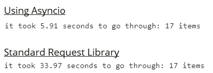

# 使用 Python 中的 Asyncio 库加速 HTTP Web 请求

> 原文：<https://medium.com/analytics-vidhya/summary-74789e47d420?source=collection_archive---------3----------------------->

# 摘要

这是一篇关于使用 Asynciolibrary 加速使用来自 stats.nba.com 的数据的 Python 中的 HTTP 请求的文章。它面向的是那些不是 Python 专家，但是遇到了大量 HTTP 请求的输入/输出(I/O)瓶颈的人(Python 代码在文章的末尾，或者可以从[https://github . com/tkpca/Python-Scripts/tree/master/Web % 20 requests](https://github.com/tkpca/Python-Scripts/tree/master/Web%20Requests)获得)。

**底线:我使用 Asyncio 在大约 5-6 分钟内完成了 3690 个查询(一个 NBA 赛季 1230 场比赛 x 3 个不同的查询/赛季),而使用标准的 requests 库需要大约 2-4 个小时。(它实际上可以运行得更快，但我发现推动它会导致知识产权禁令。)**

下面是一个使用上面的数据构建的散点图的例子(在以后的文章中会详细介绍如何实现交互)。

按游戏比较真实命中率和玩家影响评估

# 这是给谁的？

如果您是一名业余程序员，并且正在寻找一个可以重新用于 API 调用的脚本，那么可以根据您的需要对代码(发布在文章末尾)进行提取和编辑。

我用于球员数据的脚本要长得多，所以对于这个例子，我提取了 NBA 联合收割机信息(【https://stats.nba.com/draft/combine/】T4)。标准和异步版本的代码都在我的 Github 页面上，[https://Github . com/tkpca/Python-Scripts/tree/master/Web % 20 requests](https://github.com/tkpca/Python-Scripts/tree/master/Web%20Requests)。

# 背景

我一直在寻求提高我的 Python 技能，这意味着找到一个个人项目。幸运的是，我是 NBA 的忠实粉丝，NBA 碰巧跟踪了大量的数据(弄清楚如何使用 API 存在一些挑战，但这将在一组单独的帖子中解决)。最终，我想出了如何用 Python 从 stats.nba.com 提取 JSON 数据，但发现这要花很长时间…我可以按赛季提取所有球员的数据(基本和高级方块得分统计)，只是提取一个赛季的数据需要 3-4 个小时。

在做了一些研究之后，我注意到这在某种程度上是 Python 请求库的一个限制。有人可以更详细地解释这一点的技术原因([https://hacker noon . com/are-your-python-programs-running-slow-heres-how-you-can-make-them-7x-faster-3d 6758 CD 3305](https://hackernoon.com/are-your-python-programs-running-slow-heres-how-you-can-make-them-7x-faster-3d6758cd3305))，但是，简单地说，我在代码中执行了多个 web 查询，这些查询都必须按顺序发生……因此，查询服务器，等待结果，处理，进入下一个查询，等等。

# 为什么是异步？

一个朋友建议设置多线程，但坦白地说，我不了解 Python，想要类似的东西。我想做的只是收集数据，这样 Asyncio + Aiohttp 虽然令人困惑，但似乎更合理。

另外，**确保你用的是 Python 3.75+** 。我再怎么强调这一点也不为过，因为图书馆似乎变化很大。我也没发现很多解释超级有用，尽管这个很有帮助，【https://realpython.com/async-io-python/。

# 这在英语中是什么意思？

Realpython 有一个关于异步如何/为什么为 I/O 绑定的任务工作的很好的类比，但是简单地说，想象一下你正在去杂货店购物，需要从肉店柜台拿水果和一些肉，在那里肉店老板花 5 分钟切你的肉，10 分钟拿你的水果；为了简单起见，假设告诉屠夫你想要什么的时间可以忽略不计。

1)你可以去肉柜台拿水果，然后等着肉做好(反之亦然)。总时间为 15 分钟(5+10)。这类似于标准的请求方法。

2)你去熟食柜台点了肉，然后去买水果。总时间现在是 10 分钟。这类似于 Ayschio/Aiohttp 方法。

换句话说，你不是停下来等屠夫，而是让他做他的事情，然后去做别的事情。

你不需要等我！

# 它是如何工作的？

随附的 Juptyer 笔记本详细介绍了细节，但在较高层面上，我是这样解释需要做的事情的:

1)您需要创建一个协程。还有更多技术上优雅的解释，但简单地说，我将描述为一个返回值的函数，*除了它以* ***async*** *开始，任何值在被返回之前都需要有****await****关键字。Async 告诉 Python 它是一个协程，await 确保它在返回结果之前等待结果。这里的区别在于，与标准函数不同，协程可以让代码的其余部分在等待值时执行。*

*2)一旦你有了一些协程，你需要用那个协程建立一个循环。异步调用这个"**asyn CIO . create _ task**"——基本上像调用普通函数一样调用协程，除了在调用协程之前添加**asyn CIO . create _ task**(<your coroutine 这里是>)。这调度协程的执行。(注意:如果你使用的是 Python 3.6 或者更早的版本，这就叫做**asyncio . assure _ future()**。*

*3)然后你需要收集结果。Realpython 对此解释得比我更好，但基本上你需要设置一个变量=**await asyncio . gather**(<变量带有来自 create_task >的协程结果)。这将所有结果放入一个变量中，您可以将该变量传递回主例程。*

*a.最后，在主例程中设置一个变量来运行所有这些。假设您的函数在一个名为 main 的例程中——这让我迷惑了——如果您使用 Jupyter 笔记本 ，它将是:`**variable = await main()**` ***。在 Jupyter 之外，模式是 `**variable = asyncio.run(main())**` **— *大多数文章似乎都引用了这个版本，所以如果你正在使用 Jupyter，希望这能帮你减少一些挫折*。******

*仅此而已。请参阅嵌入的代码，实际浏览一个实际的示例。*

**

*一个简短的例子拉 NBA 联合数据。到这里[https://github . com/tkpca/Python-Scripts/tree/master/Web % 20 requests](https://github.com/tkpca/Python-Scripts/tree/master/Web%20Requests)自己去看看吧！*

*Jupyter 实验室代码*