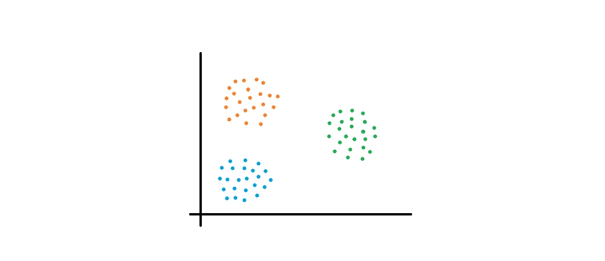

# KNN 算法用于分类时的总结

> 原文：<https://medium.com/analytics-vidhya/summary-of-knn-algorithm-when-used-for-classification-4934a1040983?source=collection_archive---------3----------------------->


# 简介:

撰写本文的目的是总结 KNN 或 K-最近邻算法，以使将要讨论的参数有助于决定如何使用该算法进行分类。让我们从问题定义的第一个参数开始。

# 1)问题定义:

这是第一个也是最重要的参数，因为它涉及我们是否应该使用 KNN 算法的部分，因为许多其他算法可以用于分类。与其他算法相比，KNN 的主要优势在于 KNN 可用于多类分类。因此，如果数据包含两个以上的标签，或者简单地说，如果您需要将数据分为两个以上的类别，那么 KNN 可能是一个合适的算法。

# 2)假设:

关于这些数据，没有具体的假设。例如，要使用逻辑回归算法，数据必须是线性可分的。由于 KNN 能够执行多类分类，因此它不需要任何特定的假设。它作用于要执行分类的所有类型的数据。下面显示了所讨论的两个参数的图示。

正如我们在下面看到的，有两个以上的类，数据也不是线性可分的。新的数据元素将被分类到这三个类别中的任何一个。



# 3)初步概念:

需要了解的基本概念有:最近邻、距离度量——欧几里德距离、曼哈顿距离、多数投票。所有这些概念都是 KNN 算法中进行分类的基本数学概念。

# 4)优化:

由于分类是通过考虑 K 个最近邻来完成的，所以我们需要决定“K”的最佳值或最近邻的数量。默认情况下，“K”的值设置为“5”。需要考虑的另一件事是，由于算法使用多数投票，如果我们为“K”设置奇数数值以避免需要执行两类分类的任何情况，例如，如果我们将“K”的值设置为偶数，如 6，那么可能会出现两类投票相等的情况(每个类 3 票)。在这种情况下，有可能分类错误。因此我们应该考虑 K 的奇数数值。确定最佳值的一个简单方法是尝试不同的“K”值。为此，我们可以简单地使用一个“For”循环。相同的语法如下所示。

```
for i in range(1,105,2):
 knn = KNeighborsClassifier(n_neighbors=i)
#Train the model using the training sets
 knn.fit(X_train, y_train)
#Predict the response for test dataset
 y_pred = knn.predict(X_test)
 print(“Accuracy:”,metrics.accuracy_score(y_test, y_pred), “for “,i)
 accuracy_list.append(metrics.accuracy_score(y_test, y_pred))
```

所有“K”值的精度将被打印出来，基于此，我们将能够决定获得最大精度的最佳值。

可用于获得最佳准确度的其他参数是通过使用交叉验证。

# 5)时间和空间复杂度:

时间和空间复杂度由我们用来选择邻居的算法决定。总共有三种算法，每一种都有不同的时间复杂度。

## 1.蛮力:

考虑有 N 个样本和 D 个维度。时间复杂度将为 O[DN ]。因此，如果我们有小的维度和一个小的数据集，这将需要一段可接受的时间。数据集大小的增加将对应于时间复杂度的增加。

## 2.k 线树:

该算法通过减少距离计算的次数来提高时间复杂度。该算法的时间复杂度为 O[D N *log(N)]。如果样本数更多，这比暴力破解要好。但是数据维度的增加将再次导致算法花费更长的时间。

## 3.球树:

如果数据具有更高的维度，则使用该算法。该算法的时间复杂度为 O[Dlog(N)]。

# 6)KNN 算法的局限性:

很明显，KNN 算法在内部计算点之间的距离，因此很明显，在某些情况下，与其他算法相比，该算法用于分类所花费的时间会更多。如果数据样本数小于 50，000，建议使用 KNN 算法进行多类分类。另一个限制是特征重要性对于 KNN 算法是不可能的。这意味着没有一种简单的方法被定义来计算负责分类的特征。

# 结论:

因此，通过考虑所讨论的所有参数，将容易使用 KNN 算法进行分类并获得最佳精度。今天就到这里吧！