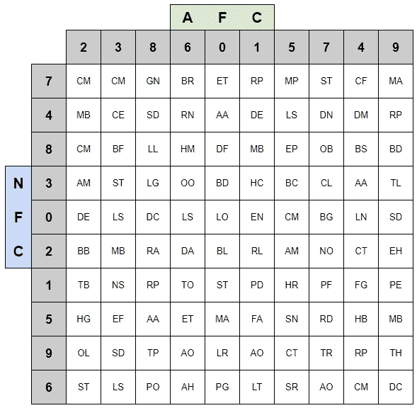
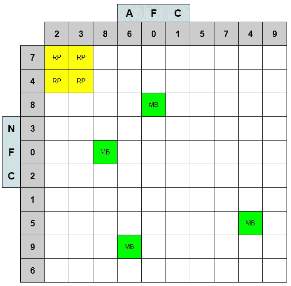
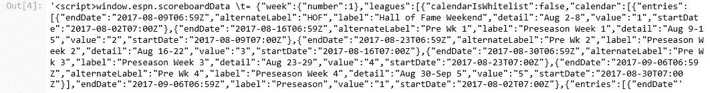
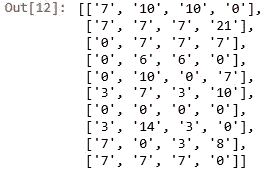
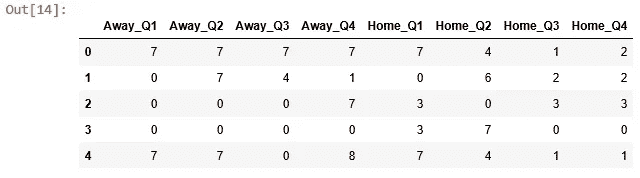
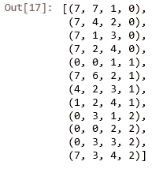
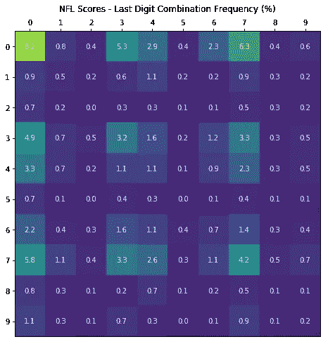
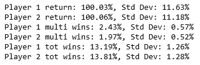

# 超级碗票房大丰收

> 原文：<https://medium.com/analytics-vidhya/super-bowl-box-bonanza-e5a57e2138e7?source=collection_archive---------24----------------------->

使用 Python 探索您是否可以在年度池中获得优势

如果你曾经参加过超级碗聚会，你可能见过这样的场面:

如果你不熟悉超级碗盒子，它们是这样工作的:在大型比赛之前，参与者以每盒 X 美元的价格购买 10 x 10 格的盒子。通常允许购买多个盒子(视需求而定)，所有权通过在已选择的盒子中写首字母来表示。

在所有的盒子都被填满后，数字 0-9 被随机抽取并分配到网格的左边和顶部。每组数字代表一个球队得分的最后一位数，一边代表 NFC，另一边代表 AFC(超级碗总是在两个大会冠军之间进行)。

在每个季度结束时，每个队得分中的最后一个数字与网格上相应的盒子相匹配，谁拥有那个盒子，谁就赢得总奖金的一部分。通常奖金占总奖金的百分比是:第一季度:12.5%，第二季度:25%，第三季度:12.5%，最后:50%。

这种超级碗主食是一种简单的随机方式，让休闲和铁杆球迷保持对比赛的兴趣。纯粹的运气可以决定你是否会带着一个鼓鼓的钱包离开聚会。然而，上一次我做这些的时候，我看到了一个参与者的选择框，看起来像这样(标记为“RP”代表“随机参与者”):

我马上想到，嗯，这不是一个好主意。如果他在前两行中抽到了一个坏数字呢？他不可能赢！我去选择我的随机框，确保不要选择同一行或同一列中的任何框，以增加我得到一个好数字的机会——在上面的网格中显示为“MB”。

但当我想得更多的时候，这种选择行为真的重要吗？我自己关于如何分散我的选择的假设从一开始就是错误的吗，因为很明显这都是运气？反过来，如果那些顶行中的一行被分配了一个好的数字呢？那么玩家的胜算肯定会比我高[2]。另一点要考虑的是，根据我的记忆，在一场比赛中看到单个盒子被击中不止一次并不罕见。有时一个季度没有得分，而且如果一个队得了 10 分，那么对应于他们那一方的数字不会改变。也许这种群聚方法会增加一局多赢的机会？

让我们运行一些测试，看看在选择我们的随机盒子时，我们能期望的结果是否确实有任何不同。因为单个游戏之间有很多不同之处(由于抽取号码时你有多幸运),所以我们希望关注不同盒子选择的长期预期。

[1] *到底什么是坏数字？嗯，如果你熟悉足球计分的方式，0、3 和 7 将是随机抽取的最佳数字。原因是:*

*   0: *有时候没有得分。还有 3 + 7 = 10(记住如果一个队有 10 分，网格上对应的#为 0。*
*   3: *一个投篮得分值 3 分。*
*   7: *一次触地得分值 6 分，但高百分比的额外加分加 1，总分为 7 分。*
*   从这里开始，1 和 4 是下一个最好的抽牌，2、5、6、8、9 是不理想的。稍后我们将看到这个故障的细节。

【2】*够搞笑的，对于我这个例子中的随机分配数字来说，似乎就是这样。RP 得到了很好的(7，3)和(4，3)的组合，这很好，但并不可怕。同时我的最好成绩是(0，8)和(8，0)。画一个 8 当然不是…很好。*

# 数据收集和转换

首先，我们将导入该分析所需的所有模块。

我在 ESPN 找到了一个页面，它会给我们提供过去几年 NFL 比赛的得分历史。为了得到一个合适的样本量，我从过去 3 年的游戏中抓取了分数。[这里](https://www.espn.com/nfl/scoreboard/_/year/2019/seasontype/2/week/1)是 2019 赛季第一周的页面外观。

通过一些繁琐的 html 检查，我找到了包含游戏分数的页面源代码部分。

我意识到这种特殊的汤一点也不美

以下是我从网站上摘录的一瞥:

下面有一个讨厌的正则表达式(但它的工作！)，我会找出每个星期的分数。这给出了一个队每个季度得分的数量，连续的线对代表一场比赛。

现在我们有了这个:

好了，开始看起来干净一点了。现在我们有了一个季度得分列表，我们将使用 pandas 进行一些数据清理，以帮助组织我们正在查看的内容。

我们将按季度在一行中记录一场比赛的分数，包括主队和客场。此外，我们还想将分数转换成盒子所需的格式。首先，我们将获得每个季度每个团队的累计分数。然后，由于获胜的盒子是由一个季度结束时团队得分中的最后一个数字决定的，我们将只记录那个数字。

在我们的熊猫数据操作之后，我们得到了这个:

接下来，我们将交换一半数据集的主客场得分。这样做的原因是为了防止主队得分优势对客队的任何可能的偏见，因为这是常规赛数据，而超级碗总是在中立地点举行。

这里我们将数据放回一个元组列表中，这样更容易处理。

这是我们现在的数据。每个元组包含(客场比分、主场比分、四分之一比分和比赛 ID):

# 分数组合

有了这些信息，我们可以计算出最流行的分数组合。

下面是一个热图，显示了样本期内每个组合的频率:

*剧情改编自* [*此处*](https://matplotlib.org/3.1.3/gallery/images_contours_and_fields/image_annotated_heatmap.html)

如你所见，分数组合(0，0)，(0，3)，(3，0)，(0，7)，(7，0)是最常见的。作为一项检查，我们希望反向得分组合非常接近，因为我们交换了一半的数据。情况似乎就是这样。

# 测试设置

现在，有了我们的分数数据，让我们运行一些测试，看看是否有任何框选择行为不同于其他。第一个功能是在每个新游戏开始前洗牌，随机选择盒子的数字组合。第二个函数将根据玩家选择的盒子来计算每个玩家在每场游戏中的奖金。最后一个函数将打印我们尝试的不同盒子组合的结果。

请记住，玩家棋盘的位置对应于在抽取数字之前所选的盒子位置。每场比赛后都要重新抽签。使用实际的历史得分，我们将计算玩家在每场游戏中玩相同的棋盘组合将获得的总奖金。我们将运行该测试的 10，000 次迭代，并查看平均支出以减少结果的可变性。

你认为会发生什么？与不同的组合相比，所选盒子的任何组合会带来更好的预期收益吗？

# 获胜者是…

让我们测试一下初始选择示例的组合，看看会发生什么:

回报相当于模拟生命周期内赚回的投资的%。100%代表收支平衡。对于多赢和总赢,%表示这些事件发生的游戏频率。

那么这告诉我们什么呢？总的来说，从长远来看，这两种盒子选择策略似乎会使两个玩家得到相同的预期结果，大约 100%的赌注被收回，或者不赔不赚。考虑到游戏的随机零和性质，这是有意义的。

有趣的是，玩家 1(“RP”或“捆绑策略”)在多赢游戏中有几乎 0.5%的优势。虽然这种差异在玩家 2 的 1 个标准差以内，但它仍然为我们之前的思考提供了一些证据:考虑到某些数字在足球中如此关键，如果玩家 1 的策略恰好捕捉到这些数字中的一个，它会使他们在一场比赛中记录多个击中盒子的次数(如上所述的多次胜利)方面具有轻微的优势。

相反，玩家 2(“MB”或“距离策略”)在赢得胜利的所有游戏中有大约 0.6%的优势。这与第一个发现一致，因为如果玩家 1 没有击中任何好的数字，他们就不太可能在游戏中记录一次击中。另一方面，玩家 2 更加多样化，在一场游戏中至少击中 1 个盒子的机会略高(以上为 tot 获胜)。

那么，你应该选择哪种策略呢？简而言之，从长远来看，这并不重要。

但是…在你的一生中，你打算玩多少次超级碗拳击比赛？如果在接下来的 50 年里，每次超级碗比赛，你每年都要进入多个游泳池，那么最多可能有几百个。这不足以保证你会达到收支平衡的预期结果。应该会有偏差。

所以，如果你想冒更大的风险争取更大的成功，就使用捆绑策略(要么做大，要么回家！).如果你喜欢有一个更好的机会来赚取至少一些利润，那就是距离策略。

或者，如果你不喜欢足球和赌博，最好的策略可能是享受一些鸡翅，等待广告。

在过去十年左右的时间里，是不是只有我觉得商业广告越来越差了？