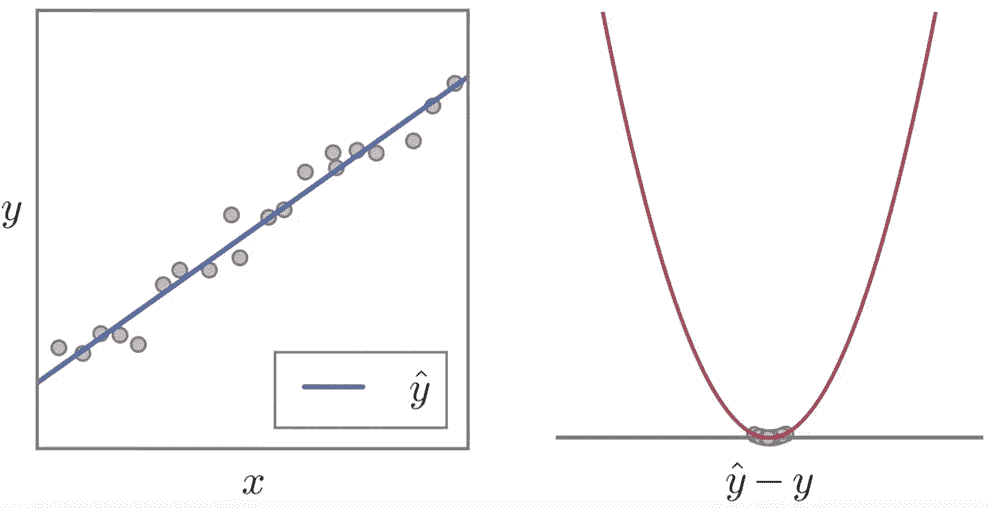

# 超级汽车-io 奥德赛:2019 年 CVPR 我最喜欢的论文

> 原文：<https://medium.com/analytics-vidhya/super-car-io-odyssey-my-favorite-papers-from-cvpr-2019-ccdca524e25c?source=collection_archive---------1----------------------->

上周，2019 年计算机视觉和模式识别大会(CVPR)在加利福尼亚州多云的长滩举行。长滩会议中心挤满了大约 10，000 人，包括一些世界上顶尖的计算机视觉研究人员，和一些激进的中型研究人员(即我)。

我很幸运能够提交过去在那里实习的一篇论文，并坐在前排(但技术上是倒数第三排，因为会议挤满了人)一些计算机视觉领域非常酷和创新的工作。现在一切都结束了，我想分享一些我觉得特别酷的论文。

*免责声明*:*我不是一个有远见的人；我实际上还不是一个什么都不是的人，因为我刚刚完成我的本科学业。所以，我强调的论文不是传统的计算机视觉论文。向那些真正想听全景分割或单目深度估计的读者道歉，但我们将转而钻研运动规划和损失函数！*

[**端到端可解释的神经运动规划器**](http://openaccess.thecvf.com/content_CVPR_2019/html/Zeng_End-To-End_Interpretable_Neural_Motion_Planner_CVPR_2019_paper.html)

这是尤特隆托/优步·ATG 大学拉奎尔·乌尔塔森团队的最新也是最伟大的作品，乌尔塔森甚至声称这是“她写过的最好的论文”Urtasun 在自动驾驶汽车(SDC)方面的研究非常务实，而且根据我在该行业的有限经验，极具影响力。我是她的超级粉丝，所以我去了她在 CVPR 的每一次研讨会。事后看来，这可能不是最好的主意，因为我最终在四个不同的时间里听到了同一个演讲。

**端到端驱动**

Urtasun 研究的“圣杯”是 SDCs 的端到端方法。这意味着一种将传感器数据作为输入，并输出命令来控制车辆的方法。这是过去所做的[，但是有一些缺点:](https://arxiv.org/pdf/1604.07316.pdf)

1.  缺乏可解释性。
2.  无法组合不同的子任务来解决主任务。这使得该方法的样品效率非常低。
3.  在现实世界中很难找到工作，在现实世界中，一些驾驶规则是必要的。

这就是 SDC 工业转向工程堆栈方法的原因，其中不同的模块，如感知、预测和规划器，将解决问题的不同子任务(分别检测和跟踪物体，估计它们去哪里，并生成安全的执行轨迹)；这些模块将被组合在一起，形成车辆的人工智能。可悲的是，这种方法也并不完美:

1.  模块之间不共享计算。
2.  难以测量模块之间的误差传播；如果你不知道车在哪里，估计车会去哪里自然会受到影响。从这些错误中恢复也很困难。

Urtasun 的小组通过建立一种既可解释(由于中级预测)又在现实世界中工作良好的端到端方法，抓住了两个世界的最佳之处。本文是她所在的小组对[以前的](http://openaccess.thecvf.com/content_cvpr_2018/html/Luo_Fast_and_Furious_CVPR_2018_paper.html) [工作](http://www.cs.toronto.edu/~wenjie/papers/intentnet_corl18.pdf)的总结；然而，与其他许多系列(即《权力的游戏》)不同，这个结局是强烈的，令人满意的。

工程堆栈与端到端(Creds: me 和 powerpoint)

**一位可解读的策划人**

提出的神经运动规划器(NMP)将激光雷达点云和道路网络的高清地图作为输入，并输出时空“成本体”成本量听起来很优雅，但实际上它只是每个时间步的 2D 热图，低价值/成本区域是很好的位置。

如果 *cᵗ* 是时间步长 t 的成本量， ***s*** 是轨迹，那么规划的轨迹就是优化的解:

本文给出了一个很好的图表来总结这种方法:

神经运动规划器概述:输入是通过骨干网络，并预测感知结果，以及成本量。成本卷评估轨迹并选择最佳轨迹。

1.  输入是激光雷达点云和高清道路图的 3D 张量拼接，通过主干卷积网络进行馈送。
2.  中间表示是通过两个头输入的。第一个，感知头，是一个 [SSD 网络](https://arxiv.org/pdf/1512.02325.pdf)，它对场景中的实体的边界框进行回归和分类，并预测这些框的未来运动 *T* - 1 步进入未来。
3.  第二个是成本体头，它是一个去卷积网络，可以生成未来 *T* 步的成本体。
4.  轨迹样本被生成(在我稍后将讨论的另一个奇特的方法中)，并且通过成本体积的最小成本样本被选择作为计划的轨迹。

现在，在我们能够实施自己的 NMP 并创办另一家自动驾驶公司之前，只需要回答两个问题并获得数十亿美元:(1)如何对轨迹进行采样？以及(2)网络针对哪些损失进行训练？不幸的是，我没有足够的钱，但我可以提供答案。

**(1)采样轨迹**

嗯，我记得上一次做几何是在中学的时候计算六边形的面积，所以这部分对我来说有点复杂。轨迹本质上是形状和速度剖面的组合。高级流程非常简单:

1.  为回旋曲线采样参数(稍后将详细介绍)，并将结果曲线用作轨迹形状。
2.  确定速度曲线(假设加速度恒定)。
3.  根据速度分布图沿曲线移动以获得轨迹。

获取时空轨迹。

不幸的是，回旋曲线不是六边形，所以我中学的几何在这里没有用。但是这条曲线比较有名，由参数方程给出:

因此， **s** (ξ)本质上定义了一条 2D 曲线，由到起点 **s₀** *，* **T₀** 和 **N₀** 是到 **s₀** 的正切和法向矢量， *a* 是比例因子。曲线的实际形状由 *a* 固定，因此步骤 1 包括对 *a* 进行均匀采样。为了形象化它的效果，我在 Mathematica 中画了一些回旋曲线变化的图 *a:*

a=10，30，50 的回旋曲线，其中ξ在范围[0，50]内

作为基线形状，直线和圆弧也以恒定的概率被采样。一旦确定了曲线的形状，曲线上的起点就由初始方向盘角度确定。然后，步骤 2 中的速度剖面ξ'(t)确定ξ(t)。最后，在步骤 3 中，ξ(t)产生曲线上的点，这些点形成采样轨迹的路点。

**(2)多任务损失**

用感知和规划头的组合损失来训练网络:

感知损失是一种非常简单的监督损失。使用地面实况检测结果，感知头被训练来预测在预定义的锚盒处车辆的存在(分类损失)，以及在每个当前和未来时间步长回归每个盒的位置、形状和航向角(回归损失)。

计划损失有点棘手，因为我们仅有的地面事实是执行的轨迹，它不能很好地映射到预测的成本量。一个天真的研究者(也就是我)会将地面真实轨迹离散化为网格位置，并使用位置上的交叉熵损失来训练成本体。事实上，我在[自己的作品](http://openaccess.thecvf.com/content_CVPR_2019/html/Hong_Rules_of_the_Road_Predicting_Driving_Behavior_With_a_Convolutional_CVPR_2019_paper.html)中就是这么做的(又是无耻的插一句)。

相反，Urtasun 使用最大边际损失，将地面事实视为正面例子，将随机采样的轨迹视为负面例子。

损失比交叉熵要复杂得多。这里，c^是地面实况航路点，cᵢ是抽样航路点，dᵢ是地面实况和抽样航路点之间的距离(鼓励距离远的航路点具有高成本)，γᵢ是对违反交通规则的处罚； *max* 确保*只优化最差的样本，以便训练成本量来区分好的、基本的真实轨迹和真正差的轨迹。*

该论文通过了相当多的实验，包括测量中间预测(感知和预测任务)质量的度量标准。TLDR:他们很好。我感兴趣的是可视化的成本量和规划的轨迹:

彩色区域表示低成本，计划的轨迹用红色表示，地面实况用蓝色表示。

成本体积似乎很好地处理了多模式场景，包括车道变换和在路口转弯。虽然我很容易被打动(尤其是如果有一只狗参与的话)，但我认为计划轨迹的复杂性无疑是非常酷的。

**讨论**

我希望我没有破坏任何 SDC 行业的秘密，因为我说，在 SDC 的书库里，机器学习还有很大的空间。直到今天，(非常复杂的)试探法似乎比学习方法更好，所以看到端到端的深度学习方法达到最先进的效果是非常有希望的。然而，一个活跃的改进领域是处理未知领域/从错误中恢复(即“[匕首问题](https://www.ri.cmu.edu/pub_files/2011/4/Ross-AISTATS11-NoRegret.pdf)”)，这似乎是强化学习(RL)可以介入的领域。但那可能只是因为我是一个狂热的追星族。

[**一种通用的、自适应的鲁棒损失函数**](http://openaccess.thecvf.com/content_CVPR_2019/html/Barron_A_General_and_Adaptive_Robust_Loss_Function_CVPR_2019_paper.html)

所以这可能是整个会议中我最喜欢的一篇论文。它完美地融合了基本的机器学习理论和为什么我没有想到的原创性。我不熟悉乔恩·巴伦的(他自己写的论文！)在此之前工作，但从现在开始我一定会跟着做。他的海报旁边也有一大群人，所以他很快就会成为一流的大规模研究人员，那种让你得到街头认可的人(如果那条街上碰巧有大规模研究人员的话)。

**损失函数太多**

有一个伴随视频的[很好地解决了这个问题。我们正在处理经典的回归问题，在这里我们试图预测给定特征 *x* 的 *y* 。在这种情况下，大多数人转向 L₂损失，但我们都知道它对异常值非常敏感。](https://www.youtube.com/watch?v=BmNKbnF69eY&feature=youtu.be)

如果你真的喜欢损失函数，你可以开始尝试一些你知道的其他函数，其中一些会比其他的更好:

不同损失之间的变化是离群值相对于内值的权重——也称为*鲁棒性*。现在，如果你在此之前不知道德国-麦克卢尔损失是什么(我猜是除了德国人和麦克卢尔之外的所有人)，你可能已经被卡住了。即使你知道，尝试所有这些不同的损失函数，最终得到一个好的，仍然是相当乏味的。

Barron 引入了一个新的损失函数，当给定不同的参数时，它实际上再现了上面显示的所有损失；也许更重要的是，他给出了一种在训练过程中自适应调整这些参数的方法，以自动确定这种损失函数对于特定任务的最佳鲁棒性。

**损失函数**

如果我是巴伦，我会称之为巴伦损失，因为有一个以我命名的损失函数在我的遗愿清单上相当靠前；但巴伦没我自恋，没留名。不管怎样，这是他的损失函数:

公式中，α是决定函数鲁棒性的形状参数， *c* > 0 是决定 *x* = 0 附近二次碗(U 形)大小的比例参数。

你可能会注意到α = 0，2 时的奇点。然而，在极限情况下，我们得到的损失实际上近似于α = 2 附近的 L₂损失，以及α = 0 附近的柯西损失。

事实上，该损失函数的一个非常好的特性是，它实际上再现了特定α的几个现有损失函数:L2 损失(α = 2)、夏邦尼尔损失(α = 1)、柯西损失(α = 0)、吉曼-麦克卢尔损失(α= 2)和韦尔施损失(α=∞)。这一点在他最终版本的损失(消除了奇点)中显而易见:

论文中还有一个很好的图形来展示它的形状是如何变化的:

各种α的损失函数(左)及其梯度(右)。请注意，随着α的降低，异常值的梯度下降到 0，从而增加了稳健性。

这个损失函数实际上有很多很好的特性:

1.  平滑 w.r.t | *x* |和α。因此，我们可以进行基于梯度的优化，老实说，这是我目前所知道的全部方法。
2.  单调增加 w.r.t. | *x* |和α。您可能还注意到，随着α的降低，稳健性会增加(离群值的权重较小/对于较小的α具有较小的梯度)。这意味着你可以做一些渐进的非凸优化:设置α很大，所以损失是凸的，然后退火α，所以凸性降低但鲁棒性增加，并且(希望)不会陷入局部最小值。
3.  有界一阶和二阶导数。这意味着我们可以在优化过程中避免令人不快的渐变爆炸。

**自适应算法**

如果这篇论文的高潮是我们需要对α和 *c.* 进行超参数搜索，那么所有这些都是毫无用处的。真正酷的是，这些参数实际上是免费的，可以与模型权重的其余部分一起求解。现在，天真地最小化 *ρ* (， *α* ， *c* )是行不通的，因为我们可以只选择 *α* ， *c* 尽可能小，让损失变得微不足道(回想一下 *ρ* 随 *α* 单调增加)。

需要引入一些折衷，因此 *α* 不能任意小。这种权衡被很好地打包到对应于损失函数的概率分布的负对数似然(NLL)中。

现在，我已经看够了使用概率图形模型的工作，对[配分函数](https://www.deeplearningbook.org/contents/partition.html) *Z* ( *α* )有点害怕了。但是也许这次它很好，很容易驾驭…

:(

幸运的是，Barrons 找到了一个解决方法，用一个[三次 hermite 样条](https://en.wikipedia.org/wiki/Cubic_Hermite_spline)插值来逼近*log**Z*(*α*)。在实践中，他做了另一个使样条连续可微的技巧，通过在 *α* 的变换空间中工作(见他的[补充材料](http://openaccess.thecvf.com/content_CVPR_2019/supplemental/Barron_A_General_and_CVPR_2019_supplemental.pdf))。

增加*日志* *Z* ( *α* )对新目标有什么作用？嗯，它有效地转移了原始损失函数，因此对于小的 *α，*来说，离群值的成本较低，而内联值的成本会增加。

NLLs(左)和 PDF(右)。请注意，对于较低的α，内联体的成本较高，这阻止了任意降低α。

这就产生了一种折衷，在这种情况下，将低成本分配给较大的残差会导致较小残差的惩罚，从而阻止优化像以前一样微不足道地减少损失。现在， *α* ， *c* 可以作为自由参数与其余模型权重一起优化！

**实验**

Barron 表明，在各种任务中，只需用新的自适应损失函数替换原始模型的损失函数，就能显著提高性能。因为这是 CVPR(还没有提到图像生成或深度估计)，两个这样的任务是(1)使用[变分自动编码器](https://arxiv.org/pdf/1312.6114.pdf) (VAEs)的图像生成，和(2)单目深度估计。

使用 VAEs，Barrons 将为输出图像中的每个 RGB 像素生成正态分布与使用 *α* 、 *c* 作为可训练参数生成新分布进行了比较。在数量上，验证集 ELBOs 也有所提高，从 31，505 提高到 36，373(用小波代替像素)。此外，使用 VAEs 的样本是出了名的模糊，但是使用新的输出分布会产生更清晰的图像。

使用新的分布会产生更清晰的样本。

[无监督单目深度估计](https://people.eecs.berkeley.edu/~tinghuiz/projects/SfMLearner/cvpr17_sfm_final.pdf)使用成对的相关的、未标记的图像作为训练数据来估计深度和相机姿态。在该任务中，使用固定的拉普拉斯分布来最大化像素的可能性的原始目标被使用新的分布所取代。这样做将验证误差从 0.407 减小到 0.332(也使用小波；我承认我不知道它们有那么有用)，并且做出明显更好看的深度估计。

我非常积极地浏览了实验，但我想专注于理论上有趣的部分，而不是计算机视觉应用(我希望我不会因为这个评论被列入未来 CVPRs 的黑名单)。

**讨论**

我认为巴伦的作品让人想起亚历克斯·肯德尔(who(m？)我也是的粉丝！该工作处理在多任务损失设置中自适应地缩放单个任务损失，而该工作松散地缩放单个数据的损失，以它们的残差为条件。它们都符合处理*随机不确定性—* 由于训练数据中隐藏的解释变量导致的统计不确定性这一总体主题。

这项工作的一个限制是它只适用于回归任务(如果这也算一个限制的话，因为*很多*任务都涉及回归)。对于分类任务，可能存在相应的“广义”交叉熵或铰链损失，但是使这样的损失平滑可能是一个挑战。

尽管如此，巴伦的作品还是让我非常兴奋；这绝对是我最近看到的最令人印象深刻的事情之一，我看到了这个:

无论如何，在今年的 CVPR 上还有很多其他伟大的工作，包括一篇“[最佳论文”，我仍在努力通过](http://openaccess.thecvf.com/content_CVPR_2019/html/Xin_A_Theory_of_Fermat_Paths_for_Non-Line-Of-Sight_Shape_Reconstruction_CVPR_2019_paper.html)。对我来说，这是一个非常令人兴奋的时刻，我终于用自己的研究努力取代了学校考试！

**参考文献**

1.  曾、、西蒙·索、阿巴斯·萨达特、、塞尔吉奥·卡萨斯、拉克尔·乌尔塔松。*端到端可解释的神经运动规划器。*IEEE 计算机视觉和模式识别大会(CVPR)，2019，第 8660–8669 页。
2.  乔纳森·t·巴伦。*一种通用的、自适应的鲁棒损失函数。*IEEE 计算机视觉和模式识别大会(CVPR)，2019，第 4331–4339 页。