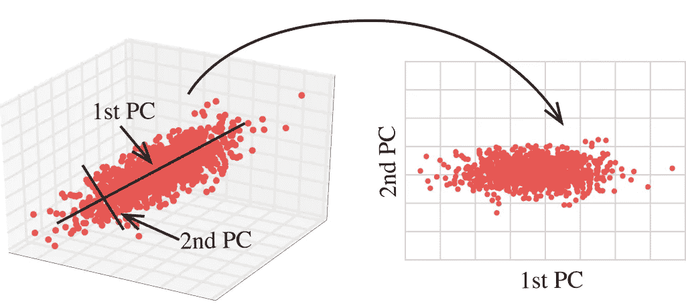
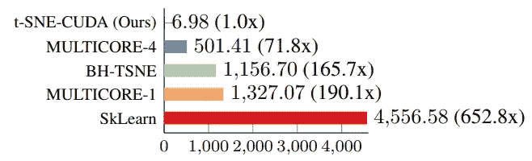
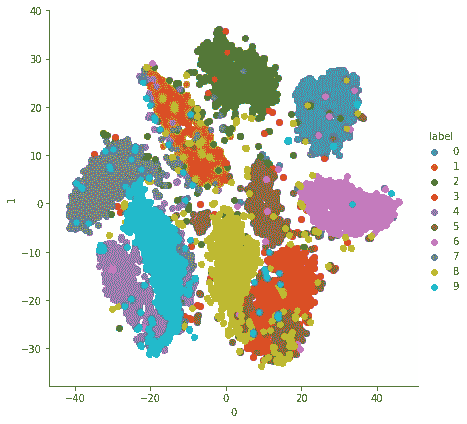

# Kaggle 上基于超高速 GPU 的 T-SNE-CUDA

> 原文：<https://medium.com/analytics-vidhya/super-fast-tsne-cuda-on-kaggle-b66dcdc4a5a4?source=collection_archive---------2----------------------->

> 学习降维可能会让你接触到 t-SNE(t-分布式随机邻居嵌入)。许多实现提供了 t-SNE，但是由于计算的复杂性，一些实现非常慢。在本文中，让我们看看如何在 Kaggle 内核上安装和使用基于 GPU 的 t-SNE-CUDA 的实现，并可视化 MNIST 数据


照片由 [Aditya Chinchure](https://unsplash.com/@adityachinchure?utm_source=unsplash&utm_medium=referral&utm_content=creditCopyText) 在 [Unsplash](https://unsplash.com/search/photos/dimensions?utm_source=unsplash&utm_medium=referral&utm_content=creditCopyText) 上拍摄

# **目的**

在讨论如何让 Kaggle 为 tsnecuda 做好准备之前，让我们先了解一下什么是降维，以及有哪些可用的解决方案。

ML 工程师总是探索数据集，以找到最能解释结果(Y)的特征(X)。在一些数据集中，会有很多特征，然而，一个好的 ML 工程师应该总是通过仔细选择最重要的特征，以简单的模型为目标。

# 降维



图片来源- [Kaggle 博客](http://blog.kaggle.com/2017/04/10/exploring-the-structure-of-high-dimensional-data-with-hypertools-in-kaggle-kernels/) |描绘从 3D 到 2D 的维度缩减

简而言之，减少特征的数量以简化 ML 模型被称为降维。有许多方法可以做到这一点

1.  **主成分分析**:降维的常用方法之一。这个想法是找到覆盖大部分点的最佳主轴。通过正交投影该轴上的所有点，将产生维数减少的新数据集。即使信息由于数据预测而丢失，它也将概括和简化问题。
2.  **特征消除:**每个特征都被移除和/或添加到模型中，并检查错误结果。具有最小正面影响或最大负面影响的特征从特征集中被消除。
3.  **因子分析:**检查特征本身之间的相关性。如果高度相关，我们可以保留重要的特征，其余的可以剔除
4.  **t 分布式随机邻域嵌入(t-SNE)** :这是最先进的最新技术，通过保持局部拓扑结构而不考虑全局配置，将数据点嵌入到低维图上。参考:[论文 1](https://arxiv.org/abs/1807.11824) [论文 2](https://dl.acm.org/citation.cfm?id=2627435.2697068) [实现](https://github.com/CannyLab/tsne-cuda)

# **比较不同的实现方式**



坎尼拉布·茨内库达| t-SNE-库达胜过其他人

包括 Sklearn 在内的许多流行库都附带了 t-SNE 实现，但它们并没有有效地使用 GPU。tsnecuda 的实现使性能达到了顶级水平，如图所示。(*比 Sklearn 实现*快 650 倍)

# 装置

**在 Kaggle**
上安装 *tsnecuda* 流行的在线 python 环境，如 [Kaggle](https://www.kaggle.com/) 和 [Colab](https://colab.research.google.com/) 没有安装 tsnecuda 库。让我们看看如何在 Kaggle 上安装 tsnecuda 及其先决条件。我的 [Kaggle 内核](https://www.kaggle.com/karthikcs1/digit-recognizer-using-t-sne-cuda-using-gpu)中描述了所遵循的步骤

**第一步:**首先，启用 GPU，因为这个库是专门为充分利用 GPU 处理能力而设计的。在 Kaggle 中，在右侧边栏→设置菜单下→启用 GPU
您可以通过执行以下命令来确认 GPU 的存在

```
!nvidia-smi
```

**第二步:**检查 CUDA 的版本。在我的例子中，它是版本 10.0.130

```
!cat /usr/local/cuda/version.txt
```

**步骤 3(先决条件):**通过执行以下命令安装 faiss-gpu。请为各自的 CUDA 版本安装 faiss

```
!yes Y | conda install faiss-gpu cudatoolkit=10.0 -c pytorch
```

**步骤 4(先决条件):**安装 openblas

```
!apt search openblas
!yes Y | apt install libopenblas-dev
```

**第 5 步:**从源代码安装 tsnecuda。当我们安装 conda libfaiss.so 时，它丢失了。所以我们下载并复制文件到 lib64 目录

```
!wget [https://anaconda.org/CannyLab/tsnecuda/2.1.0/download/linux-64/tsnecuda-2.1.0-cuda100.tar.bz2](https://anaconda.org/CannyLab/tsnecuda/2.1.0/download/linux-64/tsnecuda-2.1.0-cuda100.tar.bz2)!tar xvjf tsnecuda-2.1.0-cuda100.tar.bz2 — wildcards ‘lib/*’
!tar xvjf tsnecuda-2.1.0-cuda100.tar.bz2 — wildcards ‘site-packages/*’
!cp -r site-packages/* /opt/conda/lib/python3.6/site-packages/
# !export LD_LIBRARY_PATH=”/kaggle/working/lib/” 
!cp /kaggle/working/lib/libfaiss.so /usr/local/cuda/lib64/
```

我们都设置了安装，并准备使用 t-SNE-CUDA

# MNIST 数据集上的 T-SNE

让我们使用 TSNE 图书馆的 MNIST 数据。MNIST 数据包含 60，000 个手写数字样本。每个数字有 28x28 个像素。每个像素被认为是一个特征，因此它的维数为 784。为了可视化和分类目的，我们的目标是减少到 2 维。

```
from tsnecuda import TSNE
import pandas as pd
import numpy as np
import matplotlib.pyplot as plt
import seaborn as sns
```

加载数据

```
df_train = pd.read_csv(‘../input/digit-recognizer/train.csv’)
Y = df_train[[‘label’]]
X = df_train.drop(‘label’, axis=1)
```

T-SNE 模型:我们有两个重要的超参数需要调整。

*   *困惑*:告知高维度中有多少个点被认为是邻居。
*   *迭代次数*:由于 T-SNE 是一种迭代算法，它告诉我们应该进行多少次迭代。
*   *部件号:*输出尺寸

```
tsne_model = TSNE(n_components=2, perplexity=30.0, n_iter=1000).fit_transform(X)
```

上述模型提供了二维数据阵列，可以很容易地绘制在 2D 图上来表示数字。

```
tsne_df = pd.DataFrame(tsne_model)
tsne_df = pd.concat([tsne_df,Y], axis=1)
sns.FacetGrid(tsne_df, hue="label" , size=6).map(plt.scatter, 0, 1).add_legend()
plt.show()
```



降维后的 MNIST 数据可以显示在 2D 图上

# 结论

在本文中，我们看到了以下内容

*   降维的重要性
*   不同的解决方案
*   t-SNE-CUDA 的性能
*   存储库安装指南
*   在 MNIST 使用 t-SNE-CUDA 的例子

注意:同样的方法也可以在 Google Colab 上尝试。我没有尝试过，如果有人尝试，请让我知道..

# 参考

[1] Karthik Sunil (2019)，[使用 t-SNE CUDA 的数字识别器—使用 GPU](https://www.kaggle.com/karthikcs1/digit-recognizer-using-t-sne-cuda-using-gpu)
【2】Canny labs，[t-SNE-CUDA Github](https://github.com/CannyLab/tsne-cuda)
【3】[David m . Chan](https://arxiv.org/search/cs?searchtype=author&query=Chan%2C+D+M)， [Roshan Rao](https://arxiv.org/search/cs?searchtype=author&query=Rao%2C+R) ， [Forrest Huang](https://arxiv.org/search/cs?searchtype=author&query=Huang%2C+F) ， [John F. Canny](https://arxiv.org/search/cs?searchtype=author&query=Canny%2C+J+F) ，【2018】，[t-t](https://arxiv.org/abs/1807.11824)