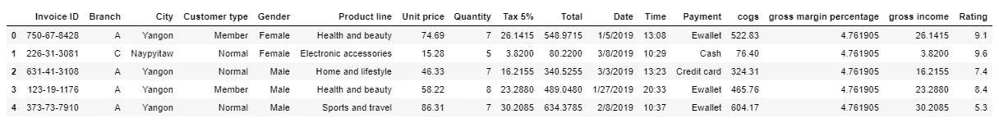
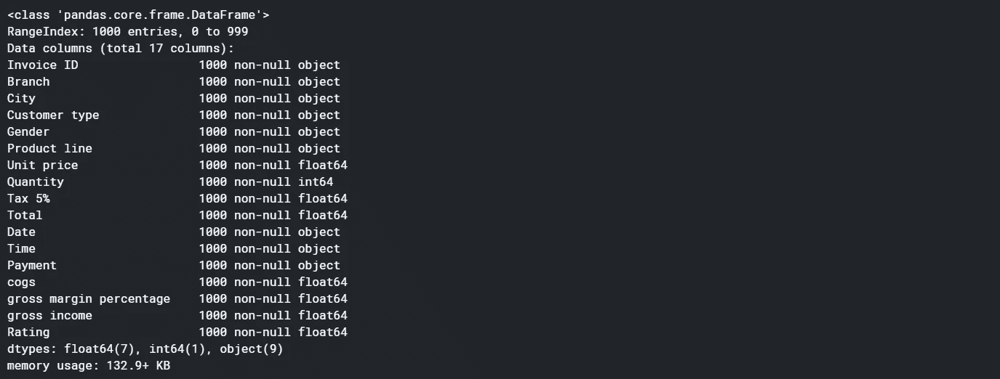
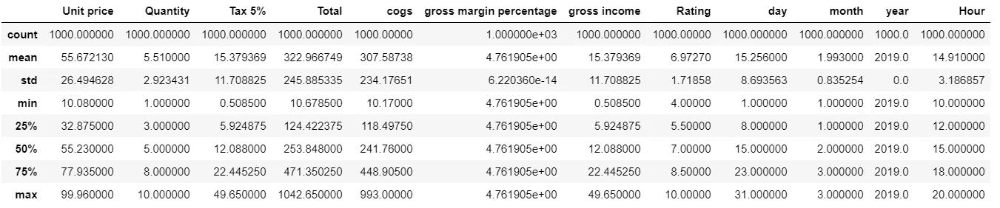
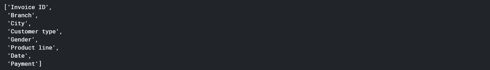
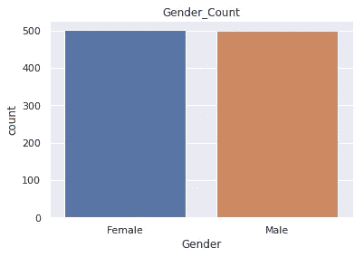
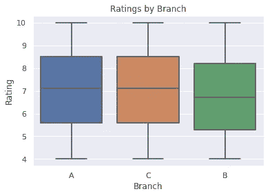
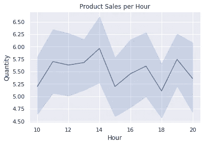
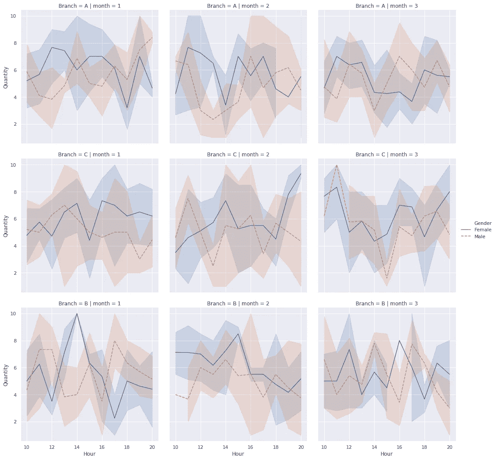
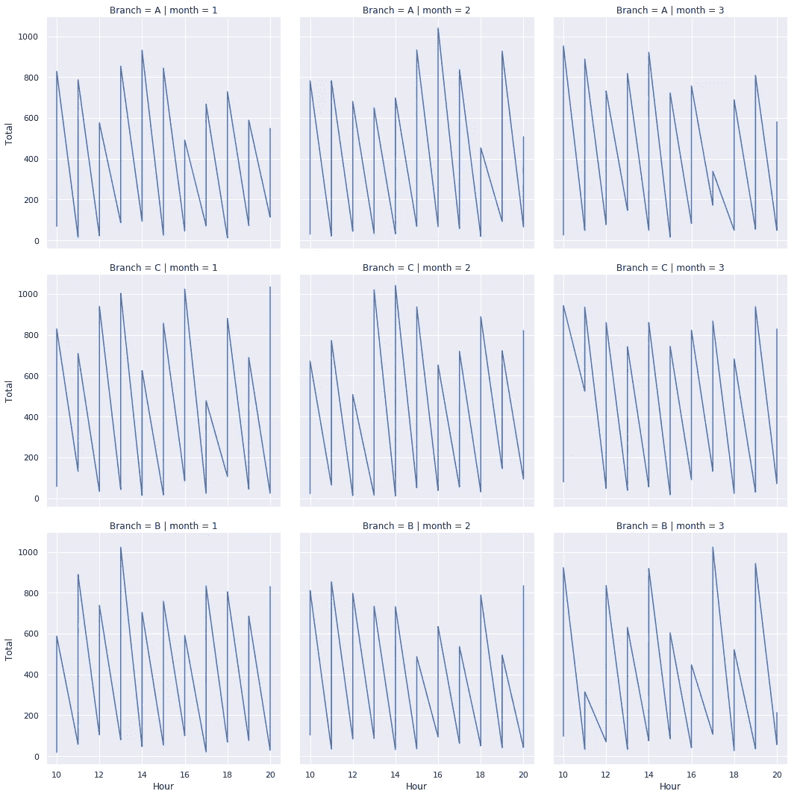

# 超级市场数据分析

> 原文：<https://medium.com/analytics-vidhya/super-market-data-analysis-2b983450cec6?source=collection_archive---------4----------------------->

在大多数人口稠密的城市，超级市场的增长正在增加，市场竞争也很激烈。该数据集是超市公司的历史销售额之一，记录了 3 个不同分支机构 3 个月的数据。预测数据分析方法很容易应用于这些数据集。


[ev](https://unsplash.com/@ev?utm_source=medium&utm_medium=referral) 在 [Unsplash](https://unsplash.com?utm_source=medium&utm_medium=referral) 上的照片

# 关于数据集

> 这是关于超市销售数据包含的属性的解释；

发票标识:计算机生成的销售单发票标识号

分支机构:购物广场的分支机构(有 3 个分支机构，分别由 A、B 和 C 标识)。

城市:购物中心的位置

客户类型:客户的类型，使用会员卡的客户由会员记录，无会员卡的客户由会员记录。

性别:客户的性别类型

产品线:一般项目分类组—电子配件、时尚配件、食品和饮料、健康和美容、家居和生活方式、运动和旅游

单价:每件产品的价格，单位为美元

数量:客户购买的产品数量

税:客户购买的 5%的税费

合计:含税总价

日期:购买日期(2019 年 1 月至 2019 年 3 月有记录)

时间:购买时间(上午 10 点到晚上 9 点)

付款:客户购买时使用的付款方式(有 3 种方式可供选择——现金、信用卡和电子钱包)

销货成本:销货成本

毛利百分比:毛利百分比

总收入:总收入

评级:客户对其整体购物体验的分层评级(从 1 到 10)

# 代码走查

> 加载库

```
import numpy as np *# linear algebra*
import pandas as pd *# data processing, CSV file I/O (e.g. pd.read_csv)*
import seaborn as sns
import matplotlib.pyplot as plt

*# Input data files are available in the "../input/" directory.*
*# For example, running this (by clicking run or pressing Shift+Enter) will list the files in the input directory*

import os
print(os.listdir("../input"))
```

> 数据洞察

这显示了真实数据在输入算法进行预测时的样子

这



这是数据的快照



关于数据集属性的信息

> 数据准备和清理

现在我们必须清理数据，以便它能被算法处理。

我们必须将“日期”、“日”、“月”、“年”、“时间”和“小时”转换成特定的格式，以便更容易理解和处理。

> 预览更新的数据

下面是在数据被我们的代码处理后得到的数据的 sanp。这个过程是使用 python 库 Pandas 来完成的



这是数据在预处理日期和时间属性后的样子

> 让我们找出数据类型为 object 的列中唯一值的数量

现在，我们需要了解我们有太多工作要做的数据中的唯一属性。



数据集中可用的属性

现在，唯一属性包含一些值，也需要进行处理，以便程序能够理解。下面是显示属性中唯一值的输出


> 可视化数据

到目前为止，我们已经按照我们的要求处理和清理了我们的数据。下面是基于数据的一些数据图。它们包括

*   性别计数
*   基于分行的评级
*   每小时产品的销售量
*   基于分支和数量的每月数据洞察
*   最后是我们产品每小时销售额的月度总结



在数据集中的性别计数，它显示平均分布，所以没有偏见



公司里按小时销售的商品大多数商品都是在当地时间 14:00 左右售出的



在这里，我们可以看到每个分支机构每月每小时的销售量



我们可以看到每个分支机构每月每小时的销售额

# 链接到 GITHUB 仓库

[超市销售数据分析](https://github.com/sushantag9/Supermarket-Sales-Data-Analysis)

跟我来

领英:【https://www.linkedin.com/in/sushantag9/ 

推特: [@sushantag9](https://twitter.com/sushantag9)