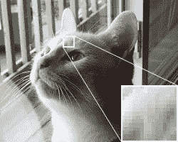
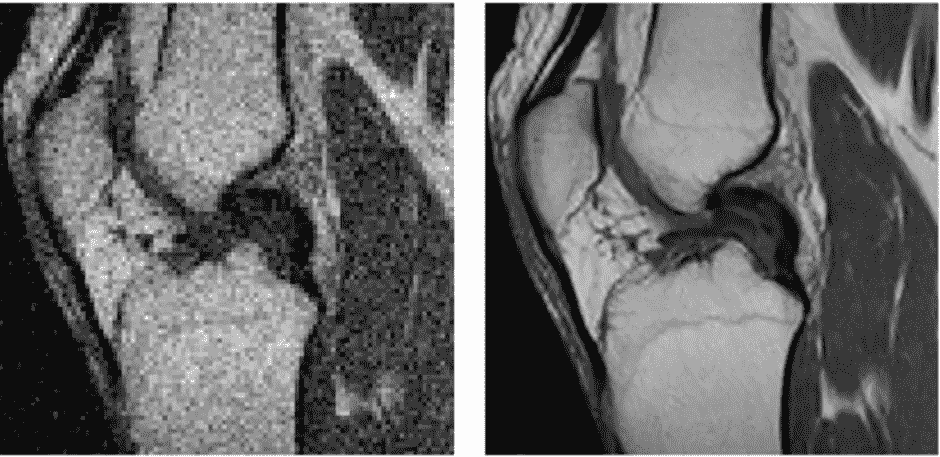
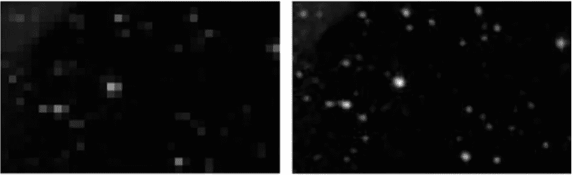
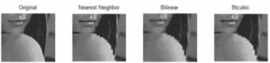

# 深度学习中的超分辨率及其最新进展(一)

> 原文：<https://medium.com/analytics-vidhya/super-resolution-and-its-recent-advances-in-deep-learning-part-1-c6d927914d32?source=collection_archive---------10----------------------->

你好，欢迎来到这个关于超分辨率的系列。这主要是针对很少或没有这些领域背景的机器学习和计算机视觉爱好者。在这一部分，我将简要介绍超分辨率的概念及其在各个领域的混淆应用。我也将讨论一些最初的算法，它们为这个领域目前的进展铺平了道路。

# 超分辨率

还记得你以为在手机上点击了一张精彩的图片，但当你试图在笔记本电脑上查看时，它看起来模糊不清，不再那么精彩了吗？或者是图像在手机上比在平板电脑上看起来更清晰的时候？发生这种情况是因为您试图放大属于手机屏幕(低分辨率— LR)的图像，以适应笔记本电脑屏幕(高分辨率— HR)的大小。

> 类似于字母表如何形成单词，许多被称为像素的彩色小方块以有组织的方式排列来创建图像。“高分辨率”图像需要更多的像素来表现更清晰的细节和更好的纹理。从低分辨率图像生成高分辨率图像的过程称为超分辨率。

# 为什么要超分辨率成像？

为什么我们不只是捕捉一个高分辨率的图像，而不是经历所有这些技术的东西？答案是一样的，为什么我们不去买一个 DSLR，当它明显比手机相机更好的时候。是的，捕捉高分辨率图像是昂贵的，有时是不可能的。我将在这里列出几个应用。

*(一)医学图像处理*

医学图像(如 MRI、CT、PET 等)对于疾病的诊断非常有价值。有时，由于分辨率的限制，这些扫描没有帮助。SR 技术已经被用来产生更好的图像。

左—原始左后膝关节扫描；右侧— SR 图像。图片来源:[图像超分辨率](https://www.researchgate.net/publication/303182546_Image_super-resolution_The_techniques_applications_and_future)

*(ii)视频增强和光学图像稳定*

超分辨率技术已用于视频(标准清晰度 HDTV)中的低分辨率图像，以创建接近高清的视频(HDTV)来为高清屏幕提供服务。超分辨率还可以用来减少由于与相机相关联的运动而导致的模糊。为了解决这些问题，SR 技术有望很快应用于手机和平板电脑。

*(三)监视*

对于交通和安全监督来说，监控摄像机已经变得非常普遍。不用说，不可能到处都装高分辨率摄像头。由于视频比图像包含更多的数据(需要更多的计算能力),并且受到相机运动伪影的影响，该领域的超分辨率变得更加复杂。大多数视频超分辨率方法仍处于研究阶段，有待在现实生活中实现。

*(四)天文观测*

天文仪器的分辨率受到其硬件的限制。在这种情况下，超分辨率对于探索和研究外层空间的研究人员来说是一个福音。

左- LR 天文图像；右侧- SR 图像。图片来源:[图像超分辨率](https://www.researchgate.net/publication/303182546_Image_super-resolution_The_techniques_applications_and_future)

# 那我们怎么超度呢？

如果像素的数量是唯一的问题，为什么我们不只是采取一个低分辨率的图像(100x100 像素)，添加更多的像素，并根据其相邻像素给每个像素着色？这确实是像最近邻上采样、双线性插值和双三次插值这样的[技术](https://in.mathworks.com/help/vision/ug/interpolation-methods.html)背后的主要思想。它们在用于填充额外像素值的方法上有所不同。

最近邻上采样

图像的一部分先降采样，然后升采样。图像来源:[图像插值](http://citeseerx.ist.psu.edu/viewdoc/download?doi=10.1.1.91.8726&rep=rep1&type=pdf)

然而，超分辨率并没有那么简单。这些简单的插值产生了像素化或模糊的图像。我们想要的是更清晰的细节和更好的质感。这时，深度学习和生成性对抗网络来拯救我们了。为了更有策略地填充像素值，我们需要观察、研究和获得更多关于特定类型图像(比如膝盖 MRI 扫描)的一般特征的信息。这正是神经网络所做的，它们研究训练数据(一组 HR-LR MRI 图像对)并调整其网络参数以适应数据属性。现在，如果我们向我们的网络提供一个新的膝盖 MRI 扫描，它知道该做什么来返回给我们超分辨率扫描。一旦网络被训练用于 10×10 像素(LR)到 20×20 像素(HR)的转换，20×20 像素(LR)的新图像可以通过网络传递以获得 30×30 像素(SR)。

> 深度学习网络可以被视为高度复杂的非线性方程，它是为我们的目的而设计的输入变量(在我们的情况下，是图像的像素值)的函数。

请继续关注，在本系列的后续部分中，探索最近为超分辨率开发的各种深度学习方法:)

# 参考

*   [图像超分辨率的深度学习:综述](https://arxiv.org/abs/1902.06068?utm_campaign=Dynamically%20Typed&utm_medium=email&utm_source=Revue%20newsletter)
*   [图像超分辨率:技术、应用和未来](https://www.researchgate.net/publication/303182546_Image_super-resolution_The_techniques_applications_and_future)

## 所有零件的链接:

*   [超分辨率及其在深度学习方面的最新进展——第一部分](/analytics-vidhya/super-resolution-and-its-recent-advances-in-deep-learning-part-1-c6d927914d32)
*   [超分辨率及其在深度学习领域的最新进展——第二部分](/@rapole.shivani.reddy.98/super-resolution-and-its-recent-advances-in-deep-learning-part-2-5868965f89e5)

*敬请期待，更多部分即将推出:)*