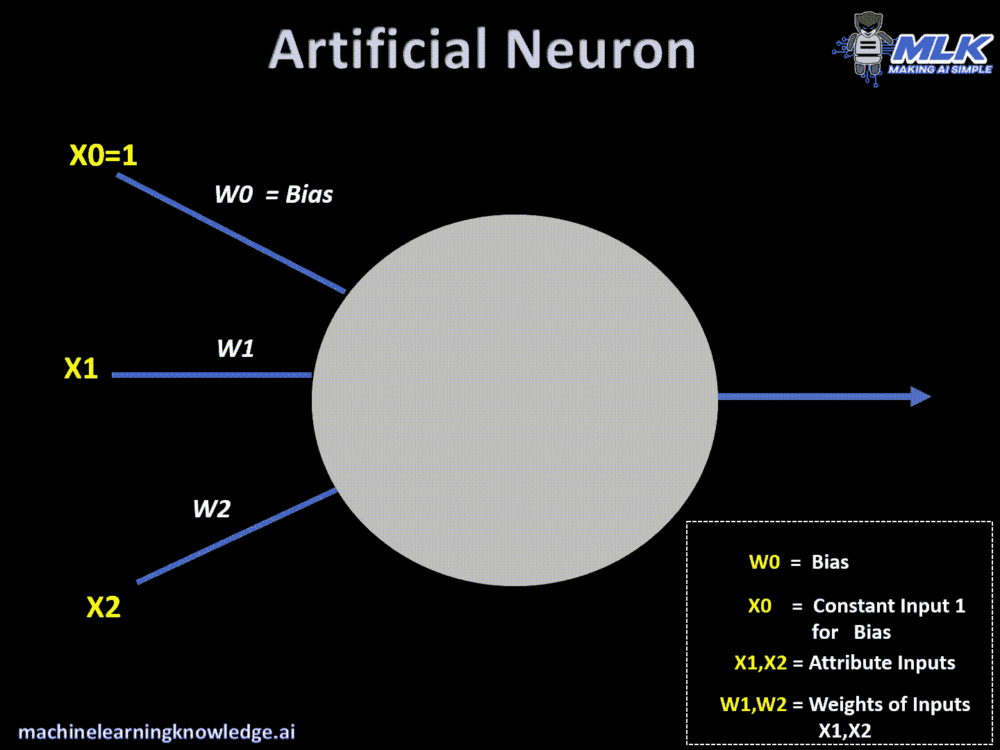
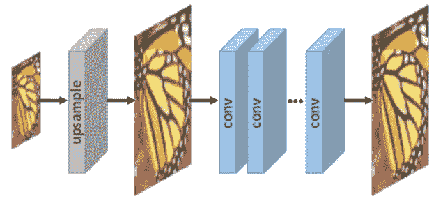
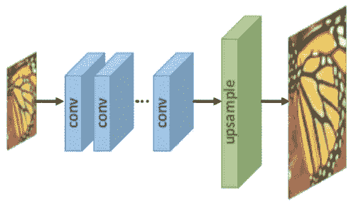
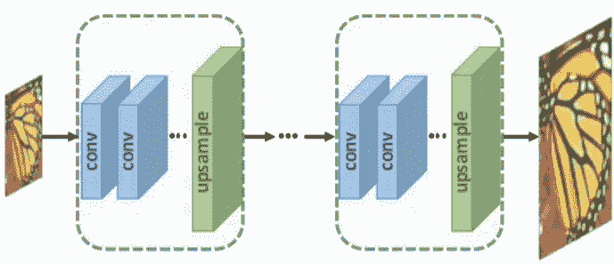
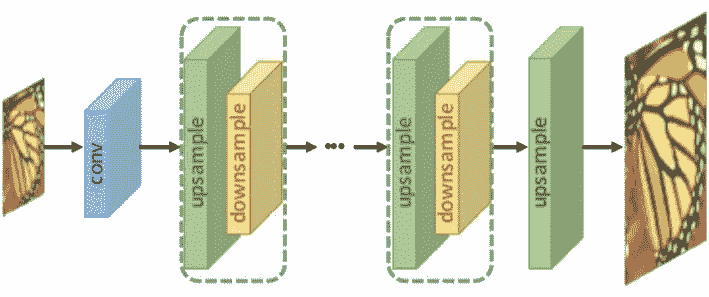
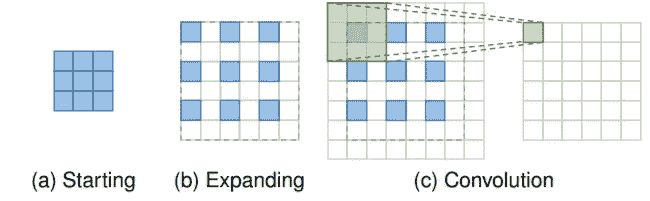
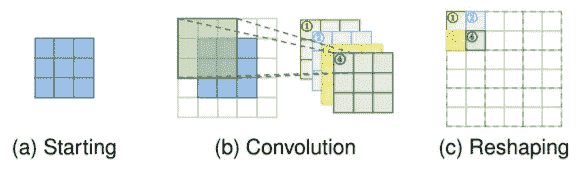

# 超分辨率及其在深度学习中的最新进展——第二部分

> 原文：<https://medium.com/analytics-vidhya/super-resolution-and-its-recent-advances-in-deep-learning-part-2-5868965f89e5?source=collection_archive---------13----------------------->

嗨，欢迎来到超分辨率系列的第二部分(你可以在最后找到其余部分的链接)。现在我们已经有了什么是超分辨率的背景，也对深度学习的概念有了一点介绍，我们就不多说了，来深入挖掘更有趣的概念吧！

正如我们在早期文章中讨论的那样，我们的深度学习模型需要一个包含低分辨率(LR)图像和高分辨率(HR)图像的数据集来调整其参数，并使其适应这种特定的图像环境。通常有两种方法来创建这样的数据集-监督和非监督超分辨率。在本文中，我们将详细讨论监督超分辨率。

# 监督超分辨率

在这种训练深度学习框架的方法中，在训练数据中考虑 LR 和 HR 图像的映射对，即，我们教导网络 HR 图像是特定 LR 对应物(输入:x)的预期超分辨率图像(网络输出:f(x))。

## 深度学习——一个背景

从之前的[帖](https://arxiv.org/abs/1902.06068?utm_campaign=Dynamically%20Typed&utm_medium=email&utm_source=Revue%20newsletter)中，我们明白了深度学习学习一个复变函数方程的目的。现在，让我们看看它实际上是如何执行的。神经元是神经网络的最小组成部分，是该领域的心脏和灵魂。单个神经元对输入( **X** )和赋予它的权重( **W** )应用两个函数，并返回结果输出。权重和输入之间的点积是第一个函数。为了将非线性引入到模型中，将合适的激活函数应用于先前的点积，该点积成为神经元的最终输出。

神经元的工作；来源:[神经网络](https://machinelearningknowledge.ai/animated-explanation-of-feed-forward-neural-network-architecture/)

这种神经元的不同层一个接一个地堆叠形成了神经网络。一层中每个神经元的输出被发送到下一层中的每个神经元，然后乘以相应的权重(在下面的动画中，想象神经元通过网络中每个权重/边的输出)。简单来说，一个神经网络的整套权值类似于我们普遍关心的精确估计*的一个简单线性方程组情形****f(x)= ax+b***中类似**a，b*** 的系数。*

**

*可视化简单的猫/狗分类器；来源:[文章](https://towardsdatascience.com/how-to-build-your-own-neural-network-from-scratch-in-python-68998a08e4f6)*

*[卷积神经网络](https://towardsdatascience.com/a-comprehensive-guide-to-convolutional-neural-networks-the-eli5-way-3bd2b1164a53#:~:text=A%20Convolutional%20Neural%20Network%20(ConvNet,differentiate%20one%20from%20the%20other.) (CNN)是一种典型地用于图像环境中的神经网络。虽然图像只是像素强度数字的数组，但是独立处理这些值意味着我们忽略了它们之间的空间相关性。CNN 就是为了解决这个问题而设计的。*

> *研究人员已经提出了各种基于 CNN 的监督模型，这些模型可能是独一无二的，但它们本质上有一些主干组件，如**模型框架、上采样方法、网络设计和学习策略**。*

*为什么我们不深入研究一下它们是如何工作的呢？*

## *模型框架*

*请记住，我们超分辨率图像的第一个想法是增加图像的尺寸，然后用有意义的像素强度填充空白空间。类似地，在 CNN 网络架构(神经元层的堆叠)中的某一点，很少层被分配用于对输入图像进行上采样以匹配预期输出图像的尺寸。这可以通过下列不同方式实现:*

****(一)预上采样超分辨率****

**

*预上采样 SR；资料来源: [DeepSR 调查](https://arxiv.org/abs/1902.06068?utm_campaign=Dynamically%20Typed&utm_medium=email&utm_source=Revue%20newsletter)*

*在我们之前的帖子中，我们已经看到简单的插值方法产生了粗糙纹理的模糊图像。那么，我们为什么不在这个插值图像的基础上建立一个网络，并训练我们的网络参数(权重),使其接近原始 HR 图像呢？这种方法最初是最流行的框架之一，因为困难的上采样操作是在开始时完成的。但是，事实证明，这种惯例往往会带来副作用，如模糊和噪声放大。此外，我们所有的卷积网络层都处理巨大的上采样图像矩阵，这使得我们的计算效率低下。*

****(二)后上采样超分辨率****

**

*后上采样 SR；来源: [DeepSR 调查](https://arxiv.org/abs/1902.06068?utm_campaign=Dynamically%20Typed&utm_medium=email&utm_source=Revue%20newsletter)*

*因为我们发现预上采样的计算开销很大，所以让我们试着将它移到最后，这意味着在最终上采样之前，图像的所有特征都在卷积层中提取。随着计算和空间复杂性的降低，这种方法变得非常流行。*

****(三)渐进上采样超分辨率****

**

*渐进上采样；资料来源: [DeepSR 调查](https://arxiv.org/abs/1902.06068?utm_campaign=Dynamically%20Typed&utm_medium=email&utm_source=Revue%20newsletter)*

*最简单的上采样因子之一是 2x(即 30x30 像素到 60x60 像素)。但是，假设我们对实现更高的系数感兴趣，如 4 倍、8 倍等。在这种情况下，网络发现在一个步骤中调整其参数以对整个图像进行上采样是复杂的。让我们通过在不同点添加较小的上采样层来简化网络的任务。如果我们希望生成 8x 超分辨率图像，渐进增加 2x 上采样层比最终增加 8x 层更可取。然而，这种方法需要先进的训练策略和复杂的多阶段模型设计，以确保整体训练的稳定性。*

****(四)迭代上下采样超分辨率****

**

**迭代上下采样 SR；*资料来源: [DeepSR 调查](https://arxiv.org/abs/1902.06068?utm_campaign=Dynamically%20Typed&utm_medium=email&utm_source=Revue%20newsletter)*

*这是该领域中最近引入的框架之一，被认为具有很大的探索范围和潜力。从图中可以清楚地看到，这种方法在网络的各个部分迭代地增加了上采样和下采样层。研究人员观察到，这种框架更准确地捕捉 LR 和 HR 图像之间的相互依赖性，从而提供更高质量的重建结果。像 [DBPN](https://arxiv.org/abs/1803.02735) 、 [SRFBN](https://arxiv.org/abs/1903.09814) 、 [RBPN](https://arxiv.org/abs/1903.10128) 等网络已经试验了这个框架。*

## *上采样方法*

*我们已经看到了在 CNN 中引入上采样层的不同方法。但是这一层到底是怎么设计的呢？*

****(一)基于插值的上采样****

*这些是我在第[部分](/analytics-vidhya/super-resolution-and-its-recent-advances-in-deep-learning-part-1-c6d927914d32)中介绍的传统插值方法，即最近邻上采样、双线性插值和双三次插值，并且易于实施。在这些方法中，最近邻插值法是最快的，但会产生意外的块状伪像。另一方面，双三次生成相对平滑的图像，但计算速度较慢。*

*然而，这些传统算法是基于图像自身的像素强度，并没有捕捉其他有用的图像信息。它们通常倾向于引入噪声放大和模糊结果。因此，研究人员已经从基于插值的方法升级到可学习的上采样图层。*

****(二)基于学习的上采样****

*   ****转置卷积层:****

**

***转置卷积层**。蓝框是输入，绿框是卷积输出；来源: [DeepSR 调查](https://arxiv.org/abs/1902.06068?utm_campaign=Dynamically%20Typed&utm_medium=email&utm_source=Revue%20newsletter)*

*考虑这样一种情况，我们希望将图像从 3×3 像素上采样到 6×6 像素。首先，我们以交替的方式添加零值像素，它们由白色方框表示。然后，我们用零值填充图像的边界，以便于对该图像应用卷积。卷积阶段中的 3×3 绿色矩阵(也称为内核)是应用于图像矩阵顶部的过滤器，该图像矩阵只是数字的点积[来自具有 3×3 内核矩阵的图像点积的 3×3 矩阵给出 1×1 最终绿色框。这在整个图像上移动以创建最终输出。检查这个[动画](https://towardsdatascience.com/types-of-convolutions-in-deep-learning-717013397f4d)以获得更好的可视化效果】。卷积后的最终图像矩阵现在是 6×6。但是在少数情况下，这一层往往会产生棋盘状的工件图案。*

*   ****子像素层:****

**

***子像素层。**蓝色方框为输入，其他颜色的方框表示不同的卷积运算和不同的输出特征图；资料来源: [DeepSR 调查](https://arxiv.org/abs/1902.06068?utm_campaign=Dynamically%20Typed&utm_medium=email&utm_source=Revue%20newsletter)*

*在这种情况下，我们不是交替地添加零值和使用一个滤波器/内核，而是尝试在边界填零后使用 4 个内核进行 2x 上采样。在整形阶段，来自相应的 4 个点积中的每一个的 1×1 输出被组合在一起以形成 2×2 矩阵，该矩阵成为最终上采样输出的一部分。类似于前一种情况，这些滤波器在整个矩阵上移动，以获得多个这样的 2×2 矩阵。与转置卷积层相比，子像素层提供了更多的上下文信息，有助于生成更真实的细节。*

# *参考*

*   *[图像超分辨率的深度学习:综述](https://arxiv.org/abs/1902.06068?utm_campaign=Dynamically%20Typed&utm_medium=email&utm_source=Revue%20newsletter)*
*   *[深度学习中不同类型卷积的介绍](https://towardsdatascience.com/types-of-convolutions-in-deep-learning-717013397f4d)*

## *所有零件的链接:*

*   *[超分辨率及其在深度学习方面的最新进展——第一部分](/analytics-vidhya/super-resolution-and-its-recent-advances-in-deep-learning-part-1-c6d927914d32)*
*   *[超分辨率及其在深度学习领域的最新进展——第二部分](/@rapole.shivani.reddy.98/super-resolution-and-its-recent-advances-in-deep-learning-part-2-5868965f89e5)*

**敬请期待，更多部分即将推出:)**